# Datenmodell

Konzeptionelle Beschreibung in Abschnitt 7 des Konzepts; hier die umgesetzten Tabellen. Maßgeblich für Spaltentypen sind die Migrationen in `server/migrations/`.

## ER-Diagramm

```mermaid
erDiagram
    user ||--o{ web_session : "meldet an"
    user ||--o{ oauth_auth_code : "gibt frei"
    user ||--o{ oauth_token : "besitzt"
    user ||--o{ webauthn_credential : "Passkey"
    oauth_client ||--o{ oauth_auth_code : "erhält"
    oauth_client ||--o{ oauth_token : "erhält"
    training_block ||--o{ training_week : "enthält"
    training_week ||--o{ session : "enthält"
    session ||--o| session_execution : "wird durchgeführt"
    session |o--o{ pain_event : "optional zugeordnet"

    user {
        int id PK
        varchar login UK
        varchar password_hash
        varchar tz
        int failed_logins
        datetime locked_until
        datetime created_at
    }
    web_session {
        char token_hash PK
        int user_id FK
        char csrf_secret
        datetime created_at
        datetime last_seen_at
        datetime expires_at
    }
    webauthn_credential {
        varchar id PK "Credential-ID base64url"
        int user_id FK
        varchar name
        text public_key "PEM"
        int sign_count
        datetime created_at
        datetime last_used_at
    }
    oauth_client {
        varchar client_id PK
        varchar client_name
        text redirect_uris_json
        datetime created_at
        datetime last_used_at
    }
    oauth_auth_code {
        char code_hash PK
        varchar client_id FK
        int user_id FK
        varchar code_challenge
        varchar method
        text redirect_uri
        varchar scope
        datetime expires_at
        tinyint used
    }
    oauth_token {
        char token_hash PK
        varchar type
        varchar client_id FK
        int user_id FK
        char family_id
        varchar scope
        datetime created_at
        datetime expires_at
        datetime used_at
        tinyint revoked
    }
    training_block {
        int id PK
        varchar name
        date start_date
        date end_date
        json goal_events_json
        text phase_notes
        enum status
        varchar doc_ref
    }
    training_week {
        int id PK
        int block_id FK
        date week_start UK
        varchar focus
        text coach_notes
        enum status
        enum created_by
    }
    session {
        int id PK
        int week_id FK
        date date
        enum type
        varchar title
        enum priority
        smallint planned_duration_min
        bigint intervals_event_id UK
        json plan_json
        text coach_rationale
        enum status
        smallint sort_order
    }
    session_execution {
        int id PK
        int session_id FK, UK
        datetime performed_at
        smallint duration_min
        json actual_json
        tinyint rpe_cr10
        int srpe_load "berechnet"
        tinyint feel_1_5
        enum deviation_reason
        text notes
        enum source
    }
    pain_event {
        int id PK
        date date
        int session_id FK "null"
        enum location
        enum side
        tinyint intensity_0_10
        enum timing
        text notes
    }
    checkin {
        int id PK
        date date UK
        tinyint recovery_1_5
        tinyint soreness_1_5
        tinyint pain_flag
        text notes
    }
    audit_log {
        bigint id PK
        datetime ts
        enum actor
        varchar action
        varchar entity
        varchar entity_id
        char payload_hash
        varchar summary
    }
    schema_version {
        int version PK
        varchar name
        datetime applied_at
    }
    ext_cache {
        varchar cache_key PK
        longtext payload_json
        datetime fetched_at
    }
    ext_activity {
        varchar id PK "Intervals.icu"
        date date
        datetime start_date_local
        varchar type
        bigint paired_event_id
        json data_json
        datetime updated_at
    }
    ext_wellness {
        date date PK
        json data_json
        datetime updated_at
    }
    app_setting {
        varchar setting_key PK
        varchar value
        datetime updated_at
    }
    athlete_profile {
        int id PK
        enum section
        mediumtext content "Markdown"
        varchar reason
        enum created_by
        datetime created_at
    }
```

`audit_log`, `schema_version`, `ext_cache`, `app_setting` (Einstellungen als Schlüssel/Wert, z. B. `calendar_reminder`; D-52), `athlete_profile` (D-48, nur Einfügen; jüngste Fassung je Abschnitt gilt) und die Spiegeltabellen `ext_activity`/`ext_wellness` (D-43) stehen für sich (`ext_activity.paired_event_id` entspricht lose `session.intervals_event_id`); `audit_log` verweist über `entity`/`entity_id` lose auf die geänderte Zeile, damit Einträge das Löschen überdauern.

## Umsetzungsdetails

| thema | umsetzung |
|---|---|
| Zeitwerte | `DATETIME` in UTC (Verbindung mit `time_zone = '+00:00'`); reine Kalendertage als `DATE` in der Zeitzone des Athleten (`user.tz`) |
| Aufzählungen | als `ENUM`-Spalten mit den Werten aus Abschnitt 7 und 7.2; die Verbindung läuft im strikten Modus (`STRICT_ALL_TABLES`), ungültige Werte werden abgewiesen. Neue Werte brauchen eine Migration. |
| Wertebereiche | `CHECK`: `rpe_cr10` 0–10, `feel_1_5`, `recovery_1_5`, `soreness_1_5` 1–5, `intensity_0_10` 0–10, `end_date >= start_date` |
| sRPE-Last | `session_execution.srpe_load` = `rpe_cr10 × duration_min` als berechnete Spalte (`STORED`); nicht schreibbar (Abschnitt 11) |
| Eindeutigkeit | eine Woche je `week_start`; eine Durchführung je Einheit; ein Check-in je Tag; ein Intervals.icu-Event je Einheit |
| Löschen | Woche → Einheiten → Durchführung kaskadierend; Schmerzereignisse bleiben erhalten (`session_id` wird `NULL`); ein Block mit Wochen lässt sich nicht löschen |
| JSON | `plan_json`, `actual_json`, `goal_events_json` als `JSON` (Datenbank prüft Syntax); Struktur prüft `Training\Plan\PlanValidator` gegen `server/schemas/` |
| Montag | `training_week.week_start` muss ein Montag sein – Prüfung in der Anwendung (AP-04/AP-05) |

## JSON-Schemata (`server/schemas/`)

| typ | plan | actual |
|---|---|---|
| `kraft`, `haltung`, `mobilitaet` | `plan-kraft_oder_haltung.json` – `exercises[]` mit `name`, `sets`, `reps` (Pflicht), `load`, `tempo`, `rest_s`, `notes` | `actual-kraft_oder_haltung.json` |
| `klettern` | `plan-klettern.json` – `blocks[]` mit `kind` (Pflicht), `spezifitaet`, Hangboard-Feldern, `duration_min`, `target`, `notes` | `actual-klettern.json` |
| `ausdauer` | `plan-ausdauer.json` – `intervals_workout_text`, `target_type`, `summary` (Pflicht), `notes` | `actual-ausdauer.json` |
| `ruhe` | `plan-ruhe.json` – leer oder nur `notes`; `plan_json` darf `NULL` sein | `actual-ruhe.json` |

- Draft 2020-12; unbekannte Felder werden abgelehnt (`additionalProperties: false`).
- Zusätzlich zu 7.1: optionales `notes` auf oberster Ebene je Typ.
- `actual_json` spiegelt die Struktur ohne Pflichtfelder: fehlende Felder bedeuten „wie geplant“, Einträge in Listen entsprechen den geplanten Einträgen gleicher Position.
- Plausibilitätsgrenzen (z. B. `sets` 1–20, `edge_mm` 4–60, `added_load_kg` −80 bis 80) sind technische Schutzgrenzen gegen Tippfehler, keine Trainingsregeln.
- Beispiel mit allen Typen: `server/tests/fixtures/beispielwoche.json`.
