# Datenmodell

Konzeptionelle Beschreibung in Abschnitt 7 des Konzepts; hier die umgesetzten Tabellen. Maßgeblich für Spaltentypen sind die Migrationen in `server/migrations/`.

## ER-Diagramm

```mermaid
erDiagram
    user ||--o{ web_session : "meldet an"
    user ||--o{ oauth_auth_code : "gibt frei"
    user ||--o{ oauth_token : "besitzt"
    user ||--o{ webauthn_credential : "Passkey"
    oauth_client ||--o{ oauth_auth_code : "erhält"
    oauth_client ||--o{ oauth_token : "erhält"
    training_block ||--o{ training_week : "enthält"
    training_block ||--o{ block_review : "Zielklärung, Revision, Bilanz"
    training_week ||--o{ session : "enthält"
    session ||--o| session_execution : "wird durchgeführt"
    session |o--o{ pain_event : "optional zugeordnet"
    exercise ||--o{ exercise_alias : "heißt auch"
    exercise ||--o{ exercise_version : "Fassungen"
    exercise |o--o{ exercise : "Variante von"
    session }o..o{ exercise : "plan_json.exercise_id (lose)"

    user {
        int id PK
        varchar login UK
        varchar password_hash
        varchar tz
        int failed_logins
        datetime locked_until
        datetime created_at
    }
    web_session {
        char token_hash PK
        int user_id FK
        char csrf_secret
        datetime created_at
        datetime last_seen_at
        datetime expires_at
    }
    webauthn_credential {
        varchar id PK "Credential-ID base64url"
        int user_id FK
        varchar name
        text public_key "PEM"
        int sign_count
        datetime created_at
        datetime last_used_at
    }
    oauth_client {
        varchar client_id PK
        varchar client_name
        text redirect_uris_json
        datetime created_at
        datetime last_used_at
    }
    oauth_auth_code {
        char code_hash PK
        varchar client_id FK
        int user_id FK
        varchar code_challenge
        varchar method
        text redirect_uri
        varchar scope
        datetime expires_at
        tinyint used
    }
    oauth_token {
        char token_hash PK
        varchar type
        varchar client_id FK
        int user_id FK
        char family_id
        varchar scope
        datetime created_at
        datetime expires_at
        datetime used_at
        tinyint revoked
    }
    training_block {
        int id PK
        varchar name
        date start_date
        date end_date
        json goal_events_json
        text phase_notes
        enum status
        varchar doc_ref
    }
    training_week {
        int id PK
        int block_id FK
        date week_start UK
        varchar focus "Kurzsatz"
        text coach_notes "Begründung"
        enum status
        enum created_by
    }
    session {
        int id PK
        int week_id FK
        date date
        enum type
        varchar title
        enum priority
        smallint planned_duration_min
        bigint intervals_event_id UK
        json plan_json
        varchar coach_summary "Kurzsatz, AP-13"
        text coach_rationale "Begründung"
        enum status
        smallint sort_order
    }
    session_execution {
        int id PK
        int session_id FK, UK
        datetime performed_at
        smallint duration_min
        json actual_json
        tinyint rpe_cr10
        int srpe_load "berechnet"
        tinyint feel_1_5
        enum deviation_reason
        text notes
        enum source
    }
    pain_event {
        int id PK
        date date
        int session_id FK "null"
        enum location
        enum side
        tinyint intensity_0_10
        enum timing
        text notes
    }
    checkin {
        int id PK
        date date UK
        tinyint recovery_1_5
        tinyint soreness_1_5
        tinyint pain_flag
        text notes
        tinyint mt_links "0-10, null"
        tinyint mt_rechts "0-10, null"
        tinyint nacken_bws "0-10, null"
        tinyint osg_umgeknickt
        tinyint osg_schwellung
        tinyint hand_rechts "0-10, null"
        json warnzeichen
    }
    audit_log {
        bigint id PK
        datetime ts
        enum actor
        varchar action
        varchar entity
        varchar entity_id
        char payload_hash
        varchar summary
    }
    schema_version {
        int version PK
        varchar name
        datetime applied_at
    }
    ext_cache {
        varchar cache_key PK
        longtext payload_json
        datetime fetched_at
    }
    ext_activity {
        varchar id PK "Intervals.icu"
        date date
        datetime start_date_local
        varchar type
        bigint paired_event_id
        json data_json
        datetime updated_at
    }
    ext_wellness {
        date date PK
        json data_json
        datetime updated_at
    }
    app_setting {
        varchar setting_key PK
        varchar value
        datetime updated_at
    }
    athlete_profile {
        int id PK
        enum section
        mediumtext content "Markdown"
        varchar reason
        enum created_by
        datetime created_at
    }
    exercise {
        int id PK
        varchar slug UK "unveränderlich"
        varchar name
        varchar name_norm UK
        enum category
        enum pattern
        json equipment_json
        int variant_of FK "null"
        tinyint difficulty "1-5, null"
        enum status "aktiv, links_pruefen, archiviert"
        enum konfidenz
        json content_json "exercise.json"
        smallint version
        enum created_by
        datetime created_at
        datetime updated_at
    }
    exercise_alias {
        int exercise_id PK
        varchar alias_norm PK "UK über alle"
        varchar alias
    }
    block_review {
        int id PK
        int block_id FK
        enum kind "revision, bilanz, zielklaerung"
        smallint sequence "bilanz/zielklaerung 1"
        smallint version "Fassung"
        enum status "entwurf, bestaetigt"
        date review_date
        date period_start "null"
        date period_end "null"
        varchar summary
        json content_json "review-<kind>.json"
        json kennzahlen_auto "vom Server, null"
        varchar reason "ab Fassung 2"
        enum created_by
        datetime created_at
        datetime confirmed_at "null"
    }
    exercise_version {
        int id PK
        int exercise_id FK
        smallint version
        json snapshot_json
        varchar reason
        enum created_by
        datetime created_at
    }
```

`audit_log`, `schema_version`, `ext_cache`, `app_setting` (Einstellungen als Schlüssel/Wert: `calendar_reminder` D-52, `checkin_hand_rechts_bis` D-53, `timer_ton` D-58, `linkcheck_zuletzt` AP-16, AP-15: `bilanz_vorlauf_tage`, `zielklaerung_vorlauf_tage`, `review_overlay`, `erinnerung_<kind>_<block_id>` (Tag, ab dem das Overlay wieder erscheint; 0 = ohne Block), `kalender_block_beginn`, `kalender_block_dauer_min`, `kalender_block_erinnerung_h`; intern `kalender_tag_<Datum>` = Fassung des Kalender-Tagestermins D-60 und `kalender_block_<id>` = Fassung des Blocktermins D-73), `athlete_profile` (D-48, nur Einfügen; jüngste Fassung je Abschnitt gilt) und die Spiegeltabellen `ext_activity`/`ext_wellness` (D-43) stehen für sich (`ext_activity.paired_event_id` entspricht lose `session.intervals_event_id`); `audit_log` verweist über `entity`/`entity_id` lose auf die geänderte Zeile, damit Einträge das Löschen überdauern.

## Umsetzungsdetails

| thema | umsetzung |
|---|---|
| Zeitwerte | `DATETIME` in UTC (Verbindung mit `time_zone = '+00:00'`); reine Kalendertage als `DATE` in der Zeitzone des Athleten (`user.tz`) |
| Aufzählungen | als `ENUM`-Spalten mit den Werten aus Abschnitt 7 und 7.2; die Verbindung läuft im strikten Modus (`STRICT_ALL_TABLES`), ungültige Werte werden abgewiesen. Neue Werte brauchen eine Migration. |
| Wertebereiche | `CHECK`: `rpe_cr10` 0–10, `feel_1_5`, `recovery_1_5`, `soreness_1_5` 1–5, `intensity_0_10` 0–10, `end_date >= start_date`; Morgen-Check-in (D-53) `mt_links`, `mt_rechts`, `nacken_bws`, `hand_rechts` 0–10 oder NULL (nicht erhoben ≠ 0) |
| sRPE-Last | `session_execution.srpe_load` = `rpe_cr10 × duration_min` als berechnete Spalte (`STORED`); nicht schreibbar (Abschnitt 11) |
| Eindeutigkeit | eine Woche je `week_start`; eine Durchführung je Einheit; ein Check-in je Tag; ein Intervals.icu-Event je Einheit |
| Löschen | Woche → Einheiten → Durchführung kaskadierend; Schmerzereignisse bleiben erhalten (`session_id` wird `NULL`); ein Block mit Wochen lässt sich nicht löschen |
| JSON | `plan_json`, `actual_json`, `goal_events_json` als `JSON` (Datenbank prüft Syntax); Struktur prüft `Training\Plan\PlanValidator` gegen `server/schemas/` |
| Montag | `training_week.week_start` muss ein Montag sein – Prüfung in der Anwendung (AP-04/AP-05) |
| Übungskatalog (AP-16, D-64) | `exercise` mit `name_norm` und `exercise_alias.alias_norm` (normalisiert: Kleinschreibung, Umlaute ae/oe/ue/ss, Akzente, Satzzeichen = Leerzeichen; je Tabelle eindeutig, Name gegen Alias einer anderen Übung prüft `upsert_exercise`). Keine Löschfunktion (`status = archiviert`); Aliase und Fassungen kaskadierend; `variant_of` bei gelöschter Grundübung `NULL`. Jede Änderung schreibt vorher einen Schnappschuss (alle Spalten und Aliase) nach `exercise_version`; die Linkprüfung ändert nur Serverfelder und Status ohne Fassung. `session.plan_json` verweist lose über den Slug (kein Fremdschlüssel; `Training\Plan\ExerciseLink` prüft beim Schreiben) |
| Blockbilanz, Zielklärung, Revision (AP-15, D-70) | `block_review`: jede Änderung ist eine neue Zeile (`version + 1`, `reason` ab Fassung 2 Pflicht, prüft `write_block_review`); gültig je (`block_id`, `kind`, `sequence`) die bestätigte Zeile mit der höchsten `version`, ein neuerer Entwurf wird zusätzlich gezeigt. `UNIQUE (block_id, kind, sequence, version)`; `CHECK`: Bilanz und Zielklärung nur `sequence = 1`, `period_end >= period_start`. Fremdschlüssel auf `training_block` mit `ON DELETE RESTRICT` (Block mit Reviews nicht löschbar). `kennzahlen_auto` berechnet `Training\Review\Kennzahlen` beim Schreiben (Bilanz, Revision) und friert sie ein. Keine Löschfunktion |
| Begründungstexte (D-56) | Woche: `focus` VARCHAR(255) = Kurzsatz (Pflicht in `write_week_plan`), `coach_notes` = ausführlicher Text; Einheit: `coach_summary` VARCHAR(200) = Kurzsatz (Migration 0022, Pflicht außer `ruhe`), `coach_rationale` = ausführlicher Text. Längen (Kurzsatz Woche ≤ 255, Einheit ≤ 200, Texte ≤ 1 500 Zeichen) prüft die Anwendung (`WriteTools`); Altdaten vor AP-13 behalten `coach_rationale` ohne Kurzsatz |

## JSON-Schemata (`server/schemas/`)

| typ | plan | actual |
|---|---|---|
| `kraft`, `haltung`, `mobilitaet` | `plan-kraft_oder_haltung.json` – `exercises[]` mit `name`, `sets`, `reps` (Pflicht), `exercise_id` (Slug, AP-16), `load`, `tempo`, `rest_s`, `notes` | `actual-kraft_oder_haltung.json` |
| `klettern` | `plan-klettern.json` – `blocks[]` mit `kind` (Pflicht), `exercise_id` (nur `hangboard`, `campus`, `zugkraft`, `antagonisten`; `if`/`then` im Schema), `spezifitaet`, Hangboard-Feldern, `duration_min`, `target`, `notes` | `actual-klettern.json` |
| Übung (AP-16) | `exercise.json` – `content_json`: `kurz`, `ziel`, `ausfuehrung` (2–12), `quellen` (≥ 1) Pflicht; `muskeln`, `voraussetzung`, `achten`, `fehler`, `vorsicht`, `progression`, `regression`, `dosierung_hinweis`, `links` (≤ 2 Text, ≤ 2 Video, nur https; `embed`, `geprueft_am`, `status` setzt der Server), `notizen` | – |
| Review (AP-15) | `review-zielklaerung.json`, `review-bilanz.json`, `review-revision.json` – `content_json` je Art (Konzept `blockbilanz.md` 4.3); Listen ≤ 20, Einträge ≤ 500, `rationale`/`grund`/`empfehlung`/`befund` ≤ 1 500 Zeichen; Entscheidungen mit mindestens einer verworfenen Alternative; Prüfung `Training\Review\ReviewValidator` | – |
| `ausdauer` | `plan-ausdauer.json` – `intervals_workout_text`, `target_type`, `summary` (Pflicht), `notes` | `actual-ausdauer.json` |
| `ruhe` | `plan-ruhe.json` – leer oder nur `notes`; `plan_json` darf `NULL` sein | `actual-ruhe.json` |

- Draft 2020-12; unbekannte Felder werden abgelehnt (`additionalProperties: false`).
- Zusätzlich zu 7.1: optionales `notes` auf oberster Ebene je Typ.
- `actual_json` spiegelt die Struktur ohne Pflichtfelder: fehlende Felder bedeuten „wie geplant“, Einträge in Listen entsprechen den geplanten Einträgen gleicher Position.
- Plausibilitätsgrenzen (z. B. `sets` 1–20, `edge_mm` 4–60, `added_load_kg` −80 bis 80) sind technische Schutzgrenzen gegen Tippfehler, keine Trainingsregeln.
- Beispiel mit allen Typen: `server/tests/fixtures/beispielwoche.json`.
