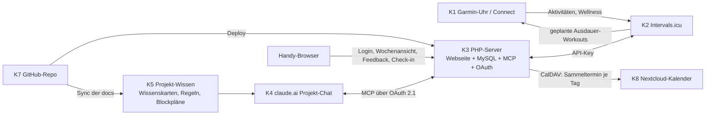

# 0. Zweck und Arbeitsweise mit diesem Dokument

- Dieses Dokument definiert Aufgabe, Architektur, Entscheidungen und Arbeitspakete (AP) für das System „KI-Personal-Trainer".
- Die **Codearbeit** findet in einer separaten Chat-Instanz statt. Diese Instanz arbeitet die AP in der angegebenen Reihenfolge ab und aktualisiert nach jedem AP:
  1. den Statusblock des AP in diesem Dokument (`status`, `probleme_loesungen`),
  2. das separate Prüfprotokoll `docs/pruefung/pruefprotokoll.md` (Struktur in Abschnitt 16),
  3. Changelog und Dokumentation des Repos.
- **Trainingsfachliche Arbeit** (Wissensbasis, Trainerregeln, Athletenprofil, Blockpläne) findet im claude.ai-Projekt „Personal Training & Trainingsdokumentation" statt, nicht in der Code-Instanz.
- **Rollenverteilung (Modelle):** Konzepterstellung (neue Konzepte, Entscheidungsvorlagen, neue AP, grundlegender Zuschnitt) und Design-Mockups (AP-01a, D-37) übernimmt das Modell **Fable**; Codearbeit, Tests, Deployment und Pull Requests übernimmt die **Code-Instanz**. Die Code-Instanz darf bestehende Konzepte **in Rücksprache mit dem Athleten** ändern und ergänzen (z. B. bestätigte Entscheidungen eintragen, Befunde aus der Umsetzung nachziehen) und dokumentiert Befunde in `probleme_loesungen`.
- Regel für Entscheidungen: Alles, was in Abschnitt 4 als `entschieden` steht, ist nicht mehr zu diskutieren. Alles unter Abschnitt 5 (`offen`) ist vor Umsetzung des betroffenen AP zu klären.

# 1. Aufgabenstellung

## 1.1 Ziel

Ein System, mit dem Claude (im Projekt-Chat) als Personal Trainer fungiert:

1. Trainingspläne für die kombinierten Ziele erstellt und wöchentlich anpasst,
2. Entscheidungen auf hinterlegte Literatur stützt (nachprüfbar, zitiert),
3. Rückmeldungen und Messdaten des Athleten strukturiert erhält (Ausführung, Belastung, Schmerz, Erholung, Uhrdaten),
4. Pläne so ausgibt, dass Ausdauereinheiten auf der Garmin-Uhr und alle anderen Einheiten auf dem Handy nutzbar sind.

## 1.2 Trainingsbereiche

| id | bereich | beschreibung |
|---|---|---|
| T1 | Ausdauer | Lauftraining für Trailrunning und Skitouren (bergauf-orientierte Ausdauer) |
| T2 | Kraft/Haltung | Haltungstraining für den Alltag, allgemeine Kräftigung |
| T3 | Klettern | Gezieltes Training für Bouldern und Klettern (Fingerkraft, Zugkraft, Technik-Volumen) |

Alle drei Bereiche werden in einem gemeinsamen Wochenplan geführt; Priorisierung erfolgt blockweise (Abschnitt 14).

## 1.3 Nutzer

Ein einzelner Athlet (= Betreiber des Systems). Kein Mehrbenutzerbetrieb.

## 1.4 Rahmenbedingungen

- Bestehendes Webhosting bei Lima-City (Apache 2.4, PHP, MySQL, FTPS, zeitgesteuerter URL-Aufruf als Cronjob); kein Plesk; kein dauerhaft laufender Node/Python-Prozess vorausgesetzt.
- Garmin-Uhr vorhanden.
- GitHub für Code und Dokumente; Deployment per Push aus GitHub auf den Server (D-17).
- claude.ai-Projekt mit Projekt-Wissen (Dateien), Projekt-Memory und Custom Connectors (MCP).

# 2. Nicht-Ziele und Ausschlüsse

| id | ausschluss | begruendung |
|---|---|---|
| N1 | Strava-API | API-Bedingungen seit 11/2024 untersagen Nutzung der Daten in KI-Anwendungen; Änderungen 06/2026: Gebühren, keine Intermediär-Plattformen mehr. |
| N2 | Garmin Connect Developer Program | Nur für geschäftliche Nutzung; neue Anträge derzeit pausiert. |
| N3 | Inoffizielle Garmin-Bibliotheken | Verstoß gegen Nutzungsbedingungen, brechen regelmäßig; nicht als Fundament. |
| N4 | KI-Logik in der Webseite | Keine LLM-Aufrufe aus dem Server; alle „Intelligenz" liegt im Projekt-Chat. Server = Daten + Schnittstelle. |
| N5 | Medizinische Diagnostik | System steuert Belastung; Diagnostik und Therapie bleiben bei Fachpersonen (Schwellenregeln in Abschnitt 14). |
| N6 | Hintergrund-Monitoring durch Claude | Claude arbeitet ausschließlich reaktiv im Chat; keine Push-Benachrichtigungen, keine automatische Anpassung ohne Chat. |
| N7 | Rohdaten im Chat | Keine FIT-Files, keine Sekunden-Streams; nur Aggregate über MCP (Budget in Abschnitt 8.3). |
| N8 | Mehrbenutzerbetrieb | Bewusst ausgeschlossen; vereinfacht Auth und Datenmodell. |

# 3. Systemarchitektur

## 3.1 Komponenten

| id | komponente | ort | aufgabe |
|---|---|---|---|
| K1 | Garmin-Uhr + Garmin Connect | Athlet | Aufzeichnung aller Aktivitäten; Anzeige geplanter Ausdauer-Workouts; Schlaf/HRV/Ruhepuls |
| K2 | Intervals.icu | Drittanbieter | Hub für Ausdauer: empfängt Aktivitäten und Wellness von Garmin; hält geplante Ausdauereinheiten (Kalender); überträgt geplante Workouts an Garmin Connect (Vorschau eine Woche) |
| K3 | PHP-Server (Lima-City) | Eigenes Hosting | Webseite (mobil und Tablet), MySQL-Datenbank, Intervals.icu-Client, MCP-Endpunkt, OAuth-Server |
| K4 | claude.ai-Projekt | Anthropic | Trainer-Instanz: Planung, Anpassung, Begründung; Zugriff auf K3 über Custom Connector (MCP) |
| K5 | Projekt-Wissen (Dateien im Projekt) | Anthropic | Wissenskarten (Literatur), Trainerregeln, Blockpläne (Athletenprofil seit D-48 in K3) |
| K6 | Projekt-Memory | Anthropic | Nur stabile, nicht gesundheitsbezogene Fakten (Ziele, Ausrüstung, Präferenzen) |
| K7 | GitHub-Repo | GitHub | Code (server/), Dokumente (docs/), Wissenskarten (docs/wissen/), Regeln (docs/regeln/) |
| K8 | Nextcloud-Kalender (CalDAV) | Eigenes Hosting des Athleten | Kopie der Einheiten als ganztägiger Sammeltermin je Tag (AP-11, D-50, D-60); wird nur von K3 beschrieben |

## 3.2 Datenflüsse



## 3.3 Was wo gespeichert wird (System of Record)

| daten | system_of_record | bemerkung |
|---|---|---|
| Geplante Ausdauereinheiten | K2 Intervals.icu (Event) | K3 hält nur `intervals_event_id` als Referenz |
| Ausgeführte Ausdauer-Aktivitäten, HF, Pace, Höhe, Load | K2 | K3 spiegelt Zusammenfassungen in `ext_activity` (D-43, read-through und stündlicher Abgleich) |
| Objektive Wellness (HRV, Ruhepuls, Schlaf) | K2 (aus Garmin) | K3 spiegelt in `ext_wellness` (D-43) |
| Geplante Nicht-Ausdauer-Einheiten (Kraft, Klettern, Haltung) | K3 MySQL | Strukturierte Inhalte (Übungen, Sätze, Kante, Last) |
| Ausführungslog aller Einheiten (Ist-Werte) | K3 MySQL | Auch für Ausdauereinheiten (Feedback) |
| Feedback (RPE, Feel, Schmerz, Abweichung, Notiz) | K3 MySQL | Ein Eingabeort für alles |
| Tägliches Check-in | K3 MySQL | D-16 |
| Kalendertermine der Einheiten | K3 MySQL (Einheit) | K8 hält nur eine Kopie; Änderungen im Kalender werden nicht zurückgelesen und beim nächsten Abgleich überschrieben (D-50, D-60) |
| Backups (verschlüsselte DB-Dumps) | Manuell heruntergeladen bzw. per E-Mail beim Athleten; Pre-Migration-Dumps lokal außerhalb Docroot | D-18 |
| Branding-Dokument | K7 Repo (docs/branding/) | D-19 |
| Blockplan, Begründungen, Trainerregeln, Wissenskarten | K7 Repo + K5 Projekt-Wissen | Textdokumente |
| Athletenprofil (Ziele, Zeitbudget, Ausrüstung, Einschränkungen, Leistungswerte) | K3 MySQL (`athlete_profile`, D-48; Zugriff über `get_athlete_profile`/`update_athlete_profile`) | Nicht in K6 Memory; nicht mehr als Datei in K7/K5 (vorher D-15) |
| OAuth-Clients, Auth-Codes, Refresh-Tokens (gehasht), Web-Sessions, Audit-Log der MCP-Schreibzugriffe | K3 MySQL | Access-Tokens sind signierte JWT und werden nicht gespeichert (D-32); Web-Session in `web_session` (D-33) |
| MCP-Sitzungsdateien des SDK (nur für Clients älterer Protokollrevisionen) | K3 Dateisystem `<Ordner>/var/` | Außerhalb Docroot, vom Deployment nicht berührt (D-17) |

# 4. Entscheidungen (entschieden)

| id | entscheidung | begruendung | datum |
|---|---|---|---|
| D-01 | Zielarchitektur ist Ausbaustufe 3: eigene Web-App mit Datenbank plus MCP-Server, Intervals.icu als Hub für Ausdauer und Garmin. | Intervals.icu modelliert Kraft/Klettern nur als Textnotiz; strukturierte Nicht-Ausdauer-Einheiten und einheitliches Feedback brauchen eigene DB. | 2026-09-27 |
| D-02 | Intervals.icu ist die einzige Verbindung zu Garmin (Aktivitäten, Wellness, Workout-Push). | Strava und Garmin-API ausgeschlossen (N1–N3); Intervals.icu bietet API mit persönlichem Key und direkten Garmin-Sync. | 2026-09-27 |
| D-03 | Server in PHP auf bestehendem Webhosting (Lima-City); MCP über Streamable HTTP im stateless-Modus (Protokollrevision 2026-07-28), kein Dauerprozess. | Aktuelle MCP-Revision ist sitzungslos, jeder POST ein abgeschlossener JSON-RPC-Austausch; passt zu PHP/Apache. | 2026-09-27 |
| D-04 | MCP-SDK: `logiscape/mcp-sdk-php` (Erstwahl); offizielles PHP-SDK als Alternative, falls logiscape Blocker zeigt. Präzisierung (Befund 2026-09-27, geprüft an v2.0.1): Das SDK liefert nur die **Resource-Server-Seite** von OAuth 2.1 – Bearer-Prüfung über `TokenValidatorInterface` (mitgeliefert `JwtTokenValidator` für HS256/RS256 mit iss/aud/exp-Prüfung, eigene Validatoren möglich), Auslieferung von `/.well-known/oauth-protected-resource`, 401 mit `WWW-Authenticate: Bearer resource_metadata=...`. Es enthält **keinen Autorisierungsserver** (Metadaten nach RFC 8414, Dynamic Client Registration, Authorize, Token). Der Autorisierungsserver wird in AP-01 selbst gebaut (D-32, D-36). | logiscape ist explizit für PHP/Apache/Shared-Hosting gebaut, hohe Konformanz; die Resource-Server-Bausteine (Validator, Metadaten, 401) werden genutzt, die Autorisierungsserver-Seite ist für einen Einzelnutzer überschaubar (vier Endpunkte, vier Tabellen). Offizielles SDK ist noch experimentell. | 2026-09-27 |
| D-05 | Authentifizierung claude.ai ↔ MCP: OAuth 2.1 (Single-User-Implementierung: Metadaten, Dynamic Client Registration, Authorize mit Webseiten-Login, Token mit PKCE, Bearer-Prüfung). Konkretisierung: Token-Format D-32, Login D-33, Client-Registrierung und Freigabe D-36. | claude.ai-Custom-Connectors unterstützen ausschließlich OAuth, keine eigenen Header. OAuth ist zudem für Gesundheitsdaten und Schreibzugriff das angemessene Verfahren. | 2026-09-27 |
| D-06 | Fallback bis OAuth-Flow stabil: Claude Desktop (oder Claude Code) mit statischem Bearer-Token-Header gegen denselben MCP-Endpunkt. Konkretisierung: Das statische Token steht in `.env` als `MCP_STATIC_TOKEN` und wird nur akzeptiert, wenn zusätzlich `MCP_STATIC_TOKEN_ENABLED=true` gesetzt ist (Standard: nicht gesetzt = aus). Die Prüfung erfolgt im selben Validator-Pfad vor der JWT-Prüfung (D-32); ein akzeptiertes statisches Token gilt mit vollem Scope. | Bekannte Flakiness des claude.ai-OAuth-Handshakes; Desktop/Code erlauben Header. Fallback ist nicht mobil. Eigenes Aktivierungsflag verhindert, dass ein vergessenes Token dauerhaft eine zweite Tür offenhält. | 2026-09-27 |
| D-07 | Ausdauereinheiten werden in den Intervals.icu-Kalender geschrieben und erscheinen auf der Uhr; alle anderen Einheiten leben auf der Webseite. | Nutzeranforderung; Garmin-Push für strukturierte Kraft-Workouts ist unklar und nicht nötig. | 2026-09-27 |
| D-08 | Die Webseite zeigt eine Wochenansicht für alle Einheiten inkl. Ausdauer (serverseitig aus Intervals.icu geladen) und nimmt Feedback für alle Einheiten auf. | Ein Eingabeort; vermeidet doppelte Erfassung. | 2026-09-27 |
| D-09 | Phase 1: Live-Proxy auf Intervals.icu (kein Cron-Spiegel). Cron-Spiegel nach MySQL optional in AP-09 (entschieden: D-43). | Vermeidet Sync-Logik; Rate-Limit (10 req/s) ist unkritisch. Spiegel nur bei Backup-/Performance-Bedarf. | 2026-09-27 |
| D-10 | Der Trainingsplan ist Daten, kein Code. Trainerregeln und Literatur sind Dokumente im Projekt-Wissen. GitHub/Claude Code dienen nur dem Bau des Werkzeugs. | Regeln bleiben lesbar, versionierbar, im Chat hinterfragbar; keine Logik-Duplikation im Server. | 2026-09-27 |
| D-11 | Claude schreibt Pläne erst nach expliziter Bestätigung im Chat in DB und Intervals.icu. Jeder Schreibzugriff wird im Audit-Log protokolliert. | Nutzerpräferenz (Bestätigung vor Umsetzung); Nachvollziehbarkeit. | 2026-09-27 |
| D-12 | Literatur wird als strukturierte Wissenskarten (Markdown mit Quellenangabe) hinterlegt, nicht als vollständige Bücher. PubMed-Connector für Primärstudien. | Größe, Urheberrecht, Zitierfähigkeit. | 2026-09-27 |
| D-13 | Zitierregel: Jede trainingsfachliche Aussage von Claude wird entweder mit Wissenskarte/DOI belegt oder ausdrücklich als „Einschätzung ohne Quelle" markiert. | Verhindert erfundene Referenzen. | 2026-09-27 |
| D-14 | Gesundheitsbezogene Daten (Schmerz, Verletzungen, Einschränkungen) werden ausschließlich in K3 (MySQL) und K7/K5 (Profil-Dokument) gehalten, nie im Projekt-Memory (K6). | Datensparsamkeit; Memory hält nur stabile, nicht sensible Fakten. | 2026-09-27 |
| D-15 | ~~Athletenprofil ist ein Dokument (docs/athlet/profil.md), kein DB-Objekt (Phase 1).~~ **Ersetzt durch D-48 (2026-09-28).** | Geringer Aufwand, im Chat direkt lesbar; DB-Abbildung bei Bedarf in AP-09. | 2026-09-27 |
| D-16 | Tägliches Check-in auf der Webseite mit genau drei Feldern: `recovery_1_5`, `soreness_1_5`, `pain_flag` (bei ja → Schmerzereignis). Keine separate Schlafqualität. Fehlende Einträge gelten als fehlend; MCP meldet Abdeckungsquote. | Subjektive Marker sind sensitiver als objektive (L-P11, verifiziert V-06); Schmerz hat keinen objektiven Ersatz; minimaler Umfang sichert Compliance. Bestätigt durch Athlet. | 2026-09-27 |
| D-17 | Deployment: GitHub-Repo ist Quelle; ein GitHub-Actions-Workflow baut (`composer install --no-dev`) und überträgt `server/` per FTPS (explizit, Port 21) in den Subdomain-Ordner auf dem Webspace. Kein Klartext-FTP. Layout auf dem Server: Subdomain-Ordner = Inhalt von `server/` (`src/`, `vendor/`, `migrations/`, …), Document Root = `<Ordner>/public`, `.env` direkt in `<Ordner>/`, Backups in `<Ordner>/backups/`, Laufzeitdaten (z. B. MCP-Sitzungsdateien des SDK für Clients älterer Protokollrevisionen) in `<Ordner>/var/`; nur `public/` ist per HTTP erreichbar. `.env`, `backups/` und `var/` werden vom Deployment nie überschrieben oder gelöscht. Migrationen werden nach dem Upload über einen geschützten Endpunkt vom Workflow ausgelöst (Secret in GitHub Actions). Optional zweiter Workflow für eine Staging-Subdomain. | Kein SSH/Composer auf dem Server vorausgesetzt; reproduzierbarer Build; Nutzeranforderung „GitHub + FTP-Push". | 2026-09-27 |
| D-18 | Backup betrifft nur die Datenbank (Code und Dokumente liegen in GitHub). Mechanik: SQL-Dump per PHP (Schema + Daten, portabel) → gzip → Verschlüsselung mit Passwort. Format OpenSSL-kompatibel (AES-256-CBC, PBKDF2 mit dokumentierter Iterationszahl, `Salted__`-Header), damit die Datei ohne eigenes Werkzeug per `openssl enc -d` entschlüsselbar ist. Auslöser: (a) manuell als Download auf der Webseite (nur eingeloggt); (b) zeitgesteuert per E-Mail (Lima-City-Cronjob ruft einen geschützten Endpunkt auf, Intervall konfigurierbar, Standard wöchentlich); (c) automatisch vor jeder Migration (in `backups/` außerhalb Docroot, Rotation der letzten 5). Backup-Passwort liegt in `.env`. Restore-Anleitung im README; Restore-Test Pflicht in AP-10. | Nutzeranforderung; DB ist klein (KB bis wenige MB), E-Mail-Anhang unkritisch; Standardformat sichert Wiederherstellbarkeit auf jedem Rechner. Tradeoff: symmetrisches Passwort auf dem Server bedeutet, dass ein Serverkompromiss auch das Backup-Passwort preisgibt – da der Server die DB ohnehin hält, entsteht kein zusätzlicher Verlust. Asymmetrische Variante (Public Key auf dem Server) optional in AP-09 – gestrichen (D-47). CBC ohne Authentifizierung: Integrität wird über die gzip-Prüfsumme nach dem Entschlüsseln erkannt. | 2026-09-27 |
| D-19 | Das Branding-Dokument wird im Repo unter `docs/branding/` abgelegt und gilt für **alle** Webseiten-Screens ab AP-01 (S0 Setup, S1 Login, S7 Freigabe) über AP-04 (S2–S5) bis AP-09 (S6). Es enthält die Gestaltungsvorgaben des Athleten und die Mockups aus AP-01a (D-37); alle Screens sind **mobil- und tabletfreundlich** (responsive, Touch-Bedienung, Hoch- und Querformat) und haben zusätzlich eine **Desktop-Ansicht** (Seitenleiste ab 1024 px; Ergänzung 2026-09-27, branding.md B-02). Die Code-Instanz liest es vor Beginn von AP-01. | Gestaltung ist Umsetzungsdetail, keine Konzeptentscheidung; da bereits AP-01 sichtbare Seiten baut, muss die Vorgabe vorher vorliegen. | 2026-09-27 |
| D-20 | Update-Mechanik: Schemaänderungen ausschließlich als nummerierte Migrationsdateien in `server/migrations/` (SQL oder PHP), Tabelle `schema_version` hält den Stand. Der Code trägt eine `APP_SCHEMA_VERSION`; bei jedem Request prüft die App, ob Code- und DB-Stand übereinstimmen – bei Abweichung wird eine „Update erforderlich"-Seite angezeigt und jeder Schreibzugriff (Web und MCP) blockiert, bis migriert ist. Migration wird ausgelöst (a) vom Deploy-Workflow über den geschützten Endpunkt (D-17) oder (b) manuell über eine Schaltfläche nach Login. Ablauf jeder Migration: Wartungsflag setzen → Pre-Migration-Dump (D-18 c) → Migrationen der Reihe nach, `schema_version` nach jeder einzelnen Migration fortschreiben → Wartungsflag lösen. MySQL beendet Transaktionen bei DDL (`CREATE`/`ALTER`) implizit; daher: ein fachlicher Schritt pro Migrationsdatei, Datenänderungen in Transaktionen, Schemaänderungen ohne; bricht eine Migration ab, bleibt `schema_version` auf der letzten erfolgreichen. Kein automatisches Rollback: Rückweg = vorheriger Git-Tag deployen + Pre-Migration-Dump einspielen. | Verhindert Code/Schema-Mismatch nach einem FTP-Upload, dessen Migrationsaufruf fehlschlug; Dump vor Migration ist der einzige zuverlässige Rückweg. Down-Migrationen sind Aufwand ohne Nutzen für ein Einzelnutzer-System. | 2026-09-27 |
| D-21 | Englischsprachige Literatur ist der deutschsprachigen gleichgestellt; Auswahl nach Eignung, nicht nach Sprache. | Die maßgeblichen Konsenspapiere und Praxisbücher (Klettern, Bergausdauer) sind englischsprachig. | 2026-09-27 |
| D-22 | Evidenzhierarchie für Regelquellen: Consensus Statements / Position Stands / systematische Reviews > wissenschaftliche Lehrbücher > Praxisliteratur. Lehrbücher liefern Grundlagen und Begriffe; Regeln in `docs/regeln/` stützen sich vorrangig auf Paper. | Klassische Standardwerke mischen empirische Befunde mit tradierten Modellen (Superkompensation, klassische Periodisierung); Paper sind per DOI/PMID prüfbar, oft Open Access und kurz (Tokenbudget 13.1). | 2026-09-27 |
| D-23 | Das GitHub-Repo ist privat. | Wissenskarten sind eigene Zusammenfassungen mit Seitenangaben. PDFs dürfen seit D-31 (Fassung 2026-09-27, Nachtrag) im Repo liegen. | 2026-09-27 |
| D-24 | Bei parallel publizierten Konsenspapieren gilt die in PubMed indexierte Fassung als Zitierfassung. | Anlass L-P06 (Meeusen et al. 2013): widersprüchliche Seitenangaben aus Sekundärzitaten. | 2026-09-27 |
| D-25 | Quellenhierarchie Ausdauer (T1), Konkretisierung von D-22: Systematische Reviews und Übersichtsarbeiten bilden den Kern der Wissenskarten, Lehrbücher das Fundament für Begriffe und Physiologie. Praxisquellen (Trainerbücher, Trainerbefragungen) sind zulässig, werden in Karten aber mit `quellentyp: praxisquelle` und `konfidenz: niedrig` (Bücher) bzw. `mittel` (peer-reviewte qualitative Studien mit Trainern) geführt. Jede Karte benennt unter „Grenzen" die Übertragung von Elite-/Hochleistungsdaten auf den Athleten (Freizeitsport, drei Trainingsbereiche). „Training for the Uphill Athlete" bleibt auf Wunsch des Athleten als Praxisquelle. | Aktuelle Evidenz zu Intensitätsverteilung/Periodisierung steht in Reviews; Lehrbücher tradieren teils schwach belegte Modelle. Ausschluss Weineck: Einschätzung ohne Quelle (kompilatorisch). | 2026-09-27 |
| D-26 | Wissenskarten werden auf Deutsch verfasst (Quellen deutsch oder englisch, D-21). Beschaffung der Bücher und nicht frei verfügbaren Artikel übernimmt der Athlet. Für den Erstellungsprozess 13.1 muss jede Quelle als durchsuchbares PDF vorliegen; DRM-geschützte E-Books (z. B. VitalSource) sind ungeeignet. Formatprüfung je Titel vor dem Kauf (V-13). | Formatanforderung folgt aus 13.1 Schritt (1)–(3). Human-Kinetics-E-Books laufen über VitalSource mit DRM (festgestellt in T1 und T2). | 2026-09-27 |
| D-27 | Zonenreferenz der Wissenskarten ist das internationale Drei-Zonen-Modell (Zone 1 ≤ LT1/VT1, Zone 2 zwischen LT1 und LT2, Zone 3 > LT2/VT2), wie in L-T1-02 und L-T1-03. In Plänen und auf der Uhr werden die fünf Garmin-Herzfrequenzzonen genutzt, definiert als %LTHR. Abbildung 3 → 5 Zonen und Grenzwerte werden in AP-07 (Regel) und AP-08 (Ausgangstests, LT1-Bestimmung) festgelegt. Das deutsche GA1/GA2/WSA-System ist keine Referenz; Neumann/Pfützner/Berbalk nur optional. | Garmin bietet fünf HF-Zonen (BPM, %HFmax, %HFR oder %LTHR, je Sportprofil); %LTHR verankert die Zonen an einer Schwelle und ist mit der Schwellendefinition der Kernquellen kompatibel; GA-Bezeichnungen existieren auf der Uhr nicht. Einschränkung: Garmin kennt nur eine Schwelle (LTHR ≈ LT2); LT1 muss separat bestimmt werden. | 2026-09-27 |
| D-28 | Literatur Krafttraining (Geltungsbereich T2 und Kraft als Ergänzung zu T1; fingerspezifische Kraft gehört zu T3). Kernset: L-P08 (ACSM Position Stand 2026, Anker Dosierung), L-A03 (NSCA Essentials, 5. Aufl., Breite: Programmgestaltung, Testung, Technik), L-T2-03 (Schumann/Rønnestad, Concurrent Aerobic and Strength Training, Kombination Ausdauer + Kraft). Optional kapitelweise: L-T2-05 (Zatsiorsky/Kraemer/Fry), L-T2-06 (Güllich/Krüger, Sport – Lehrbuch). Zurückgestellt: L-T2-07 (Schoenfeld, Hypertrophie kein Primärziel). Weineck und Bompa nicht als Evidenzbasis. Ergänzend Primärliteratur über PubMed (V-14). | Positionspapier = aktuellste Evidenzsynthese (137 systematische Reviews, GRADE); Lehrbücher bündeln Konsens mit Verzögerung und mischen Evidenz mit Praxiserfahrung; Tokenbudget 13.1 erlaubt kein Vollprogramm. | 2026-09-27 |
| D-29 | Calisthenics ist Teil von T2. Übungskatalog mit Progressionsleitern aus L-T2-04 (Low, Overcoming Gravity, 2. Aufl. 2016), abgelegt als Abschnitt `uebungskatalog_calisthenics` in der T2-Sammeldatei, nicht als eigene Karte; Konfidenz niedrig (Praxiswissen). Dosierung (Sätze, Nähe zum Muskelversagen, Frequenz, Volumen) ausschließlich aus dem Kernset D-28. Ausgeschlossen: Wade, Convict Conditioning. | Kein wissenschaftliches Standardwerk zu Calisthenics; Progression über Hebelvarianten praktisch nicht untersucht. Belastungsprinzipien gelten unabhängig vom Widerstand (ACSM 2026 schließt Körpergewicht/Band/Heimtraining ein). Direkte Studien L-T2-08 bis L-T2-10 (per PubMed geprüft). Convict Conditioning: anonymer Autor, unbelegte Behauptungen. | 2026-09-27 |
| D-30 | Zugübungen mit Körpergewicht (Klimmzug-Varianten, Front Lever u. ä.) werden unter T3 geplant (`session.type = klettern`, Block `zugkraft`). Calisthenics unter T2 umfasst Druckübungen, Beine und Rumpf. | Starke Überschneidung mit Kletter-Zugkraft; nur bei Zuordnung zu T3 greifen die Sequenzierungsregeln (Abschnitt 14 Kap. 2). | 2026-09-27 |
| D-31 | Einheitliches Evidenzschema für alle Literaturblöcke: Stufe A = Paper/Konsens (konfidenz hoch), B = wissenschaftliche Lehrbücher (mittel), C = Praxisquellen (niedrig). Stufe C darf in Wissenskarten als Übungs-/Ideenfundus und mit Kennzeichnung zitiert werden, aber nie allein einen Belastungsparameter (Dosierung, Progression, Schwelle) begründen. Volltexte (Open Access und gekaufte PDFs) dürfen im privaten Repo unter `docs/literatur/` liegen, nie im Projektwissen; einzelne Dateien < 100 MB (GitHub-Grenze), große Bücher als Kapitel-PDFs. Evidenzkern T3 gemäß E6 übernommen (L-T3-01, -02, -03, -06, -08; -09 optional). Klettermedizin: englische Ausgabe 2022 (L-T3-06) bevorzugt, deutsche 2020 (L-T3-07) als Alternative. | Vereinheitlicht D-22, D-25, D-29 und die T3-Vorschläge E3–E6; bestätigt durch Athlet (Q-07, Q-08). | 2026-09-27 |
| D-32 | Token-Format OAuth (AP-01). **Access-Token** = JWT, signiert mit HS256, Laufzeit 1 h, Secret aus `.env` (`OAUTH_JWT_SECRET`, Pflicht, ≥ 32 Zeichen). Claims: `iss` (= `APP_URL`), `aud` (= `APP_URL` + `/mcp`), `sub` (Benutzer-ID), `client_id`, `scope`, `iat`, `exp`, `jti`. Prüfung am `/mcp`-Endpunkt über den SDK-`JwtTokenValidator` (iss/aud/exp); Access-Tokens werden nicht in der DB gespeichert. **Refresh-Token** = zufälliger Wert (≥ 32 Byte), nur gehasht in `oauth_token` abgelegt, widerrufbar, **Rotation bei jeder Nutzung** (altes Token wird als benutzt markiert, neues ausgegeben, gleiche `family_id`); Wiederverwendung eines bereits rotierten Refresh-Tokens widerruft die **gesamte Token-Familie**. Tabelle `oauth_token` hält damit nur Refresh-Tokens (Feld `type` bleibt für Erweiterbarkeit). | Der SDK-Validator kann JWT direkt prüfen, ohne DB-Zugriff pro Request; HS256 genügt, da Aussteller und Prüfer derselbe Server sind. Rotation mit Familien-Widerruf ist die OAuth-2.1-Empfehlung gegen gestohlene Refresh-Tokens. **Tradeoff:** Ein Widerruf wirkt für bereits ausgegebene Access-Tokens erst nach deren Ablauf (≤ 1 h), weil sie nicht gegen die DB geprüft werden – für einen Einzelnutzer akzeptiert; im Notfall wird `OAUTH_JWT_SECRET` gewechselt, was alle Access-Tokens sofort ungültig macht. | 2026-09-27 |
| D-33 | Login der Webseite (Q-05): **Passwort** mit langer Session (**30 Tage**, gleitend über `last_seen_at`). Die Session liegt in der eigenen Tabelle `web_session` (`token_hash`, `user_id`, `csrf_secret`, `created_at`, `last_seen_at`, `expires_at`), das Session-Token im Cookie (`HttpOnly`, `Secure`, `SameSite=Lax`), in der DB nur gehasht. Schutz gegen Raten (Werte vom Athleten bestätigt 2026-09-27): `user.failed_logins` und `user.locked_until` – nach **10 Fehlversuchen** wird das Konto **5 Minuten** gesperrt; bei weiteren Fehlversuchen nach Ablauf der Sperre verdoppelt sich die Sperrdauer jeweils (10, 20, 40 min …, **maximal 24 h**); der Zähler `failed_logins` läuft dabei weiter und bestimmt die Stufe. Ein **erfolgreicher Login setzt** `failed_logins` **auf 0** und löscht `locked_until`. Passwort-Hash mit `password_hash()` (Argon2id, sonst bcrypt). Passkey (WebAuthn) optional in AP-09. Der Login wird bereits in AP-01 gebaut, weil `/oauth/authorize` ihn voraussetzt. | PHP-Standardsessions auf Shared Hosting leben nicht zuverlässig 30 Tage (Garbage Collection, Sitzungsverzeichnis des Hosters); eigene Tabelle macht Laufzeit und Widerruf kontrollierbar. Passkey ist Komfort, kein Sicherheitsgewinn, solange nur ein Gerät angemeldet wird. | 2026-09-27 |
| D-34 | Erstes Passwort: einmalige Seite `/setup`, nur aktiv, **solange kein Benutzer existiert**; verlangt das `MIGRATION_SECRET` aus `.env` und legt den einzigen Benutzer (Login, Passwort, Zeitzone) an. Sobald ein Benutzer existiert, antwortet `/setup` dauerhaft mit 404; ein Zurücksetzen erfolgt nur über die Datenbank (Benutzer löschen). | Kein Seed-Passwort im Repo oder in Migrationen; das ohnehin vorhandene Deploy-Secret beweist Betreiberrechte. Einzelnutzer (N8): kein Einladungs- oder Registrierungsfluss nötig. | 2026-09-27 |
| D-35 | Die Tabellen `user`, `web_session`, `oauth_client`, `oauth_auth_code`, `oauth_token` werden in **AP-01** als Migrationen angelegt (vorgezogen aus AP-03). AP-03 legt nur noch die Trainingstabellen an (`training_block`, `training_week`, `session`, `session_execution`, `pain_event`, `checkin`, `audit_log`, optional `ext_cache`). | AP-01 braucht Login und OAuth-Persistenz produktiv; Q-05 ist entschieden (D-33), damit entfällt die frühere Wartebedingung für AP-03. | 2026-09-27 |
| D-36 | Dynamic Client Registration (`/oauth/register`) ist **offen** (jeder Client darf sich registrieren, RFC 7591, ohne Vorab-Secret). Schutz liegt im Authorize-Schritt: Login (D-33) und eine **ausdrückliche Freigabeseite**, die Client-Name und Redirect-Host anzeigt und eine Bestätigung verlangt; ohne Bestätigung kein Code. Regeln: Redirect-URIs nur `https://` oder `http://localhost` bzw. `http://127.0.0.1` (exakter Vergleich gegen die registrierte URI); **PKCE mit `S256` Pflicht** (`plain` abgelehnt); Autorisierungscodes 10 min gültig, einmalig, gehasht gespeichert; unbenutzte Client-Registrierungen dürfen nach 30 Tagen aufgeräumt werden. | claude.ai registriert seinen Client selbst und erwartet offene DCR; eine Registrierung allein verschafft keinen Zugriff, weil jeder Zugriff die Freigabe des angemeldeten Athleten braucht. Localhost-Ausnahme für Claude Desktop/Code und lokale Tests. | 2026-09-27 |
| D-37 | **Design-Mockups vor AP-01** (eigenes Vorpaket AP-01a, Fable): Mockups aller Screens – S0 Setup, S1 Login, S2 Woche, S3 Einheit, S4 Check-in, S5 Schmerz, S7 OAuth-Freigabe – mobil- und tabletfreundlich, auf Grundlage der Gestaltungsvorgaben des Athleten (werden noch geliefert). Ergebnis ist das Branding-Dokument unter `docs/branding/` (D-19); Abnahme durch den Athleten ist Voraussetzung für AP-01. | Bereits AP-01 baut drei sichtbare Seiten (Setup, Login, Freigabe); eine spätere Umgestaltung wäre doppelte Arbeit. Die Code-Instanz setzt Mockups um, entwirft sie aber nicht (Rollenverteilung Abschnitt 0). | 2026-09-27 |
| D-38 | Laufzeit der Refresh-Tokens (Q-09): **90 Tage**, jede Rotation beginnt die Laufzeit neu. Nach Ablauf muss der Connector in Claude neu verbunden werden (Login + Freigabe). | Bei wöchentlicher Nutzung nie ein erneuter Login; ein verlorenes oder vergessenes Gerät verliert den Zugang spätestens nach 90 Tagen ohne Nutzung. Bestätigt durch Athlet. | 2026-09-28 |
| D-39 | `plan_json` für die in 7.1 fehlenden Typen (Q-10): `mobilitaet` nutzt das Schema `kraft_oder_haltung` (Übungsliste; Haltezeiten als `reps` z. B. „30s“); `ruhe` hat kein `plan_json` (leer oder nur `notes`). | Passt zu den Mockups (S3) und hält Webseite und MCP-Schnittstelle einfach. Bestätigt durch Athlet. | 2026-09-28 |
| D-40 | MCP-Tool `upsert_block` (Q-11): legt einen Trainingsblock an oder ändert ihn (Name, Zeitraum, Status, Zielevents, Phasen, Verweis auf `docs/plaene/`); Status „aktiv“ schließt andere aktive Blöcke ab. Voraussetzung für `write_week_plan`. | Der Blockplan entsteht im Projekt-Chat (AP-08); Claude legt ihn nach Bestätigung selbst an, ohne Handarbeit in der Datenbank. Bestätigt durch Athlet. | 2026-09-28 |
| D-41 | Optionales Feld `sport` in `plan_json.ausdauer` (Q-12): Intervals.icu-Sportart des Events (Run, TrailRun, Hike, Walk, Ride, MountainBikeRide, GravelRide, BackcountrySki, NordicSki, Snowshoe, Swim, Rowing; Standard Run). | Skitour und Wandern kommen mit dem richtigen Sportprofil und den passenden Zonen (V-12) auf die Uhr. Bestätigt durch Athlet. | 2026-09-28 |
| D-42 | AP-09 wird umgesetzt mit: asymmetrischer Backup-Verschlüsselung, JSON-Export, Cron-Spiegel Intervals.icu → MySQL, Feedback-Rückschreiben nach Intervals.icu (Q-02), Verlauf S6, Passkey-Login, Athletenprofil als DB-Objekt, Offline-Fähigkeit. Vorgehen: direkte Umsetzung in der Reihenfolge JSON-Export → S6 → Spiegel → Rückschreiben → Passkey → asymmetrische Backups → Profil → Offline; Detailfragen zu einzelnen Punkten vorab einzeln. Asymmetrische Backups nachträglich gestrichen (D-47). | Entscheidung des Athleten nach Erklärung der Optionen. | 2026-09-28 |
| D-43 | Cron-Spiegel (ändert D-09): Aktivitäten und Wellness werden zusätzlich regelmäßig per Lima-City-Cronjob in eigene Tabellen übernommen; Webseite und MCP lesen aus dem Spiegel, Live-Abfrage nur als Rückfall. | Datenhoheit (auch im Backup), schnellere Seiten, Verläufe über lange Zeiträume (S6). | 2026-09-28 |
| D-44 | Passkey (WebAuthn) zusätzlich zum Passwort (ergänzt D-33); das Passwort bleibt Rückfallweg bei Geräteverlust. | Komfort im Alltag ohne Aussperr-Risiko. | 2026-09-28 |
| D-45 | Offline-Fähigkeit (ändert Abschnitt 10 „kein Offline-Modus in Phase 1“): Woche und Einheiten offline lesbar; Check-in, Rückmeldung und Schmerz offline erfassbar, werden gepuffert und bei Netz automatisch gesendet. Dafür Service Worker und JavaScript über das bisherige Minimum hinaus. | Nutzung in Halle/Gebirge ohne Netz. | 2026-09-28 |
| D-46 | Feedback-Rückschreiben nach Intervals.icu (Q-02): beim Speichern einer Rückmeldung auf der Webseite werden RPE (nur 1–10; RPE 0 wird nicht übertragen) und Gefühl (1–5, gleiche Richtung wie D-16/Abschnitt 11, V-03) automatisch auf die zugeordnete Intervals.icu-Aktivität geschrieben; die Notiz wird als Kommentar an die Aktivität angehängt, nur wenn sie neu oder geändert ist. Fehler brechen das Speichern nicht ab und werden angezeigt. | Intervals.icu-Diagramme vollständig; eigene Beschreibung in Intervals.icu bleibt unberührt. Entscheidung des Athleten. | 2026-09-28 |
| D-47 | Asymmetrische Backup-Verschlüsselung wird nicht umgesetzt (ändert D-42); Backups bleiben passwortverschlüsselt nach D-18 (`openssl enc`, AES-256-CBC, PBKDF2). Auch kein Wechsel auf AES-ZIP. | Ein Serverkompromiss legt die Live-Datenbank ohnehin offen, ein Postfachkompromiss enthält das Passwort nicht; Gewinn nur im Randfall „.env und alte Backups“ (ältere/gelöschte Stände). Kosten: Verwaltung eines privaten Schlüssels, dessen Verlust alle Backups unlesbar macht, umständlicherer Restore. ZIP wäre ebenfalls symmetrisch; der Restore braucht ohnehin die Kommandozeile, zum Ansehen gibt es den JSON-Export. Entscheidung des Athleten nach Erklärung. | 2026-09-28 |
| D-48 | Athletenprofil als DB-Objekt (ersetzt D-15): Tabelle `athlete_profile` mit festen Abschnitten `ziele`, `zeitbudget`, `ausruestung`, `einschraenkungen`, `leistungswerte`, `sonstiges`, je Abschnitt Markdown-Text (höchstens 6 000 Zeichen). Jede Änderung legt eine neue Fassung an (Datum, Urheber Claude/Web, optionaler Grund); frühere Stände bleiben lesbar. Die DB ist die einzige Quelle: `docs/athlet/profil.md` und die Kopie im Projekt-Wissen entfallen. Bearbeiten durch Claude (`update_athlete_profile`, Scope `training:write`) und auf der Webseite (`/profil`, erreichbar über S8); Schutz gegen gegenseitiges Überschreiben. | Profil ändert sich mit Tests und Lebensumständen; Claude kann Werte direkt im Chat eintragen, ohne Repo und Deployment. Abschnitte statt eines Dokuments, damit Änderungen gezielt sind; Fassungen, damit spätere Auswertungen den damaligen Stand kennen. Entscheidung des Athleten (Struktur, Bearbeiter, Quelle, Verlauf). | 2026-09-28 |
| D-49 | Ausgestaltung Offline (konkretisiert D-45): (a) Vorgeladen werden beim Öffnen der aktuellen Woche die aktuelle und die nächste Woche mit allen Einheiten sowie Check-in und Schmerz für heute; weitere besuchte Seiten dieser Art werden beim Aufruf gespeichert, andere Seiten sind offline nicht verfügbar. (b) Abmelden löscht die gespeicherten Seiten auf dem Gerät; noch nicht gesendete Eingaben bleiben und werden nach dem nächsten Login gesendet. (c) Wurde ein Eintrag (Check-in, Rückmeldung) seit dem Laden des Formulars geändert, wird eine gepufferte Eingabe nicht übernommen, sondern als Hinweis mit „Öffnen“, „Trotzdem übernehmen“ und „Verwerfen“ angezeigt; dieselbe Prüfung gilt online (Formular bleibt mit den Eingaben stehen, erneutes Speichern übernimmt). Schmerzereignisse sind immer neue Einträge und kollidieren nicht. | Entscheidung des Athleten (Umfang, Abmelden, Konflikt); „Trotzdem übernehmen“ ergänzt in der Umsetzung, damit eine Eingabe nach Prüfung nicht neu getippt werden muss. | 2026-09-28 |
| D-50 | Kalender per CalDAV-Push (AP-11): Die App schreibt jede Einheit außer Ruhetagen als ganztägigen Termin in einen Nextcloud-Kalender (eigener Kalender empfohlen), mit fester UID je Einheit; Titel „Typ: Titel“, Beschreibung mit Priorität, Dauer, Kurzplan, Trainer-Begründung und Link zur App. Status: erledigt/teilweise mit „✓“ im Titel, ausgelassen als abgesagter Termin, verschoben wandert mit dem Datum. Übertragen wird bei jeder Änderung (Wochenplan, update_session, Ersetzen einer Woche, Rückmeldung auf der Webseite); zusätzlich Abgleich 7 Tage zurück bis 8 Wochen voraus im stündlichen Cronjob und per Knopf in den Einstellungen, dabei werden verwaiste eigene Termine entfernt, fremde nie. Zugang über Nextcloud-App-Passwort in der .env (CALDAV_URL nur https); Fehler brechen nichts ab. Einbahnstraße: Änderungen im Kalender werden nicht zurückgelesen. **Zuschnitt geändert durch D-60 (2026-09-28): ein Sammeltermin je Tag statt je Einheit, ohne Status-Markierung und ohne abgesagte Termine.** | Entscheidung des Athleten (CalDAV statt ICS-Abo: sofort sichtbar; Umfang ohne Ruhetage; Markierung; Abgleich im bestehenden Cronjob; direkte Umsetzung durch die Code-Instanz). Einheiten haben keine Uhrzeit, daher ganztägig. | 2026-09-28 |
| D-51 | Ablage der Volltexte in `docs/literatur/`: Unterordner je Block (`uebergreifend/`, `t1-ausdauer/`, `t2-kraft/`, `t3-klettern/`), eine Datei im Block ihrer ID-Definition; Dateiname `<ID>_<Erstautor>-<Jahr>_<Kurztitel>[_<Auflage>].pdf` (ASCII). Bücher zusätzlich als Kapitel-PDFs in `<ID>_kapitel/` (Schritt 1 in 13.1; Kapitel über 60 PDF-Seiten in etwa gleich große Teile, möglichst an Abschnittsgrenzen); das Originalbuch bleibt liegen. Im Konzept verweisen die Felder `datei`/`kapitel` auf die Dateien, 13.4 führt die Spalte „vorhanden“, `docs/literatur/README.md` ist das Verzeichnis. L-A01 liegt in der 7. Aufl. (2019) vor: gilt vorläufig, die 8./9. Aufl. bleibt auf der Beschaffungsliste. | Entscheidung des Athleten 2026-09-28 (Unterordner statt flacher Ablage; Kapitel-PDFs zusätzlich zum Original statt Ersatz; 7. Aufl. nur vorläufig). Kapitel-PDFs sind nötig, weil die Bücher (bis 1876 Seiten, 65 MB) für Chat-Sitzungen zu groß sind. | 2026-09-28 |
| D-52 | Erinnerung an Kalenderterminen (ergänzt D-50): Jeder Termin einer geplanten oder verschobenen Einheit trägt eine Erinnerung (VALARM) am Tag der Einheit zur eingestellten Uhrzeit, Standard 05:00; erledigte und ausgelassene Einheiten erinnern nicht (seit D-60: eine Erinnerung je Tag, solange mindestens eine Einheit des Tages geplant oder verschoben ist). Uhrzeit oder „keine Erinnerung“ in den Einstellungen (S8), gespeichert in der neuen Tabelle `app_setting` (Schlüssel/Wert); nach dem Ändern werden die Termine im Abgleichzeitraum sofort neu übertragen. | Wunsch des Athleten (Uhrzeit einstellbar, Standard 05:00); Ausnahmen für erledigt/ausgelassen und die Aus-Option in der Umsetzung ergänzt, weil eine Erinnerung dort keinen Nutzen hat. | 2026-09-28 |
| D-53 | Morgen-Check-in mit Morgentest (AP-12): Auftrag und Entscheidungen E-01–E-13 in `docs/konzept/morgen-checkin.md`. Kern: Morgentest Patellasehne links/rechts (NRS 0–10, leer = nicht erhoben), weitere Angaben (Nacken/BWS, Sprunggelenk links, Hand rechts bis Stichtag, Warnzeichen) als Erweiterung des bestehenden Check-ins (ein Eintrag je Tag); feste Ampelregeln (rot > 5 oder zwei Tage streng steigend bis ≥ 4, gelb 4–5, grün ≤ 3) als reine Information, Planänderungen macht Claude; Bereitstellung über die Karte auf der Startseite und `get_morning_checks`. Erholung/Muskelkater bleiben Pflicht. Schmerzorte um Patellasehne, Sprunggelenk und BWS ergänzt. | Auftrag aus dem Trainer-Chat, bestätigt durch den Athleten; Speicherort, Pflichtfelder, Briefing und Schmerzorte in Rücksprache mit dem Athleten festgelegt. | 2026-09-28 |
| D-54 | Literatur Haltung/Rücken (Teilblock T2). Kern: L-T2-15 (Warneke 2024, Kräftigung vs. Dehnung, Anker), L-T2-16 (Khorramroo 2026, Korrekturübungen bei Upper Crossed Syndrome), L-T2-17 (Shiri 2018, Prävention Kreuzschmerz mit Dosierung), L-T2-18 (Steffens 2016, Prävention Kreuzschmerz). Optional: L-T2-19 (Carrasco-Uribarren 2026, Nacken vs. Nacken + BWS), L-T2-14 (Cowley 2026). Zurückgestellt: L-T2-13 (McGill, Stufe C). Übungsbeispiele aus Praxisquellen (z. B. McGill „Big 3“) dürfen in Karten nur als gekennzeichnete Beispiele stehen (D-31). Geltungsbereich: thorakale und zervikale Extension (Vorkopfhaltung, thorakale Kyphose) plus Rumpfkraft und Prävention von Kreuzschmerzen. Planungsfolgen (in AP-07 als Regeln auszuformulieren): (a) Haltungsarbeit als Kräftigung (thorakale/zervikale Extensoren, Schulterblattmuskulatur), nicht als Dehnprogramm; (b) Kreuzschmerz-Prävention über Kräftigung kombiniert mit Dehnung oder Ausdauer, 2–3× pro Woche, eingebettet in bestehende Kraft-/Haltungseinheiten, kein eigener Block; (c) Karten führen unter „Grenzen“, dass verbesserte Haltungswinkel nicht zuverlässig weniger Schmerz oder bessere Funktion bedeuten. | L-T2-15: 23 Studien, gesunde Personen, GRADE moderat – Dehnen ohne Effekt auf Haltung, Kräftigung wirksam an BWS/HWS, nicht an LWS/Becken. L-T2-16: 28 RCTs – große Effekte auf Haltungswinkel, Schmerz/Funktion inkonsistent. L-T2-17/18: Training (mit oder ohne Aufklärung) senkt das Risiko von Kreuzschmerz-Episoden; Aufklärung allein, Rückengurte, Einlagen wirkungslos. Stufe-C-Buch nicht nötig, da Dosierung vollständig aus Stufe A (D-31). Bestätigt durch Athlet (Literatur-Sitzung AP-06 Teil A; dort als D-38 vergeben, wegen Kollision umnummeriert; zunächst D-53, nach Merge von AP-12 D-54). | 2026-09-28 |
| D-55 | App-Icon und Logo: Das Logo der App wechselt vom Lama-Kopf auf das ganze Lama (Variante D-59). Icon-Satz für alle Browser: PNG 48/96/192/512 `any`, 512 `maskable`, `apple-touch-icon` 180, `favicon.ico`, SVG; Manifest, PNG-Icon-Links, `apple-touch-icon` und `theme-color` in **beiden** Layouts (auch Login). Details `docs/konzept/gefuehrte-einheit.md` Teil A (AP-13). | Wunsch des Athleten (Kopf gefällt nicht; Verknüpfung auf Android ohne Logo). Die Login-Seite hatte nur ein SVG-Favicon; Firefox-Abkömmlinge nutzen für Verknüpfungen das Favicon, nicht das Manifest. | 2026-09-28 |
| D-56 | Begründungstexte der Planung: je Woche und Einheit ein Kurzsatz (Was und warum) und ein ausführlicher Text. Woche: `focus` (Kurzsatz, Pflicht) + `coach_notes`; Einheit: neues Feld `coach_summary` (max. 200 Zeichen, Pflicht außer `ruhe`) + `coach_rationale` (≤ 1 500 Zeichen). Anzeige: Kurzsatz bei Woche (unter der Kopfzeile) und Einheit (Seitenkopf), „mehr“ als `<details>` ohne JavaScript; nicht in der Wochenliste. Kalendertermin führt den Kurzsatz als erste Zeile (seit D-60 bei mehreren Einheiten eines Tages je Abschnitt nach der Überschrift „Typ: Titel“). Regel für den Inhalt in den Tool-Beschreibungen und in AP-07. | Wunsch des Athleten; eigene Kurzfelder statt Konvention „erster Absatz“ (Entscheidung 2026-09-28). | 2026-09-28 |
| D-57 | Geführte Einheit (S9): `GET /einheit?id=…&modus=start` zeigt für `kraft`, `haltung`, `mobilitaet`, `klettern` dasselbe Formular wie S3 schrittweise (eine Übung je Schritt, Ist-Felder, „Als Nächstes“, Abschluss mit Rückmeldung), gespeichert einmal am Ende über `POST /einheit`. Ablaufplan aus `plan_json` serverseitig und deterministisch (Halten bei `reps` in s/min und `hang_s`, Block bei `duration_min`, sonst Wiederholungen); Automatik innerhalb einer Übung, „Weiter“ zwischen Übungen; Pausentimer nach „Satz erledigt“. Ohne JavaScript alle Schritte sichtbar. Nicht für `ausdauer` (Uhr) und `ruhe`. Details `docs/konzept/gefuehrte-einheit.md` Teil C (AP-14). | Wunsch des Athleten; Wiederverwendung von Formular, Konfliktschutz und Offline-Puffer; kein Serverzustand während des Trainings (Entscheidung 2026-09-28). | 2026-09-28 |
| D-58 | Timer und Signale in S9: Grün nur in der Arbeitsphase, Rot in Pause/bereit/angehalten, sonst normale Farbe (Statusfarben des Design-Systems, B-08). Töne über Web Audio (Start, 30 s und 10 s vor Ende, letzte 3 s, Abschlusston) plus Vibration; Bildschirm bleibt an (Wake Lock). Stumm: Einstellung `timer_ton` in `app_setting` (S8) und Schalter in der Einheit. Zeit zeitstempelbasiert, Fortschritt im Browser (`sessionStorage`, 12 h). | Vorgabe des Athleten (Rot → Grün, Signalzeitpunkte, stummschaltbar an zwei Stellen); Grün = Arbeit, Wake Lock und Vibration am 2026-09-28 bestätigt. | 2026-09-28 |
| D-59 | Logo-Variante (Q-14): V3 (Lama Fläche hell auf Pflaume 600) als App-Icon Android/iOS und `maskable`; V2 (Lama Fläche Pflaume 600 auf Papier) als Favicon 16/32 px, SVG-Favicon und App-Kennung in Topbar, Navigation und Login. Vorlagen in `docs/branding/mockups/icon-optionen/`. | Entscheidung des Athleten, wie von Fable empfohlen: Kontrast auf dem Startbildschirm, Lesbarkeit bei 16 px, Kennung auf Papier wie bisher. | 2026-09-28 |
| D-60 | Ein Sammeltermin je Tag im Kalender (ändert D-50, passt D-52 an): Statt eines Termins je Einheit schreibt die App je Trainingstag einen ganztägigen Termin (Ressource `training-tag-<Datum>.ics`, feste UID je Tag; nach dem Löschen eines Tagestermins bekommt der nächste eine neue Fassung `-1`, `-2` … mit eigener UID, weil Nextcloud Gelöschtes im Papierkorb hält). Titel „Typ: Titel“ bei einer Einheit, sonst „Training: Titel 1 + Titel 2“ in Planreihenfolge; kein Status-Zeichen im Titel, der Termin wird nie abgesagt – der Status steht je Einheit in der Beschreibung. Beschreibung: alle Einheiten des Tages ohne Ruhetage, je Einheit Überschrift (bei mehreren), Kurzsatz, Kurzplan mit Priorität/Dauer/Status, Trainer-Begründung (gekürzt) und Link; der Termin verlinkt die Woche. Erinnerung einmal je Tag, solange eine Einheit geplant oder verschoben ist. Bei jeder Änderung wird der ganze Tag neu geschrieben (beim Verschieben alter und neuer Tag); Tage ohne Einheiten verlieren ihren Termin. Der Abgleich ersetzt die alten Einzeltermine im Abgleichzeitraum; ändert die App eine Einheit, entfernt sie deren Einzeltermin sofort, auch außerhalb des Zeitraums; ältere Einzeltermine unberührter Einheiten bleiben. | Wunsch des Athleten (ein Termin je Tag, übersichtlicher Kalender); Titel aus den Einheitentiteln, kein Status-Zeichen und Umfang (Unterpunkt T8, eigener Code-Stand) am 2026-09-28 gewählt. | 2026-09-28 |

# 5. Offene Fragen und Verifikationen

## 5.1 Offene Entscheidungen

| id | frage | empfehlung | status |
|---|---|---|---|
| Q-01 | Tägliches subjektives Check-in erheben? Welche Felder? Wo? | Ja, minimal: `erholung_1_5`, `muskelkater_1_5`, `schmerz_ja_nein` (bei ja → Schmerzereignis). Auf der Webseite, integriert in Wochenansicht, ≤ 10 s. Keine separate Schlafqualität (Garmin liefert Schlaf; fließt in Erholung ein). Begründung: subjektive Marker sind sensitiver als objektive (Saw/Main/Gastin 2016, verifiziert als L-P11); Schmerz hat keinen objektiven Ersatz. Fehlende Einträge gelten als fehlend, nicht als beschwerdefrei; MCP meldet Abdeckungsquote. | entschieden → D-16 |
| Q-02 | Feedback zu Ausdauereinheiten zusätzlich zurück nach Intervals.icu schreiben (RPE/Feel/Kommentar auf der Aktivität)? | Optional in AP-09; Nutzen: Intervals.icu-Charts vollständig. Kosten: Feld-Semantik abgleichen (V-03). | entschieden → D-46 (2026-09-28) |
| Q-03 | Sichtbarkeit der Aktivitäten in Intervals.icu | Auf privat stellen. | offen |
| Q-04 | Repo-Name und Lizenz | Repo `chodid/training`, privat, keine Lizenz. | entschieden (2026-09-27) |
| Q-05 | Login-Verfahren Webseite: Passwort oder Passkey (WebAuthn) | Passwort + lange Session (30 Tage, eigene Tabelle `web_session`) in Phase 1; Passkey optional AP-09. | entschieden → D-33 (2026-09-27) |
| Q-06 | Welche Literatur ist bereits vorhanden (PDF/ePub/Print)? | Antwort: keine. Auswahl, Priorisierung und Beschaffung vollständig in AP-06; Kandidatenliste 13.2 ist Ausgangspunkt, nicht Vorgabe. | beantwortet |
| Q-07 | Einheitliches Evidenzschema über alle Blöcke: Block T3 schlägt Stufen A/B/C vor (E3) und will Stufe C ohne Begründungsfunktion (E4); Block T1 führt Praxisquellen mit `konfidenz: niedrig` in Karten (D-25); Block T2 nutzt eine Stufe-C-Quelle als Übungskatalog mit Dosierung aus Stufe A (D-29). | Vereinheitlichen als D-31: A = Paper/Konsens (konfidenz hoch), B = wissenschaftliche Lehrbücher (mittel), C = Praxisquellen (niedrig). Stufe C darf in Karten als Übungs-/Ideenfundus und mit Kennzeichnung zitiert werden, aber nie allein einen Belastungsparameter (Dosierung, Progression, Schwelle) begründen. Damit sind D-25, D-29 und E4 deckungsgleich. Ebenso E5: Open-Access-Volltexte (nur CC BY) dürfen im privaten Repo unter `docs/literatur/` liegen, nie im Projektwissen (D-12, Budget 13.1). E6 (Evidenzkern T3) übernehmen. | entschieden → D-31 |
| Q-08 | Klettermedizin: deutsche (L-T3-07, 2020) oder englische Ausgabe (L-T3-06, 2022)? Nur eine wird beschafft. | Englische Ausgabe (neuer, ISBN/DOI verifiziert, Springer-Kapitel-PDFs); deutsche nur, wenn Sprache im Alltag wichtiger ist als Aktualität. | entschieden → D-31: 2022 bevorzugt, 2020 als Alternative |
| Q-09 | Laufzeit der Refresh-Tokens (D-32 legt keine fest). Jede Rotation beginnt die Laufzeit neu; nach Ablauf muss der Connector in Claude neu verbunden werden (Login + Freigabe). | 90 Tage: bei regelmäßiger Nutzung (wöchentlicher Zyklus) nie ein erneuter Login, ein verlorenes Gerät verliert den Zugang spätestens nach 90 Tagen ohne Nutzung. Kürzer (30 Tage) nur, wenn Pausen > 30 Tage einen neuen Login rechtfertigen. | entschieden → D-38 (2026-09-28) |
| Q-10 | `plan_json` für `mobilitaet` und `ruhe` (Abschnitt 7.1 definiert nur kraft/haltung, klettern, ausdauer). | `mobilitaet` wie kraft/haltung (Übungsliste mit Sätzen/Wiederholungen bzw. Haltezeit „30s“); `ruhe` ohne Plan, höchstens Notiz. Passt zu den Mockups (S3) und hält die Webseite einfach. | entschieden → D-39 (2026-09-28) |
| Q-11 | Neues MCP-Tool `upsert_block` (Block anlegen/ändern: Name, Zeitraum, Status, Zielevents, Phasen, Verweis auf docs/plaene/). Abschnitt 8.2 sieht kein Tool dafür vor, `write_week_plan` braucht aber einen Block. | Tool aufnehmen (so umgesetzt): Blockplan entsteht im Projekt-Chat (AP-08), Claude legt ihn nach Bestätigung per Tool an. Alternative: Block per SQL/Webseite anlegen. | entschieden → D-40 (2026-09-28) |
| Q-12 | Sportart für Intervals.icu-Events: optionales Feld `sport` in `plan_json.ausdauer` (Run, TrailRun, Hike, Walk, Ride, MountainBikeRide, GravelRide, BackcountrySki, NordicSki, Snowshoe, Swim, Rowing; Standard Run). | Aufnehmen (so umgesetzt): Skitour und Wandern brauchen eigene Typen, damit Garmin das richtige Sportprofil (und die Zonen, V-12) nutzt. | entschieden → D-41 (2026-09-28) |
| Q-13 | Schmerzregeln 14.5 (≤ 3/10 fortfahren; 4–5/10 reduzieren; > 5/10 stoppen) sind strenger als das Schmerzmonitoring-Modell nach L-P13 (laut Sekundärquelle ≤ 5/10 zulässig, Abklingen bis Folgemorgen, keine Zunahme von Woche zu Woche). Beibehalten, an das Modell angleichen oder je Struktur unterscheiden (Sehnen untere Extremität vs. Finger/Ringbänder)? | Entscheidung in AP-07 nach Volltextprüfung L-P13. Für Finger/Ringbänder strengere Schwellen beibehalten, da das Modell dort nicht validiert ist (Einschätzung); für Sehnen der unteren Extremität Angleichung an das Modell prüfen. (Literatur-Sitzung AP-06 Teil B; dort als Q-09 vergeben, wegen Kollision umnummeriert.) | offen (AP-07) |
| Q-14 | Welche Lama-Variante als App-Icon, Favicon und App-Kennung (Topbar, Navigation, Login)? Mockup `docs/branding/mockups/icon-optionen.html` mit V1 Linie auf Papier, V2 Fläche auf Papier, V3 Fläche hell auf Pflaume 600, V4 Linie hell auf Pflaume 800, V5 Kopf (bisher). | Empfehlung Fable: V3 als App-Icon (Android/iOS, maskable), V2 als Favicon 16/32 px und App-Kennung. Mischung oder eine Variante überall möglich. AP-13 Teil A wartet auf die Wahl. | entschieden → D-59 (2026-09-28) |

## 5.2 Zu verifizieren (vor/in dem jeweiligen AP)

| id | verifikation | ap | status |
|---|---|---|---|
| V-01 | Intervals.icu-Workout-Textsyntax für strukturierte Ausdauer-Einheiten (Schritte mit HF-Zone bzw. Pace-Ziel); Verhalten beim Push auf die konkrete Uhr; Einschränkung „mehrere Zieltypen pro Schritt". Design-Regel vorläufig: ein Zieltyp pro Schritt. | AP-02 | offen |
| V-02 | Zeitpunkt/Umfang des Intervals.icu→Garmin-Pushes (Vorschau eine Woche; wann muss der Plan spätestens geschrieben sein). | AP-02 | offen |
| V-03 | Semantik der Intervals.icu-Felder `icu_rpe` (Skala) und `feel` (Richtung der 1–5-Skala) sowie verfügbare Wellness-Felder für dieses Konto über die API. | AP-02 | offen |
| V-04 | Endpunkte/Parameter für Events (GET/POST/PUT/DELETE), Aktivitäten (Zeitraum), Wellness (Zeitraum) anhand der aktuellen API-Dokumentation. Stand 2026-09-27 (vorläufig, Sekundärquelle Client-Quellcode, da intervals.icu aus der Code-Umgebung gesperrt): Basis `https://intervals.icu/api/v1`, Basic-Auth `API_KEY:<key>`, `/athlete/{id}/events` (GET mit `oldest`/`newest`, POST), `/athlete/{id}/events/{eventId}` (PUT, DELETE), `/athlete/{id}/activities` und `/athlete/{id}/wellness` (GET mit `oldest`/`newest`); Event-Felder `category` WORKOUT, `type`, `name`, `start_date_local`, `description`, `external_id`. Bestätigung über `/intervals` auf dem Server. Stand 2026-09-28: auf dem Server mit echtem Konto bestätigt für Aktivitäten und Wellness (GET) sowie Event anlegen (POST, Workout-Text korrekt als strukturiertes Workout übernommen); PUT/DELETE und Rückschreiben (Aktivität) offen. | AP-02 | in Arbeit |
| V-05 | OAuth-Flow claude.ai (Web und Mobile) gegen PHP-Server: DCR, Callback-URLs (`claude.ai/api/mcp/auth_callback`, ggf. `claude.com/...`), Token-Refresh. Stand 2026-09-27: Ablauf lokal automatisiert geprüft (DCR, Authorize, PKCE, Token, Refresh-Rotation, `/mcp` mit JWT) und mit dem SDK-Client in beiden Protokoll-Epochen; beide Callback-Hosts sind als https-URIs zulässig. Stand 2026-09-28: Connector in claude.ai (Web) verbunden und freigegeben, Tool-Aufruf funktioniert; Mobile-App und Token-Refresh nach > 1 h offen. | AP-01 | in Arbeit |
| V-06 | Referenz Saw AE, Main LC, Gastin PB. Monitoring the athlete training response: subjective self-reported measures trump commonly used objective measures. Br J Sports Med 2016 – DOI und Kernaussage über PubMed-Connector prüfen. | AP-06 | erledigt 2026-09-28 (L-P11 per PubMed verifiziert, Kernaussage bestätigt) |
| V-07 | Schmerzmonitoring-Modell für Sehnenbelastung (Silbernagel/Thomeé 2007) als Grundlage der Schmerzregeln – Quelle und Schwellenwerte prüfen. | AP-06 (Literatur), AP-07 (Schwellen) | teilweise 2026-09-28: Bibliografie L-P13 und Modellherkunft (Thomeé 1997) verifiziert; Schwellenwerte nur aus Sekundärquelle, Abweichung zu 14.5 → Q-13; Rest: Schwellen am Original prüfen (Volltext L-P13 liegt seit 2026-09-28 vor) |
| V-08 | PHP-Version auf dem Hosting vs. Anforderungen des SDK; Composer-Verfügbarkeit. Ergebnis: Test auf dem Server 2026-09-27: PHP 8.4.25, Apache 2.4, Erweiterungen curl, json, openssl, pdo_mysql, zlib, mbstring aktiv; logiscape/mcp-sdk-php v2.0.1 verlangt PHP ≥ 8.1, ext-curl, ext-json (Packagist, 2026-09-27). Composer auf dem Server nicht nötig (Build in GitHub Actions, D-17). Health-Endpunkt prüft die Erweiterungen laufend. | AP-00 | erledigt 2026-09-27 |
| V-09 | Verhalten von Garmin-Kraftaktivitäten (auf der Uhr gestartet) in Intervals.icu: Typ, Dauer, HF – für heuristisches Matching mit Webseiten-Einheiten. | AP-02 | offen |
| V-10 | Auf dem Hosting verfügbar: FTPS oder SFTP für den Deploy-Workflow; PHP-CLI für „Geplante Aufgaben" (sonst HTTP-Aufruf eines geschützten Endpunkts); E-Mail-Versand aus PHP mit Anhang (SMTP über Mailkonto des Hostings bevorzugt, Größenlimit des Anhangs); PHP-OpenSSL-Erweiterung aktiv. Ergebnis (Angaben Athlet 2026-09-27): FTPS vorhanden (Port 21, explizit, gültiges Zertifikat); SMTP vorhanden; keine PHP-CLI-Aufgaben, aber zeitgesteuerter Aufruf von URLs → E-Mail-Backup über geschützten Endpunkt (D-18 b); OpenSSL aktiv (Servertest). Servertest zusätzlich: `open_basedir` leer, Datei oberhalb des Docroots lesbar, `.htaccess` wird ausgewertet (`Require all denied` → 403). Rest: Anhang-Größenlimit SMTP → Testversand in AP-10. | AP-00 | erledigt 2026-09-27 (bis auf Anhang-Limit) |
| V-11 | Bibliografische Prüfung der T1-Quellen (Autoren, Jahr, Band/Seiten, DOI/ISBN, freie Verfügbarkeit) per PubMed-Connector bzw. Bibliothekskataloge. Ergebnis in 13.2.2 (Felder `zugang`, `verifikation`). Hinweis Lizenz: PubMed liefert keinen Lizenztyp; „frei" heißt Volltext in PMC; CC BY 4.0 nur für L-T1-04 belegt. | AP-06 | erledigt 2026-09-27 |
| V-12 | Zonendefinition in Garmin Connect (Laufprofil, ggf. eigenes Profil Skitour) und in Intervals.icu identisch halten (%LTHR, gleiche Grenzen), damit HF-Ziele aus Intervals.icu-Workouts auf der Uhr dieselbe Zone treffen. Prüfen, ob Intervals.icu Zonen nach Garmin überträgt oder beide getrennt gepflegt werden müssen (D-27). | AP-02 (mit V-01), AP-08 | offen |
| V-13 | Format und Kopierschutz je Titel vor Beschaffung (D-26): Human-Kinetics-Titel (L-A01, L-A03, L-T1-07, L-T2-05, L-T2-07) laufen über VitalSource mit DRM → Print oder anderer Anbieter; Springer-Titel (L-A02, L-T2-03, L-T2-06, L-T3-06/07) kapitelweise als PDF über SpringerLink bzw. Bibliothekszugang; L-T2-04 (Low) Digitalausgabe PDF/ePUB beim Autor prüfen; L-T1-01, L-T1-08, L-T3-08 PDF-Verfügbarkeit prüfen. Stand 2026-09-28: als durchsuchbares PDF vorhanden L-A01 (7. Aufl., vorläufig), L-A02 (2. Aufl. 2025), L-A03, L-T1-08 (Scan), L-T2-03, L-T2-04 (Scan, Texterkennung fehlerhaft), L-T3-06; offen L-T1-01, L-T1-07, L-T3-08 sowie die 8./9. Aufl. von L-A01. | AP-06 | teilweise |
| V-14 | PubMed-Verifikation Kraftliteratur: Rønnestad & Mujika 2014 (Scand J Med Sci Sports) und Blagrove et al. 2018 (Sports Med) → L-T2-11, L-T2-12. ACSM 2026 und Schumann 2022 bereits verifiziert als L-P08 und L-P07. | AP-06 | erledigt 2026-09-28 (L-T2-11, L-T2-12 verifiziert) |
| V-15 | Bibliografische Vervollständigung T3: L-T3-03 (Band, Lizenz – erledigt 2026-09-28: Bd. 5, Art. 1130812, CC BY laut Volltext), L-T3-04 (Band, Seiten, DOI, Zugang), L-T3-05 (Titel, Journal, Band, Seiten, DOI), L-T3-07 (ISBN), L-T3-08 (aktuelle Auflage/ISBN), L-T3-09 (Jahr), L-T3-12 (Jahr, Auflage, ISBN); Kernaussagen L-T3-02 am Original statt Sekundärzitat prüfen (Original liegt seit 2026-09-28 vor). | AP-06 | weitgehend erledigt 2026-09-28: L-T3-03, -04, -05, -07, -09 verifiziert; L-T3-02 Kernaussagen am Abstract korrigiert. Rest: L-T3-02 Wiederholungsbereiche am Volltext (liegt vor), L-T3-08 ISBN/aktuelle Auflage, L-T3-12 Auflage |

# 6. Betriebsablauf (Wochenzyklus)

1. **Blockplan** (8–16 Wochen): Phasen, Prioritäten je Bereich T1–T3, Zielevents, Begründung mit Quellen. Erarbeitet im Projekt-Chat, vom Athleten bestätigt, abgelegt in `docs/plaene/block-<nr>.md` und im Projekt-Wissen.
2. **Wochenplanung** (Chat, typischerweise Sonntag): Claude ruft `get_week_overview` (Vorwoche), `get_wellness_trend`, `get_pain_history`; liest Blockplan, Trainerregeln und das Athletenprofil (`get_athlete_profile`); erstellt Wochenvorschlag mit Begründung im Chat.
3. **Bestätigung**: Athlet bestätigt oder ändert im Chat (D-11).
4. **Schreiben**: Claude ruft `write_week_plan`. Server legt Einheiten in MySQL an; Ausdauereinheiten zusätzlich als Events in Intervals.icu (Workout-Syntax); Event-IDs werden gespeichert; Audit-Log-Eintrag.
5. **Sync**: Intervals.icu überträgt Ausdauer-Workouts an Garmin Connect; nach Sync der Uhr sind sie dort sichtbar.
6. **Ausführung**: Ausdauer über die Uhr; Kraft/Klettern/Haltung über Webseite (Einheit öffnen, Ist-Werte eintragen).
7. **Feedback**: Nach jeder Einheit auf der Webseite (RPE, Feel, Schmerz, Abweichung, Notiz); täglich Check-in (D-16).
8. **Rückkopplung**: nächster Chat → Schritt 2. Blockplan-Revision alle 3–4 Wochen oder bei Schmerzereignis/Ausfall (Trigger in Abschnitt 14).

Ad-hoc-Anpassung unter der Woche: Athlet meldet sich im Chat; Claude ruft `get_week_overview` (laufende Woche) und schreibt Änderungen per `update_session` nach Bestätigung.

# 7. Datenmodell (Entitäten, konzeptionell)

Feldtypen sind konzeptionell. Die konkreten Migrationen entstehen in zwei Schritten: Benutzer-, Session- und OAuth-Tabellen in AP-01 (D-35), Trainingstabellen in AP-03. Umgesetztes Schema mit ER-Diagramm: `docs/konzept/datenmodell.md`.

| entitaet | felder (auszug) | bemerkung |
|---|---|---|
| `user` | id, login, password_hash, tz, failed_logins, locked_until(null), created_at | genau ein Datensatz; Anlage über `/setup` (D-34); Sperre nach 10 Fehlversuchen, 5 min verdoppelnd bis 24 h, Reset bei Erfolg (D-33); AP-01 |
| `web_session` | token_hash, user_id, csrf_secret, created_at, last_seen_at, expires_at | 30-Tage-Session der Webseite (D-33); Token nur gehasht; AP-01 |
| `training_block` | id, name, start_date, end_date, goal_events_json, phase_notes, status(`geplant`,`aktiv`,`abgeschlossen`), doc_ref | doc_ref → docs/plaene/ |
| `training_week` | id, block_id, week_start(Mo), focus, coach_notes, status(`entwurf`,`bestaetigt`,`abgeschlossen`), created_by(`mcp`,`web`), created_at | `focus` = Kurzsatz der Woche, `coach_notes` = ausführliche Begründung (D-56) |
| `session` | id, week_id, date, type(`ausdauer`,`kraft`,`klettern`,`haltung`,`mobilitaet`,`ruhe`), title, priority(`A`,`B`,`C`), planned_duration_min, intervals_event_id(null), plan_json, coach_summary (D-56, AP-13), coach_rationale, status(`geplant`,`erledigt`,`teilweise`,`ausgelassen`,`verschoben`), sort_order | plan_json-Schema in 7.1; `coach_summary` Kurzsatz ≤ 200 Zeichen, `coach_rationale` ausführlich ≤ 1 500 Zeichen (D-56) |
| `session_execution` | id, session_id, performed_at, duration_min, actual_json, rpe_cr10(0–10), srpe_load(=rpe×min, berechnet), feel_1_5, deviation_reason(`zeit`,`ermuedung`,`schmerz`,`wetter`,`sonstiges`,null), notes, source(`web`,`intervals`) | genau eine pro Session |
| `pain_event` | id, date, session_id(null), location(enum 7.2), side(`L`,`R`,`beide`,`na`), intensity_0_10, timing(`waehrend`,`danach`,`naechster_morgen`,`ruhe`), notes | mehrere pro Tag möglich |
| `checkin` | id, date(unique), recovery_1_5, soreness_1_5, pain_flag(bool), notes; Morgen-Check-in: mt_links, mt_rechts, nacken_bws, hand_rechts (0–10, null = nicht erhoben), osg_umgeknickt, osg_schwellung (bool), warnzeichen (Liste) | D-16, D-53 |
| `oauth_client` | client_id, client_name, redirect_uris_json, created_at, last_used_at | offene DCR (D-36); Redirect-URIs nur https bzw. localhost; AP-01 |
| `oauth_auth_code` | code_hash, client_id, user_id, code_challenge, method(`S256`), redirect_uri, scope, expires_at, used | PKCE S256 Pflicht; 10 min, einmalig (D-36); AP-01 |
| `oauth_token` | token_hash, type(`refresh`; `access` reserviert), client_id, user_id, family_id, scope, expires_at, used_at(null), revoked | Hält nur Refresh-Tokens, gehasht; Access-Tokens sind JWT ohne DB-Eintrag (D-32); `family_id` für Rotation und Familien-Widerruf; AP-01 |
| `audit_log` | id, ts, actor(`mcp`,`web`,`cron`), action, entity, entity_id, payload_hash, summary | alle Schreibzugriffe |
| `ext_cache` (optional) | cache_key, payload_json, fetched_at | Kurzcache Intervals.icu (z. B. 5 min) |
| `ext_activity`, `ext_wellness` | id bzw. date, Kernfelder, data_json, updated_at | Spiegel Intervals.icu (D-43); AP-09 |
| `webauthn_credential` | id, user_id, name, public_key, sign_count, created_at, last_used_at | Passkeys (D-44); AP-09 |
| `athlete_profile` | id, section(`ziele`,`zeitbudget`,`ausruestung`,`einschraenkungen`,`leistungswerte`,`sonstiges`), content (Markdown), reason, created_by(`mcp`,`web`), created_at | Athletenprofil mit Fassungen, jüngste je Abschnitt gilt (D-48); AP-09 |

## 7.1 `plan_json` / `actual_json` (Schema je Typ)

```yaml
kraft_oder_haltung:
  exercises:
    - name: string
      sets: int
      reps: string        # z. B. "8" oder "6-8" oder "30s"
      load: string        # z. B. "20 kg", "KG", "Band grün"
      tempo: string|null
      rest_s: int|null
      notes: string|null
klettern:
  blocks:
    - kind: enum [hangboard, campus, bouldern_volumen, bouldern_limit, ausdauer_route, technik, zugkraft, antagonisten]
      spezifitaet: enum|null [spezifisch, halbspezifisch, unspezifisch]   # nach L-T3-02; zugkraft umfasst auch Körpergewicht-Zugübungen (D-30)
      # hangboard-spezifisch:
      edge_mm: int|null
      grip: enum|null [halbkrimp, offen, vollkrimp, zange]
      hang_s: int|null
      rest_s: int|null
      sets: int|null
      added_load_kg: number|null   # negativ = Entlastung
      # allgemein:
      duration_min: int|null
      target: string|null           # z. B. "Grad 5-6, 20 Boulder"
      notes: string|null
ausdauer:
  intervals_workout_text: string   # Intervals.icu-Syntax (V-01)
  sport: enum|null [Run, TrailRun, Hike, Walk, Ride, MountainBikeRide, GravelRide, BackcountrySki, NordicSki, Snowshoe, Swim, Rowing]  # D-41, Standard Run
  target_type: enum [hf_zone, pace, rpe]
  summary: string                  # Klartext für Wochenansicht
```

`actual_json` spiegelt die Struktur von `plan_json` mit Ist-Werten; leere Felder = wie geplant.

Zuordnung der übrigen Typen (D-39): `mobilitaet` nutzt das Schema `kraft_oder_haltung`; `ruhe` hat kein `plan_json` (leer oder nur `notes`). Umsetzung als JSON-Schema in `server/schemas/` (AP-03).

## 7.2 Enum `pain_event.location`

`finger_ringband, finger_gelenk, handgelenk, ellbogen_medial, ellbogen_lateral, schulter, nacken, lws, huefte, knie, achillessehne, wade, schienbein, fuss, sonstiges, patellasehne, sprunggelenk, bws` (die letzten drei ab D-53)

# 8. MCP-Schnittstelle

## 8.1 Endpunkt und Transport

- Pfad: `/mcp` (Streamable HTTP, stateless; GET/DELETE → 405). Für Clients älterer Protokollrevisionen legt das SDK Sitzungsdateien an; Ablage in `<Ordner>/var/` außerhalb des Docroots (D-17).
- Auth: Bearer (OAuth 2.1, D-05). Access-Token ist ein JWT HS256 (D-32), geprüft über den SDK-`JwtTokenValidator` (iss = `APP_URL`, aud = `APP_URL` + `/mcp`, exp); ohne oder mit ungültigem Token → 401 mit `WWW-Authenticate: Bearer resource_metadata=...` (vom SDK erzeugt).
- Aus dem SDK (Resource-Server-Seite, D-04): Bearer-Prüfung, `/.well-known/oauth-protected-resource`, 401-Antwort.
- Selbst gebaut (Autorisierungsserver, D-04, D-36): `/.well-known/oauth-authorization-server` (RFC 8414), `/oauth/register` (offene DCR), `/oauth/authorize` (Login D-33 + Freigabeseite S7), `/oauth/token` (Code-Einlösung mit PKCE S256, Refresh mit Rotation D-32).
- Fallback (D-06): derselbe Endpunkt akzeptiert zusätzlich das statische Token `MCP_STATIC_TOKEN` aus `.env`, aber nur wenn `MCP_STATIC_TOKEN_ENABLED=true`.
- Scopes: `training:read`, `training:write` (AP-01); Metadaten zusätzlich unter dem Pfad-Suffix `/mcp` (`/.well-known/oauth-authorization-server/mcp`, `/.well-known/oauth-protected-resource/mcp`) für Clients, die nach RFC 9728/8414 pfadbezogen suchen.

## 8.2 Tools (konzeptionell)

| tool | eingabe | ausgabe (aggregiert) | schreibt |
|---|---|---|---|
| `get_week_overview` | week_start | je Session: Typ, Titel, Status, geplant vs. Ist (Dauer, sRPE-Load), Feel, Abweichungsgrund; Wochensummen sRPE je Typ; Compliance %; Schmerzereignisse der Woche (Ort, max, Verlauf); Check-in-Mittelwerte + Abdeckung %; Ausdauer aus Intervals.icu: je Aktivität Dauer, Distanz, Höhenmeter, Zeit in HF-Zonen (komprimiert), Load; Fitness/Fatigue/Form-Werte; Matching Aktivität↔Event; Woche `fokus` und `begruendung`, je Session `kurz` (D-56) | nein |
| `get_session_detail` | session_id | plan_json, actual_json, Feedback, Notizen, coach_summary, coach_rationale (D-56) | nein |
| `get_pain_history` | days (default 56) | je Ort: Ereignisse (Datum, Intensität, Timing), 7-Tage-Trend | nein |
| `get_wellness_trend` | days (default 28) | tageweise: HRV, Ruhepuls, Schlaf (h, Score), Check-in-Werte; 7d-vs-28d-Baseline für HRV/Ruhepuls | nein |
| `get_block` | block_id (optional) | aktiver Block, Wochenstatus, Phase | nein |
| `write_week_plan` | week_start, sessions[], replace_existing(bool), focus (Pflicht, D-56), coach_notes | angelegte Session-IDs, Intervals.icu-Event-IDs, Fehler je Session; je Session `coach_summary` Pflicht außer `ruhe`, `coach_rationale` optional (D-56) | ja (DB + Intervals.icu) |
| `update_session` | session_id, changes (inkl. coach_summary, coach_rationale; D-56) | aktualisierte Session; bei Ausdauer auch Event-Update | ja |
| `get_morning_checks` (D-53) | days (Standard 14, 7–90) | Zusammenfassung für heute (Ampel mit Grund, Morgentest links/rechts/Steuerwert, Wochenausgangswert, Vortagseinheiten, grüne Tage und Abdeckung der letzten 7 Tage, abklaerung_empfohlen) und je Tag alle Felder und Ableitungen, neueste zuerst; Format `docs/konzept/morgen-checkin.md` 6.1 | nein |
| `get_athlete_profile` (D-48) | section, as_of, include_history (alle optional) | Abschnitte (Markdown) mit Stand, Urheber, Grund und Anzahl Fassungen; mit as_of der Stand am Ende dieses Tages; mit include_history die Fassungen eines Abschnitts (höchstens 20) | nein |
| `update_athlete_profile` (D-48) | section, content (vollständiger Abschnitt), reason (optional) | Version; `unveraendert`, wenn der Text gleich ist | ja (neue Fassung) |
| `upsert_block` (D-40) | block_id (optional), block {name, start_date, end_date, status, goal_events, phase_notes, doc_ref} | Block-ID | ja |

Enum-Werte und Skalen in Antworten immer mit Einheit/Skala kennzeichnen (z. B. `rpe_cr10`), damit Claude sie nicht verwechselt.

Rechte (AP-05): Lese-Tools verlangen den Scope `training:read`, Schreib-Tools `training:write`. Schreib-Tools sind bei Code/Schema-Abweichung gesperrt (D-20).

## 8.3 Antwortbudget

- Jede Tool-Antwort ≤ ca. 3 000 Tokens; `get_week_overview` Ziel ≤ 2 000.
- Keine Streams, keine Rohlisten über 60 Einträge; bei Bedarf Paginierung über `days`/`week_start`.
- Zahlen gerundet (Dauer min, Distanz 0,1 km, Höhenmeter 10 m).

# 9. Intervals.icu-Anbindung

- Auth: HTTP Basic mit `API_KEY:<key>`, ausschließlich serverseitig; Key außerhalb des Docroots.
- Genutzte Bereiche (V-04): Events (geplante Workouts) lesen/schreiben/löschen; Aktivitäten nach Zeitraum (Zusammenfassung, keine Streams); Wellness nach Zeitraum.
- Workout-Erzeugung: `plan_json.ausdauer.intervals_workout_text` in Intervals.icu-Syntax; ein Zieltyp pro Schritt (V-01); `summary` als Klartext für Uhr-Titel und Webseite.
- HF-Ziele beziehen sich auf die fünf Garmin-Zonen nach %LTHR (D-27); Zonengrenzen in Garmin Connect und Intervals.icu identisch pflegen (V-12).
- Sync-Verhalten: Intervals.icu überträgt geplante Workouts der kommenden Woche an Garmin Connect; Änderungen werden automatisch nachgezogen (V-02 für genaues Zeitfenster). Regel: Wochenplan spätestens am Vorabend des ersten Ausdauertags schreiben.
- Matching Aktivität↔geplante Einheit: für Ausdauer übernimmt Intervals.icu das Pairing (Compliance); für Kraft/Klettern (auf der Uhr aufgezeichnet, aber nicht als Event gepusht) heuristisch über Datum + Aktivitätstyp (V-09).
- Rate-Limit 10 req/s pro IP: unkritisch; optionaler Kurzcache (`ext_cache`).
- Privatsphäre: Aktivitäten auf privat (Q-03).

# 10. Webseite (mobil und Tablet)

Technik: serverseitig gerenderte PHP-Seiten, responsive, minimales JS (Formulare ohne Reload optional), Web-App-Manifest für „Zum Startbildschirm", kein Offline-Modus in Phase 1 (ab AP-09 Offline-Fähigkeit nach D-45/D-49: Service Worker `/sw.js`, Seitenskript `/js/offline.js`; Seiten funktionieren weiterhin ohne JavaScript).

Anforderung Gestaltung: Alle Screens sind **mobil- und tabletfreundlich** (Smartphone hochkant als Primärfall; Tablet hoch und quer ohne Layoutbrüche; Touch-Ziele, lesbare Schrift, keine horizontalen Scrollbereiche). Gestaltung nach Branding-Dokument und Mockups (D-19, D-37, AP-01a).

| screen | inhalt | felder/aktionen |
|---|---|---|
| S0 Setup (einmalig) | Anlage des einzigen Benutzers, nur solange kein Benutzer existiert (D-34) | `MIGRATION_SECRET`, Login, Passwort (2×), Zeitzone |
| S1 Login | Passwort (D-33), Session 30 Tage; Hinweis bei gesperrtem Konto | Login, Passwort; Abmelden (widerruft die Web-Session) |
| S2 Woche | 7 Tage, je Tag Einheiten (Typ-Icon, Titel, Dauer, Status); heutiger Tag hervorgehoben; Check-in-Status pro Tag; Navigation ±Woche; Wochensumme sRPE; Kurzsatz der Woche mit „mehr“ unter der Kopfzeile (D-56) | Einheit öffnen; Check-in öffnen |
| S3 Einheit | Kurzsatz der Planung mit „mehr“ (D-56); Knopf „Einheit starten“ → S9 (D-57); Plan (Übungen/Blöcke mit Soll), Ist-Eingabe pro Übung (vorbelegt mit Soll), Feedback-Block | RPE 0–10; Feel 1–5; Schmerz ja/nein → Ort, Seite, Stärke, Timing; Abweichungsgrund; Notiz; Status setzen (erledigt/teilweise/ausgelassen/verschoben); bei Ausdauer: verknüpfte Intervals.icu-Aktivität anzeigen |
| S4 Check-in | Tagesformular vor dem Frühstück mit Morgentest (D-53); Formular bzw. Zusammenfassung mit Ampel auch als Karte oben in S2 | Morgentest links/rechts 0–10, Erholung 1–5, Muskelkater 1–5; unter „Weitere Angaben“ Nacken/BWS, Sprunggelenk links, Hand rechts, Warnzeichen, Schmerz ja/nein (→ S5-Kurzform), Notiz optional |
| S5 Schmerz | Kurzformular | Ort (Enum 7.2), Seite, 0–10, Timing, Notiz |
| S6 Verlauf (optional, AP-09) | Schmerz je Ort über 8 Wochen; sRPE-Wochenlast je Typ | |
| S7 OAuth-Freigabe | Freigabeseite im Authorize-Schritt (D-36): zeigt Client-Name, Redirect-Host und angeforderten Scope | Freigeben / Ablehnen |
| Profil (AP-09, D-48) | Athletenprofil je Abschnitt mit Stand und Urheber; Bearbeiten je Abschnitt; frühere Fassungen | Abschnitt bearbeiten (Text, Grund); Fassungen ansehen |
| S8 Einstellungen | Athletenprofil (Link), Konto (Abmelden, Zeitzone, Passwort, Passkeys, Morgen-Check-in), Training (Timer-Signale an/aus, D-58), Backup (Download, JSON-Export, E-Mail-Status), Update (Schemastand, Migration), Verbindungen (Intervals.icu, Spiegel, Kalender mit Erinnerung, freigegebene OAuth-Clients, statisches Token) | Abmelden; Timer-Signale speichern; Backup herunterladen; Migration ausführen; Freigabe widerrufen |
| S9 Einheit geführt (AP-14, D-57/D-58) | Schrittweise Führung durch eine Einheit: Fortschritt, aktuelle Übung mit Satz, Soll und Timer (Arbeit grün, Pause rot), Ist-Felder der Übung, „Als Nächstes“, Abschluss mit Rückmeldung wie S3; Stummschalter in der Kopfzeile | Start/Anhalten/Pause beenden/Satz erledigt/Weiter/Zurück/Überspringen; Speichern (wie S3) |

Screens S0, S1 und S7 entstehen in AP-01, S2–S5 und S8 in AP-04 (Backup/Update-Funktionen in S8 aus AP-10), S6 und Profil in AP-09; Mockups in AP-01a (Profil ohne Mockup, aus vorhandenen Bausteinen – branding.md Abschnitt 8); S9 in AP-14 mit Mockup `s9-einheit-gefuehrt.html` (Fable, 2026-09-28), Anpassungen S2/S3/S8 in AP-13/AP-14.

# 11. Feedback- und Check-in-Definitionen

| feld | skala | definition | quelle_regel |
|---|---|---|---|
| `rpe_cr10` | 0–10 (CR-10) | Gesamtanstrengung der Einheit, 30 min nach Ende bewertet | Foster sRPE-Methode (Wissenskarte AP-06) |
| `srpe_load` | rpe × Dauer(min) | berechnet, nie manuell | |
| `feel_1_5` | 1–5 | Wie hat sich die Einheit angefühlt (1 = sehr gut, 5 = sehr schlecht; Richtung gegen Intervals.icu abgleichen V-03) | |
| `recovery_1_5` | 1–5 | Erholt/leistungsbereit heute (1 = sehr gut, 5 = sehr schlecht) | D-16 |
| `soreness_1_5` | 1–5 | Muskelkater (1 = keiner, 5 = stark) | D-16 |
| `pain intensity` | 0–10 (NRS) | Schmerz am Ort, zum Timing | Schmerzregeln Abschnitt 14 |

Regeln für fehlende Daten:
- Fehlendes Check-in = fehlend, nicht = beschwerdefrei. `get_week_overview` liefert Abdeckung %.
- Bei Abdeckung < 50 % in einer Woche kennzeichnet Claude die Wochenbewertung als „geringe Konfidenz" und fragt nach, statt zu progressieren.
- Fehlendes Session-Feedback bei Status `erledigt` → Claude fragt beim nächsten Chat gezielt nach (Liste der offenen Feedbacks im Overview).

# 12. Sicherheit und Datenschutz

1. HTTPS (Zertifikat über Lima-City; TLS endet am vorgeschalteten Proxy, der auch auf HTTPS umleitet); HSTS.
1a. Auf dem Webspace ist `open_basedir` nicht gesetzt: PHP-Skripte anderer Websites desselben Lima-City-Accounts können `.env`, `backups/` und `var/` lesen. Hinnehmbar, solange im Account keine fremde oder veraltete Software läuft; Backups sind zusätzlich verschlüsselt. Zusätzlich sperrt eine `.htaccess` im Subdomain-Ordner jeden HTTP-Zugriff, falls der Document Root versehentlich auf den Ordner selbst zeigt.
2. Secrets ausschließlich in `.env` außerhalb des Docroots, nie im Repo: Intervals.icu-Key, `OAUTH_JWT_SECRET` (Pflicht, ≥ 32 Zeichen, D-32), `CRON_SECRET` (Cron-Endpunkte), `MCP_STATIC_TOKEN` mit `MCP_STATIC_TOKEN_ENABLED` (D-06), `MIGRATION_SECRET` (D-17, D-34), Backup-Passwort (D-18).
3. OAuth 2.1 Single-User: Authorize nur nach Webseiten-Login und ausdrücklicher Freigabe (D-36); Access-Tokens = JWT HS256, 1 h, ohne DB-Eintrag; Refresh-Tokens zufällig, nur gehasht, rotierend, Familien-Widerruf bei Wiederverwendung (D-32); PKCE S256 Pflicht, Codes 10 min einmalig, Redirect-URIs nur https bzw. localhost (D-36). Tradeoff: Widerruf greift für laufende Access-Tokens erst nach Ablauf (≤ 1 h); Notbremse ist der Wechsel von `OAUTH_JWT_SECRET`.
3a. Webseiten-Login (D-33): Passwort-Hash per `password_hash()`; Session 30 Tage in `web_session`, Cookie `HttpOnly`/`Secure`/`SameSite=Lax`, CSRF-Schutz über `csrf_secret` je Session; Kontosperre nach 10 Fehlversuchen für 5 Minuten, bei weiteren Fehlversuchen Verdopplung bis maximal 24 h, Rücksetzung des Zählers bei erfolgreichem Login (`failed_logins`, `locked_until`; D-33). Erstanlage nur über `/setup` mit `MIGRATION_SECRET`, danach dauerhaft gesperrt (D-34).
4. Audit-Log für alle Schreibzugriffe über MCP und Web.
5. Backups gemäß D-18: verschlüsselte Dumps (manuell, per E-Mail, vor Migrationen); Backup-Passwort nur in `.env`; Pre-Migration-Dumps außerhalb des Docroots, nicht per HTTP erreichbar; Restore-Test in AP-10.
5a. Deployment gemäß D-17: FTPS/SFTP-Zugangsdaten und Migrations-Secret nur als GitHub-Actions-Secrets; Workflow überschreibt weder `.env` noch `backups/` noch `var/` (Ausschlussliste ab AP-01 um `var/` ergänzt).
5b. Updates gemäß D-20: Schreibsperre bei Code/Schema-Abweichung; Migrationen nur nach erfolgreichem Pre-Migration-Dump.
6. Datenklassifikation: Schmerz-/Verletzungsdaten = sensibel → nur K3 und Profil-Dokument (D-14); Projekt-Memory hält keine Gesundheitsdaten.
7. Intervals.icu: Datenschutzeinstellungen prüfen; Bewusstsein, dass ein Drittanbieter Aktivitäts- und Wellness-Daten hält (bewusste Entscheidung D-02).

# 13. Wissensbasis

## 13.1 Struktur

- Ablage: `docs/wissen/<thema>.md`, gespiegelt ins Projekt-Wissen (K5).
- Front matter je Karte: `thema`, `geltungsbereich` (T1/T2/T3), `quellen[]` (Typ, Titel, Autor, Jahr, Seiten/DOI), `stand`, `konfidenz` (hoch/mittel/niedrig).
- Aufbau: Kernaussagen (je mit Quellenverweis) → Zahlen/Protokolle → Anwendung im Plan → Grenzen/Widersprüche in der Literatur.
- PubMed-Workflow: Bei Entscheidungen, die eine Primärquelle brauchen, Abfrage über den PubMed-Connector im Projekt-Chat; DOI in die Karte übernehmen.
- Zitierregel D-13 gilt in jedem Chat.
- Bündelung und Budget: Projektwissen wird vollständig in jeden Chat geladen, solange es unter dem Kontextlimit bleibt; darüber (und beobachtet bereits ab etwa 13 Dateien) schaltet das Projekt in den Retrieval-Modus, in dem nur gefundene Passagen sichtbar sind. Daher: wenige Sammeldateien (je Bereich T1–T3 plus übergreifend, 4–6 Dateien) statt vieler Einzelkarten; Gesamtbudget des Projektwissens inkl. Regeln, Profil und aktuellem Blockplan unter ca. 40 000 Tokens halten.
- Erstellungsprozess (in eigenen Sitzungen, nicht im Trainingsprojekt): (1) PDF kapitelweise aufteilen (20–40 Seiten; für die vorhandenen Bücher erledigt, `docs/literatur/<block>/<ID>_kapitel/`, D-51); (2) Extraktion je Kapitel mit Template und Regeln: nur Textinhalt, Seitenzahl je Aussage, Zahlen exakt mit Einheit, Modellschlüsse markiert, Lücken des Kapitels aufgelistet; (3) Prüfung: 3–5 Aussagen je Karte gegen das PDF, dann `konfidenz` setzen; (4) Synthesekarte je Thema über alle Quellen mit Widersprüchen und geltender Regel (Vorarbeit AP-07); (5) Ablage in `docs/wissen/`, Spiegelung ins Projektwissen. PDFs liegen lokal und dürfen zusätzlich im privaten Repo unter `docs/literatur/` liegen (D-31), nie im Projektwissen.

## 13.2 Literaturkandidaten und -auswahl (AP-06)

Literatur wird blockweise ausgewählt (ein Block je Bereich), in eigenen Sitzungen erarbeitet und per Übergabedokument in diesen Abschnitt eingearbeitet. Dieses Dokument ist die einzige Quelle für IDs; neue Blöcke nehmen die nächsten freien Nummern. Jede Literatur-Sitzung startet mit der aktuellen Konzeptfassung – parallel begonnene Sitzungen haben bereits zu ID-Kollisionen geführt (D-21–D-23, Änderungsprotokoll).

ID-Konvention:
- übergreifend: `L-A<nn>` Bücher, `L-P<nn>` Paper
- Bereiche: `L-T1-<nn>` (Ausdauer), `L-T2-<nn>` (Kraft/Haltung), `L-T3-<nn>` (Klettern); der Quellentyp steht im Feld `typ`
- Verweise auf einen Eintrag eines anderen Blocks: eigenes `id` mit `status: verweis` und Feld `verweis: <id>`, nie eine zweite Definition

Statuswerte: `kandidat` (unverifiziert) · `verifiziert` (bibliografisch bzw. PubMed) · `vorgeschlagen` (von der Sitzung empfohlen, vom Athleten noch nicht bestätigt) · `ausgewaehlt` (vom Athleten bestätigt) · `optional` · `zurueckgestellt` · `verweis` · `nicht_aufgenommen`

Volltext (Felder `datei`, `kapitel`, D-51): Pfad relativ zu `docs/literatur/`; fehlt `datei`, liegt noch kein Volltext vor. Verzeichnis aller Dateien: `docs/literatur/README.md`.

Evidenzstufe (Feld `stufe`, D-31): `A` Paper/Konsens (konfidenz hoch) · `B` wissenschaftliches Lehrbuch (mittel) · `C` Praxisquelle (niedrig, kein alleiniger Beleg für Belastungsparameter)

### 13.2.1 Übergreifend – Allgemeine Trainingslehre (Block bestätigt 2026-09-27)

Bücher:

```yaml
- id: L-A01
  status: ausgewaehlt
  datei: uebergreifend/L-A01_Kenney-2019_Physiology-of-Sport-and-Exercise_7ed.pdf
  vorhanden_auflage: 7. Aufl. 2019, ISBN 978-1-4925-7229-9 – vorläufig; 8. oder 9. Aufl. weiter beschaffen (D-51)
  kapitel: uebergreifend/L-A01_kapitel/
  typ: Lehrbuch
  autor: Kenney WL, Wilmore JH, Costill DL
  titel: Physiology of Sport and Exercise
  auflage: 8
  jahr: 2022
  verlag: Human Kinetics
  isbn: 978-1-7182-0172-9
  sprache: en
  zweck: Physiologische Grundlagen von Belastung und Anpassung
  verifikation: bibliografisch (Bibliothekskataloge)
  hinweis: E-Book-Format (epub/HKPropel) vor Kauf auf Eignung für den PDF-Kapitel-Workflow (13.1) prüfen. Block T1 meldet eine 9. Aufl. 2024 (ISBN 978-1-7182-2842-9, nur Händlerangabe) – Auflage und Autorenliste beim Erwerb prüfen (AP-06 offener Punkt).
- id: L-A02
  status: ausgewaehlt
  datei: uebergreifend/L-A02_Ferrauti-2025_Trainingswissenschaft-fuer-die-Sportpraxis_2ed.pdf
  kapitel: uebergreifend/L-A02_kapitel/
  typ: Lehrbuch
  autor: Ferrauti A, Wiewelhove T (Hrsg.)
  titel: "Trainingswissenschaft für die Sportpraxis. Lehrbuch für Studium, Ausbildung und Unterricht im Sport"
  auflage: 2
  jahr: 2025 (1. Aufl. 2020, ISBN 9783662582268, DOI 10.1007/978-3-662-58227-5)
  isbn: 978-3-662-69523-4 (Print), 978-3-662-69524-1 (E-Book)
  doi: 10.1007/978-3-662-69524-1
  verlag: Springer (1. Aufl. Springer Spektrum)
  sprache: de
  zweck: Integrierte Trainingswissenschaft – Leistungsdiagnostik, Trainingssteuerung, Monitoring, Regenerationsmanagement
  verifikation: bibliografisch laut Titelei und Impressum des Volltexts (2026-09-28); 2. Aufl. mit Wiewelhove als zweitem Herausgeber
- id: L-A03
  status: ausgewaehlt
  datei: uebergreifend/L-A03_NSCA-2026_Essentials-of-Strength-Training-and-Conditioning_5ed.pdf
  kapitel: uebergreifend/L-A03_kapitel/
  entschieden_in: Block T2 (2026-09-27), Kernset D-28
  stufe: B
  typ: Lehrbuch
  autor: NSCA (Hrsg.)
  titel: Essentials of Strength Training and Conditioning
  auflage: 5
  jahr: ©2027 (erschienen 2026)
  verlag: Human Kinetics
  isbn: 9781718216273
  sprache: en
  zweck: Programmgestaltung; Kapitel zu Overreaching/Übertraining
  einschraenkung: CSCS-Prüfungsbuch, konservativer Konsens, S&C-Fokus
  verifikation: bibliografisch (Verlag, Bibliothekskatalog)
```

Paper (Kern der Regelbasis; L-P01–L-P09 per PubMed verifiziert am 2026-09-27, L-P10–L-P14 am 2026-09-28):

```yaml
- id: L-P01
  status: ausgewaehlt
  datei: uebergreifend/L-P01_Kiely-2018_Periodization-Theory.pdf
  thema: Planung/Periodisierung – Kritik
  zitat: "Kiely J. Periodization Theory: Confronting an Inconvenient Truth. Sports Med. 2018;48(4):753-764."
  doi: 10.1007/s40279-017-0823-y
  pmid: "29189930"
  pmcid: PMC5856877
  zugang: Open Access (PMC)
- id: L-P02
  status: ausgewaehlt
  datei: uebergreifend/L-P02_Mujika-2018_Integrated-Approach-to-Periodization.pdf
  thema: Planung/Periodisierung – integrierte Periodisierung (Gegenposition zu L-P01)
  zitat: "Mujika I, Halson S, Burke LM, Balagué G, Farrow D. An Integrated, Multifactorial Approach to Periodization for Optimal Performance in Individual and Team Sports. Int J Sports Physiol Perform. 2018;13(5):538-561."
  doi: 10.1123/ijspp.2018-0093
  pmid: "29848161"
  zugang: kein PMC-Volltext
- id: L-P03
  status: ausgewaehlt
  datei: uebergreifend/L-P03_Bourdon-2017_Monitoring-Training-Loads-Consensus.pdf
  thema: Belastungsmonitoring – Konsens
  zitat: "Bourdon PC, Cardinale M, Murray A, et al. Monitoring Athlete Training Loads: Consensus Statement. Int J Sports Physiol Perform. 2017;12(Suppl 2):S2161-S2170."
  doi: 10.1123/IJSPP.2017-0208
  pmid: "28463642"
  zugang: kein PMC-Volltext
- id: L-P04
  status: ausgewaehlt
  datei: uebergreifend/L-P04_Impellizzeri-2019_Internal-and-External-Training-Load.pdf
  thema: Belastungsbegriff intern/extern
  zitat: "Impellizzeri FM, Marcora SM, Coutts AJ. Internal and External Training Load: 15 Years On. Int J Sports Physiol Perform. 2019;14(2):270-273."
  doi: 10.1123/ijspp.2018-0935
  pmid: "30614348"
  zugang: kein PMC-Volltext
- id: L-P05
  status: ausgewaehlt
  datei: uebergreifend/L-P05_Kellmann-2018_Recovery-and-Performance-Consensus.pdf
  thema: Erholung – Konsens
  zitat: "Kellmann M, Bertollo M, Bosquet L, et al. Recovery and Performance in Sport: Consensus Statement. Int J Sports Physiol Perform. 2018;13(2):240-245."
  doi: 10.1123/ijspp.2017-0759
  pmid: "29345524"
  zugang: kein PMC-Volltext
- id: L-P06
  status: ausgewaehlt
  datei: uebergreifend/L-P06_Meeusen-2013_Overtraining-Syndrome-Consensus.pdf
  thema: Übertraining – Konsens
  zitat: "Meeusen R, Duclos M, Foster C, et al. Prevention, diagnosis, and treatment of the overtraining syndrome: joint consensus statement of the European College of Sport Science and the American College of Sports Medicine. Med Sci Sports Exerc. 2013;45(1):186-205."
  doi: 10.1249/MSS.0b013e318279a10a
  pmid: "23247672"
  zugang: kein PMC-Volltext
  hinweis: Zitierfassung ist die in PubMed indexierte MSSE-Fassung (D-24)
- id: L-P07
  status: ausgewaehlt
  datei: uebergreifend/L-P07_Schumann-2022_Concurrent-Training-Meta-Analysis.pdf
  thema: Kombiniertes Training (Interferenz Ausdauer/Kraft)
  zitat: "Schumann M, Feuerbacher JF, Sünkeler M, et al. Compatibility of Concurrent Aerobic and Strength Training for Skeletal Muscle Size and Function: An Updated Systematic Review and Meta-Analysis. Sports Med. 2022;52(3):601-612."
  doi: 10.1007/s40279-021-01587-7
  pmid: "34757594"
  pmcid: PMC8891239
  zugang: Open Access (PMC)
  relevanz: hoch – T1, T2 und T3 laufen parallel
- id: L-P08
  status: ausgewaehlt
  datei: uebergreifend/L-P08_Currier-2026_ACSM-Resistance-Training-Prescription.pdf
  thema: Krafttraining – Prinzipien (ersetzt ACSM Position Stand 2009)
  zitat: "Currier BS, D'Souza AC, Singh MAF, et al. American College of Sports Medicine Position Stand. Resistance Training Prescription for Muscle Function, Hypertrophy, and Physical Performance in Healthy Adults: An Overview of Reviews. Med Sci Sports Exerc. 2026;58(4):851-872."
  doi: 10.1249/MSS.0000000000003897
  pmid: "41843416"
  pmcid: PMC12965823
  zugang: Open Access (PMC)
  bezug: auch T2; laut Abstract kein konsistenter Effekt von Periodisierung auf Trainingsergebnisse → relevant für Kontroverse L-P01/L-P02
- id: L-P09
  status: ausgewaehlt
  datei: uebergreifend/L-P09_Held-2026_Concurrent-Training-Umbrella-Review.pdf
  thema: Kombiniertes Training – Umbrella-Review (Ergänzung zu L-P07)
  zitat: "Held S, Wolf L, Rappelt L, et al. Maximizing Adaptations in Concurrent Training: An Umbrella Review of Meta-analyses. Sports Med. 2026;56(6):1489-1512."
  doi: 10.1007/s40279-026-02401-y
  pmid: "41762427"
  zugang: kein PMC-Volltext
  relevanz: Reihenfolge Kraft vor Ausdauer in derselben Einheit (Trend, nicht signifikant); Datenlage bei Hochtrainierten dünn
- id: L-P10
  status: ausgewaehlt
  datei: uebergreifend/L-P10_Foster-2001_Monitoring-Exercise-Training-sRPE.pdf
  stufe: A
  typ: validierungsstudie
  thema: sRPE-Methode (Belastungsmaß, Abschnitt 11)
  zitat: "Foster C, Florhaug JA, Franklin J, Gottschall L, Hrovatin LA, Parker S, Doleshal P, Dodge C. A new approach to monitoring exercise training. J Strength Cond Res. 2001;15(1):109-15."
  pmid: "11708692"
  doi: keine in PubMed hinterlegt
  zugang: Volltext vorhanden (datei, 2026-09-28)
  kernaussage_abstract: Session-RPE korreliert konsistent mit HF-basiertem Belastungsmaß über Dauer-, Intervall- und Spielbelastung; absolute Werte liegen mit sRPE höher
  verifikation: PubMed 2026-09-28
- id: L-P11
  status: ausgewaehlt
  stufe: A
  typ: systematischer_review
  thema: Erholungsmonitoring – subjektiv vs. objektiv
  zitat: "Saw AE, Main LC, Gastin PB. Monitoring the athlete training response: subjective self-reported measures trump commonly used objective measures: a systematic review. Br J Sports Med. 2016;50(5):281-91."
  pmid: "26423706"
  pmcid: PMC4789708
  doi: 10.1136/bjsports-2015-094758
  zugang: Volltext in PMC; Lizenz laut PubMed nicht als CC ausgewiesen (BMJ)
  kernaussage_abstract: 56 Studien; subjektive und objektive Marker korrelierten meist nicht; subjektive Marker bildeten akute und chronische Last sensitiver und konsistenter ab
  hinweis: Online-Vorabveröffentlichung 2015, Heft 2016 – Zitierjahr 2016
  verifikation: PubMed 2026-09-28 (V-06)
- id: L-P12
  status: ausgewaehlt
  datei: uebergreifend/L-P12_Impellizzeri-2020_ACWR-Conceptual-Issues.pdf
  stufe: A
  typ: kommentar_kritische_analyse
  thema: ACWR-Kritik (Begründung, warum keine ACWR-Automatik)
  zitat: "Impellizzeri FM, Tenan MS, Kempton T, Novak A, Coutts AJ. Acute:Chronic Workload Ratio: Conceptual Issues and Fundamental Pitfalls. Int J Sports Physiol Perform. 2020;15(6):907-913."
  pmid: "32502973"
  doi: 10.1123/ijspp.2019-0864
  zugang: Volltext vorhanden (datei, 2026-09-28)
  ersatz: "Impellizzeri FM, McCall A, Ward P, Bornn L, Coutts AJ. Training Load and Its Role in Injury Prevention, Part 2. J Athl Train. 2020;55(9):893-901. DOI 10.4085/1062-6050-501-19, PMC7534938 – Open Access, inhaltlich redundant; nur falls die Beschaffung von L-P12 scheitert"
  kernaussage_abstract: keine Evidenz für ACWR in Laststeuerungssystemen oder Empfehlungen zur Verletzungsreduktion; Kausalität nicht belegt; Ratio erzeugt statistische Artefakte
  verifikation: PubMed 2026-09-28
- id: L-P13
  status: ausgewaehlt
  datei: uebergreifend/L-P13_Silbernagel-2007_Pain-Monitoring-Model-Achilles.pdf
  stufe: A
  typ: rct
  thema: Schmerzmonitoring bei Sehnenbelastung (Grundlage Schmerzregeln 14.5)
  zitat: "Silbernagel KG, Thomeé R, Eriksson BI, Karlsson J. Continued sports activity, using a pain-monitoring model, during rehabilitation in patients with Achilles tendinopathy: a randomized controlled study. Am J Sports Med. 2007;35(6):897-906."
  pmid: "17307888"
  doi: 10.1177/0363546506298279
  zugang: Volltext vorhanden (datei, 2026-09-28)
  kernaussage_abstract: n = 38; Weiterlaufen/Springen nach Schmerzmonitoring-Modell ohne Nachteil gegenüber aktiver Pause (VISA-A-S, 12 Monate)
  herkunft_modell: "Thomeé R. A comprehensive treatment approach for patellofemoral pain syndrome in young women. Phys Ther. 1997;77(12):1690-703. PMID 9413448, DOI 10.1093/ptj/77.12.1690"
  schwellenwerte: nicht im Abstract; nur nicht begutachtete Sekundärquelle (Physiotherapie-Blog) – Schmerz bis 5/10 (VAS) während der Belastung zulässig, bis zum Folgemorgen abgeklungen, keine Zunahme von Schmerz/Steifigkeit von Woche zu Woche → am Volltext prüfen
  geltungsbereich: Sehnenreha untere Extremität; Übertragung auf Finger/Ringbänder unbelegt (→ Q-13)
  verifikation: teilweise (V-07)
- id: L-P14
  status: optional
  stufe: A
  typ: reanalyse
  thema: ACWR-Kritik – statistische Widerlegung (Ergänzung zu L-P12)
  zitat: "Impellizzeri FM, Woodcock S, Coutts AJ, Fanchini M, McCall A, Vigotsky AD. What Role Do Chronic Workloads Play in the Acute to Chronic Workload Ratio? Time to Dismiss ACWR and Its Underlying Theory. Sports Med. 2021;51(3):581-592."
  pmid: "33332011"
  doi: 10.1007/s40279-020-01378-6
  zugang: kein PMC-Volltext
  kernaussage_abstract: zufällige bzw. fixe chronische Last im Nenner erzeugt ähnliche Effekte wie echte; ACWR ohne prädiktiven Mehrwert
  verifikation: PubMed 2026-09-28
```

### 13.2.2 T1 Ausdauer (Block bestätigt 2026-09-27)

Artikel per PubMed verifiziert am 2026-09-27 (V-11). Budget: Kern = 1 Lehrbuch (auszugsweise), 5 Artikel, 2 Bücher (auszugsweise) ≈ 8 000–10 000 Tokens für die T1-Sammeldatei; optionale Quellen nur bei konkreter Planungsfrage.

Kern:

```yaml
- id: L-T1-01
  status: ausgewaehlt
  stufe: B
  typ: lehrbuch
  zitat: "Hottenrott K, Seidel I (Hrsg.). Handbuch Trainingswissenschaft – Trainingslehre. Beiträge zur Lehre und Forschung im Sport, Bd. 200. Schorndorf: Hofmann; 2., überarb. Aufl. 2025."
  isbn: 978-3-7780-4005-8 (1. Aufl. 2017: 978-3-7780-4004-1)
  sprache: de
  zweck: Begriffe, Adaptationsmodelle, Methoden des Ausdauertrainings, Periodisierung
  zugang: Kauf; PDF-Verfügbarkeit prüfen (V-13)
  verifikation: bibliografisch (Bibliothekskataloge)
- id: L-T1-02
  status: ausgewaehlt
  datei: t1-ausdauer/L-T1-02_Seiler-2010_Intensity-and-Duration-Distribution.pdf
  stufe: A
  typ: review
  zitat: "Seiler S. What is best practice for training intensity and duration distribution in endurance athletes? Int J Sports Physiol Perform. 2010;5(3):276-291."
  doi: 10.1123/ijspp.5.3.276
  pmid: "20861519"
  zweck: Intensitätsverteilung, Ausgangspunkt polarisiert/80-20; Zonenreferenz D-27
  zugang: nicht in PMC → Beschaffung
- id: L-T1-03
  status: ausgewaehlt
  datei: t1-ausdauer/L-T1-03_Casado-2022_Periodization-Elite-Distance-Runners.pdf
  stufe: A
  typ: systematischer_review
  zitat: "Casado A, González-Mohíno F, González-Ravé JM, Foster C. Training Periodization, Methods, Intensity Distribution, and Volume in Highly Trained and Elite Distance Runners: A Systematic Review. Int J Sports Physiol Perform. 2022;17(6):820-833."
  doi: 10.1123/ijspp.2021-0435
  pmid: "35418513"
  zweck: Pyramidal vs. polarisiert je Phase, Einheitenformate Zone 2/3
  zugang: nicht in PMC; Repositorium Univ. Nebrija weist Open Access aus → prüfen
- id: L-T1-04
  status: ausgewaehlt
  datei: t1-ausdauer/L-T1-04_Haugen-2022_World-Class-Distance-Runners.pdf
  stufe: A
  typ: review
  zitat: "Haugen T, Sandbakk Ø, Seiler S, Tønnessen E. The Training Characteristics of World-Class Distance Runners: An Integration of Scientific Literature and Results-Proven Practice. Sports Med Open. 2022;8(1):46."
  doi: 10.1186/s40798-022-00438-7
  pmid: "35362850"
  pmcid: PMC8975965
  zweck: Umfang, Intensitätsverteilung, Tapering, Wochenstruktur
  zugang: Open Access (PMC), CC BY 4.0
- id: L-T1-05
  status: ausgewaehlt
  datei: t1-ausdauer/L-T1-05_Vernillo-2017_Uphill-and-Downhill-Running.pdf
  stufe: A
  typ: review
  zitat: "Vernillo G, Giandolini M, Edwards WB, Morin JB, Samozino P, Horvais N, Millet GY. Biomechanics and Physiology of Uphill and Downhill Running. Sports Med. 2017;47(4):615-629."
  doi: 10.1007/s40279-016-0605-y
  pmid: "27501719"
  zweck: Bergauf-/Bergablauf – Energiekosten, Muskelarbeit, Verletzungsrelevanz
  zugang: nicht in PMC → Beschaffung
- id: L-T1-06
  status: ausgewaehlt
  datei: t1-ausdauer/L-T1-06_Bortolan-2021_Ski-Mountaineering-Perspectives.pdf
  stufe: A
  typ: perspective
  zitat: "Bortolan L, Savoldelli A, Pellegrini B, Modena R, Sacchi M, Holmberg HC, Supej M. Ski Mountaineering: Perspectives on a Novel Sport to Be Introduced at the 2026 Winter Olympic Games. Front Physiol. 2021;12:737249."
  doi: 10.3389/fphys.2021.737249
  pmid: "34744777"
  pmcid: PMC8566874
  zweck: Skitour-Spezifik – Leistungsdeterminanten, Gewicht, Schrittmuster
  zugang: Open Access (PMC)
- id: L-T1-07
  status: ausgewaehlt
  stufe: B
  typ: lehrbuch
  zitat: "Laursen P, Buchheit M (Hrsg.). Science and Application of High-Intensity Interval Training: Solutions to the Programming Puzzle. Champaign, IL: Human Kinetics; 2019."
  isbn: 978-1-4925-5212-3 (Print), 978-1-4925-8689-0 (E-Book)
  sprache: en
  zweck: Programmierung von Intervalleinheiten (Zone 3)
  zugang: Kauf; E-Book nur über VitalSource (DRM) → Print oder anderes Format (D-26, V-13)
  verifikation: bibliografisch (Verlag, Bibliothekskatalog)
- id: L-T1-08
  status: ausgewaehlt
  datei: t1-ausdauer/L-T1-08_House-2019_Training-for-the-Uphill-Athlete.pdf
  kapitel: t1-ausdauer/L-T1-08_kapitel/
  stufe: C
  typ: praxisquelle
  konfidenz: niedrig (D-25)
  zitat: "House S, Johnston S, Jornet K. Training for the Uphill Athlete: A Manual for Mountain Runners and Ski Mountaineers. Ventura, CA: Patagonia; 2019."
  isbn: 978-1-938340-84-0 (Paperback), 978-1-938340-85-7 (E-Book)
  sprache: en
  zweck: Bergauf-Ausdauer, Blockstruktur, Skitour-Praxis
  zugang: Kauf; E-Book-Format/DRM prüfen (V-13)
  verifikation: bibliografisch (Händler-/Bibliothekskataloge)
```

Optional (nur bei Bedarf und Tokenbudget):

```yaml
- id: L-T1-09
  status: optional
  datei: t1-ausdauer/L-T1-09_Toennessen-2024_Training-Session-Models.pdf
  stufe: C
  typ: qualitative_studie (Trainer als Informanten) → praxisquelle
  konfidenz: mittel (D-25)
  zitat: "Tønnessen E, Sandbakk Ø, Sandbakk SB, Seiler S, Haugen T. Training Session Models in Endurance Sports: A Norwegian Perspective on Best Practice Recommendations. Sports Med. 2024;54(11):2935-2953."
  doi: 10.1007/s40279-024-02067-4
  pmid: "39012575"
  pmcid: PMC11560996
  zweck: Vorlagen für Einheiten (Intervallformate, Dauer)
  zugang: Open Access (PMC)
- id: L-T1-10
  status: optional
  datei: t1-ausdauer/L-T1-10_Sandbakk-2025_Best-Practice-Norwegian-Coaches.pdf
  stufe: C
  typ: multiple_case_study (Trainer) → praxisquelle
  konfidenz: mittel (D-25)
  zitat: "Sandbakk Ø, Tønnessen E, Sandbakk SB, Losnegard T, Seiler S, Haugen T. Best-Practice Training Characteristics Within Olympic Endurance Sports as Described by Norwegian World-Class Coaches. Sports Med Open. 2025;11(1):45."
  doi: 10.1186/s40798-025-00848-3
  pmid: "40278987"
  pmcid: PMC12031707
  zweck: Wochenstruktur, Key-Workout-Tage, Periodisierung
  zugang: Open Access (PMC)
- id: L-T1-11
  status: optional
  stufe: A
  typ: review
  zitat: "Giandolini M, Vernillo G, Samozino P, Horvais N, Edwards WB, Morin JB, Millet GY. Fatigue associated with prolonged graded running. Eur J Appl Physiol. 2016;116(10):1859-1873."
  doi: 10.1007/s00421-016-3437-4
  pmid: "27456477"
  zweck: Ermüdung/Muskelschaden bergab, Trail-Belastung
  zugang: nicht in PMC → Beschaffung
- id: L-T1-12
  status: optional
  datei: t1-ausdauer/L-T1-12_Joyner-2008_Physiology-of-Champions.pdf
  stufe: A
  typ: review
  zitat: "Joyner MJ, Coyle EF. Endurance exercise performance: the physiology of champions. J Physiol. 2008;586(1):35-44."
  doi: 10.1113/jphysiol.2007.143834
  pmid: "17901124"
  pmcid: PMC2375555
  zweck: Leistungsdeterminanten (VO2max, Schwelle, Ökonomie)
  zugang: Open Access (PMC)
- id: L-T1-13
  status: verweis
  verweis: L-A01
  hinweis: Kenney/Wilmore/Costill ist übergreifend bereits ausgewählt; Block T1 meldet 9. Aufl. 2024 (nur Händlerangabe) – Auflage beim Erwerb klären
- id: L-T1-14
  status: optional
  stufe: B
  typ: lehrbuch
  zitat: "Neumann G, Pfützner A, Berbalk A. Optimiertes Ausdauertraining. Aachen: Meyer & Meyer."
  sprache: de
  zweck: Nur falls GA-Terminologie gemappt werden muss (D-27)
  zugang: Kauf; Auflage/ISBN beim Erwerb prüfen
  verifikation: teilweise (Verlagsleseprobe)
```

### 13.2.3 T2 Kraft/Haltung (Block Kraft/Calisthenics bestätigt 2026-09-27; Haltung/Rücken bestätigt 2026-09-28, D-54)

Kernset und Regeln in D-28 bis D-30; Haltung/Rücken in D-54.

```yaml
- id: L-T2-01
  status: verweis
  verweis: L-P08
  rolle: Anker Dosierung (ACSM Position Stand 2026), stufe A, konfidenz hoch
- id: L-T2-02
  status: verweis
  verweis: L-A03
  rolle: NSCA Essentials – Grundlagen, Programmgestaltung, Testung, Technik
- id: L-T2-03
  status: ausgewaehlt
  datei: t2-kraft/L-T2-03_Schumann-2019_Concurrent-Aerobic-and-Strength-Training.pdf
  kapitel: t2-kraft/L-T2-03_kapitel/
  stufe: B
  typ: lehrbuch (Herausgeberwerk)
  zitat: "Schumann M, Rønnestad BR (Hrsg.). Concurrent Aerobic and Strength Training: Scientific Basics and Practical Applications. Cham: Springer; 2019."
  doi: 10.1007/978-3-319-75547-2
  sprache: en
  zweck: Kombination Ausdauer + Kraft, Interferenz; zentral für T1–T3 im gemeinsamen Wochenplan
  zugang: Springer, kapitelweise PDF (V-13)
- id: L-T2-04
  status: ausgewaehlt
  datei: t2-kraft/L-T2-04_Low-2016_Overcoming-Gravity_2ed.pdf
  kapitel: t2-kraft/L-T2-04_kapitel/
  stufe: C
  typ: praxisquelle
  konfidenz: niedrig (D-29)
  zitat: "Low S. Overcoming Gravity: A Systematic Approach to Gymnastics and Bodyweight Strength. 2. Aufl. 2016."
  isbn: 9780990873853
  sprache: en
  zweck: Übungskatalog Calisthenics mit Progressionsleitern (Abschnitt `uebungskatalog_calisthenics` der T2-Sammeldatei); Dosierung ausschließlich aus Kernset
  zugang: Kauf; Digitalausgabe PDF/ePUB beim Autor prüfen (V-13)
- id: L-T2-05
  status: optional
  stufe: B
  typ: lehrbuch
  zitat: "Zatsiorsky VM, Kraemer WJ, Fry AC. Science and Practice of Strength Training. 3. Aufl. Human Kinetics; 2021."
  sprache: en
  zweck: Vertiefung Dosierung/Monitoring, einzelne Kapitel
  zugang: Human Kinetics, VitalSource-DRM (V-13)
- id: L-T2-06
  status: optional
  stufe: B
  typ: lehrbuch
  zitat: "Güllich A, Krüger M (Hrsg.). Sport – Das Lehrbuch für das Sportstudium. 2. Aufl. Springer; 2022."
  doi: 10.1007/978-3-662-64695-3
  sprache: de
  zweck: Deutsche Fachterminologie
  zugang: Springer, kapitelweise PDF
- id: L-T2-07
  status: zurueckgestellt
  stufe: B
  typ: lehrbuch
  zitat: "Schoenfeld BJ. Science and Development of Muscle Hypertrophy. Human Kinetics."
  zweck: Hypertrophie (kein Primärziel); falls benötigt 3. Aufl., Erscheinen angekündigt 23.10.2026
- id: L-T2-08
  status: verifiziert
  datei: t2-kraft/L-T2-08_Kotarsky-2018_Progressive-Push-up-Training.pdf
  stufe: A
  typ: interventionsstudie
  zitat: "Kotarsky CJ, Christensen BK, Miller JS, Hackney KJ. Effect of Progressive Calisthenic Push-up Training on Muscle Strength and Thickness. J Strength Cond Res. 2018;32(3):651-659."
  doi: 10.1519/JSC.0000000000002345
  zweck: Liegestütz-Progression ≈ Bankdrücken (n = 23, 4 Wochen); Beleg für Calisthenics-Wirksamkeit (D-29)
- id: L-T2-09
  status: verifiziert
  datei: t2-kraft/L-T2-09_vandenTillaar-2019_Push-up-vs-Bench-Press.pdf
  stufe: A
  typ: studie (akut)
  zitat: "van den Tillaar R. Comparison of Kinematics and Muscle Activation between Push-up and Bench Press. Sports Med Int Open. 2019;3(3):E74-E81."
  doi: 10.1055/a-1001-2526
  zweck: Liegestütz mit Weste ≈ Bankdrücken in Kinematik/EMG (D-29)
- id: L-T2-10
  status: verifiziert
  stufe: A
  typ: netzwerk_metaanalyse
  zitat: "Wiedenmann T, et al. Gerontology. 2025;71(7):576-588."
  doi: 10.1159/000546346
  zweck: Körpergewichtstraining wirksam, kleinster Effekt; Population Ältere – Übertragung eingeschränkt (D-29)
- id: L-T2-11
  status: ausgewaehlt
  stufe: A
  typ: review
  zitat: "Rønnestad BR, Mujika I. Optimizing strength training for running and cycling endurance performance: A review. Scand J Med Sci Sports. 2014;24(4):603-12."
  pmid: "23914932"
  doi: 10.1111/sms.12104
  zugang: kein PMC-Volltext → Beschaffung
  zweck: Krafttraining für Lauf-/Radleistung (T2 als Ergänzung zu T1)
  kernaussage_abstract: Laufökonomie verbessert durch schweres oder explosives Krafttraining; Effekte auf Schwellenleistung uneinheitlich
  hinweis: Online-Vorabveröffentlichung 2013, Heft 2014
  verifikation: PubMed 2026-09-28 (V-14)
- id: L-T2-12
  status: ausgewaehlt
  stufe: A
  typ: systematischer_review
  zitat: "Blagrove RC, Howatson G, Hayes PR. Effects of Strength Training on the Physiological Determinants of Middle- and Long-Distance Running Performance: A Systematic Review. Sports Med. 2018;48(5):1117-1149."
  pmid: "29249083"
  pmcid: PMC5889786
  doi: 10.1007/s40279-017-0835-7
  zugang: Open Access, CC BY 4.0 (PMC) – Volltext im Repo zulässig (D-31)
  zweck: Krafttraining bei Mittel-/Langstreckenläufern
  kernaussage_abstract: 24 Studien; Laufökonomie meist +2–8 %; Zeitfahrleistung und Sprint tendenziell besser; VO2max und Körperzusammensetzung unverändert; Empfehlung 2–3 Krafteinheiten/Woche mit gemischten Modalitäten
  verifikation: PubMed 2026-09-28 (V-14)
- id: L-T2-13
  status: zurueckgestellt
  stufe: C
  typ: praxisquelle
  zitat: "McGill S. Back Mechanic / Ultimate Back Fitness and Performance"
  zweck: nur Übungsbeispiele (gekennzeichnet); Dosierung aus L-T2-15 bis L-T2-18 (D-54)
- id: L-T2-14
  status: optional
  datei: t2-kraft/L-T2-14_Cowley-2026_Advanced-Resistance-Training-Methods.pdf
  stufe: A
  typ: systematischer_review_netzwerk_metaanalyse
  zitat: "Cowley N, Nicholson V, Timmins R, Munteanu G, Weakley J. The Effects of Advanced Resistance Training Prescription Methods on Strength, Power, Hypertrophy, and Performance Adaptations in Healthy Adults: A Systematic Review and Bayesian Network Meta-analysis. Sports Med. 2026;56(8):1955-1977."
  doi: 10.1007/s40279-026-02428-1
  pmid: "41951916"
  pmcid: PMC13457283
  zugang: Volltext in PMC
  zweck: Beleg für einfache, klassische Programmierung – fortgeschrittene Methoden (u. a. Cluster/Rest-Redistribution, Flywheel) ohne klaren Vorteil für Kraft, Schnellkraft, Hypertrophie bei untrainierten bis mäßig trainierten Personen
  verifikation: PubMed 2026-09-28
- id: L-T2-15
  status: ausgewaehlt
  stufe: A
  typ: systematischer_review_metaanalyse
  zitat: "Warneke K, Lohmann LH, Wilke J. Effects of Stretching or Strengthening Exercise on Spinal and Lumbopelvic Posture: A Systematic Review with Meta-Analysis. Sports Med Open. 2024;10(1):65."
  doi: 10.1186/s40798-024-00733-5
  pmid: "38834878"
  pmcid: PMC11150224
  zugang: Volltext in PMC; Lizenz laut PubMed nicht ausgewiesen (vor Ablage im Repo prüfen)
  themenfelder: [haltung, kraeftigung, dehnung]
  kernaussagen_abstract: 23 Studien, 969 gesunde Teilnehmer; Dehnen akut (d = 0,01) und chronisch (d = −0,19) ohne Effekt auf Haltung; chronische Kräftigung große Verbesserung (d = −0,83); Kräftigung Dehnen überlegen (d = 0,81); wirksam an BWS/HWS (d = −1,04), nicht an LWS/Becken (d = −0,23); Evidenzsicherheit moderat (GRADE)
  rolle: Anker Haltung (D-54)
  verifikation: PubMed 2026-09-28
- id: L-T2-16
  status: ausgewaehlt
  stufe: A
  typ: systematischer_review_metaanalyse
  zitat: "Khorramroo F, Rostami M, Bafrouei MJ. Corrective exercises strongly improve posture but fail to produce consistent clinical or functional benefits in patients with upper crossed syndrome: a systematic review and meta-analysis of randomized controlled trials. BMC Sports Sci Med Rehabil. 2026;18(1)."
  doi: 10.1186/s13102-026-01707-8
  pmid: "42210327"
  pmcid: PMC13326462
  zugang: Volltext in PMC; Lizenz laut PubMed nicht ausgewiesen
  themenfelder: [haltung, vorkopfhaltung, kyphose]
  kernaussagen_abstract: 28 RCTs (n = 901); Korrekturübungen verbessern Vorkopfwinkel (SMD −1,49), Schulterwinkel (SMD −1,53), Kyphosewinkel (SMD −1,70) bei hoher Heterogenität; Effekte auf Muskelaktivierung, Funktion, Gleichgewicht und Schmerz nicht schlüssig
  hinweis: Artikelnummer in PubMed nicht hinterlegt – bei Beschaffung ergänzen
  verifikation: PubMed 2026-09-28
- id: L-T2-17
  status: ausgewaehlt
  datei: t2-kraft/L-T2-17_Shiri-2018_Exercise-Prevention-Low-Back-Pain.pdf
  stufe: A
  typ: systematischer_review_metaanalyse
  zitat: "Shiri R, Coggon D, Falah-Hassani K. Exercise for the Prevention of Low Back Pain: Systematic Review and Meta-Analysis of Controlled Trials. Am J Epidemiol. 2018;187(5):1093-1101."
  doi: 10.1093/aje/kwx337
  pmid: "29053873"
  zugang: Volltext vorhanden (datei, 2026-09-28)
  themenfelder: [rumpf, praevention_kreuzschmerz]
  kernaussagen_abstract: Training allein senkt Kreuzschmerz-Risiko um 33 % (RR 0,67), mit Aufklärung um 27 % (RR 0,73); Schwere und Beeinträchtigung geringer; Empfehlung Kräftigung kombiniert mit Dehnung oder Ausdauer, 2–3× pro Woche
  rolle: Dosierung Prävention (D-54)
  verifikation: PubMed 2026-09-28
- id: L-T2-18
  status: ausgewaehlt
  datei: t2-kraft/L-T2-18_Steffens-2016_Prevention-of-Low-Back-Pain.pdf
  stufe: A
  typ: systematischer_review_metaanalyse
  zitat: "Steffens D, Maher CG, Pereira LSM, Stevens ML, Oliveira VC, Chapple M, Teixeira-Salmela LF, Hancock MJ. Prevention of Low Back Pain: A Systematic Review and Meta-analysis. JAMA Intern Med. 2016;176(2):199-208."
  doi: 10.1001/jamainternmed.2015.7431
  pmid: "26752509"
  zugang: Volltext vorhanden (datei, 2026-09-28)
  themenfelder: [rumpf, praevention_kreuzschmerz]
  kernaussagen_abstract: 21 RCTs, 30 850 Teilnehmer; Training + Aufklärung senkt Risiko einer Kreuzschmerz-Episode (RR 0,55, moderate Evidenz); Training allein RR 0,65 (niedrige bis sehr niedrige Evidenz); Aufklärung allein, Rückengurte, Einlagen ohne Effekt
  verifikation: PubMed 2026-09-28
- id: L-T2-19
  status: optional
  stufe: A
  typ: systematischer_review_metaanalyse
  zitat: "Carrasco-Uribarren A, Ceballos-Laita L, Pérez-Guillén S, Jiménez-Del-Barrio S, Pantaleón-Hernández D, Cabanillas-Barea S. Impact of therapeutic exercise on craniovertebral angle in forward head posture: a systematic review and meta-analysis. J Man Manip Ther. 2026:1-12."
  doi: 10.1080/10669817.2026.2686739
  pmid: "42281352"
  zugang: kein PMC-Volltext; Band/Heft noch nicht vergeben (Online-Vorabveröffentlichung)
  themenfelder: [haltung, vorkopfhaltung]
  kernaussagen_abstract: 13 RCTs (n = 819); Nacken-Übungen allein und kombiniert mit BWS-Übungen verbessern kurzfristig Kraniovertebralwinkel und Nackenbeeinträchtigung; nur die Kombination senkt Schmerz; Evidenzsicherheit niedrig bis sehr niedrig
  zweck: Begründung für Kombination HWS + BWS in Haltungseinheiten
  verifikation: PubMed 2026-09-28
```

Themenfeld-Vokabular T2 Haltung/Rücken (für Karten): haltung, vorkopfhaltung, kyphose, kraeftigung, dehnung, rumpf, praevention_kreuzschmerz.

### 13.2.4 T3 Klettern/Bouldern (Block bestätigt 2026-09-27; E1/E2 bestätigt, E3–E6 → D-31)

Evidenzlage laut beiden Reviews begrenzt (je ca. 11–12 Studien, kleine Stichproben, heterogene Designs): Karten kennzeichnen Empfehlungen als „Evidenz: begrenzt"; keine Scheingenauigkeit bei Belastungsparametern. Evidenzkern (E6): L-T3-01, -02, -03, -06, -08; L-T3-09 optional. Das Spezifitätsschema aus L-T3-02 (spezifisch = Vorstieg/Bouldern, halbspezifisch = Fingerboard/Campusboard, unspezifisch = klassisches Krafttraining) wird als Attribut `spezifitaet` der Kletterblöcke im Datenmodell (7.1) übernommen.

```yaml
- id: L-T3-01
  status: ausgewaehlt (kern)
  datei: t3-klettern/L-T3-01_Stien-2023_Climbing-and-Resistance-Training-Meta-Analysis.pdf
  stufe: A
  typ: systematischer_review_metaanalyse
  zitat: "Stien N, Riiser A, Shaw MP, Saeterbakken AH, Andersen V. Effects of climbing- and resistance-training on climbing-specific performance: a systematic review and meta-analysis. Biol Sport. 2023;40(1):179-191."
  doi: 10.5114/biolsport.2023.113295
  zugang: Open Access, CC BY 4.0 (Volltext im Repo zulässig, D-31)
  themenfelder: [fingerkraft, kraftanstiegsrate, unterarmausdauer, kraftausdauer]
  kernaussagen: kletterspezifisches Krafttraining verbessert kletterbezogene Testleistungen stärker als reines Klettern (SDM 0,57; 95%-KI 0,24–0,91); Fingerbeuger-Krafttraining verbessert Fingerkraft, Kraftanstiegsrate und Unterarmausdauer; 11 RCTs, 5 meta-analysiert, Suche bis 01/2021
  verifikation: verifiziert
- id: L-T3-02
  status: ausgewaehlt (kern)
  datei: t3-klettern/L-T3-02_Langer-2023_Strength-Training-in-Climbing.pdf
  stufe: A
  typ: systematischer_review
  zitat: "Langer K, Simon C, Wiemeyer J. Strength Training in Climbing: A Systematic Review. J Strength Cond Res. 2023;37(3):751-767."
  pmid: "36820707"
  doi: 10.1519/JSC.0000000000004286
  zugang: Volltext vorhanden (datei)
  themenfelder: [fingerkraft, maximalkraft, hypertrophie, kraftausdauer, kraftanstiegsrate]
  kernaussagen: "Laut Abstract: 12 Studien, Effektstärken für 9; positive Effekte des Krafttrainings auf alle Zielgrößen; Trend zu Kombination Maximalkraft mit Hypertrophie oder Ausdauer; Trend zu halbspezifischen Übungen; statisch und dynamisch ähnlich, Trend zur Mischung. Wiederholungsbereiche (1–5 Wdh./s; 8–15 Wdh. bzw. 3–30 s) stehen nicht im Abstract und bleiben Sekundärzitat (Front Physiol 2024, doi 10.3389/fphys.2024.1461820), bis sie am Volltext geprüft sind (V-15)"
  verifikation: teilweise (Abstract PubMed 2026-09-28; Wiederholungsbereiche am Volltext offen)
- id: L-T3-03
  status: ausgewaehlt (kern)
  datei: t3-klettern/L-T3-03_Langer-2023_Performance-Testing-in-Climbing.pdf
  stufe: A
  typ: systematischer_review
  zitat: "Langer K, Simon C, Wiemeyer J. Physical performance testing in climbing – A systematic review. Front Sports Act Living. 2023;5:1130812."
  pmid: "37229362"
  pmcid: PMC10203485
  doi: 10.3389/fspor.2023.1130812
  zugang: Open Access, CC BY (Verlags-PDF; Zweitveröffentlichung TU Darmstadt als CC BY 4.0) – Volltext im Repo zulässig (D-31)
  themenfelder: [leistungsdiagnostik]
  kernaussagen: 156 Studien, 63 verschiedene Tests; keine einheitlichen Standardverfahren für Kraft-, Ausdauer-, Beweglichkeitstests; kaum Gütekriterien berichtet → präzise Testempfehlungen nicht möglich; Grundlage für Verlaufstests (AP-08)
  verifikation: verifiziert 2026-09-28 (Band 5, Artikel 1130812, Lizenz CC BY laut Volltext und Verlag)
- id: L-T3-04
  status: ausgewaehlt (ergaenzend)
  datei: t3-klettern/L-T3-04_Draper-2015_IRCRA-Grading-Position-Statement.pdf
  stufe: A
  typ: positionspapier
  zitat: "Draper N, Giles D, Schöffl V, et al. Comparative grading scales, statistical analyses, climber descriptors and ability grouping: International Rock Climbing Research Association position statement. Sports Technology. 2015;8(3-4):88-94."
  doi: 10.1080/19346182.2015.1107081
  zugang: Volltext vorhanden (datei, 2026-09-28)
  themenfelder: [leistungsniveau_klassifikation]
  zweck: Umrechnung von Schwierigkeitsgraden, Einordnung des Leistungsniveaus (Datenmodell)
  verifikation: verifiziert 2026-09-28 (Hochschulbibliografien Bayreuth, Cádiz)
- id: L-T3-05
  status: ausgewaehlt (ergaenzend)
  stufe: A
  konfidenz: niedrig trotz Stufe A (sehr kleine Stichprobe, keine Signifikanz) – Protokollvorlage, kein Wirksamkeitsbeleg
  typ: interventionsstudie
  zitat: "López-Rivera E, González-Badillo JJ. The effects of two maximum grip strength training methods using the same effort duration and different edge depth on grip endurance in elite climbers. Sports Technology. 2012;5(3-4):100-110."
  doi: 10.1080/19346182.2012.716061
  zugang: Taylor & Francis; nicht in PubMed indexiert
  themenfelder: [fingerkraft, kraftausdauer]
  zweck: Vergleich von Hangboard-Maximalkraftmethoden (Leistentiefe/Zusatzlast); Hauptbeleg für Hangboard-Protokolle ist L-T3-18
  kernaussagen: n = 9 (8a+/b); Reihenfolge Zusatzgewicht an 18-mm-Leiste vor minimaler Leistentiefe tendenziell besser; Unterschiede nicht signifikant (p > 0,05)
  verifikation: verifiziert 2026-09-28 (Datenbank BISp/IAT)
- id: L-T3-06
  status: ausgewaehlt (kern)
  datei: t3-klettern/L-T3-06_Schoeffl-2022_Climbing-Medicine.pdf
  kapitel: t3-klettern/L-T3-06_kapitel/
  stufe: B
  typ: fachbuch
  zitat: "Schöffl V, Schöffl I, Lutter C, Hochholzer T (Hrsg.). Climbing Medicine – A Practical Guide. Cham: Springer; 2022. 329 S."
  isbn: 978-3-030-72183-1
  doi: 10.1007/978-3-030-72184-8
  sprache: en
  themenfelder: [physiologie, biomechanik, verletzungspraevention, verletzungen_therapie]
  zweck: Sportmedizinisches Referenzwerk; bevorzugte Ausgabe (D-31), Alternative L-T3-07
  zugang: Springer, kapitelweise PDF
  verifikation: verifiziert
- id: L-T3-07
  status: optional (Alternative zu L-T3-06, D-31)
  stufe: B
  typ: fachbuch
  zitat: "Schöffl V, Schöffl I, Hochholzer T, Lutter C (Hrsg.). Klettermedizin – Grundlagen, Unfälle, Verletzungen und Therapie. Berlin, Heidelberg: Springer; 2020. IX, 255 S."
  isbn: 978-3-662-61090-9 (E-Book)
  doi: 10.1007/978-3-662-61090-9
  sprache: de
  zweck: Deutsche Originalausgabe von L-T3-06; Alternative, falls die englische nicht beschafft wird (D-31)
  hinweis: Print-ISBN nicht ermittelt; für Springer-Kapitel-PDF genügen E-ISBN/DOI. Nicht nötig, L-T3-06 liegt vor
  verifikation: verifiziert 2026-09-28 (Katalog UB TUM)
- id: L-T3-08
  status: ausgewaehlt (kern)
  stufe: B
  typ: fachbuch
  zitat: "Köstermeyer G. Peak Performance – Klettertechnik und Klettertraining von A–Z. 8. Aufl. Korb: tmms-Verlag; 2017."
  sprache: de
  themenfelder: [periodisierung, fingerkraft, kraftausdauer, technik, taktik]
  zweck: Deutschsprachiges Standardwerk; Übertragung der Trainingslehre aufs Klettern, nichtlineare Periodisierung; Autor FAU Erlangen-Nürnberg, DAV-Trainer
  verifikation: teilweise – 8. Aufl. 2017 belegt (Fachpresse); FAU-Publikationsliste nennt „Peak Performance (2019)" ohne Auflagenangabe; ISBN der 8. Aufl. nicht ermittelt → beim Kauf klären (tmms-Shop); 7. Aufl. 2014 ISBN 978-3-930650-97-2
- id: L-T3-09
  status: optional
  stufe: B
  typ: fachbuch
  zitat: "Hörst EJ. Training for Climbing – The Definitive Guide to Improving Your Performance. 3. Aufl. Guilford, CT: FalconGuides; 2016. xiii, 335 S."
  isbn: 978-1-4930-1761-4
  sprache: en
  themenfelder: [periodisierung, fingerkraft, kraftausdauer, unterarmausdauer, mental, verletzungspraevention]
  zweck: Energiesystemtraining, Trainingszonen, DUP, Hangboard-Protokolle, Tapering
  einschraenkung: Label „evidenzbasiert" stammt vom Verlag; Autor ist Coach, kein Hochschulforscher – Aussagen gegen Stufe A abgleichen
  hinweis: Neuauflage vom Handel angekündigt für 02.03.2027 (ISBN 9781493086184); bei Aktivierung Neuauflage abwarten
  verifikation: verifiziert 2026-09-28 (Bibliothekskataloge)
- id: L-T3-10
  status: optional (ideenfundus, Stufe C)
  stufe: C
  typ: praxisbuch
  zitat: "Mobråten M, Christophersen S. The Climbing Bible – Technical, Physical and Mental Training for Rock Climbing. Vertebrate Publishing; 2020."
  isbn: 978-1-912560-70-7
  sprache: en
  themenfelder: [technik, fingerkraft, mental, verletzungspraevention, periodisierung]
  hinweis: Übungsbibliothek, Co-Autor Physiotherapeut; nur Ideenfundus (D-31)
  verifikation: verifiziert
- id: L-T3-11
  status: optional (ideenfundus, Stufe C)
  stufe: C
  typ: praxisbuch
  zitat: "Köstermeyer G. Der Boulder-Coach. BLV; 2017."
  isbn: 978-3-8354-1705-2
  sprache: de
  themenfelder: [bouldern_spezifisch, technik, taktik, mental]
  verifikation: verifiziert
- id: L-T3-12
  status: optional (ideenfundus, Stufe C)
  stufe: C
  typ: praxisbuch
  zitat: "Hochholzer T, Schöffl V. So weit die Hände greifen (engl. One Move Too Many). Ebenhausen: Lochner-Verlag; 2014. 320 S."
  isbn: 9783928026345
  sprache: de
  themenfelder: [verletzungspraevention, verletzungen_therapie]
  hinweis: Weitgehend redundant zu L-T3-06/07; nur relevant, falls Klettermedizin nicht beschafft wird
  verifikation: teilweise – Jahr/ISBN aus Händlerangabe; Auflage unklar (laut Händler „Ausgabe Nr. 6")
- id: L-T3-15
  status: kandidat
  stufe: C (erwartet)
  zitat: "Anderson M, Anderson M. The Rock Climber's Training Manual"
  zweck: Periodisierung Klettern, Hangboard – von Block T3 nicht bewertet; Entscheidung nur bei konkretem Bedarf
- id: L-T3-16
  status: kandidat
  stufe: C (erwartet)
  zitat: "Bechtel S. Logical Progression"
  zweck: Kletterkraft, Progression – von Block T3 nicht bewertet; Entscheidung nur bei konkretem Bedarf
- id: L-T3-17
  status: kandidat (Sammelplatzhalter)
  stufe: A
  thema: Fingerbeuger-/Sehnen-/Ringbandadaptation, Hangboard-Protokolle, Belastungsdosierung
  zweck: Progressionsregeln und Schmerzregeln (14.5); von Block T3 nur über L-T3-01/02/05 abgedeckt – Primärstudien bei Bedarf über PubMed
- id: L-T3-18
  status: ausgewaehlt
  stufe: A
  typ: rct
  zitat: "López-Rivera E, González-Badillo JJ. Comparison of the Effects of Three Hangboard Strength and Endurance Training Programs on Grip Endurance in Sport Climbers. J Hum Kinet. 2019;66:183-195."
  pmid: "30988852"
  pmcid: PMC6458579
  doi: 10.2478/hukin-2018-0057
  zugang: Open Access (PMC)
  themenfelder: [fingerkraft, kraftausdauer]
  zweck: Größere Folgestudie zu L-T3-05 (n = 26, 8 Wochen, drei Hangboard-Programme); Hauptbeleg für Hangboard-Protokolle
  kernaussage: Griffausdauer +34 % (maximale Hangs), +45 % (intermittierende Hangs), +7 % (Kombination)
  verifikation: PMC-Seite 2026-09-28; PubMed-Metadaten nicht separat abgerufen
```

Nummernlücke: L-T3-13 (MacLeod) und L-T3-14 (Neumann U) stehen als ausgeschlossene Werke in 13.3.

Themenfeld-Vokabular T3 (für Karten und Datenmodell): fingerkraft, maximalkraft, hypertrophie, kraftausdauer, kraftanstiegsrate, unterarmausdauer, periodisierung, leistungsdiagnostik, leistungsniveau_klassifikation, verletzungspraevention, verletzungen_therapie, physiologie, biomechanik, technik, taktik, mental, bouldern_spezifisch.

## 13.3 Bewusst nicht aufgenommen

```yaml
- werk: Hohmann/Lames/Letzelter/Pfeiffer – Einführung in die Trainingswissenschaft, 7. Aufl., Limpert 2020
  grund: Theoriekritik wird durch L-P01/L-P02 aktueller und zitierfähig abgedeckt; für T1 redundant zu L-T1-01 und nicht ausdauerspezifisch
- werk: Güllich/Krüger (Hrsg.) – Handbuch Bewegung, Training, Leistung und Gesundheit, Springer 2023
  grund: nur bei Bedarf kapitelweise über SpringerLink; kein Kauf (nicht zu verwechseln mit L-T2-06, Sport – Das Lehrbuch)
- werk: Weineck – Optimales Training
  grund: kompilatorisch, viele ältere Quellen, tradierte Modelle (Einschätzung); Block T1 und T2 bestätigen den Ausschluss (D-25, D-28) – allenfalls Ideengeber, nie Quelle in Karten
- werk: Grosser/Starischka/Zimmermann – Das neue Konditionstraining; Schnabel/Harre/Krug – Trainingslehre – Trainingswissenschaft
  grund: stark traditionsgebunden (Einschätzung)
- werk: Bompa/Buzzichelli – Periodization
  grund: verkörpert das von L-P01 kritisierte Paradigma; stark präskriptiv (Einschätzung); Block T2 bestätigt (D-28) – allenfalls Ideengeber
- werk: Wade – Convict Conditioning
  grund: anonymer Autor, unbelegte Behauptungen (D-29)
- werk: MacLeod – 9 von 10 Kletterern machen die gleichen Fehler; Make or Break
  grund: Stufe C, meinungsstark; nicht als Begründungsbasis (Block T3, unverifiziert)
- werk: Neumann U – Lizenz zum Klettern
  grund: Klassiker der Bewegungslehre, Stufe C; nicht als Begründungsbasis (Block T3, unverifiziert)
- werk: "Sheikhhoseini R, Shahrbanian S, Sayyadi P, O'Sullivan K. Effectiveness of Therapeutic Exercise on Forward Head Posture: A Systematic Review and Meta-analysis. J Manipulative Physiol Ther. 2018;41(6):530-539. DOI 10.1016/j.jmpt.2018.02.002"
  grund: 7 RCTs; durch L-T2-16 (28 RCTs, 2026) inhaltlich überholt; im Reha-Plan (anderer Chat) bereits verwendet
- werk: "de Campos TF, Maher CG, Fuller JT, et al. Prevention strategies to reduce future impact of low back pain. Br J Sports Med. 2021;55(9):468-476. DOI 10.1136/bjsports-2019-101436"
  grund: bestätigt L-T2-17/18 (Training bzw. Training + Aufklärung reduziert künftige Schmerzintensität/Beeinträchtigung); redundant, Tokenbudget 13.1
- werk: "Huang R, Ning J, Chuter VH, et al. Exercise alone and exercise combined with education both prevent episodes of low back pain and related absenteeism. Br J Sports Med. 2020;54(13):766-770. DOI 10.1136/bjsports-2018-100035"
  grund: Netzwerk-Metaanalyse, 40 RCTs; bestätigt L-T2-17/18; redundant
- werk: "Sepehri S, Sheikhhoseini R, Piri H, Sayyadi P. BMC Musculoskelet Disord. 2024;25(1):105. DOI 10.1186/s12891-024-07224-4"
  grund: Upper Crossed Syndrome, 22 Studien inkl. nicht indexierter Google-Scholar-Funde; durch L-T2-16 überholt
hinweis: Auflagen der nicht aufgenommenen Werke wurden nicht geprüft.
```

## 13.4 Beschaffungsliste (Verantwortung Athlet, D-26)

Formatprüfung je Titel vor dem Kauf (V-13). Alle Blöcke sind bestätigt (D-31). Spalte „vorhanden“: Abgleich mit `docs/literatur/` (D-51).

| prio | block | quelle | benötigt | formatanforderung | bemerkung | vorhanden (2026-09-28) |
|---|---|---|---|---|---|---|
| 1 | übergreifend | L-A01 Kenney/Wilmore/Costill | Auflage klären (8. 2022 vs. 9. 2024) | durchsuchbares PDF; Human-Kinetics-Format prüfen | | teilweise: 7. Aufl. 2019 als E-Book-PDF, vorläufig (D-51); 8./9. Aufl. offen |
| 1 | übergreifend | L-A02 Ferrauti, 2. Aufl. | Jahr/ISBN offen | Springer-Kapitel-PDF | | ✓ 2. Aufl. 2025, Gesamt-PDF; Jahr und ISBN geklärt |
| 1 | übergreifend | L-P02, L-P03, L-P04, L-P05, L-P06, L-P09 | Artikel | PDF | nicht in PMC → Bibliothekszugang | ✓ alle |
| 1 | T1 | L-T1-01 Hottenrott/Seidel, 2. Aufl. 2025 | Buch | durchsuchbares PDF | Kapitelauswahl (Adaptation, Ausdauer, Periodisierung, Diagnostik) nach Inhaltsverzeichnis | offen |
| 1 | T1 | L-T1-02 Seiler 2010, L-T1-03 Casado 2022, L-T1-05 Vernillo 2017 | Artikel | PDF | Casado: zuerst freie Repositoriumsfassung prüfen | ✓ alle |
| 1 | T2 | L-A03 NSCA, 5. Aufl. | Buch | kein VitalSource-DRM → Print oder anderer Anbieter | | ✓ E-Book-PDF mit Lesezeichen |
| 1 | T2 | L-T2-03 Schumann/Rønnestad 2019 | Buch | Springer-Kapitel-PDF | | ✓ Gesamt-PDF |
| 1 | T2 | L-T2-04 Low, Overcoming Gravity, 2. Aufl. | Buch | PDF/ePUB beim Autor prüfen | | ✓ Scan; Texterkennung fehlerhaft |
| 1 | übergreifend | L-P13 Silbernagel 2007 (AJSM) | Artikel | PDF | Pflicht für V-07 | ✓ |
| 1 | übergreifend | L-P10 Foster 2001 (JSCR), L-P12 Impellizzeri 2020 (IJSPP) | Artikel | PDF | nicht in PMC → Bibliothekszugang; Open-Access-Ersatz für L-P12 im Eintrag | ✓ beide |
| 1 | T2 | L-T2-17 Shiri 2018 (AJE), L-T2-18 Steffens 2016 (JAMA IM) | Artikel | PDF | nicht in PMC → Bibliothekszugang | ✓ beide |
| 2 | T1 | L-T1-07 Laursen/Buchheit | Buch | kein VitalSource-DRM | Teil Grundlagen Intervallprogrammierung + Kapitel Lauf/Ausdauer | offen |
| 2 | T1 | L-T1-08 Uphill Athlete | Buch | PDF bevorzugt; E-Book-DRM prüfen | Praxisquelle | ✓ Scan mit Texterkennung |
| 2 | T3 | L-T3-02 Langer 2023 (JSCR) | Artikel | PDF | kostenpflichtig | ✓ |
| 2 | T3 | L-T3-06 Climbing Medicine 2022 (bevorzugt) oder L-T3-07 Klettermedizin 2020 (Alternative) | Buch, eine Ausgabe (D-31) | Springer-Kapitel-PDF | | ✓ L-T3-06, Gesamt-PDF |
| 2 | T3 | L-T3-08 Köstermeyer, Peak Performance | Buch | PDF-Verfügbarkeit prüfen | aktuelle Auflage klären (V-15) | offen |
| 2 | T2 | L-T2-11 Rønnestad & Mujika 2014 | Artikel | PDF | nicht in PMC | offen |
| 2 | T3 | L-T3-05 López-Rivera 2012 (Sports Technology) | Artikel | PDF | nur falls L-T3-18 nicht genügt | offen |
| 2 | T2 | L-T2-10 Wiedenmann et al. 2025 (Gerontology 71(7):576–588) | Artikel | PDF | Beleg Körpergewichtstraining (D-29); Population Ältere; Zugang nicht geprüft | offen |
| 2 | T3 | L-T3-04 Draper et al. 2015 (Sports Technology 8(3-4):88–94) | Artikel | PDF | IRCRA-Positionspapier, Graduierung/Leistungsniveau (Datenmodell); Taylor & Francis | ✓ |
| frei | alle | L-P01, L-P07, L-P08, L-T1-04, L-T1-06, L-T3-01, L-T3-03; optional L-T1-09, L-T1-10, L-T1-12 | – | PDF aus PMC bzw. Verlag (OA) | kein Kauf | ✓ alle |
| frei | übergreifend/T2/T3 | L-P11 (PMC), L-T2-12 (CC BY 4.0), L-T3-03 (CC BY), L-T3-18 (PMC) | – | PDF aus PMC/Verlag | L-P11 ohne CC-Lizenz | L-T3-03 ✓; L-P11, L-T2-12, L-T3-18 offen |
| frei | T2 | L-T2-15 Warneke 2024, L-T2-16 Khorramroo 2026 | – | PDF aus PMC | Lizenz vor Ablage im Repo prüfen | offen |
| bei Bedarf | – | L-T1-11, L-T1-14, L-T2-05, L-T2-06, L-T3-09, L-T3-10, L-T3-11 | – | – | nur wenn optional aktiviert | – |
| bei Bedarf | übergreifend | L-P14 Impellizzeri 2021 | Artikel | PDF | optional | – |
| bei Bedarf | T2 | L-T2-14 Cowley 2026 (PMC), L-T2-19 Carrasco-Uribarren 2026 | – | PDF | optional | L-T2-14 ✓ |

Stand 2026-09-28: 36 Volltexte vorhanden (D-51), Verzeichnis in `docs/literatur/README.md`. Offen sind 4 Bücher (L-T1-01, L-T1-07, L-T3-08 sowie L-A01 in 8./9. Aufl.), 2 Artikel ohne freien Zugang (L-T2-10, L-T2-11; dazu L-T3-05 nur bei Bedarf) und 5 frei verfügbare Artikel (L-P11, L-T2-12, L-T2-15, L-T2-16, L-T3-18).

# 14. Trainerregeln (Struktur; Inhalte in AP-07)

Ablage: `docs/regeln/trainerregeln.md`. Jede Regel mit `id`, `regel`, `quelle`, `konfidenz`.

Vorgesehene Kapitel:
1. Prioritäten je Blockphase (welcher Bereich T1–T3 hat Vorrang; Konfliktauflösung im Wochenplan).
2. Sequenzierung (Abstände zwischen intensiven Finger-Einheiten; harte Läufe nicht am Vortag von Limit-Bouldern; Haltungsarbeit als niedrigschwelliger Filler).
3. Progression je Bereich (Ausdauer: Volumen-/Intensitätsschritte, Entlastungswochen; Kraft: doppelte Progression; Hangboard: Last-/Kanten-/Zeitprogression).
4. Deload-Trigger (Kombination aus subjektiven Markern, sRPE-Wochenlast, HRV/Ruhepuls-Abweichung, Schmerzereignissen).
5. Schmerzregeln (vorläufig, V-07; Abgleich mit dem Modell nach L-P13 offen, Q-13): Schmerz ≤ 3/10 während der Belastung und am Folgemorgen abgeklungen → fortfahren; 4–5/10 oder Morgenschmerz → Belastung der Struktur reduzieren; > 5/10, über eine Woche steigend oder akutes Ereignis (z. B. Knall/Riss-Gefühl am Finger) → Belastung der Struktur stoppen, klinische Abklärung vor Weitertraining.
6. Datenqualitätsregeln (Abschnitt 11).
7. Schreibregel D-11 (nur nach Bestätigung).
8. Zonenmodell: Abbildung des Drei-Zonen-Modells (LT1/LT2) auf die fünf Garmin-Zonen (%LTHR), Grenzwerte, Umgang mit nur einer Schwelle auf der Uhr (D-27). Kletterregeln tragen die Kennzeichnung „Evidenz: begrenzt“ (13.2.4).

# 15. Arbeitspakete

Reihenfolge Code-Instanz: AP-00 → **AP-01a (Fable, Vorarbeit)** → AP-01 → AP-02 → AP-03 → AP-04 → AP-10 → AP-05 → AP-09 → AP-11 (ergänzt 2026-09-28) → AP-12 (ergänzt 2026-09-28) → AP-13 → AP-14 (beide ergänzt 2026-09-28, Auftrag `docs/konzept/gefuehrte-einheit.md`).
Parallel im Projekt-Chat: AP-06 → AP-07 → AP-08. Training kann mit AP-06 bis AP-08 und Plan-als-Dokument (Übergangslösung) starten, bevor der Code fertig ist.
Hinweis zur Nummerierung: AP-10 wurde nachträglich eingefügt und steht bewusst vor AP-05, weil Migrationen und Backups produktiv sein müssen, bevor Claude über MCP schreibt. AP-01a wurde nachträglich als eigenes Vorpaket eingefügt (D-37), weil es von einem anderen Modell (Fable) bearbeitet und vom Athleten abgenommen wird und damit einen eigenen Statusblock braucht; AP-01 hängt davon ab.

Statusblock je AP (von der Code-Instanz zu pflegen):
```yaml
status: offen | in_arbeit | erledigt | blockiert
begonnen: null
abgeschlossen: null
probleme_loesungen: []
```

## AP-00 Grundgerüst und Deployment

- **Ziel:** Repo, Ordnerstruktur, Konfiguration, Deployment auf Subdomain (Lima-City), HTTPS, Datenbank.
- **Umfang:** Repo anlegen (Q-04); Struktur `server/` (public/, src/, config/, migrations/), `docs/` (konzept/, pruefung/, wissen/, regeln/, athlet/, plaene/, branding/), Changelog; `.env`-Konfiguration außerhalb Docroot; PHP-Version und Composer prüfen (V-08); Hosting-Fähigkeiten prüfen (V-10); MySQL-DB anlegen; Deploy-Workflow gemäß D-17 (GitHub Actions: Build mit `composer install --no-dev`, Übertragung von `server/` per FTPS/SFTP, Ausschlussliste für `.env`, Daten- und Backup-Verzeichnisse, anschließender Aufruf des geschützten Migrations-Endpunkts); Migrationsgrundgerüst gemäß D-20 (Ordner `server/migrations/`, Tabelle `schema_version`, `APP_SCHEMA_VERSION`, geschützter Endpunkt, Runner in Transaktionen – ohne Pre-Migration-Dump und Schreibsperre, die kommen in AP-10).
- **Abhängigkeiten:** keine.
- **Abnahmekriterien:** Push auf `main` führt zu lauffähigem Stand auf dem Server ohne manuelle Schritte; Health-Endpunkt über HTTPS erreichbar; Secrets nicht im Repo; Migrations-Endpunkt lehnt Aufrufe ohne Secret ab; `.env` überlebt ein Deployment.
- **Status:**
```yaml
status: erledigt         # Code-Stand 0.1.1, alle Abnahmekriterien erfüllt (Prüfprotokoll)
begonnen: 2026-09-27
abgeschlossen: 2026-09-27
umsetzung:
  - Endpunkte: GET /health, POST /admin/migrate (Header X-Migration-Secret), GET / (Platzhalter)
  - Konfiguration: .env im Subdomain-Ordner; Pflichtwerte APP_URL, DB_HOST, DB_NAME, DB_USER, DB_PASSWORD, MIGRATION_SECRET
  - Deploy: .github/workflows/deploy.yml, GitHub-Environment production (Secrets FTP_USERNAME, FTP_PASSWORD, MIGRATION_SECRET; Variablen FTP_SERVER, FTP_PORT, FTP_SERVER_DIR, APP_URL); FTP-Benutzer ist auf den Subdomain-Ordner beschränkt → FTP_SERVER_DIR "/"
  - Migrationen: server/migrations/0001_schema_version.sql, App::SCHEMA_VERSION = 1
probleme_loesungen:
  - datum: 2026-09-27
    was: Hosting ist Lima-City, nicht Plesk; Recherche (Forenbeiträge 2012–2017) ließ open_basedir-Sperre oberhalb des Docroots erwarten
    loesung: Servertest (test.php) – open_basedir leer, .env oberhalb des Docroots lesbar, .htaccess wirksam; ursprüngliches Layout beibehalten, Konzept auf Lima-City umgestellt, Restrisiko als 12.1a dokumentiert
  - datum: 2026-09-27
    was: D-20 forderte Migrationen in Transaktionen; MySQL beendet Transaktionen bei DDL implizit
    loesung: D-20 präzisiert – ein Schritt pro Migrationsdatei, schema_version nach jeder Migration fortschreiben, Sperre per GET_LOCK gegen parallele Läufe
  - datum: 2026-09-27
    was: Repo hatte keinen Branch main (Deploy-Auslöser)
    loesung: main als leerer Initial-Commit angelegt, Arbeit per Pull Request
  - datum: 2026-09-27
    was: Subdomain und FTP-Ordner heißen unterschiedlich (training.gen-em.org vs. /training.jennym.org)
    loesung: bewusst so belassen; APP_URL und FTP_SERVER_DIR getrennt konfiguriert
  - datum: 2026-09-27
    was: Erster CI-Lauf rot – .gitignore-Regel *.sql (für Backups) schloss server/migrations/0001_schema_version.sql aus; lokal unbemerkt, Migrator meldete still Schemastand 0
    loesung: .gitignore auf Backup-Muster mit Ausnahme !server/migrations/*.sql umgestellt; Migrator wirft bei fehlendem Ordner einen Fehler (Test ergänzt)
  - datum: 2026-09-27
    was: Erstes Deployment auf main rot – Workflow-Schutzprüfung verbot FTP_SERVER_DIR "/"; der FTP-Benutzer ist aber auf den Subdomain-Ordner beschränkt, "/" ist dort korrekt
    loesung: Prüfung entfernt (FTP-Deploy-Action löscht nur selbst hochgeladene Dateien), README präzisiert; Version 0.1.1
  - datum: 2026-09-27
    was: Lima-City schaltet einen Proxy (openresty) vor Apache; TLS und HTTP→HTTPS-Weiterleitung erfolgen dort, inkl. eigenem HSTS-Header (includeSubDomains; preload)
    loesung: keine Änderung nötig; Weiterleitung in public/.htaccess bleibt als Rückfallebene, PHP erkennt HTTPS korrekt (HSTS gesetzt)
  - datum: 2026-09-27
    was: Apache reicht den Authorization-Header bei PHP als CGI/FPM oft nicht durch (relevant für Bearer-Token in AP-01)
    loesung: vorsorglich Weitergabe per RewriteRule in public/.htaccess, Request liest auch REDIRECT_HTTP_AUTHORIZATION
```

## AP-01a Design-Mockups (Fable, Vorarbeit)

- **Ziel:** Gestaltungsgrundlage für alle Webseiten-Screens, bevor die erste sichtbare Seite gebaut wird (D-37).
- **Umfang:** Gestaltungsvorgaben des Athleten entgegennehmen (Farben, Schrift, Tonalität, ggf. Logo – werden noch geliefert); Mockups für S0 Setup, S1 Login, S2 Woche, S3 Einheit, S4 Check-in, S5 Schmerz, S7 OAuth-Freigabe, je in Smartphone-Hochformat und Tablet-Ansicht; Zustände Fehler/gesperrt/leer, wo relevant; Ergebnis als Branding-Dokument `docs/branding/` (Vorgaben, Komponenten, Mockups, Umsetzungshinweise für die Code-Instanz) gemäß D-19.
- **Abhängigkeiten:** Gestaltungsvorgaben des Athleten liegen vor.
- **Abnahmekriterien:** Athlet hat die Mockups bestätigt; Branding-Dokument liegt im Repo; jeder Screen aus Abschnitt 10 ist abgedeckt; Tablet- und Smartphone-Ansicht vorhanden.
- **Status:**
```yaml
status: erledigt
begonnen: 2026-09-27
abgeschlossen: 2026-09-27
probleme_loesungen:
  - datum: 2026-09-27
    was: Gestaltungsvorgaben des Athleten geliefert (Chadid Design-System aus Claude Design)
    loesung: Abgelegt unter docs/branding/chadid-design-system/ (Tokens, Richtlinien, Logo, Schriften lokal, SKILL.md); Quelldateien (uploads) bewusst nicht übernommen; keine UI-Komponenten. Grundlage für die Mockups durch Fable.
  - datum: 2026-09-27
    was: Mockups erstellt (Fable) – S0, S1 (normal, Fehler, gesperrt), S2 (inkl. leer), S3 (Kraft, Ausdauer, Klettern mit Schmerz), S4 (inkl. Schmerz), S5, S6, S7, Einstellungen (inkl. Update erforderlich) als HTML unter docs/branding/mockups/, Übersicht index.html, Screenshots Smartphone/Desktop, Branding-Dokument docs/branding/branding.md
    loesung: In Rücksprache mit dem Athleten festgelegt (branding.md B-01 bis B-07) – Umfang inkl. S6 und Einstellungen; zusätzlich zu Smartphone/Tablet eine Desktop-Ansicht (Seitenleiste); App-Kennung Lama-Kopf + „Training“; nur helles Farbschema; Icons als lokales Sprite; Diagramme in einer Farbe als kleine Vielfache. Abnahme durch den Athleten am 2026-09-27; D-19 um Desktop und Abschnitt 10 um S8 Einstellungen ergänzt.
```

## AP-01 MCP-Minimalserver mit OAuth (Risikotest)

- **Ziel:** Nachweis, dass claude.ai (Web und Mobile) den PHP-MCP-Server über OAuth 2.1 erreicht, bevor Trainingslogik gebaut wird.
- **Umfang:**
  1. logiscape-SDK einbinden; `/mcp` stateless; ein Dummy-Tool `ping` (gibt Zeitstempel zurück); SDK-Sitzungsdateien nach `<Ordner>/var/`; Deploy-Ausschlussliste (AP-00-Workflow) um `var/` ergänzen (D-17).
  2. Migrationen für `user`, `web_session`, `oauth_client`, `oauth_auth_code`, `oauth_token` (D-35, Abschnitt 7).
  3. Seite `/setup` (S0) zur Erstanlage des Benutzers mit `MIGRATION_SECRET` (D-34); Login S1 mit 30-Tage-Session, CSRF-Schutz, Kontosperre nach Fehlversuchen, Abmelden (D-33).
  4. Autorisierungsserver selbst bauen (D-04, D-36): `/.well-known/oauth-authorization-server`, `/oauth/register` (offene DCR, Redirect-URI-Regeln), `/oauth/authorize` (Login + Freigabeseite S7), `/oauth/token` (PKCE S256, Codes 10 min einmalig; Refresh mit Rotation und Familien-Widerruf).
  5. Access-Token als JWT HS256 (1 h, Claims gemäß D-32) ausstellen; Bearer-Prüfung am `/mcp` über den SDK-`JwtTokenValidator`; `/.well-known/oauth-protected-resource` und 401 aus dem SDK.
  6. Statisches Fallback-Token `MCP_STATIC_TOKEN`, nur bei `MCP_STATIC_TOKEN_ENABLED=true` (D-06).
  7. Neue `.env`-Schlüssel dokumentieren (README, `.env.example`): `OAUTH_JWT_SECRET` (Pflicht, ≥ 32 Zeichen; Start verweigert, wenn kürzer oder fehlend), `MCP_STATIC_TOKEN` (optional), `MCP_STATIC_TOKEN_ENABLED` (optional, Standard aus).
  8. Gestaltung von S0, S1, S7 nach `docs/branding/` (AP-01a); Custom Connector in claude.ai einrichten (V-05); Fallback über Claude Desktop testen.
- **Abhängigkeiten:** AP-00; AP-01a (Branding-Dokument abgenommen).
- **Abnahmekriterien:** `/setup` legt genau einen Benutzer an und ist danach gesperrt (404); Login funktioniert, Session überlebt einen Browser-Neustart; zehn Fehlversuche sperren 5 Minuten, weitere Fehlversuche verdoppeln die Sperre (Test mit verkürzter Zeitbasis), erfolgreicher Login setzt den Zähler zurück; `ping` aus dem Projekt-Chat (Web) und aus der Mobile-App aufrufbar, jeweils nach Freigabe auf S7; Token-Refresh nach Ablauf funktioniert, Wiederverwendung eines rotierten Refresh-Tokens widerruft die Familie (Test); Anfrage ohne Token → 401 mit korrekten Metadaten; abgelaufenes oder fremd signiertes JWT → 401; Redirect-URI mit `http://` außer localhost wird bei Registrierung abgelehnt; PKCE `plain` wird abgelehnt; Fallback über Desktop funktioniert nur bei gesetztem Flag; S0/S1/S7 auf Smartphone und Tablet nutzbar; `.env` und `var/` überleben ein Deployment.
- **Status:**
```yaml
status: in_arbeit         # Code-Stand 0.2.0 fertig, automatisierte Tests grün; Abnahme auf dem Server und mit claude.ai offen (Prüfprotokoll)
begonnen: 2026-09-27
abgeschlossen: null
umsetzung:
  - Endpunkte: /setup (S0), /login (S1), /logout, / (Startseite), /.well-known/oauth-authorization-server[/mcp], /.well-known/oauth-protected-resource[/mcp], /oauth/register, /oauth/authorize (S7), /oauth/token, /mcp (Tool ping)
  - Migrationen 0002–0006 (user, web_session, oauth_client, oauth_auth_code, oauth_token), App::SCHEMA_VERSION = 6
  - .env: OAUTH_JWT_SECRET (Pflicht, ≥ 32 Zeichen), MCP_STATIC_TOKEN, MCP_STATIC_TOKEN_ENABLED (Standard aus)
  - Scopes training:read, training:write (Bezeichnungen aus Mockup S7); ohne Angabe beide
  - Laufzeiten: Access-Token 1 h, Code 10 min, Refresh-Token 90 Tage je Rotation (D-38), Web-Session 30 Tage gleitend (Verlängerung höchstens stündlich)
  - Deploy: var/** und bin/** vom Upload ausgeschlossen; Assets aus docs/branding/ per server/bin/build-assets.php in CI gebaut
  - Tests: 68 (Unit + Integration gegen MariaDB 10.11 lokal, MySQL 8.4 in CI); zusätzlich lokal SDK-Client in beiden Protokoll-Epochen (2026-07-28 zustandslos, 2025-11-25 mit Handshake) und Browser-Durchlauf S0/S1/S7 in 390/834/1280 px
probleme_loesungen:
  - datum: 2026-09-27
    was: Vorbereitung – logiscape/mcp-sdk-php v2.0.1 geprüft. Das SDK enthält nur die Resource-Server-Seite von OAuth 2.1 (TokenValidatorInterface mit JwtTokenValidator HS256/RS256 inkl. iss/aud/exp-Prüfung, /.well-known/oauth-protected-resource, 401 mit WWW-Authenticate resource_metadata), aber keinen Autorisierungsserver (RFC-8414-Metadaten, DCR, Authorize, Token). Für Clients älterer Protokollrevisionen legt es Sitzungsdateien an.
    loesung: D-04 präzisiert, Autorisierungsserver wird in AP-01 selbst gebaut (D-32, D-36); Access-Token als JWT HS256, damit der SDK-Validator direkt genutzt werden kann; Sitzungsdateien nach var/ außerhalb Docroot (D-17); Auth-Tabellen aus AP-03 vorgezogen (D-35); Login und Erstanlage festgelegt (D-33, D-34)
  - datum: 2026-09-27
    was: McpServer::runHttp() schreibt Header und Body direkt (SAPI) und liest die Globals; passt nicht zum eigenen Router und ist so nicht testbar
    loesung: HttpServerRunner des SDK direkt mit BufferedIo betreiben (McpEndpoint), Request → HttpMessage → Response übersetzen; Host und Schema für die resource_metadata-URL aus APP_URL statt aus Proxy-Headern
  - datum: 2026-09-27
    was: Das SDK legt für Clients älterer Protokollrevisionen eine Sitzungsdatei an, bevor es das Token prüft – unauthentifizierte Anfragen hätten var/ füllen können
    loesung: Token vorab mit demselben Validator prüfen; ohne gültiges Token nutzt das SDK nur einen flüchtigen Speicher (die 401-Antwort erzeugt weiterhin das SDK), Mcp-Session-Id wird dann nicht ausgegeben; Sitzungsdateien älter als ein Tag werden gelegentlich gelöscht (Test)
  - datum: 2026-09-27
    was: D-32 legt keine Laufzeit für Refresh-Tokens fest
    loesung: 90 Tage, jede Rotation beginnt neu (bei regelmäßiger Nutzung kein erneuter Login); als Q-09 vorgelegt, vom Athleten bestätigt → D-38 (2026-09-28)
  - datum: 2026-09-27
    was: Scope-Namen waren im Konzept nicht festgelegt; Clients fordern teils eigene Scopes an
    loesung: training:read und training:write aus Mockup S7 übernommen; unbekannte Scopes werden ignoriert statt abgelehnt, ohne bekannte Angabe werden beide vergeben (verhindert Abbruch bei Clients mit Standardwerten); geprüft wird am /mcp derzeit nur aud/iss/exp, eine Scope-Prüfung je Tool folgt mit AP-05
  - datum: 2026-09-27
    was: Clients können bei der Registrierung eine andere Client-Authentifizierung als "none" wünschen
    loesung: Alle Clients sind öffentlich; die Registrierungsantwort meldet immer token_endpoint_auth_method "none" (RFC 7591 erlaubt die Abweichung), ein trotzdem gesendetes Secret wird ignoriert; Schutz über PKCE S256
  - datum: 2026-09-27
    was: Fehlversuche mit falschem Anmeldenamen – zählen oder nicht?
    loesung: zählen gegen den einzigen Benutzer (Einzelnutzer, keine Unterscheidung nach außen sichtbar); während einer Sperre wird weder geprüft noch gezählt, damit die Sperre nicht durch weitere Versuche verlängert wird
  - datum: 2026-09-27
    was: Branding-Hinweis 7.1 (Assets nach public/assets übernehmen) – Kopie im Repo hätte Schriften und Icons doppelt gehalten
    loesung: Build-Schritt server/bin/build-assets.php in CI und Deploy; public/assets/ ist nicht im Repo, einzige Quelle bleibt docs/branding/
  - datum: 2026-09-27
    was: Content-Security-Policy ohne Inline-Styles/-Skripte vs. Inline-Styles und icons.js in den Mockups
    loesung: Ergänzungsklassen in server/public/css/training.css; Icons serverseitig inline aus public/assets/icons (kein JavaScript nötig); Abweichungen im Branding-Dokument Abschnitt 8 nachgetragen
  - datum: 2026-09-27
    was: POST /mcp mit ungültigem JSON-Körper antwortet ohne Token mit 400 statt 401 (Reihenfolge im SDK)
    loesung: hingenommen – kein Datenabfluss, gültige JSON-RPC-Anfragen ohne Token erhalten 401 mit Metadaten (Test)
```

## AP-02 Intervals.icu-Anbindung

- **Ziel:** Serverseitiger Client für Events, Aktivitäten, Wellness; Garmin-Verknüpfung produktiv.
- **Umfang:** Intervals.icu-Konto: Garmin-Verknüpfung und Wellness-Sync aktivieren, Privatsphäre (Q-03); API-Client (Auth, Fehlerbehandlung, optionaler Kurzcache); Verifikationen V-01, V-02, V-03, V-04, V-09, V-12 durchführen und Ergebnisse in Abschnitt 5.2 eintragen; Test-Event mit Workout-Syntax schreiben und auf der Uhr prüfen.
- **Abhängigkeiten:** AP-00.
- **Abnahmekriterien:** Test-Event erscheint auf der Uhr mit korrekten Zielen; Aktivitäten und Wellness der letzten 7 Tage per Client abrufbar; Event löschen/ändern wird auf der Uhr nachgezogen.
- **Status:**
```yaml
status: in_arbeit         # Code-Stand 0.3.0: Client und Verbindungstest fertig, Tests mit simulierter API grün; Prüfung gegen die echte API, Kontoeinstellungen und Uhr offen
begonnen: 2026-09-27
abgeschlossen: null
umsetzung:
  - Client server/src/Intervals/IntervalsClient.php – Basis https://intervals.icu/api/v1, Basic-Auth API_KEY:<key>; GET /athlete/{id}, GET/POST /athlete/{id}/events, PUT/DELETE /athlete/{id}/events/{eventId}, GET /athlete/{id}/activities, GET /athlete/{id}/wellness (Query oldest/newest YYYY-MM-DD)
  - eine Wiederholung bei 429/5xx; Fehlermeldungen ohne Key; kein Kurzcache (ext_cache optional in AP-03, bei Bedarf)
  - Seite /intervals (nach Login) als Werkzeug für die Abnahme, da auf dem Hosting keine PHP-CLI verfügbar ist (V-10); wandert mit AP-04 nach S8 „Verbindungen“
  - .env INTERVALS_API_KEY, INTERVALS_ATHLETE_ID optional; /health meldet nur den Konfigurationsstand
probleme_loesungen:
  - datum: 2026-09-27
    was: Die Code-Umgebung erreicht intervals.icu nicht (Netzwerkrichtlinie), weder API noch Dokumentation/Forum; V-01, V-03, V-04 lassen sich hier nicht am Original prüfen
    loesung: Endpunkte und Auth aus dem Quellcode eines öffentlichen Intervals.icu-Clients (github.com/mvilanova/intervals-mcp-server) abgeleitet und in V-04 als vorläufig markiert; Client gegen simulierte Antworten getestet; Bestätigung erfolgt über /intervals auf dem Server (Athlet, Aktivitäten, Wellness, Test-Event)
  - datum: 2026-09-27
    was: Workout-Textsyntax (V-01) nicht am Original prüfbar
    loesung: Test-Event nutzt die bekannte Form „- 10m Z1 HR“, Wiederholungsblock „Hauptteil 3x“, ein Zieltyp pro Schritt; ob Schritte und HF-Zonen korrekt auf der Uhr ankommen, prüft der Athlet (Abnahmekriterium)
  - datum: 2026-09-27
    was: Pflicht oder optional für die Intervals-Schlüssel in .env?
    loesung: optional – fehlende Schlüssel dürfen Deployment und Health nicht blockieren, solange die Anbindung noch nicht genutzt wird; /health zeigt den Stand, /intervals erklärt die Einrichtung
```

## AP-03 Datenmodell

- **Ziel:** MySQL-Schema der Trainingsdaten gemäß Abschnitt 7, Migrationen, Enum-Seeds.
- **Umfang:** Migrationen für die Trainingstabellen `training_block`, `training_week`, `session`, `session_execution`, `pain_event`, `checkin`, `audit_log`, optional `ext_cache` (Benutzer-, Session- und OAuth-Tabellen sind bereits in AP-01 angelegt, D-35); JSON-Schemata für `plan_json`/`actual_json` als Validierungsgrundlage; ER-Diagramm aller Tabellen (inkl. der aus AP-01) in `docs/`.
- **Abhängigkeiten:** AP-00, AP-01 (Migrationsreihenfolge). Q-05 ist entschieden (D-33).
- **Abnahmekriterien:** Migrationen idempotent; Beispiel-Woche mit allen Session-Typen einfügbar; JSON-Validierung lehnt fehlerhafte Pläne ab.
- **Status:**
```yaml
status: in_arbeit         # Code-Stand 0.4.0, alle Abnahmekriterien lokal automatisiert erfüllt (MariaDB 10.11); offen: CI gegen MySQL 8.4, Migration auf dem Server
begonnen: 2026-09-27
abgeschlossen: null
umsetzung:
  - Migrationen 0007–0014, App::SCHEMA_VERSION = 14; ER-Diagramm docs/konzept/datenmodell.md
  - Schemata server/schemas/plan-*.json, actual-*.json; Validator Training\Plan\PlanValidator (opis/json-schema)
  - Beispielwoche server/tests/fixtures/beispielwoche.json (alle sechs Typen)
probleme_loesungen:
  - datum: 2026-09-27
    was: „Enum-Seeds“ im Ziel nicht näher bestimmt (eigene Wertetabellen oder Aufzählungen im Schema?)
    loesung: Aufzählungen als ENUM-Spalten mit den Werten aus Abschnitt 7 und 7.2; keine Seed-Tabellen nötig. Neue Werte brauchen eine Migration (bewusst: Claude und Webseite sollen nur bekannte Werte schreiben)
  - datum: 2026-09-27
    was: Ohne strikten SQL-Modus speichert MySQL ungültige ENUM-Werte als Leerstring und schneidet Texte still ab; Voreinstellung bei Lima-City unbekannt
    loesung: Verbindung setzt sql_mode STRICT_ALL_TABLES u. a. und time_zone +00:00 selbst (Database::connect); Tests prüfen die Ablehnung
  - datum: 2026-09-27
    was: Abschnitt 7.1 definiert kein plan_json für mobilitaet und ruhe
    loesung: mobilitaet = Schema kraft_oder_haltung, ruhe = leer oder nur notes; als Q-10 vorgelegt, vom Athleten bestätigt → D-39 (2026-09-28)
  - datum: 2026-09-27
    was: srpe_load „berechnet, nie manuell“ (Abschnitt 11)
    loesung: berechnete Spalte (STORED) rpe_cr10 × duration_min; Schreiben wird von der Datenbank abgewiesen (Test)
  - datum: 2026-09-27
    was: Löschverhalten nicht festgelegt
    loesung: Woche → Einheiten → Durchführung kaskadierend (für replace_existing in write_week_plan, AP-05); Schmerzereignisse bleiben mit session_id NULL erhalten (Schmerzverlauf darf nicht verloren gehen); Block mit Wochen nicht löschbar
  - datum: 2026-09-27
    was: Ergänzungen gegenüber Abschnitt 7
    loesung: created_at/updated_at je Tabelle, optionales notes auf oberster Ebene je plan_json, Plausibilitätsgrenzen in den Schemata (keine Trainingsregeln); in datenmodell.md dokumentiert
```

## AP-04 Webseite

- **Ziel:** Screens S2–S5 gemäß Abschnitt 10, mobil und auf dem Tablet nutzbar (S0, S1, S7 stammen aus AP-01).
- **Umfang:** Gestaltung nach `docs/branding/` (D-19, AP-01a); Login aus AP-01 (D-33) einbinden; Wochenansicht inkl. Ausdauereinheiten aus Intervals.icu; Einheit mit Ist-Eingabe und Feedback; Check-in; Schmerz-Kurzformular; Bereich „Einstellungen" nach Login (Platzhalter für Backup/Update aus AP-10); Web-App-Manifest.
- **Abhängigkeiten:** AP-01, AP-02, AP-03; Branding-Dokument im Repo vorhanden (AP-01a).
- **Abnahmekriterien:** Auf dem Smartphone und auf dem Tablet: Woche sehen, Krafteinheit mit Ist-Werten abschließen, Feedback und Schmerzereignis erfassen, Check-in in ≤ 10 s; alles in DB nachvollziehbar; Ausdauereinheit der Woche mit verknüpfter Aktivität sichtbar.
- **Status:**
```yaml
status: in_arbeit         # Code-Stand 0.5.0: alle Screens umgesetzt, automatisierte Tests und Browser-Durchlauf grün; Abnahme auf Smartphone/Tablet durch den Athleten und mit echten Intervals.icu-Daten offen
begonnen: 2026-09-28
abgeschlossen: null
umsetzung:
  - Seiten /woche (S2), /einheit (S3), /checkin (S4), /schmerz (S5), /einstellungen (S8), /verlauf (Platzhalter AP-09); / leitet nach Login auf /woche
  - Datenzugriff server/src/Data/ (WeekRepository, FeedbackRepository, AuditLog); alle Schreibzugriffe der Webseite im audit_log (actor web, payload_hash)
  - Intervals.icu-Aktivitäten mit 5-Minuten-Cache (ext_cache) und Zuordnung zu Ausdauereinheiten
  - Web-App-Manifest mit Icons (192, 512, maskierbar)
probleme_loesungen:
  - datum: 2026-09-28
    was: Mockup S3 hat kein Feld für die Dauer; sRPE = RPE × Dauer braucht sie (Abschnitt 11)
    loesung: Feld „Dauer (min)“ im Rückmeldungsblock, vorbelegt mit gespeicherter Dauer, sonst Dauer der verknüpften Aktivität, sonst geplanter Dauer; Pflicht bei erledigt/teilweise
  - datum: 2026-09-28
    was: RPE, Gefühl und Dauer sind bei „ausgelassen“/„verschoben“ sinnlos
    loesung: nur bei erledigt/teilweise Pflicht und gespeichert; Abweichungsgrund und Notiz werden immer gespeichert
  - datum: 2026-09-28
    was: performed_at ist aus der Webseite nicht genau bekannt
    loesung: bei Eingabe am selben Tag Zeitpunkt der Eingabe, sonst Tag der Einheit 12:00 (Näherung); genaue Zeit liefert bei Ausdauer die Intervals.icu-Aktivität
  - datum: 2026-09-28
    was: actual_json „leere Felder = wie geplant“ – vollständige oder nur abweichende Werte speichern?
    loesung: die angezeigten Ist-Werte werden vollständig gespeichert (eindeutig, ohne Vergleichslogik); das Schema erlaubt 0 Sätze für nicht gemachte Übungen
  - datum: 2026-09-28
    was: Zuordnung Aktivität ↔ geplante Ausdauereinheit; Feldnamen der Intervals.icu-Aktivität (paired_event_id, icu_hr_zone_times, average_speed) nicht am Original prüfbar (V-04)
    loesung: zuerst über paired_event_id = intervals_event_id, sonst erste Ausdauer-Aktivität am selben Tag; fehlende Felder blenden die jeweilige Kennzahl aus; Prüfung mit echten Daten im Prüfprotokoll
  - datum: 2026-09-28
    was: Hinweistext nach dem Speichern eines Schmerzereignisses (Mockup S5) braucht eine Auslöseregel; Schmerzregeln entstehen erst in AP-07
    loesung: vorläufige Anzeigeregel ohne Trainingswirkung – ab der dritten Meldung am selben Ort in 14 Tagen, bei Stärke über 5 oder Schmerz in Ruhe; wird mit AP-07 an die Schmerzregeln angeglichen
  - datum: 2026-09-28
    was: Schmerz-Kurzform soll ohne JavaScript funktionieren (Branding 7.3); Content-Security-Policy verbietet Inline-Skripte und Inline-Styles (Zonenbalken im Mockup per style-Attribut)
    loesung: Aufklappen per CSS :has() (Browser ohne :has() zeigen die Kurzform immer); Zonenbalken als SVG mit Breiten-Attributen und Farbklassen
  - datum: 2026-09-28
    was: Einstellungen verlangen Backup, Update und „Verlauf“ – Funktionen aus AP-09/AP-10
    loesung: Anzeige des Schemastands und der Version jetzt; Backup und Migrationsknopf als deaktivierte Platzhalter; Navigationspunkt Verlauf mit Platzhalterseite
  - datum: 2026-09-28
    was: Widerruf einer Claude-Freigabe (S8)
    loesung: setzt alle Refresh-Tokens des Clients auf revoked; laufende Access-Tokens enden nach ≤ 1 h (D-32); die Client-Registrierung bleibt und wird nach 30 Tagen ohne Nutzung aufgeräumt
  - datum: 2026-09-28
    was: CI (MySQL 8.4) rot, lokal (MariaDB) grün – MySQL speichert JSON-Objekte mit sortierten Schlüsseln, ein Test verglich die Reihenfolge
    loesung: Test vergleicht ohne Reihenfolge; fachlich ohne Folgen (Zugriff immer über Schlüssel)
```

## AP-05 MCP-Tools produktiv

- **Ziel:** Tools gemäß Abschnitt 8.2 inkl. Schreibpfad und Audit-Log.
- **Umfang:** Lese-Tools mit Aggregation und Antwortbudget (8.3); `write_week_plan` (DB + Intervals.icu-Events, Fehlerbericht je Session, `replace_existing`); `update_session`; `get_athlete_profile`; Audit-Log.
- **Abhängigkeiten:** AP-01, AP-02, AP-03.
- **Abnahmekriterien:** Aus dem Projekt-Chat: Wochenübersicht abrufen (≤ 2 000 Tokens); Wochenplan schreiben → Einheiten in DB, Ausdauer-Events auf der Uhr; Audit-Log vollständig; Fehler in Intervals.icu brechen den DB-Schreibvorgang nicht unbemerkt ab.
- **Status:**
```yaml
status: in_arbeit         # Code-Stand 0.7.0, Tests über /mcp grün (simulierte Intervals-API), SDK-Client beide Protokoll-Epochen ok; offen: Projekt-Chat mit echten Daten, Events auf der Uhr
begonnen: 2026-09-28
abgeschlossen: null
umsetzung:
  - server/src/Mcp/ReadTools.php, WriteTools.php, ToolRegistry.php; Registrierung in McpEndpoint
  - Scope je Tool (training:read / training:write) aus dem geprüften Token; Schreibsperre D-20 für Schreib-Tools
  - write_week_plan – Prüfung aller Einheiten vor dem Schreiben (alles oder nichts), DB-Transaktion, danach Intervals-Events (external_id training-session-<id>); Fehler je Einheit, Einheit bleibt ohne Event-ID, erneuter Sync mit update_session
  - Audit-Log – block_create/update, week_plan_write, session_update, intervals_event_create/update/delete, intervals_error (actor mcp)
probleme_loesungen:
  - datum: 2026-09-28
    was: Kein Tool legt einen Trainingsblock an; write_week_plan braucht aber einen Block (training_week.block_id)
    loesung: Tool upsert_block ergänzt (Anlegen/Ändern, „aktiv“ schließt andere aktive Blöcke ab); als Q-11 vorgelegt, vom Athleten bestätigt → D-40 (2026-09-28)
  - datum: 2026-09-28
    was: Das Intervals.icu-Event braucht eine Sportart; plan_json.ausdauer (7.1) hat keine
    loesung: optionales Feld sport (Run, TrailRun, Hike, Walk, Ride, …, BackcountrySki, NordicSki; Standard Run) im Schema; als Q-12 vorgelegt, vom Athleten bestätigt → D-41 (2026-09-28)
  - datum: 2026-09-28
    was: replace_existing würde Einheiten mit Rückmeldung löschen (Datenverlust)
    loesung: ersetzt werden nur Einheiten mit Status geplant und ohne Durchführung; alle anderen bleiben und werden in „behalten“ gemeldet; Events ersetzter Einheiten werden in Intervals.icu gelöscht
  - datum: 2026-09-28
    was: Reihenfolge DB ↔ Intervals.icu bei Teilfehlern
    loesung: erst DB-Transaktion (vollständig oder gar nicht), dann Events; Intervals-Fehler landen je Einheit in der Antwort (status teilweise) und im audit_log; update_session legt fehlende Events nachträglich an
  - datum: 2026-09-28
    was: Status „ausgelassen“ bzw. Verschieben einer Ausdauereinheit
    loesung: ausgelassen löscht das Event (verschwindet von der Uhr), Datumsänderung aktualisiert es; Verschieben in eine Woche ohne Plan wird abgelehnt
  - datum: 2026-09-28
    was: Antwortbudget (8.3)
    loesung: kompakte deutsche Schlüssel, Aktivitäten zusammengefasst (Zonen in Minuten), Schmerzverlauf als „MM-TT:Stärke:Zeitpunkt“, Listen begrenzt; Beispielwoche ≈ 2 000 Zeichen (Test < 8 000 Zeichen ≈ 2 000 Tokens)
  - datum: 2026-09-28
    was: Feldnamen der Intervals-Wellness (ctl, atl, hrv, restingHR, sleepSecs, sleepScore) und Aktivität (icu_training_load, total_elevation_gain) nicht am Original prüfbar (V-04)
    loesung: fehlende Felder werden weggelassen statt Fehler; Prüfung mit echten Daten im Prüfprotokoll
```

## AP-06 Wissensbasis (Projekt-Chat / eigene Literatur-Sitzungen)

- **Ziel:** Literaturauswahl je Block, Beschaffung, Wissenskarten gemäß 13.1.
- **Umfang:**
  1. Literaturblöcke: übergreifend (bestätigt), T1 Ausdauer (bestätigt), T2 Kraft/Calisthenics (bestätigt) und Haltung/Rücken (bestätigt, D-54), T3 Klettern/Bouldern (bestätigt; E3–E6 → D-31). Regel für weitere Sitzungen: aktuelle Konzeptfassung laden, Übergabedokument liefern, Konzept nicht direkt editieren.
  2. Beschaffung nach 13.4 (Athlet, D-26); Formatprüfung je Titel (V-13).
  3. Kartenzuschnitt (Bündelungsregel 13.1, Zielzahl 5 Dateien):
     - `docs/wissen/uebergreifend-belastung-monitoring-erholung.md` ← L-P03, L-P04, L-P05, L-P06, L-A01, L-A02, L-P10, L-P11, L-P12, L-P13
     - `docs/wissen/uebergreifend-planung-kombiniertes-training.md` ← L-P01, L-P02, L-P07, L-P08, L-P09, L-A01, L-A02
     - `docs/wissen/t1-ausdauer.md` ← L-T1-01 bis L-T1-08 (Karten: Intensitätsverteilung und Zonenmodell D-27; Bergauf-Ausdauer und Skitour-Spezifik; Intervallprogrammierung); optionale Quellen nur bei konkreter Planungsfrage; Budget ca. 8 000–10 000 Tokens
     - `docs/wissen/t2-kraft-haltung.md` ← L-P08, L-A03, L-T2-03 (Karten: Dosierung und Progression; kombiniertes Training Kraft/Ausdauer), L-T2-11, L-T2-12 (Kraft für Läufer), Abschnitt `uebungskatalog_calisthenics` aus L-T2-04 mit Belegen L-T2-08 bis L-T2-10 (D-29), Karte Haltung und Rücken aus L-T2-15 bis L-T2-18 (D-54); optional L-T2-14, L-T2-19
     - `docs/wissen/t3-klettern.md` ← L-T3-01, -02, -03, -06 (bzw. -07), -08; optional -09 (Karten: kletterspezifisches Krafttraining und Spezifitätsschema; Leistungsdiagnostik und Verlaufstests; Verletzungsprävention/Schmerz); L-T3-18 als Beleg für Hangboard-Protokolle, L-T3-05 mit konfidenz niedrig; Stufe-C-Quellen nur als Ideenfundus (D-31); Kennzeichnung „Evidenz: begrenzt"
  4. Offene Punkte: Auflage L-A01 (7. Aufl. vorläufig vorhanden, 8. oder 9. beschaffen, D-51); V-07 Rest (Schwellen am Volltext L-P13, Entscheidung Q-13 in AP-07); V-15 Rest (L-T3-02 Wiederholungsbereiche, L-T3-08, L-T3-12); Lizenz L-T2-15, L-T2-16 vor Ablage prüfen; Karten-Template (Schema: Kernaussage + Quelle + Seite + Stufe + konfidenz + Themenfeld); Kartenerstellung nach Beschaffung.
- **Abhängigkeiten:** keine (Chat-Arbeit); Kartenerstellung erst nach Beschaffung.
- **Abnahmekriterien:** Karten liegen in `docs/wissen/` und im Projekt-Wissen; jede Kernaussage hat Quelle mit Seite bzw. DOI/PMID und Evidenzstufe; V-06, V-07 (Literaturteil), V-14, V-15 erledigt; Gesamtbudget 13.1 eingehalten.
- **Status:**
```yaml
status: in_arbeit
begonnen: 2026-09-27
abgeschlossen: null
teilschritte:
  - Literaturauswahl übergreifend: erledigt (D-21–D-24)
  - Literaturauswahl T1 Ausdauer: erledigt (D-25–D-27, V-11)
  - Literaturauswahl T2 Kraft/Calisthenics: erledigt (D-28–D-30)
  - Literaturauswahl T2 Haltung/Rücken: erledigt (D-54)
  - Literaturauswahl T3 Klettern/Bouldern: erledigt (D-31)
  - Beschaffung und Formatprüfung: teilweise (Stand 2026-09-28 – 36 Volltexte sortiert und umbenannt, Kapitel-PDFs für 7 Bücher, D-51; offen nach 13.4 sind L-T1-01, L-T1-07, L-T3-08 und L-A01 in 8./9. Aufl.)
  - Primärquellen verifizieren: weitgehend erledigt (V-06, V-14 erledigt; V-07, V-15 teilweise, Rest nach Beschaffung)
  - Karten-Template und Karten: offen
probleme_loesungen:
  - datum: 2026-09-27
    was: Drei Literatur-Sitzungen (übergreifend, T1, T2) arbeiteten parallel vom selben Konzeptstand; alle vergaben D-21 ff. und V-11 ff.; T2 editierte das Konzept direkt
    loesung: Zusammenführung durch die planende Instanz mit Renummerierung (T1 → D-25–D-27, V-11–V-12; T2 → D-28–D-30, V-13–V-14; T3 → Q-07, Q-08, V-15). Regel in 13.2 und Umfang 1 festgeschrieben
  - datum: 2026-09-27
    was: Block übergreifend – PubMed-Verifikation L-P01 bis L-P08
    ergebnis: ok; Korrekturen – L-P05 DOI ergänzt; L-P06 Zitierfassung festgelegt (MSSE 2013;45(1):186-205), widersprüchliche Seitenangaben stammten aus fehlerhaften Sekundärzitaten; L-P07 Heftnummer ergänzt (52(3)); L-P08 DOI ergänzt, Open Access
  - datum: 2026-09-27
    was: Held et al. 2026 (zuvor nur Sekundärquelle)
    ergebnis: per PubMed bestätigt, als L-P09 aufgenommen
  - datum: 2026-09-27
    was: L-A02 2. Auflage
    ergebnis: Auflage belegt, Jahr/ISBN nicht auffindbar → offen
  - datum: 2026-09-27
    was: Block T1 – Autorenliste Casado et al. 2022 zunächst aus dem Gedächtnis falsch angegeben
    loesung: per Websuche und PubMed korrigiert; bestätigt Zitierregel D-13 und Pflicht zur bibliografischen Prüfung (V-11)
  - datum: 2026-09-27
    was: Block T1 – Haugen et al. 2022 zunächst mit Artikelnummer 18 (Repositoriumsangabe)
    loesung: laut PubMed Artikelnummer 46; korrigiert
  - datum: 2026-09-27
    was: Block T1 – Aussage „alle Reviews außer Vernillo sind Open Access" war falsch
    loesung: Seiler 2010, Vernillo 2017, Giandolini 2016 nicht in PMC; Casado 2022 unklar; Zugang je Quelle ausgewiesen
  - datum: 2026-09-27
    was: Block T1 – Tønnessen 2024 und Sandbakk 2025 zunächst als Reviews eingeordnet
    loesung: laut PubMed qualitative Studie bzw. Multiple-Case-Study mit Trainern → Praxisquelle, konfidenz mittel (D-25)
  - datum: 2026-09-27
    was: Blöcke T1 und T2 – Human-Kinetics-E-Books nur mit DRM (VitalSource), unvereinbar mit PDF-Kapitelprozess 13.1
    loesung: Formatanforderung D-26, Formatprüfung je Titel V-13; Springer-Titel bevorzugt digital beschaffbar
  - datum: 2026-09-27
    was: Block T2 – kein wissenschaftliches Standardwerk für Calisthenics; Progressionsreihenfolgen nicht studienbasiert
    loesung: Übungskatalog aus L-T2-04 mit konfidenz niedrig, Dosierung ausschließlich aus Kernset (D-29)
  - datum: 2026-09-27
    was: Blöcke übergreifend und T1 – Kenney/Wilmore/Costill mit unterschiedlicher Auflage gemeldet (8. 2022 vs. 9. 2024)
    loesung: L-A01 bleibt Referenz; Auflage beim Erwerb klären (13.4)
  - datum: 2026-09-27
    was: Block T3 – abweichendes Evidenzschema (A/B/C) und strengere Regel für Praxisquellen (E4) gegenüber D-25/D-29
    loesung: Vereinheitlicht als D-31 (bestätigt); Feld `stufe` in 13.2 eingeführt
  - datum: 2026-09-28
    was: 29 PDFs unsortiert in docs/literatur/ mit Verlags- und Archivdateinamen (z. B. s40279-017-0823-y.pdf, „… Anna’s Archive.pdf“)
    loesung: jede Datei am Inhalt (Titel, Autoren, DOI) identifiziert und einer ID aus 13.2 zugeordnet; alle DOIs stimmen mit 13.2 überein; nach D-51 umbenannt und in Blockordner sortiert; Felder `datei`/`kapitel` und Spalte „vorhanden“ in 13.4 ergänzt
  - datum: 2026-09-28
    was: Kenney/Wilmore/Costill liegt in der 7. Aufl. (2019) vor, ausgewählt ist die 8. (2022)
    loesung: Athlet entscheidet – 7. Aufl. vorläufig, 8./9. Aufl. bleibt auf der Beschaffungsliste (D-51)
  - datum: 2026-09-28
    was: Bücher bis 1876 Seiten und 65 MB, für Chat-Sitzungen zu groß (13.1 Schritt 1)
    loesung: Kapitel-PDFs nach Lesezeichen (NSCA, Kenney, Climbing Medicine, Concurrent Training) bzw. nach im Text gefundenen Kapitelanfängen (Scans Uphill Athlete, Overcoming Gravity); 179 Dateien mit 4–59 Seiten, Seitensummen je Buch geprüft
  - datum: 2026-09-28
    was: Kapitel-PDFs der E-Books zunächst bis dreimal so groß wie das Buch (Vorspann Kenney 45 MB bei 34 Seiten)
    loesung: interne Sprungverweise (Inhaltsverzeichnis, Index) zogen die Zielseiten samt Ressourcen mit; Kapitel-PDFs ohne Link-Annotationen erzeugt → zusammen 258 MB, größte Datei 11 MB; Links bleiben im Original
  - datum: 2026-09-28
    was: Scans ohne Lesezeichen mit Unregelmäßigkeiten – Uphill Athlete – PDF-Seiten 88–89 wiederholen 86–87, Druckseiten 149–150 fehlen; Overcoming Gravity – fehlerhafte Texterkennung (z. B. „ANO“ statt „AND“), PDF-Seiten 577/578 vertauscht
    loesung: Druckseiten je Abschnitt aus dem Versatz berechnet und in docs/literatur/README.md dokumentiert; bei Zitaten aus Overcoming Gravity Wortlaut gegen das Seitenbild prüfen
  - datum: 2026-09-28
    was: Die Kapitel-PDFs vergrößern das Repo um 258 MB (zusammen mit den Originalen rund 540 MB PDFs); der CI-Lauf checkt das ganze Repo aus
    loesung: Deployment lädt nur server/ hoch (geprüft); beobachten, bei Bedarf Sparse-Checkout ohne docs/literatur im Workflow
  - datum: 2026-09-28
    was: L-A02 Ferrauti (2. Aufl.) als 355-MB-PDF geliefert (per HTTPS-Download), zu groß für GitHub (Grenze 100 MB je Datei)
    loesung: Das PDF ist aus Einzelkapiteln zusammengesetzt und bettete gleiche Schriften und Bilder mehrfach ein. Ohne Dubletten neu geschrieben → Gesamtbuch 94 MB, 25 Kapitel-PDFs zusammen 98 MB (größte 16 MB). Text und Bilddaten (Prüfsumme) aller 911 Seiten gleich dem Original; interne Links wie bei den anderen Kapitel-PDFs entfernt. Nebenbei geklärt – 2. Aufl. 2025, ISBN 978-3-662-69523-4, zweiter Herausgeber Wiewelhove
  - datum: 2026-09-28
    was: V-07 – Schwellenwerte des Schmerzmonitoring-Modells nicht im Abstract, Volltext nicht in PMC; einzige gefundene Angabe aus nicht begutachteter Sekundärquelle
    loesung: V-07 als teilweise geführt; Volltext in Beschaffungsliste; Abweichung zu 14.5 als Q-13 nach AP-07
  - datum: 2026-09-28
    was: L-T3-02 – Kernaussagen im Konzept stärker formuliert als im Original-Abstract („am effizientesten" statt Trend; Wiederholungsbereiche nicht im Abstract)
    loesung: Kernaussagen auf Abstract-Wortlaut zurückgeführt; Wiederholungsbereiche bleiben als Sekundärzitat markiert, Prüfung am Volltext (liegt im Repo)
  - datum: 2026-09-28
    was: L-T3-05 – Stufe A, aber n = 9 ohne signifikante Gruppenunterschiede
    loesung: konfidenz niedrig; größere Folgestudie derselben Autoren als L-T3-18 aufgenommen
  - datum: 2026-09-28
    was: Literatur-Sitzung – zwei PubMed-Aufrufe (Volltext, ID-Konvertierung) ohne Freigabe abgebrochen
    loesung: Ersatzweise Metadaten-Abruf bzw. Verlagsseiten/Bibliothekskataloge; Volltext Sprague 2021 (PMC7905015) für Modellschwellen nicht genutzt
  - datum: 2026-09-28
    was: V-07 in 5.2 bei AP-07 geführt, Abnahme AP-06 verlangt V-07
    loesung: V-07 auf AP-06 (Literatur) und AP-07 (Schwellen) aufgeteilt
  - datum: 2026-09-28
    was: Teilblock Haltung/Rücken – einzige Kandidatenquelle (McGill) Stufe C; Frage, ob Haltungskorrektur überhaupt Beschwerden reduziert
    loesung: Stufe-A-Kern über PubMed aufgebaut (L-T2-15 bis L-T2-18); Grenze „Haltung ≠ Schmerz" als Pflichtinhalt der Karte (D-54 c); McGill zurückgestellt
  - datum: 2026-09-28
    was: Im Chat vorgesehene IDs L-T2-19 bis L-T2-22 für vier optionale Quellen; nur eine aufgenommen
    loesung: Carrasco-Uribarren als L-T2-19, übrige ohne ID in 13.3
  - datum: 2026-09-28
    was: Übergaben Teil A und B beruhten auf einem älteren Konzeptstand (letzte IDs D-37, Q-08); D-38 und Q-09 waren inzwischen vergeben
    loesung: bei der Einarbeitung umnummeriert – D-38 → D-54 (zunächst D-53; AP-12 hat D-53 parallel belegt und wurde zuerst gemergt), Q-09 → Q-13; übrige neue IDs (L-P14, L-T2-15 bis L-T2-19, L-T3-18) waren frei
```
Hinweis Prüfprotokoll: Die Einträge unter `probleme_loesungen` sind bei Anlage von `docs/pruefung/pruefprotokoll.md` als AP-06-Block zu übernehmen.

## AP-07 Trainerregeln (Projekt-Chat)

- **Ziel:** `docs/regeln/trainerregeln.md` gemäß Abschnitt 14.
- **Vorgaben aus AP-06** (Kapitel 2 und 3 in 14; D-54, Q-13):
```yaml
- regelvorschlag: Haltungsarbeit = Kräftigung BWS/HWS-Extensoren und Schulterblattmuskulatur, kombiniert HWS + BWS; Dehnen nicht als Haltungskorrektur einplanen
  quelle: L-T2-15, L-T2-16, L-T2-19
- regelvorschlag: Kreuzschmerz-Prävention 2–3× pro Woche als Teil bestehender Kraft-/Haltungseinheiten (Kräftigung + Dehnung oder Ausdauer)
  quelle: L-T2-17, L-T2-18
- regelvorschlag: Erfolgskriterium Haltungsarbeit nicht über Schmerzfreiheit definieren
  quelle: L-T2-16
- offene_frage: Q-13 Schmerzschwellen 14.5 vs. Modell L-P13 (nach Volltextprüfung L-P13)
```
- **Abhängigkeiten:** AP-06 (Quellen).
- **Abnahmekriterien:** Jede Regel mit Quelle oder Kennzeichnung „Einschätzung"; Schmerz- und Deload-Regeln vom Athleten bestätigt.
- **Status:**
```yaml
status: offen
begonnen: null
abgeschlossen: null
probleme_loesungen: []
```

## AP-08 Athletenprofil und erster Blockplan (Projekt-Chat)

- **Ziel:** Athletenprofil in der Datenbank (D-48, über `update_athlete_profile` im Projekt-Chat) und `docs/plaene/block-01.md`.
- **Umfang:** Ziele mit Datum, Trainingsalter je Bereich, Zeitbudget/Wochenstruktur, Ausrüstung (Hangboard, Gym, Halle), aktuelle Einschränkungen, Ausgangstests (LTHR-Test und LT1-Bestimmung für das Zonenmodell D-27; Maximalhang und Verlaufstests nach L-T3-03; Leistungsniveau nach L-T3-04); erster Block mit Phasen und Prioritäten.
- **Abhängigkeiten:** AP-07.
- **Abnahmekriterien:** Profil (alle Abschnitte) und Block vom Athleten bestätigt; Block ins Projekt-Wissen gespiegelt.
- **Status:**
```yaml
status: offen
begonnen: null
abgeschlossen: null
probleme_loesungen: []
```

## AP-09 Betrieb und Optionen

- **Ziel:** Betriebsreife und optionale Erweiterungen nach Praxiserfahrung.
- **Umfang (jeweils einzeln zu entscheiden):** Asymmetrische Backup-Verschlüsselung (Public Key auf dem Server) statt Passwort; JSON-Export aller Daten für Portabilität; Cron-Spiegel Intervals.icu → MySQL (D-09); Feedback-Rückschreiben nach Intervals.icu (Q-02); Verlauf-Screen S6; Passkey-Login (D-33); Athletenprofil als DB-Objekt; Offline-Fähigkeit der Webseite.
- **Abhängigkeiten:** AP-05.
- **Entscheidung (2026-09-28, D-42–D-45):** alle Optionen außer keiner werden umgesetzt; Reihenfolge und Detailfragen siehe D-42.
- **Status:**
```yaml
status: in_arbeit
begonnen: 2026-09-28
abgeschlossen: null
teilpakete:
  - JSON-Export: erledigt (Code-Stand 0.8.0, Abnahme durch Athlet offen)
  - Verlauf S6: erledigt (Code-Stand 0.8.0, Abnahme durch Athlet offen)
  - Cron-Spiegel (D-43): erledigt (Code-Stand 0.9.0, Cronjob und Abnahme durch Athlet offen)
  - Feedback-Rückschreiben (Q-02 → D-46): erledigt (Code-Stand 0.10.0, Prüfung mit echtem Konto offen – V-03/V-04)
  - Passkey (D-44): erledigt (Code-Stand 0.11.0, Anlegen und Anmelden auf Smartphone/Tablet durch Athlet offen)
  - Asymmetrische Backups: gestrichen (D-47)
  - Athletenprofil als DB-Objekt (D-48): erledigt (Code-Stand 0.12.0, Befüllen in AP-08, Abnahme durch Athlet offen)
  - Offline-Fähigkeit (D-45, D-49): erledigt (Code-Stand 0.13.0, Prüfung auf iPhone/Android im Funkloch durch Athlet offen)
probleme_loesungen:
  - datum: 2026-09-28
    was: JSON-Export enthält Gesundheitsdaten unverschlüsselt
    loesung: bewusst unverschlüsselt (Portabilität ist der Zweck); nur nach Login, Hinweis „unverschlüsselt, enthält Gesundheitsdaten“ am Knopf, Audit-Log; Passwort-Hash, Sessions, Tokens und Cache sind nicht enthalten
  - datum: 2026-09-28
    was: S6-Mockup setzt Balkenhöhen und Legendenfarben per Inline-Style (CSP verbietet das)
    loesung: Höhenklassen in 5-%-Schritten und Farbklassen in training.css; Rasterzellen über die vorhandenen data-i-Selektoren aus app.css
  - datum: 2026-09-28
    was: Wochenlast Ausdauer in S6 – aus Rückmeldung (sRPE) oder aus Intervals-Load?
    loesung: einheitlich sRPE aus der Rückmeldung (RPE × Dauer) für alle Bereiche, damit die Achse vergleichbar bleibt; Intervals-Load folgt mit dem Cron-Spiegel optional
  - datum: 2026-09-28
    was: Hinweis „steigt seit vier Wochen“ im Mockup braucht eine Trendregel (AP-07)
    loesung: vorerst weggelassen; Trend liefert get_pain_history an Claude
  - datum: 2026-09-28
    was: Spiegel – wann live, wann aus MySQL? (D-43 „Live-Abfrage nur als Rückfall“)
    loesung: read-through – ein Zeitraum wird höchstens alle 5 Minuten live geholt und dabei gespiegelt (auch heute aufgezeichnete Aktivitäten sofort sichtbar); sonst Spiegel; bei API-Fehlern Spiegel mit Hinweis. Stündlicher Cronjob hält die letzten 14 Tage aktuell, einmalig tage=365 für die Vorgeschichte
  - datum: 2026-09-28
    was: In Intervals.icu gelöschte oder zusammengeführte Aktivitäten blieben sonst im Spiegel
    loesung: bei jedem Abgleich eines Zeitraums werden dort nicht mehr vorhandene Aktivitäten entfernt
  - datum: 2026-09-28
    was: Zweiter Cron-Endpunkt bräuchte ein weiteres Secret
    loesung: ein gemeinsames CRON_SECRET für alle Cron-Endpunkte (vorher BACKUP_CRON_SECRET; noch nicht produktiv, daher umbenannt)
  - datum: 2026-09-28
    was: Einstellungsseite (mit dem Migrationsknopf) stürzte bei veraltetem Schema ab, weil sie die neue Spiegeltabelle abfragte
    loesung: Spiegelzugriffe fangen fehlende Tabellen ab; Test „Schreibsperre“ setzt jetzt allgemein die letzte Migration zurück und hat den Fehler aufgedeckt
  - datum: 2026-09-28
    was: Endpunkte und Feldsemantik für das Rückschreiben nicht am Original prüfbar (PUT /activity/{id} mit icu_rpe/feel, POST /activity/{id}/messages mit content; Richtung von feel V-03)
    loesung: Kommentar-Endpunkt aus Sekundärquelle (Client-Quellcode), Aktivitätsänderung angenommen; beides im Prüfprotokoll zur Verifikation mit dem echten Konto; bei Fehlern bleibt die Rückmeldung gespeichert (Hinweis „Gespeichert, aber nicht übertragen“, audit_log intervals_error)
  - datum: 2026-09-28
    was: Doppelte Kommentare bei erneutem Speichern
    loesung: Kommentar nur, wenn sich die Notiz gegenüber der gespeicherten geändert hat; RPE/Gefühl werden bei jedem Speichern (idempotent) gesetzt
  - datum: 2026-09-28
    was: WebAuthn braucht JavaScript (navigator.credentials), die Seiten sind bisher ohne JavaScript gebaut; CSP ohne Inline-Skripte
    loesung: eine externe Datei public/js/passkey.js nur auf Login und Einstellungen; Passkey-Knöpfe sind versteckt und erscheinen nur, wenn der Browser WebAuthn kann; Passwort-Login bleibt ohne JavaScript
  - datum: 2026-09-28
    was: Wo liegt die Challenge zwischen Options- und Antwort-Request? (Login ohne Session)
    loesung: im Cookie training_webauthn als Challenge + Ablauf + HMAC (OAUTH_JWT_SECRET, Zweck create/get), 5 Minuten, HttpOnly, SameSite=Strict; nach Gebrauch gelöscht – keine neue Tabelle, kein Zustand auf dem Server
  - datum: 2026-09-28
    was: Passkey und Passwort-Sperre (D-33)
    loesung: erfolgreiche Passkey-Anmeldung setzt failed_logins zurück und hebt locked_until auf (wie ein erfolgreicher Passwort-Login); Passkey-Fehlversuche zählen nicht, weil ohne privaten Schlüssel nicht zu raten
  - datum: 2026-09-28
    was: Passkeys in Backup und Export?
    loesung: im SQL-Backup enthalten (öffentliche Schlüssel, nach Restore weiter nutzbar); nicht im JSON-Export (Anmeldedaten wie der Passwort-Hash)
  - datum: 2026-09-28
    was: Browser-Prüfung ohne echtes Gerät
    loesung: automatisiert mit Software-Authenticator (ES256, Attestierung none) in PHPUnit und virtuellem Authenticator in Chromium; echte Geräte (iPhone/Android, Synchronisierung über iCloud/Google) prüft der Athlet
  - datum: 2026-09-28
    was: Asymmetrische Backups – Nutzen gegenüber Aufwand (Rückfrage des Athleten „Was spricht gegen ZIP?“)
    loesung: gestrichen (D-47) nach Abwägung der Bedrohungsfälle; ZIP wäre ebenfalls symmetrisch
  - datum: 2026-09-28
    was: Claude und Webseite ändern dasselbe Profil – gegenseitiges Überschreiben
    loesung: Webformular trägt die gelesene Fassung mit; hat sich der Abschnitt inzwischen geändert, wird nicht gespeichert (409) und der eigene Text bleibt im Formular; Claude wird im Tool-Text angewiesen, vorher zu lesen und den vollständigen Abschnitt zu schicken
  - datum: 2026-09-28
    was: Markdown-Darstellung auf der Webseite
    loesung: Text wird unverändert (mit Zeilenumbrüchen) angezeigt, keine Markdown-Bibliothek; Überschriften/Listen bleiben als Zeichen lesbar
  - datum: 2026-09-28
    was: Antwortbudget (8.3) bei langen Profilen
    loesung: höchstens 6 000 Zeichen je Abschnitt; Fassungen in include_history auf 1 500 Zeichen gekürzt, höchstens 20
  - datum: 2026-09-28
    was: Build-Schritt docs/athlet → server/resources/athlet und App::profileFile
    loesung: entfernt (DB ist einzige Quelle); docs/athlet/profil.md existierte noch nicht, daher kein Import nötig
  - datum: 2026-09-28
    was: Offline gepufferte Formulare tragen ein CSRF-Token, das nach Abmelden/neuer Sitzung nicht mehr gilt
    loesung: der Service Worker holt vor dem Senden ein frisches Token (GET /offline/token, nur gleiche Herkunft lesbar) und ersetzt es; ohne Sitzung bleiben Eingaben „wartet auf Anmeldung“
  - datum: 2026-09-28
    was: Gepufferte Sendungen brauchen eine auswertbare Antwort statt Seite/Weiterleitung
    loesung: Kopfzeile X-Offline-Queue – Server antwortet 204 (übernommen), 401 (Anmeldung), 409 (inzwischen geändert), 422 (ungültig), 503 (Schreibsperre, später erneut)
  - datum: 2026-09-28
    was: Konflikterkennung ohne Versionsspalten
    loesung: Feld „stand“ im Formular = gekürzter SHA-256 über den gespeicherten Eintrag (Check-in-Zeile bzw. Status + Durchführung der Einheit); leer, wenn es noch keinen Eintrag gibt; Formulare ohne das Feld werden nicht geprüft
  - datum: 2026-09-28
    was: Zwei Offline-Eingaben zum selben Eintrag würden mit sich selbst kollidieren
    loesung: eine neuere Offline-Eingabe zum selben Check-in-Tag bzw. zur selben Einheit ersetzt die ältere im Puffer
  - datum: 2026-09-28
    was: Gespeichertes Formular „heute“ (Check-in, Schmerz) an einem späteren Tag offline genutzt
    loesung: Seitenskript setzt bei Formularen ohne ?datum= das Datum auf den heutigen Gerätetag und passt Überschrift und Stand an (Hinweis „Datum auf heute gesetzt“)
  - datum: 2026-09-28
    was: Zeitpunkt der Durchführung bei spätem Senden
    loesung: Service Worker ergänzt offline_erfasst (Erfassungszeit); der Server übernimmt sie für performed_at, wenn sie höchstens 14 Tage alt ist und auf den Tag der Einheit fällt
  - datum: 2026-09-28
    was: Safari (iPhone/iPad) kennt keine Hintergrund-Synchronisation
    loesung: Senden zusätzlich bei jedem Seitenaufruf und beim Ereignis „online“; auf dem iPhone gehen Eingaben also raus, sobald die App mit Netz geöffnet ist
  - datum: 2026-09-28
    was: Playwrights Offline-Schalter erfasst den Service Worker nicht (Seiten kamen weiter aus dem Netz)
    loesung: Browser-Prüfung mit gestopptem lokalen Server (echter Netzfehler); dabei Vorladen, Offline-Lesen, Puffern, Konflikt, Erzwingen, Abmelden und Senden nach Login geprüft
```

## AP-10 Backup und Update-Mechanik

- **Ziel:** Verschlüsselte DB-Backups (manuell, per E-Mail, vor Migrationen) und sichere Schema-Updates gemäß D-18 und D-20.
- **Umfang:**
  1. Dump-Modul: SQL-Dump per PHP (Schema + Daten, alle Tabellen inkl. `schema_version` und `audit_log`; `oauth_token`, `oauth_auth_code` und `web_session` ausgenommen – nach einem Restore wird neu angemeldet und der Connector neu freigegeben), gzip.
  2. Verschlüsselungsmodul: OpenSSL-kompatibel (AES-256-CBC, PBKDF2, Iterationszahl als Konstante dokumentiert, `Salted__`-Header); Passwort aus `.env`; Dateiname mit Zeitstempel und Schema-Version.
  3. Download: Schaltfläche in „Einstellungen" (nur eingeloggt), liefert die verschlüsselte Datei.
  4. E-Mail-Versand: geschützter Endpunkt, aufgerufen von einem Lima-City-Cronjob (V-10: keine PHP-CLI), Empfängeradresse und Intervall in `.env`, Versand mit Anhang; Fehler werden geloggt und beim nächsten Login angezeigt.
  5. Pre-Migration-Dump: Migrations-Runner aus AP-00 erweitern – Dump vor der ersten ausstehenden Migration, Ablage außerhalb Docroot, Rotation der letzten 5; Migration bricht ab, wenn der Dump fehlschlägt.
  6. Schreibsperre: Prüfung `APP_SCHEMA_VERSION` gegen `schema_version` bei jedem Request; „Update erforderlich"-Seite; MCP-Tools antworten mit klarer Fehlermeldung statt zu schreiben; manuelle Migrations-Schaltfläche in „Einstellungen".
  7. Restore-Anleitung im README: `openssl enc -d …` → `gunzip` → Import über phpMyAdmin (Lima-City) oder MySQL-Client; Reihenfolge bei Rückweg (Git-Tag zurück, Dump einspielen).
- **Abhängigkeiten:** AP-03, AP-04; V-10 erledigt.
- **Abnahmekriterien:** Manuell heruntergeladene Datei lässt sich auf einem anderen Rechner nur mit dem Passwort entschlüsseln und ergibt einen Dump, aus dem die Beispiel-Woche in eine leere DB zurückgespielt werden kann (Restore-Test dokumentiert im Prüfprotokoll); E-Mail mit Anhang kommt an; absichtliche Code/Schema-Abweichung blockiert Web- und MCP-Schreibzugriffe und wird durch die Migrations-Schaltfläche behoben; vor der Migration liegt ein neuer Pre-Migration-Dump; fehlgeschlagener Dump verhindert die Migration.
- **Status:**
```yaml
status: in_arbeit         # Code-Stand 0.6.0; Restore-Test, Schreibsperre, Pre-Migration-Dump und Abbruch automatisiert geprüft; offen: Entschlüsseln auf dem Rechner des Athleten, E-Mail über Lima-City-SMTP (Anhang-Limit V-10), MCP-Schreibsperre mit AP-05
begonnen: 2026-09-28
abgeschlossen: null
umsetzung:
  - server/src/Backup/ – Dumper, Encryptor (OpenSSL-Format, PBKDF2-SHA256 200 000 Iterationen), BackupService, UpdateService (Dump vor Migration, Schreibsperre), MailBackup + SmtpMailer (PHPMailer)
  - Einstellungen – Download, Migrationsknopf, Status Backup-Mail und Pre-Migration-Dumps; Seite „Update erforderlich“ für gesperrte Schreibzugriffe
  - GET /cron/backup-mail?key=… (CRON_SECRET), Intervall BACKUP_MAIL_INTERVAL_DAYS (Standard 7); Zustand var/backup-mail.json
  - .env – BACKUP_PASSWORD (Pflicht, ≥ 16 Zeichen), CRON_SECRET, BACKUP_MAIL_TO, BACKUP_MAIL_INTERVAL_DAYS, SMTP_HOST/PORT/SECURE/USER/PASSWORD/FROM
probleme_loesungen:
  - datum: 2026-09-28
    was: „Migration bricht ab, wenn der Dump fehlschlägt“ – ohne Backup-Passwort kann kein Dump entstehen
    loesung: BACKUP_PASSWORD ist Pflichtwert der Konfiguration (≥ 16 Zeichen); fehlt er, meldet /health config fehlt und das Deployment schlägt sichtbar fehl, statt ohne Dump zu migrieren. Erstinstallation (Schemastand 0) braucht keinen Dump
  - datum: 2026-09-28
    was: Iterationszahl PBKDF2 und Hash waren nicht festgelegt (D-18 „dokumentierte Iterationszahl“)
    loesung: 200 000 Iterationen, SHA-256 (Encryptor::ITERATIONS); Befehl zum Entschlüsseln im README, in jeder Backup-Mail und im Code; Kompatibilität mit openssl 3.0 getestet
  - datum: 2026-09-28
    was: Lima-City-Cronjob kann nur URLs aufrufen (V-10), keine eigenen Header
    loesung: Secret als Query-Parameter (CRON_SECRET ≥ 32 Zeichen, Vergleich mit hash_equals); Endpunkt versendet nur nach Ablauf des Intervalls, damit ein täglicher Cronjob reicht
  - datum: 2026-09-28
    was: Wo speichern, wann zuletzt versendet wurde und ob ein Fehler auftrat (Anzeige „beim nächsten Login“)?
    loesung: Datei var/backup-mail.json statt Tabelle (keine Migration, überlebt Restore unabhängig); Fehler als Hinweis in Wochenansicht und Einstellungen
  - datum: 2026-09-28
    was: ext_cache ist im Umfang nicht als ausgenommen genannt
    loesung: nur Struktur gesichert (Cache-Daten sind nach 5 Minuten wertlos)
  - datum: 2026-09-28
    was: Schreibsperre – welche Schreibzugriffe?
    loesung: gesperrt sind alle fachlichen Schreibzugriffe (Einheit, Check-in, Schmerz, Zeitzone, Passwort); erlaubt bleiben Anmelden/Abmelden, OAuth, Backup-Download, Freigabe widerrufen und der Migrationsknopf selbst. MCP-Schreibtools prüfen die Sperre ab AP-05 (App::writeLocked)
```

## AP-11 Kalender (CalDAV, Nextcloud)

- **Ziel:** Alle Einheiten (außer Ruhetagen) erscheinen im Nextcloud-Kalender des Athleten – ein ganztägiger Sammeltermin je Trainingstag (D-60) – und bleiben mit Plan und Status aktuell (D-50).
- **Umfang:**
  1. CalDAV-Client: PUT/DELETE je Tag (`training-tag-<Datum>[-<Fassung>].ics`, Fassung in `app_setting` `kalender_tag_<Datum>`; vor D-60 je Einheit `training-session-<id>.ics`), REPORT calendar-query für einen Zeitraum; Basic-Auth mit App-Passwort; nur https.
  2. Termin-Aufbau (iCalendar): ganztägig, UID je Tag und Fassung (nach jedem Löschen neu, siehe Punkt 1 und D-60), Titel „Typ: Titel“ bzw. „Training: Titel 1 + Titel 2“ ohne Status-Markierung, Beschreibung je Einheit mit Kurzsatz, Kurzplan (Priorität, Dauer, Status), Begründung und Link, nie abgesagt (D-60; vorher nach D-50 Termin je Einheit mit „✓“ und STATUS:CANCELLED); Escaping und Zeilenfaltung nach RFC 5545.
  3. Übertragen bei jeder Änderung (MCP `write_week_plan`, `update_session`, Ersetzen; Rückmeldung auf der Webseite), jeweils der ganze betroffene Tag (beim Verschieben alter und neuer Tag); Fehler als `fehler_kalender` in der Tool-Antwort, im Audit-Log und in den Einstellungen.
  4. Abgleich 7 Tage zurück bis 8 Wochen voraus im stündlichen Cronjob `/cron/intervals-sync` und per Knopf in S8; verwaiste eigene Termine (auch alte Einzeltermine je Einheit) löschen, fremde nie.
  5. Konfiguration `CALDAV_URL`, `CALDAV_USER`, `CALDAV_PASSWORD` (optional; ohne sie aus), Anzeige in S8 und `/health`.
  6. Erinnerung (D-52): VALARM am Trainingstag zur eingestellten Uhrzeit (Standard 05:00, abschaltbar), einmal je Tag, solange eine Einheit geplant oder verschoben ist (D-60); Einstellung in S8, Tabelle `app_setting`.
  7. Sammeltermin je Tag (D-60, Code-Stand 0.19.0): Unterpunkt T8 in `docs/konzept/gefuehrte-einheit.md`.
- **Abhängigkeiten:** AP-05, AP-09 (Cronjob).
- **Abnahmekriterien:** Nach einem Wochenplan aus Claude stehen die Einheiten im Nextcloud-Kalender (Web und Handy); Statusänderung und Verschieben werden sichtbar; Abgleich-Knopf meldet Anzahl.
- **Status:**
```yaml
status: in_arbeit
begonnen: 2026-09-28
abgeschlossen: null
probleme_loesungen:
  - datum: 2026-09-28
    was: Kein Nextcloud in der Code-Umgebung
    loesung: Tests mit simuliertem CalDAV-Server (PUT/DELETE/REPORT mit Zeitraum); zusätzlich Rauchtest gegen einen echten CalDAV-Server (Radicale 3.8, lokal): Anlegen, Ersetzen, Zeitraum-Abfrage, Löschen und iCalendar-Prüfung ok. Nextcloud (Sabre/DAV) prüft der Athlet
  - datum: 2026-09-28
    was: Ungültige CALDAV_URL (http) darf die Schreib-Tools nicht lahmlegen
    loesung: Kalender bleibt dann aus; Hinweis in den Einstellungen, /health meldet ungueltig_kein_https
  - datum: 2026-09-28
    was: Welche Termine darf der Abgleich löschen?
    loesung: nur Ressourcen mit dem Namensmuster training-session-<id>.ics im Zeitraum, deren Einheit fehlt oder ein Ruhetag ist; fremde Termine bleiben
  - datum: 2026-09-28
    was: Viele Fehler bei ausgefallenem Kalender (eine Meldung je Einheit)
    loesung: je Tool-Aufruf nur die erste Fehlermeldung, weitere Versuche entfallen; der stündliche Abgleich holt alles nach
  - datum: 2026-09-28
    was: Erinnerung bei ganztägigen Terminen – absolute Uhrzeit oder relativ?
    loesung: TRIGGER;RELATED=START relativ zum Tagesbeginn (PT5H = 05:00 in der Zeitzone des Kalenders); so zeigen Nextcloud und Handy-Kalender „am Tag um 05:00“ ohne Zeitzonen-Umrechnung. Mit Radicale geprüft
  - datum: 2026-09-28
    was: Wo die Uhrzeit speichern? (bisher keine Einstellungstabelle; rollbackLastMigration in den Tests erwartet eine neue Tabelle je Migration)
    loesung: neue Tabelle app_setting (Schlüssel/Wert) statt Spalte in user; wiederverwendbar für weitere Einstellungen; fehlt die Tabelle (Schema alt), gilt der Standard
  - datum: 2026-09-28
    was: D-60 – bestehende Einzeltermine je Einheit im Kalender des Athleten
    loesung: der Abgleich behandelt training-session-<id>.ics weiterhin als eigene Termine und löscht sie im Zeitraum (7 Tage zurück bis 8 Wochen voraus), auch wenn die Einheit noch besteht; bis zum nächsten stündlichen Abgleich (oder Knopf in S8) kann ein Tag doppelt erscheinen. Ändert die App eine Einheit (Rückmeldung, update_session, Ersetzen), löscht sie deren Einzeltermin sofort – auch außerhalb des Zeitraums (Review T8). Ältere Einzeltermine unberührter Einheiten bleiben als Verlauf
  - datum: 2026-09-28
    was: Review T8 – Nextcloud bis 34.0.1 hält gelöschte Termine im Papierkorb und lehnt das erneute Anlegen derselben Adresse bzw. UID ab (HTTP 403); ein Tag, der mehrfach leer und wieder belegt wird, hätte den Abgleich blockiert
    loesung: Fassung je Tag in app_setting (kalender_tag_<Datum>), erhöht nach jedem tatsächlichen Löschen; Name und UID tragen die Fassung (training-tag-<Datum>-<n>.ics), eine gelöschte Adresse wird nie wieder verwendet. Einträge älter als 60 Tage vor dem Abgleichzeitraum werden entfernt. Hinweis bei HTTP 403 nennt zusätzlich den Papierkorb
  - datum: 2026-09-28
    was: D-60 – Welche Tage schreiben die Tools neu?
    loesung: write_week_plan die Tage der neuen und der ersetzten Einheiten, update_session alten und neuen Tag, die Rückmeldung auf der Webseite den Tag der Einheit; der Termin wird aus den Einheiten des Tages in der Datenbank neu gebildet, ein Tag ohne Einheiten (oder nur Ruhetag) verliert ihn. Fehler im Audit-Log jetzt mit Bezug auf den Tag (kalender_tag)
```

## AP-12 Morgen-Check-in mit Morgentest

- **Ziel:** Täglicher Morgen-Check-in mit standardisiertem Provokationstest der Patellasehnen, zu einer Ampel verdichtet und für Claude abrufbar (D-53).
- **Umfang:** Auftrag, Unterpunkte T1–T6, Testfälle und Entscheidungen in `docs/konzept/morgen-checkin.md` (dort fortgeschrieben).
- **Abhängigkeiten:** AP-04, AP-05, AP-11 (Einstellungstabelle `app_setting`).
- **Abnahmekriterien:** siehe T1–T6 im Auftragsdokument; Abnahme durch den Athleten auf dem Smartphone und über den Claude-Connector.
- **Status:**
```yaml
status: in_arbeit
begonnen: 2026-09-28
abgeschlossen: null
teilpakete: T1–T6 umgesetzt (Code-Stand 0.16.0, Schema 21), Abnahme offen – Details in docs/konzept/morgen-checkin.md Abschnitt 12
probleme_loesungen:
  - datum: 2026-09-28
    was: Auftrag nennt ein „bestehendes Morgen-Briefing“, das es im Repo nicht gibt
    loesung: Rückfrage beim Athleten – er öffnet morgens die Webseite; Zusammenfassung in der Karte der Startseite (E-12)
  - datum: 2026-09-28
    was: T3 (≤ 3 Taps) und Pflichtfelder Erholung/Muskelkater widersprechen sich
    loesung: Athlet entscheidet – Pflicht bleibt (E-11)
```

## AP-13 App-Icon und Begründungstexte

- **Ziel:** Das App-Logo erscheint beim Verknüpfen auf dem Startbildschirm in allen Browsern (Android, iOS, Desktop) und wechselt auf das ganze Lama (D-55); die Planung liefert je Woche und Einheit einen Kurzsatz und eine Begründung, sichtbar mit „mehr“ (D-56).
- **Umfang:** Auftrag `docs/konzept/gefuehrte-einheit.md`, Teile A und B, Unterpunkte T1 (Icon, Variante D-59) und T2 (Begründungstexte); Mockups `icon-optionen.html`, S2/S3 angepasst.
- **Abhängigkeiten:** AP-04, AP-05, AP-11 (Kalenderbeschreibung).
- **Abnahmekriterien:** Prüfschritte P-A1 bis P-A6 des Auftrags (Lama-Icon in Chrome und LibreWolf, von `/login` und `/woche`); Plan aus dem Projekt-Chat mit Kurzsatz und Begründung erscheint in S2 und S3, „mehr“ klappt ohne JavaScript auf.
- **Status:**
```yaml
status: in_arbeit
begonnen: 2026-09-28
abgeschlossen: null
teilpakete: T1 und T2 umgesetzt (Code-Stand 0.17.0, Schema 22), Abnahme durch den Athleten offen – Details in docs/konzept/gefuehrte-einheit.md Abschnitt 12
probleme_loesungen:
  - datum: 2026-09-28
    was: Icon-Erzeugung als PHP-Skript nicht möglich (kein SVG-Renderer auf Server und in PHP)
    loesung: Playwright-Skript docs/branding/build-icons.cjs, Ergebnis eingecheckt (Alternative aus Auftrag 4.2 Punkt 7)
  - datum: 2026-09-28
    was: Motivwechsel bei gleichbleibenden Icon-Dateinamen bliebe in Browser-Caches hängen
    loesung: neue Dateinamen lama-*.png, alte icon-*.png entfernt; Icons 7 Tage im Cache
  - datum: 2026-09-28
    was: Überlange Begründungen aus der Zeit vor AP-13 hätten update_session blockiert (Prüfung der zusammengeführten Einheit)
    loesung: nur übergebene Texte werden geprüft; Kurzsatz-Pflicht nur in write_week_plan
```

## AP-14 Geführte Einheit

- **Ziel:** Eine Einheit lässt sich starten und Schritt für Schritt durchführen, mit Timer, Farbwechsel, Signalen und direkter Ist-Eingabe (D-57, D-58).
- **Umfang:** Auftrag `docs/konzept/gefuehrte-einheit.md`, Teil C, Unterpunkte T3 (Ablaufplan), T4 (S9 ohne Skript), T5 (Skript: Timer, Signale, Farbe, Zustand), T6 (Einstellungen, Offline, Prüfprotokoll), T7 (Dokumentation); Mockup `s9-einheit-gefuehrt.html` (fünf Zustände), S8 angepasst.
- **Abhängigkeiten:** AP-13 T2 (Kurzsatz im Startschritt), AP-09 (Offline), AP-11 (`app_setting`).
- **Abnahmekriterien:** Testfälle 8.1 und 8.2 des Auftrags grün; Gerätetest des Athleten auf Android (Töne, Vibration, Grün/Rot, Bildschirm an, Stumm in S8 und in der Einheit); ohne JavaScript vollständig ausfüllbar; Speichern offline landet im Puffer.
- **Status:**
```yaml
status: in_arbeit
begonnen: 2026-09-28
abgeschlossen: null
teilpakete: T3 bis T7 umgesetzt (Code-Stand 0.18.0), Abnahme durch den Athleten offen (Gerätetest Android, Flugmodus) – Details in docs/konzept/gefuehrte-einheit.md Abschnitt 12
probleme_loesungen:
  - datum: 2026-09-28
    was: Haltebereiche mit Halbgeviertstrich („30–45 s“) und rest_s = 0 sind in 6.3 nicht geregelt
    loesung: „–“ wie „-“; 0 = keine Pause bzw. kein Timer (Auftrag Abschnitt 12, T3)
  - datum: 2026-09-28
    was: 6.2/Z-11 „duration_min wird, wenn leer, mit der gemessenen Dauer vorbelegt“ – S3 belegt die Dauer mit der geplanten vor, das Feld ist nie leer
    loesung: ohne JavaScript wie S3; das Skript ersetzt die Dauer nur, wenn sie aus dem Plan stammt, nie eine gespeicherte oder geänderte (Auftrag Abschnitt 12, T4)
  - datum: 2026-09-28
    was: Fehler beim Speichern aus S9 (422/409) hätten S3 gezeigt
    loesung: verstecktes Feld modus=start im S9-Formular, Speicherweg bleibt POST /einheit (Auftrag Abschnitt 12, T4)
  - datum: 2026-09-28
    was: Kletterblöcke mit Sätzen und Pause ohne Haltezeit sind nach 6.3 „offen“ (kein Pausentimer)
    loesung: Sätze werden übernommen und angezeigt; Pausentimer für solche Blöcke als O-07 zur Entscheidung des Athleten
  - datum: 2026-09-28
    was: E-17 („30-s-Ton bei Phasen ≥ 45 s“) widerspricht Testfall Z-01 („bei 45 s kein 30-s-Ton“)
    loesung: umgesetzt nach Z-01 (Phase länger als 45 s), Bestätigung offen (Auftrag O-06)
  - datum: 2026-09-28
    was: Review T5 – Tipps direkt nach einem automatischen Phasenwechsel, Zurück-Navigation, Dauermessung im Abschluss, Stumm (Blinken, Wahl vor der ersten Eingabe, Name des Schalters), Fokus, Ist-Fehler nach 422, Browser-Test und CI
    loesung: Tipp-Sperre (verworfen, wenn die angezeigte Phase inzwischen endete oder < 500 ms nach einem automatischen Wechsel), erledigte Übungen bleiben beim Zurück erledigt, Messung endet mit dem Abschluss, Blinken nur in den letzten 3 s, Ist-Fehler öffnen die Übung; run.sh mit freiem Port, CI-Zeitlimit – Einzelheiten im Auftrag Abschnitt 12, T5
  - datum: 2026-09-28
    was: Abschluss-Review (T6 und Dokumente) – offline gezeigte S9 übernahm eine seit dem Vorladen geänderte Timer-Einstellung nicht; Untertext 6.6, Deploy-Hinweise und Versionsangaben im Konzept uneinheitlich
    loesung: timer_ton zusätzlich auf dem Gerät gemerkt (localStorage) und offline bevorzugt; Dokumente angeglichen – Einzelheiten im Auftrag Abschnitt 12, T6
```

# 16. Prüfprotokoll (separates Dokument)

Datei: `docs/pruefung/pruefprotokoll.md`. Struktur je AP:

```yaml
ap: AP-xx
geprueft:
  - was: ...
    wie: ...        # manuell / automatisiert / Gerätetest
    ergebnis: ok | fehler | offen
    datum: ...
noch_zu_pruefen:
  - was: ...
    wie: ...
```

# 17. Änderungsprotokoll des Konzepts

| datum | aenderung |
|---|---|
| 2026-09-27 | Erstfassung nach Klärung von Architektur (D-01…D-15), Garmin-Weg, Hosting, OAuth, Check-in (Q-01 offen). |
| 2026-09-27 | Bestätigung durch Athlet (D-01…D-15, AP-Struktur). Q-01 → D-16 (tägliches Check-in). Neu: D-17 Deployment GitHub → FTPS/SFTP, D-18 einfaches Backup, D-19 Branding-Dokument im Repo; V-10; AP-00, AP-03, AP-04, AP-09 entsprechend erweitert. Status: bestätigt. |
| 2026-09-27 | D-18 neu gefasst: Backup nur DB, verschlüsselt (OpenSSL-kompatibel), manuell/per E-Mail/vor Migrationen. Neu: D-20 Update-Mechanik (Migrationen, `schema_version`, Schreibsperre bei Abweichung, Pre-Migration-Dump). Neu: AP-10 Backup und Update-Mechanik (Reihenfolge vor AP-05). AP-00, AP-03, AP-04, AP-09, V-10, Abschnitt 12 angepasst. |
| 2026-09-27 | Q-06 beantwortet: keine Literatur vorhanden; AP-06 startet bei null. |
| 2026-09-27 | 13.1 ergänzt: Bündelungsregel (4–6 Sammeldateien), Tokenbudget für Projektwissen, fünfstufiger Erstellungsprozess für Wissenskarten. |
| 2026-09-27 | 13.2 umgebaut (ID-Konvention, Statuswerte, Blöcke je Bereich); Literaturblock „übergreifend – Allgemeine Trainingslehre" eingearbeitet (L-A01–L-A03, L-P01–L-P09, unverifizierte Alt-Kandidaten als L-P10–L-P13); 13.3 „bewusst nicht aufgenommen" neu. Neue Entscheidungen D-21 (Sprache), D-22 (Evidenzhierarchie), D-23 (Repo privat), D-24 (Zitierfassung). PubMed-Verifikation aller Paper dokumentiert (PMID/DOI ergänzt, L-P09 neu). AP-06 auf `in_arbeit`; Kartenzuschnitt und offene Punkte aufgenommen. Nebenbefund Cowley 2026 als L-T2P01 (seit Umstellung der Konvention: L-T2-14). |
| 2026-09-27 | Literaturblöcke T1, T2, T3 eingearbeitet, ID-Kollisionen dreier paralleler Sitzungen aufgelöst (Renummerierung: T1 → D-25–D-27, V-11–V-12; T2 → D-28–D-30, V-13–V-14; T3 → V-15, Q-07, Q-08). ID-Konvention der Bereiche vereinfacht auf `L-T<n>-<nn>` mit Feld `typ`; Feld `stufe` (A/B/C) und Statuswerte `vorgeschlagen`, `zurueckgestellt`, `verweis` eingeführt. 13.2.2 T1 (L-T1-01–14), 13.2.3 T2 (L-T2-01–14, L-A03 ausgewählt), 13.2.4 T3 (L-T3-01–17) angelegt; 13.3 erweitert; 13.4 Beschaffungsliste neu. Querverweise: 7.1 `spezifitaet`, 9 Zonen %LTHR, 14 Kap. 8 Zonenmodell, AP-02 V-12, AP-08 Tests. AP-06 Teilschritte und Probleme/Lösungen konsolidiert. Regel: Literatur-Sitzungen editieren das Konzept nicht direkt. |
| 2026-09-27 | Q-07 und Q-08 entschieden → D-31 (Evidenzschema A/B/C, Stufe-C-Regel, Volltexte nur im Repo, Evidenzkern T3, Klettermedizin 2022 bevorzugt). T3-Einträge auf `ausgewaehlt`/`optional` gesetzt; 13.4 und AP-06 angepasst. |
| 2026-09-27 | Vorbereitung AP-00: Q-04 entschieden (Repo `chodid/training`, privat, keine Lizenz); Subdomain `training.gen-em.org`; V-08 und V-10 teilweise geklärt (PHP 8.4, FTPS, SMTP, zeitgesteuerter URL-Aufruf statt PHP-CLI). D-31 geändert: auch gekaufte PDFs dürfen im privaten Repo unter `docs/literatur/` liegen (nie im Projektwissen); D-23 und 13.1 angeglichen. |
| 2026-09-27 | Servertest AP-00: Hosting ist Lima-City, nicht Plesk → alle Plesk-Bezüge ersetzt (1.4, K3, D-03, D-17, D-18, V-08, V-10, 12, AP-00, AP-10). Layout in D-17 festgeschrieben (Docroot `public/`, `.env` und `backups/` im Subdomain-Ordner). D-20 präzisiert (MySQL-DDL ohne Transaktion, `schema_version` je Migration). 12.1a neu (`open_basedir` leer). V-08 erledigt, V-10 bis auf Anhang-Limit erledigt. FTP-Ordner heißt `/training.jennym.org`, Subdomain ist `training.gen-em.org`. |
| 2026-09-27 | AP-00 umgesetzt (Code-Stand 0.1.0), Status `in_arbeit` bis zur Abnahme auf dem Server; Probleme/Lösungen im AP-00-Block. |
| 2026-09-27 | AP-00 Korrektur (Code-Stand 0.1.1): FTP-Benutzer ist auf den Subdomain-Ordner beschränkt, `FTP_SERVER_DIR` = `/`. |
| 2026-09-27 | AP-00 abgenommen (Prüfprotokoll), Status `erledigt`. |
| 2026-09-27 | Vorbereitung AP-01 (Befund SDK v2.0.1 und Entscheidungen des Athleten). D-04 präzisiert: SDK liefert nur die Resource-Server-Seite, Autorisierungsserver wird selbst gebaut. Neu: D-32 Token-Format (JWT HS256 1 h, Refresh-Rotation mit Familien-Widerruf), D-33 Login Passwort + 30-Tage-Session in `web_session` (Q-05 entschieden), D-34 Erstanlage über `/setup` mit `MIGRATION_SECRET`, D-35 Auth-Tabellen in AP-01 vorgezogen, D-36 offene DCR mit Freigabeseite/PKCE S256/Redirect-Regeln, D-37 Design-Mockups vor AP-01. D-06 konkretisiert (`MCP_STATIC_TOKEN`, `MCP_STATIC_TOKEN_ENABLED`), D-17 um `var/` ergänzt, D-19 auf alle Screens ab AP-01 und Tablet erweitert. Abschnitt 0 Rollenverteilung (Fable/Code-Instanz); 3.3, 7 (`web_session`, `user.failed_logins/locked_until`, `oauth_token` nur Refresh), 8.1, 10 (S0, S7, Tablet), 12 (2, 3, 3a) angepasst. Neues Vorpaket AP-01a Design-Mockups als eigenes AP statt Voraussetzung in AP-01, weil es ein anderes Modell bearbeitet und der Athlet es separat abnimmt (eigener Statusblock). AP-01 Umfang/Abnahme erweitert, AP-03 nur noch Trainingstabellen, AP-04/AP-09/AP-10 Querverweise. |
| 2026-09-27 | D-33 Sperrwerte vom Athleten bestätigt: Sperre nach 10 Fehlversuchen für 5 min, Verdopplung bei weiteren Fehlversuchen bis max. 24 h, Rücksetzung des Zählers bei erfolgreichem Login (ersetzt die Richtwerte 5 Versuche / 15 min). Angepasst: D-33, Abschnitt 7 (`user`), 12.3a, AP-01 Abnahmekriterien. |
| 2026-09-27 | Abschnitt 0 präzisiert (Rücksprache mit dem Athleten): Konzepterstellung durch Fable; Code-Instanz darf bestehende Konzepte in Rücksprache ändern und ergänzen. |
| 2026-09-27 | AP-01a begonnen: Gestaltungsvorgaben (Chadid Design-System) unter `docs/branding/chadid-design-system/` abgelegt; Status AP-01a `in_arbeit`. |
| 2026-09-27 | AP-01a: Mockups aller Screens (S0–S7 und Einstellungen) sowie Branding-Dokument `docs/branding/branding.md` erstellt; Entscheidungen B-01 bis B-07 dort dokumentiert (u. a. Desktop-Ansicht zusätzlich zu Smartphone/Tablet). Abnahme offen. |
| 2026-09-27 | AP-01a abgenommen (Athlet). D-19 um Desktop-Ansicht ergänzt; Abschnitt 10 um S8 Einstellungen ergänzt (AP-04, Backup/Update aus AP-10). AP-01a `erledigt`. |
| 2026-09-27 | AP-01 umgesetzt (Code-Stand 0.2.0), Status `in_arbeit` bis zur Abnahme auf dem Server und mit claude.ai. Befunde im AP-01-Block (SDK-Einbindung über HttpServerRunner, Sitzungsdateien nur mit gültigem Token, Scope-Namen, Client-Authentifizierung `none`, Assets-Build, CSP). Neu: Q-09 Laufzeit Refresh-Token (vorläufig 90 Tage). 8.1 um Scopes und Pfad-Suffix-Metadaten ergänzt; V-05 in Arbeit. |
| 2026-09-27 | AP-02 umgesetzt (Code-Stand 0.3.0), Status `in_arbeit`: Intervals.icu-Client und Verbindungstest `/intervals`. V-04 vorläufig aus Sekundärquelle (intervals.icu aus der Code-Umgebung nicht erreichbar); Befunde im AP-02-Block. |
| 2026-09-27 | AP-03 umgesetzt (Code-Stand 0.4.0), Status `in_arbeit` bis CI gegen MySQL 8.4 und Migration auf dem Server. Neu: `docs/konzept/datenmodell.md` (ER-Diagramm), Q-10 (plan_json für mobilitaet/ruhe, vorläufig umgesetzt), Verweise in Abschnitt 7 und 7.1. |
| 2026-09-28 | Q-09 → D-38 (Refresh-Token 90 Tage) und Q-10 → D-39 (`plan_json` für mobilitaet/ruhe) vom Athleten bestätigt; Umsetzung unverändert. Auslieferung: AP-01 bis AP-03 gemeinsam in einem Pull Request (Entscheidung Athlet). |
| 2026-09-28 | AP-04 umgesetzt (Code-Stand 0.5.0), Status `in_arbeit` bis zur Abnahme auf Smartphone/Tablet. Befunde im AP-04-Block (Dauerfeld in S3, Speichern bei ausgelassen/verschoben, performed_at, actual_json vollständig, Aktivitätszuordnung, vorläufige Schmerz-Hinweisregel, CSS statt JavaScript, Platzhalter für AP-09/AP-10). |
| 2026-09-28 | AP-10 umgesetzt (Code-Stand 0.6.0), Status `in_arbeit` bis Entschlüsseln beim Athleten, E-Mail-Test über Lima-City und MCP-Schreibsperre (AP-05). Befunde im AP-10-Block (BACKUP_PASSWORD Pflicht, 200 000 Iterationen, Cron-Secret im Query, Zustand in var/, Umfang der Sperre). |
| 2026-09-28 | AP-05 umgesetzt (Code-Stand 0.7.0), Status `in_arbeit`. Neu vorgeschlagen: Q-11 Tool `upsert_block` (8.2 ergänzt), Q-12 Feld `sport` in `plan_json.ausdauer` (7.1 ergänzt); Rechte je Tool über Scopes. Befunde im AP-05-Block. |
| 2026-09-28 | Q-11 → D-40 (Tool `upsert_block`) und Q-12 → D-41 (Feld `sport` im Ausdauerplan) vom Athleten bestätigt; Umsetzung unverändert. |
| 2026-09-28 | AP-09 entschieden (D-42): alle Optionen; Cron-Spiegel (D-43, ändert D-09), Passkey zusätzlich (D-44), Offline lesen + Eingaben puffern (D-45, ändert Abschnitt 10). AP-09 `in_arbeit` mit Teilpaketen. |
| 2026-09-28 | AP-09 Teil 1 umgesetzt (Code-Stand 0.8.0): JSON-Export, Verlauf S6. |
| 2026-09-28 | AP-09 Teil 2 umgesetzt (Code-Stand 0.9.0): Spiegel Intervals.icu → MySQL (D-43) mit read-through und Cron-Abgleich; CRON_SECRET statt BACKUP_CRON_SECRET. |
| 2026-09-28 | AP-09 Teil 3 umgesetzt (Code-Stand 0.10.0): Feedback-Rückschreiben nach Intervals.icu; Q-02 → D-46. |
| 2026-09-28 | AP-09 Teil 4 umgesetzt (Code-Stand 0.11.0): Passkey-Login zusätzlich zum Passwort (D-44); Befunde im AP-09-Block. |
| 2026-09-28 | Asymmetrische Backups gestrichen (D-47, ändert D-42/D-18). Athletenprofil als DB-Objekt entschieden (D-48, ersetzt D-15) und umgesetzt (AP-09 Teil 5, Code-Stand 0.12.0): Abschnitt 3.1/3.3, Ablauf Wochenplanung, 8.2 (`get_athlete_profile` neu, `update_athlete_profile`), Abschnitt 10 (Profilseite), AP-08 angepasst. |
| 2026-09-28 | AP-09 Teil 6 umgesetzt (Code-Stand 0.13.0): Offline-Fähigkeit (D-45) mit D-49 (Umfang, Abmelden, Konflikt); alle AP-09-Teilpakete umgesetzt, Abnahme durch Athlet offen. |
| 2026-09-28 | Deployment 0.13.0 auf training.gen-em.org (Merge PR #7), Schema 18. Prüfungen durch den Athleten eingetragen: Setup, Intervals.icu (GET, Event-POST), Claude-Connector (Web), Cron-Abgleich, Backup-Mail, Entschlüsselung, Passkey, Offline; V-04 und V-05 teilweise bestätigt. |
| 2026-09-28 | Konsistenz: Athletenprofil und K5 verwiesen fälschlich auf K2 statt K3; 3.3 beschreibt jetzt den Spiegel (D-43) statt „live“. |
| 2026-09-28 | Neu: AP-11 Kalender per CalDAV (D-50) auf Wunsch des Athleten, direkt umgesetzt (Code-Stand 0.14.0); K8 in 3.1/3.2/3.3 ergänzt. |
| 2026-09-28 | Literatur-Volltexte abgeglichen, umbenannt und in Blockordner sortiert (D-51); Bücher zusätzlich als Kapitel-PDFs. 13.1 Schritt 1, 13.2 (Felder `datei`/`kapitel`, L-A01 vorhandene Auflage, L-T3-03 Band und Lizenz), 13.4 Spalte „vorhanden“, V-13 teilweise, V-15 L-T3-03 erledigt, AP-06 Teilschritt Beschaffung teilweise. |
| 2026-09-28 | AP-11 ergänzt um Erinnerungen (D-52, Code-Stand 0.15.0, Schema 19: `app_setting`). Zunächst als D-51 vergeben; beim Zusammenführen mit der parallelen Literatur-Sitzung (PR #9, ebenfalls D-51) in D-52 umbenannt. |
| 2026-09-28 | L-A02 Ferrauti, 2. Aufl. 2025, ergänzt (Gesamtbuch ohne doppelt eingebettete Ressourcen, 94 MB, plus Kapitel-PDFs); Eintrag 13.2.1 vervollständigt (Herausgeber, Jahr, ISBN, DOI, Verlag), 13.4, V-13, AP-06 nachgezogen. |
| 2026-09-28 | Neu: AP-12 Morgen-Check-in (D-53, Auftrag `docs/konzept/morgen-checkin.md` aus dem Trainer-Chat) umgesetzt, Code-Stand 0.16.0, Schema 21; 7 (`checkin`), 7.2 (Schmerzorte), 8.2 (`get_morning_checks`), 10 (S4/S2) ergänzt. |
| 2026-09-28 | Übergaben AP-06 Teil B (Verifikation) und Teil A (Haltung/Rücken) eingearbeitet: 13.2.1 L-P10–L-P13 ausgewählt und verifiziert, L-P14 neu (optional); 13.2.3 L-T2-11/-12 ausgewählt, Teilblock Haltung/Rücken mit L-T2-15–L-T2-19, L-T2-13 zurückgestellt, L-T2-14 optional; 13.2.4 L-T3-02 Kernaussagen korrigiert, L-T3-03/-04/-05/-07/-08/-09/-12 bibliografisch ergänzt, L-T3-18 neu; 13.3 vier Ausschlüsse; 13.4 ergänzt. Neu D-54 (Haltung/Rücken, in der Übergabe D-38) und Q-13 (Schmerzschwellen, in der Übergabe Q-09); V-06 und V-14 erledigt, V-07 teilweise (AP-06/AP-07), V-15 weitgehend erledigt; 14.5 Verweis auf Q-13; AP-06 Umfang, Abnahme, Status; AP-07 Vorgaben aus AP-06. |
| 2026-09-28 | 13.4: L-T2-10 und L-T3-04 auf Wunsch des Athleten in die Beschaffungsliste aufgenommen (Prio 2); Haltung/Rücken nach Merge von AP-12 (D-53) als D-54 geführt. |
| 2026-09-28 | Neu (Fable, Konzeptentwurf, Bestätigung offen): Auftrag `docs/konzept/gefuehrte-einheit.md` mit Teil A App-Icon/Logo (D-55, Q-14 Logo-Variante), Teil B Begründungstexte je Woche/Einheit (D-56, `coach_summary`), Teil C geführte Einheit S9 (D-57, D-58); AP-13 und AP-14 angelegt; 7, 8.2, 10, 15 ergänzt. Mockups: `s9-einheit-gefuehrt.html`, `icon-optionen.html`, S2/S3/S8 angepasst, fünf Tabler-Icons ergänzt (Branding B-08, Abschnitt 8). |
| 2026-09-28 | Auftrag `gefuehrte-einheit.md` vom Athleten bestätigt (E-08 bis E-20 gelten); Q-14 → D-59 (V3 App-Icon, V2 Favicon und App-Kennung); AP-13 kann ohne Wartepunkt starten. |
| 2026-09-28 | Icon-Befund (Auftrag gefuehrte-einheit.md, E-05/O-03): Chrome auf Android zeigt das App-Icon; Fehler ist auf den Favicon-Weg von LibreWolf eingegrenzt, Manifest ausgeschlossen. |
| 2026-09-28 | AP-13 begonnen: T1 App-Icon und Logo umgesetzt (Code-Stand 0.17.0, D-59); AP-13 `in_arbeit`, Befunde im AP-13-Block und im Auftrag (Abschnitt 12). |
| 2026-09-28 | AP-13 T2 Begründungstexte umgesetzt (Code-Stand 0.17.0, Schema 22: `session.coach_summary`); 7, 8.2 und 10 entsprechen der Umsetzung (bereits mit D-56 eingetragen). AP-13 bleibt `in_arbeit` bis zur Abnahme durch den Athleten. |
| 2026-09-28 | AP-14 begonnen: T3 Ablaufplan umgesetzt (Code-Stand 0.18.0); AP-14 `in_arbeit`. |
| 2026-09-28 | AP-14 T4: Seite S9 ohne Skript (`/einheit?id=…&modus=start`, Template `session-start.php`), Startknopf in S3. |
| 2026-09-28 | AP-14 T5: Seitenskript `js/gefuehrt.js` (Timer, Signale, Farben, Wake Lock, Stumm, Fortschritt im Browser), Node- und Browser-Tests in der CI; offener Punkt O-06 (30-s-Ton) im Auftrag. |
| 2026-09-28 | AP-14 T6: Einstellungen → Training (Timer-Signale, `timer_ton`), Vorladen der geführten Einheit für heute und morgen, Skript im Versions-Cache. |
| 2026-09-28 | Neu: D-60 (ändert D-50, passt D-52 an) – ein Sammeltermin je Tag im Kalender, auf Wunsch des Athleten als Unterpunkt T8 des Auftrags `gefuehrte-einheit.md` umgesetzt (Code-Stand 0.19.0); AP-11 Umfang und Status, K8 in 3.1/3.3 nachgezogen. |
| 2026-09-28 | AP-14 T5: Befunde des Reviews eingearbeitet (Tipp-Sperre nach automatischem Phasenwechsel, Zurück-Navigation, Dauermessung, Stumm, Fokus, Ist-Fehler, Browser-Test/CI); Auftrag Abschnitt 12 und 6.5 ergänzt. |
| 2026-09-28 | AP-11/T8: Befunde des Reviews eingearbeitet – Fassung je Tagestermin gegen den Nextcloud-Papierkorb (D-60 ergänzt, AP-11 Umfang und `probleme_loesungen`), alte Einzeltermine geänderter Einheiten sofort entfernen, Datenfluss 3.2 und D-56 an D-60 angepasst. |
| 2026-09-28 | AP-14 T7: Dokumentation abgeschlossen (Changelog, README, Hauptkonzept, Datenmodell, Branding, Auftrag Abschnitt 12, Prüfprotokoll auf Konsistenz geprüft); AP-13, AP-14 und AP-11 bleiben `in_arbeit` bis zur Abnahme durch den Athleten. |
| 2026-09-28 | Abschluss-Review eingearbeitet: Timer-Einstellung auch für offline gezeigte S9 (AP-14 T6), AP-11 Umfang ohne Versionsnummern und mit UID je Fassung, D-60 zu alten Einzelterminen präzisiert. |
| 2026-09-28 | Sechs weitere Volltexte einsortiert (L-P10, L-P12, L-P13, L-T2-17, L-T2-18, L-T3-04; D-51): Felder `datei`, `zugang`, 13.4 „vorhanden“, V-07 (Volltext liegt vor), AP-06 Teilschritt Beschaffung. |
