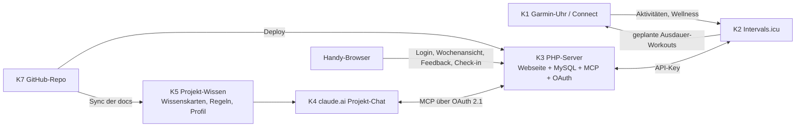

# 0. Zweck und Arbeitsweise mit diesem Dokument

- Dieses Dokument definiert Aufgabe, Architektur, Entscheidungen und Arbeitspakete (AP) für das System „KI-Personal-Trainer".
- Die **Codearbeit** findet in einer separaten Chat-Instanz statt. Diese Instanz arbeitet die AP in der angegebenen Reihenfolge ab und aktualisiert nach jedem AP:
  1. den Statusblock des AP in diesem Dokument (`status`, `probleme_loesungen`),
  2. das separate Prüfprotokoll `docs/pruefung/pruefprotokoll.md` (Struktur in Abschnitt 16),
  3. Changelog und Dokumentation des Repos.
- **Trainingsfachliche Arbeit** (Wissensbasis, Trainerregeln, Athletenprofil, Blockpläne) findet im claude.ai-Projekt „Personal Training & Trainingsdokumentation" statt, nicht in der Code-Instanz.
- Regel für Entscheidungen: Alles, was in Abschnitt 4 als `entschieden` steht, ist nicht mehr zu diskutieren. Alles unter Abschnitt 5 (`offen`) ist vor Umsetzung des betroffenen AP zu klären.

# 1. Aufgabenstellung

## 1.1 Ziel

Ein System, mit dem Claude (im Projekt-Chat) als Personal Trainer fungiert:

1. Trainingspläne für die kombinierten Ziele erstellt und wöchentlich anpasst,
2. Entscheidungen auf hinterlegte Literatur stützt (nachprüfbar, zitiert),
3. Rückmeldungen und Messdaten des Athleten strukturiert erhält (Ausführung, Belastung, Schmerz, Erholung, Uhrdaten),
4. Pläne so ausgibt, dass Ausdauereinheiten auf der Garmin-Uhr und alle anderen Einheiten auf dem Handy nutzbar sind.

## 1.2 Trainingsbereiche

| id | bereich | beschreibung |
|---|---|---|
| T1 | Ausdauer | Lauftraining für Trailrunning und Skitouren (bergauf-orientierte Ausdauer) |
| T2 | Kraft/Haltung | Haltungstraining für den Alltag, allgemeine Kräftigung |
| T3 | Klettern | Gezieltes Training für Bouldern und Klettern (Fingerkraft, Zugkraft, Technik-Volumen) |

Alle drei Bereiche werden in einem gemeinsamen Wochenplan geführt; Priorisierung erfolgt blockweise (Abschnitt 14).

## 1.3 Nutzer

Ein einzelner Athlet (= Betreiber des Systems). Kein Mehrbenutzerbetrieb.

## 1.4 Rahmenbedingungen

- Bestehendes Webhosting bei Lima-City (Apache 2.4, PHP, MySQL, FTPS, zeitgesteuerter URL-Aufruf als Cronjob); kein Plesk; kein dauerhaft laufender Node/Python-Prozess vorausgesetzt.
- Garmin-Uhr vorhanden.
- GitHub für Code und Dokumente; Deployment per Push aus GitHub auf den Server (D-17).
- claude.ai-Projekt mit Projekt-Wissen (Dateien), Projekt-Memory und Custom Connectors (MCP).

# 2. Nicht-Ziele und Ausschlüsse

| id | ausschluss | begruendung |
|---|---|---|
| N1 | Strava-API | API-Bedingungen seit 11/2024 untersagen Nutzung der Daten in KI-Anwendungen; Änderungen 06/2026: Gebühren, keine Intermediär-Plattformen mehr. |
| N2 | Garmin Connect Developer Program | Nur für geschäftliche Nutzung; neue Anträge derzeit pausiert. |
| N3 | Inoffizielle Garmin-Bibliotheken | Verstoß gegen Nutzungsbedingungen, brechen regelmäßig; nicht als Fundament. |
| N4 | KI-Logik in der Webseite | Keine LLM-Aufrufe aus dem Server; alle „Intelligenz" liegt im Projekt-Chat. Server = Daten + Schnittstelle. |
| N5 | Medizinische Diagnostik | System steuert Belastung; Diagnostik und Therapie bleiben bei Fachpersonen (Schwellenregeln in Abschnitt 14). |
| N6 | Hintergrund-Monitoring durch Claude | Claude arbeitet ausschließlich reaktiv im Chat; keine Push-Benachrichtigungen, keine automatische Anpassung ohne Chat. |
| N7 | Rohdaten im Chat | Keine FIT-Files, keine Sekunden-Streams; nur Aggregate über MCP (Budget in Abschnitt 8.3). |
| N8 | Mehrbenutzerbetrieb | Bewusst ausgeschlossen; vereinfacht Auth und Datenmodell. |

# 3. Systemarchitektur

## 3.1 Komponenten

| id | komponente | ort | aufgabe |
|---|---|---|---|
| K1 | Garmin-Uhr + Garmin Connect | Athlet | Aufzeichnung aller Aktivitäten; Anzeige geplanter Ausdauer-Workouts; Schlaf/HRV/Ruhepuls |
| K2 | Intervals.icu | Drittanbieter | Hub für Ausdauer: empfängt Aktivitäten und Wellness von Garmin; hält geplante Ausdauereinheiten (Kalender); überträgt geplante Workouts an Garmin Connect (Vorschau eine Woche) |
| K3 | PHP-Server (Lima-City) | Eigenes Hosting | Webseite (mobil), MySQL-Datenbank, Intervals.icu-Client, MCP-Endpunkt, OAuth-Server |
| K4 | claude.ai-Projekt | Anthropic | Trainer-Instanz: Planung, Anpassung, Begründung; Zugriff auf K3 über Custom Connector (MCP) |
| K5 | Projekt-Wissen (Dateien im Projekt) | Anthropic | Wissenskarten (Literatur), Trainerregeln, Athletenprofil, Blockpläne |
| K6 | Projekt-Memory | Anthropic | Nur stabile, nicht gesundheitsbezogene Fakten (Ziele, Ausrüstung, Präferenzen) |
| K7 | GitHub-Repo | GitHub | Code (server/), Dokumente (docs/), Wissenskarten (docs/wissen/), Regeln (docs/regeln/) |

## 3.2 Datenflüsse



## 3.3 Was wo gespeichert wird (System of Record)

| daten | system_of_record | bemerkung |
|---|---|---|
| Geplante Ausdauereinheiten | K2 Intervals.icu (Event) | K3 hält nur `intervals_event_id` als Referenz |
| Ausgeführte Ausdauer-Aktivitäten, HF, Pace, Höhe, Load | K2 | K3 liest live per API (kein Spiegel in Phase 1) |
| Objektive Wellness (HRV, Ruhepuls, Schlaf) | K2 (aus Garmin) | K3 liest live |
| Geplante Nicht-Ausdauer-Einheiten (Kraft, Klettern, Haltung) | K3 MySQL | Strukturierte Inhalte (Übungen, Sätze, Kante, Last) |
| Ausführungslog aller Einheiten (Ist-Werte) | K3 MySQL | Auch für Ausdauereinheiten (Feedback) |
| Feedback (RPE, Feel, Schmerz, Abweichung, Notiz) | K3 MySQL | Ein Eingabeort für alles |
| Tägliches Check-in | K3 MySQL | D-16 |
| Backups (verschlüsselte DB-Dumps) | Manuell heruntergeladen bzw. per E-Mail beim Athleten; Pre-Migration-Dumps lokal außerhalb Docroot | D-18 |
| Branding-Dokument | K7 Repo (docs/branding/) | D-19 |
| Blockplan, Begründungen, Trainerregeln, Wissenskarten | K7 Repo + K5 Projekt-Wissen | Textdokumente |
| Athletenprofil (Ziele, Zeitbudget, Ausrüstung, Einschränkungen) | K7 Repo (docs/athlet/) + K5 | Nicht in K6 Memory |
| OAuth-Clients/Tokens, Audit-Log der MCP-Schreibzugriffe | K3 MySQL | |

# 4. Entscheidungen (entschieden)

| id | entscheidung | begruendung | datum |
|---|---|---|---|
| D-01 | Zielarchitektur ist Ausbaustufe 3: eigene Web-App mit Datenbank plus MCP-Server, Intervals.icu als Hub für Ausdauer und Garmin. | Intervals.icu modelliert Kraft/Klettern nur als Textnotiz; strukturierte Nicht-Ausdauer-Einheiten und einheitliches Feedback brauchen eigene DB. | 2026-09-27 |
| D-02 | Intervals.icu ist die einzige Verbindung zu Garmin (Aktivitäten, Wellness, Workout-Push). | Strava und Garmin-API ausgeschlossen (N1–N3); Intervals.icu bietet API mit persönlichem Key und direkten Garmin-Sync. | 2026-09-27 |
| D-03 | Server in PHP auf bestehendem Webhosting (Lima-City); MCP über Streamable HTTP im stateless-Modus (Protokollrevision 2026-07-28), kein Dauerprozess. | Aktuelle MCP-Revision ist sitzungslos, jeder POST ein abgeschlossener JSON-RPC-Austausch; passt zu PHP/Apache. | 2026-09-27 |
| D-04 | MCP-SDK: `logiscape/mcp-sdk-php` (Erstwahl); offizielles PHP-SDK als Alternative, falls logiscape Blocker zeigt. | logiscape ist explizit für PHP/Apache/cPanel-Hosting gebaut, hohe Konformanz, bringt OAuth-2.1-Bausteine mit. Offizielles SDK ist noch experimentell. | 2026-09-27 |
| D-05 | Authentifizierung claude.ai ↔ MCP: OAuth 2.1 (Single-User-Implementierung: Metadaten, Dynamic Client Registration, Authorize mit Webseiten-Login, Token mit PKCE, Bearer-Prüfung). | claude.ai-Custom-Connectors unterstützen ausschließlich OAuth, keine eigenen Header. OAuth ist zudem für Gesundheitsdaten und Schreibzugriff das angemessene Verfahren. | 2026-09-27 |
| D-06 | Fallback bis OAuth-Flow stabil: Claude Desktop (oder Claude Code) mit statischem Bearer-Token-Header gegen denselben MCP-Endpunkt. | Bekannte Flakiness des claude.ai-OAuth-Handshakes; Desktop/Code erlauben Header. Fallback ist nicht mobil. | 2026-09-27 |
| D-07 | Ausdauereinheiten werden in den Intervals.icu-Kalender geschrieben und erscheinen auf der Uhr; alle anderen Einheiten leben auf der Webseite. | Nutzeranforderung; Garmin-Push für strukturierte Kraft-Workouts ist unklar und nicht nötig. | 2026-09-27 |
| D-08 | Die Webseite zeigt eine Wochenansicht für alle Einheiten inkl. Ausdauer (serverseitig aus Intervals.icu geladen) und nimmt Feedback für alle Einheiten auf. | Ein Eingabeort; vermeidet doppelte Erfassung. | 2026-09-27 |
| D-09 | Phase 1: Live-Proxy auf Intervals.icu (kein Cron-Spiegel). Cron-Spiegel nach MySQL optional in AP-09. | Vermeidet Sync-Logik; Rate-Limit (10 req/s) ist unkritisch. Spiegel nur bei Backup-/Performance-Bedarf. | 2026-09-27 |
| D-10 | Der Trainingsplan ist Daten, kein Code. Trainerregeln und Literatur sind Dokumente im Projekt-Wissen. GitHub/Claude Code dienen nur dem Bau des Werkzeugs. | Regeln bleiben lesbar, versionierbar, im Chat hinterfragbar; keine Logik-Duplikation im Server. | 2026-09-27 |
| D-11 | Claude schreibt Pläne erst nach expliziter Bestätigung im Chat in DB und Intervals.icu. Jeder Schreibzugriff wird im Audit-Log protokolliert. | Nutzerpräferenz (Bestätigung vor Umsetzung); Nachvollziehbarkeit. | 2026-09-27 |
| D-12 | Literatur wird als strukturierte Wissenskarten (Markdown mit Quellenangabe) hinterlegt, nicht als vollständige Bücher. PubMed-Connector für Primärstudien. | Größe, Urheberrecht, Zitierfähigkeit. | 2026-09-27 |
| D-13 | Zitierregel: Jede trainingsfachliche Aussage von Claude wird entweder mit Wissenskarte/DOI belegt oder ausdrücklich als „Einschätzung ohne Quelle" markiert. | Verhindert erfundene Referenzen. | 2026-09-27 |
| D-14 | Gesundheitsbezogene Daten (Schmerz, Verletzungen, Einschränkungen) werden ausschließlich in K3 (MySQL) und K7/K5 (Profil-Dokument) gehalten, nie im Projekt-Memory (K6). | Datensparsamkeit; Memory hält nur stabile, nicht sensible Fakten. | 2026-09-27 |
| D-15 | Athletenprofil ist ein Dokument (docs/athlet/profil.md), kein DB-Objekt (Phase 1). | Geringer Aufwand, im Chat direkt lesbar; DB-Abbildung bei Bedarf in AP-09. | 2026-09-27 |
| D-16 | Tägliches Check-in auf der Webseite mit genau drei Feldern: `recovery_1_5`, `soreness_1_5`, `pain_flag` (bei ja → Schmerzereignis). Keine separate Schlafqualität. Fehlende Einträge gelten als fehlend; MCP meldet Abdeckungsquote. | Subjektive Marker sind sensitiver als objektive (V-06); Schmerz hat keinen objektiven Ersatz; minimaler Umfang sichert Compliance. Bestätigt durch Athlet. | 2026-09-27 |
| D-17 | Deployment: GitHub-Repo ist Quelle; ein GitHub-Actions-Workflow baut (`composer install --no-dev`) und überträgt `server/` per FTPS (explizit, Port 21) in den Subdomain-Ordner auf dem Webspace. Kein Klartext-FTP. Layout auf dem Server: Subdomain-Ordner = Inhalt von `server/` (`src/`, `vendor/`, `migrations/`, …), Document Root = `<Ordner>/public`, `.env` direkt in `<Ordner>/`, Backups in `<Ordner>/backups/`; nur `public/` ist per HTTP erreichbar. `.env` und `backups/` werden nie überschrieben oder gelöscht. Migrationen werden nach dem Upload über einen geschützten Endpunkt vom Workflow ausgelöst (Secret in GitHub Actions). Optional zweiter Workflow für eine Staging-Subdomain. | Kein SSH/Composer auf dem Server vorausgesetzt; reproduzierbarer Build; Nutzeranforderung „GitHub + FTP-Push". | 2026-09-27 |
| D-18 | Backup betrifft nur die Datenbank (Code und Dokumente liegen in GitHub). Mechanik: SQL-Dump per PHP (Schema + Daten, portabel) → gzip → Verschlüsselung mit Passwort. Format OpenSSL-kompatibel (AES-256-CBC, PBKDF2 mit dokumentierter Iterationszahl, `Salted__`-Header), damit die Datei ohne eigenes Werkzeug per `openssl enc -d` entschlüsselbar ist. Auslöser: (a) manuell als Download auf der Webseite (nur eingeloggt); (b) zeitgesteuert per E-Mail (Lima-City-Cronjob ruft einen geschützten Endpunkt auf, Intervall konfigurierbar, Standard wöchentlich); (c) automatisch vor jeder Migration (in `backups/` außerhalb Docroot, Rotation der letzten 5). Backup-Passwort liegt in `.env`. Restore-Anleitung im README; Restore-Test Pflicht in AP-10. | Nutzeranforderung; DB ist klein (KB bis wenige MB), E-Mail-Anhang unkritisch; Standardformat sichert Wiederherstellbarkeit auf jedem Rechner. Tradeoff: symmetrisches Passwort auf dem Server bedeutet, dass ein Serverkompromiss auch das Backup-Passwort preisgibt – da der Server die DB ohnehin hält, entsteht kein zusätzlicher Verlust. Asymmetrische Variante (Public Key auf dem Server) optional in AP-09. CBC ohne Authentifizierung: Integrität wird über die gzip-Prüfsumme nach dem Entschlüsseln erkannt. | 2026-09-27 |
| D-19 | Das Branding-Dokument wird im Repo unter `docs/branding/` abgelegt und gilt für AP-04 (Webseite). Das Konzept benötigt es nicht; die Code-Instanz liest es vor AP-04. | Gestaltung ist Umsetzungsdetail, keine Konzeptentscheidung. | 2026-09-27 |
| D-20 | Update-Mechanik: Schemaänderungen ausschließlich als nummerierte Migrationsdateien in `server/migrations/` (SQL oder PHP), Tabelle `schema_version` hält den Stand. Der Code trägt eine `APP_SCHEMA_VERSION`; bei jedem Request prüft die App, ob Code- und DB-Stand übereinstimmen – bei Abweichung wird eine „Update erforderlich"-Seite angezeigt und jeder Schreibzugriff (Web und MCP) blockiert, bis migriert ist. Migration wird ausgelöst (a) vom Deploy-Workflow über den geschützten Endpunkt (D-17) oder (b) manuell über eine Schaltfläche nach Login. Ablauf jeder Migration: Wartungsflag setzen → Pre-Migration-Dump (D-18 c) → Migrationen der Reihe nach, `schema_version` nach jeder einzelnen Migration fortschreiben → Wartungsflag lösen. MySQL beendet Transaktionen bei DDL (`CREATE`/`ALTER`) implizit; daher: ein fachlicher Schritt pro Migrationsdatei, Datenänderungen in Transaktionen, Schemaänderungen ohne; bricht eine Migration ab, bleibt `schema_version` auf der letzten erfolgreichen. Kein automatisches Rollback: Rückweg = vorheriger Git-Tag deployen + Pre-Migration-Dump einspielen. | Verhindert Code/Schema-Mismatch nach einem FTP-Upload, dessen Migrationsaufruf fehlschlug; Dump vor Migration ist der einzige zuverlässige Rückweg. Down-Migrationen sind Aufwand ohne Nutzen für ein Einzelnutzer-System. | 2026-09-27 |
| D-21 | Englischsprachige Literatur ist der deutschsprachigen gleichgestellt; Auswahl nach Eignung, nicht nach Sprache. | Die maßgeblichen Konsenspapiere und Praxisbücher (Klettern, Bergausdauer) sind englischsprachig. | 2026-09-27 |
| D-22 | Evidenzhierarchie für Regelquellen: Consensus Statements / Position Stands / systematische Reviews > wissenschaftliche Lehrbücher > Praxisliteratur. Lehrbücher liefern Grundlagen und Begriffe; Regeln in `docs/regeln/` stützen sich vorrangig auf Paper. | Klassische Standardwerke mischen empirische Befunde mit tradierten Modellen (Superkompensation, klassische Periodisierung); Paper sind per DOI/PMID prüfbar, oft Open Access und kurz (Tokenbudget 13.1). | 2026-09-27 |
| D-23 | Das GitHub-Repo ist privat. | Wissenskarten sind eigene Zusammenfassungen mit Seitenangaben. PDFs dürfen seit D-31 (Fassung 2026-09-27, Nachtrag) im Repo liegen. | 2026-09-27 |
| D-24 | Bei parallel publizierten Konsenspapieren gilt die in PubMed indexierte Fassung als Zitierfassung. | Anlass L-P06 (Meeusen et al. 2013): widersprüchliche Seitenangaben aus Sekundärzitaten. | 2026-09-27 |
| D-25 | Quellenhierarchie Ausdauer (T1), Konkretisierung von D-22: Systematische Reviews und Übersichtsarbeiten bilden den Kern der Wissenskarten, Lehrbücher das Fundament für Begriffe und Physiologie. Praxisquellen (Trainerbücher, Trainerbefragungen) sind zulässig, werden in Karten aber mit `quellentyp: praxisquelle` und `konfidenz: niedrig` (Bücher) bzw. `mittel` (peer-reviewte qualitative Studien mit Trainern) geführt. Jede Karte benennt unter „Grenzen" die Übertragung von Elite-/Hochleistungsdaten auf den Athleten (Freizeitsport, drei Trainingsbereiche). „Training for the Uphill Athlete" bleibt auf Wunsch des Athleten als Praxisquelle. | Aktuelle Evidenz zu Intensitätsverteilung/Periodisierung steht in Reviews; Lehrbücher tradieren teils schwach belegte Modelle. Ausschluss Weineck: Einschätzung ohne Quelle (kompilatorisch). | 2026-09-27 |
| D-26 | Wissenskarten werden auf Deutsch verfasst (Quellen deutsch oder englisch, D-21). Beschaffung der Bücher und nicht frei verfügbaren Artikel übernimmt der Athlet. Für den Erstellungsprozess 13.1 muss jede Quelle als durchsuchbares PDF vorliegen; DRM-geschützte E-Books (z. B. VitalSource) sind ungeeignet. Formatprüfung je Titel vor dem Kauf (V-13). | Formatanforderung folgt aus 13.1 Schritt (1)–(3). Human-Kinetics-E-Books laufen über VitalSource mit DRM (festgestellt in T1 und T2). | 2026-09-27 |
| D-27 | Zonenreferenz der Wissenskarten ist das internationale Drei-Zonen-Modell (Zone 1 ≤ LT1/VT1, Zone 2 zwischen LT1 und LT2, Zone 3 > LT2/VT2), wie in L-T1-02 und L-T1-03. In Plänen und auf der Uhr werden die fünf Garmin-Herzfrequenzzonen genutzt, definiert als %LTHR. Abbildung 3 → 5 Zonen und Grenzwerte werden in AP-07 (Regel) und AP-08 (Ausgangstests, LT1-Bestimmung) festgelegt. Das deutsche GA1/GA2/WSA-System ist keine Referenz; Neumann/Pfützner/Berbalk nur optional. | Garmin bietet fünf HF-Zonen (BPM, %HFmax, %HFR oder %LTHR, je Sportprofil); %LTHR verankert die Zonen an einer Schwelle und ist mit der Schwellendefinition der Kernquellen kompatibel; GA-Bezeichnungen existieren auf der Uhr nicht. Einschränkung: Garmin kennt nur eine Schwelle (LTHR ≈ LT2); LT1 muss separat bestimmt werden. | 2026-09-27 |
| D-28 | Literatur Krafttraining (Geltungsbereich T2 und Kraft als Ergänzung zu T1; fingerspezifische Kraft gehört zu T3). Kernset: L-P08 (ACSM Position Stand 2026, Anker Dosierung), L-A03 (NSCA Essentials, 5. Aufl., Breite: Programmgestaltung, Testung, Technik), L-T2-03 (Schumann/Rønnestad, Concurrent Aerobic and Strength Training, Kombination Ausdauer + Kraft). Optional kapitelweise: L-T2-05 (Zatsiorsky/Kraemer/Fry), L-T2-06 (Güllich/Krüger, Sport – Lehrbuch). Zurückgestellt: L-T2-07 (Schoenfeld, Hypertrophie kein Primärziel). Weineck und Bompa nicht als Evidenzbasis. Ergänzend Primärliteratur über PubMed (V-14). | Positionspapier = aktuellste Evidenzsynthese (137 systematische Reviews, GRADE); Lehrbücher bündeln Konsens mit Verzögerung und mischen Evidenz mit Praxiserfahrung; Tokenbudget 13.1 erlaubt kein Vollprogramm. | 2026-09-27 |
| D-29 | Calisthenics ist Teil von T2. Übungskatalog mit Progressionsleitern aus L-T2-04 (Low, Overcoming Gravity, 2. Aufl. 2016), abgelegt als Abschnitt `uebungskatalog_calisthenics` in der T2-Sammeldatei, nicht als eigene Karte; Konfidenz niedrig (Praxiswissen). Dosierung (Sätze, Nähe zum Muskelversagen, Frequenz, Volumen) ausschließlich aus dem Kernset D-28. Ausgeschlossen: Wade, Convict Conditioning. | Kein wissenschaftliches Standardwerk zu Calisthenics; Progression über Hebelvarianten praktisch nicht untersucht. Belastungsprinzipien gelten unabhängig vom Widerstand (ACSM 2026 schließt Körpergewicht/Band/Heimtraining ein). Direkte Studien L-T2-08 bis L-T2-10 (per PubMed geprüft). Convict Conditioning: anonymer Autor, unbelegte Behauptungen. | 2026-09-27 |
| D-30 | Zugübungen mit Körpergewicht (Klimmzug-Varianten, Front Lever u. ä.) werden unter T3 geplant (`session.type = klettern`, Block `zugkraft`). Calisthenics unter T2 umfasst Druckübungen, Beine und Rumpf. | Starke Überschneidung mit Kletter-Zugkraft; nur bei Zuordnung zu T3 greifen die Sequenzierungsregeln (Abschnitt 14 Kap. 2). | 2026-09-27 |
| D-31 | Einheitliches Evidenzschema für alle Literaturblöcke: Stufe A = Paper/Konsens (konfidenz hoch), B = wissenschaftliche Lehrbücher (mittel), C = Praxisquellen (niedrig). Stufe C darf in Wissenskarten als Übungs-/Ideenfundus und mit Kennzeichnung zitiert werden, aber nie allein einen Belastungsparameter (Dosierung, Progression, Schwelle) begründen. Volltexte (Open Access und gekaufte PDFs) dürfen im privaten Repo unter `docs/literatur/` liegen, nie im Projektwissen; einzelne Dateien < 100 MB (GitHub-Grenze), große Bücher als Kapitel-PDFs. Evidenzkern T3 gemäß E6 übernommen (L-T3-01, -02, -03, -06, -08; -09 optional). Klettermedizin: englische Ausgabe 2022 (L-T3-06) bevorzugt, deutsche 2020 (L-T3-07) als Alternative. | Vereinheitlicht D-22, D-25, D-29 und die T3-Vorschläge E3–E6; bestätigt durch Athlet (Q-07, Q-08). | 2026-09-27 |

# 5. Offene Fragen und Verifikationen

## 5.1 Offene Entscheidungen

| id | frage | empfehlung | status |
|---|---|---|---|
| Q-01 | Tägliches subjektives Check-in erheben? Welche Felder? Wo? | Ja, minimal: `erholung_1_5`, `muskelkater_1_5`, `schmerz_ja_nein` (bei ja → Schmerzereignis). Auf der Webseite, integriert in Wochenansicht, ≤ 10 s. Keine separate Schlafqualität (Garmin liefert Schlaf; fließt in Erholung ein). Begründung: subjektive Marker sind sensitiver als objektive (Saw/Main/Gastin 2016, zu verifizieren V-06); Schmerz hat keinen objektiven Ersatz. Fehlende Einträge gelten als fehlend, nicht als beschwerdefrei; MCP meldet Abdeckungsquote. | entschieden → D-16 |
| Q-02 | Feedback zu Ausdauereinheiten zusätzlich zurück nach Intervals.icu schreiben (RPE/Feel/Kommentar auf der Aktivität)? | Optional in AP-09; Nutzen: Intervals.icu-Charts vollständig. Kosten: Feld-Semantik abgleichen (V-03). | offen |
| Q-03 | Sichtbarkeit der Aktivitäten in Intervals.icu | Auf privat stellen. | offen |
| Q-04 | Repo-Name und Lizenz | Repo `chodid/training`, privat, keine Lizenz. | entschieden (2026-09-27) |
| Q-05 | Login-Verfahren Webseite: Passwort oder Passkey (WebAuthn) | Passwort + lange Session in Phase 1; Passkey optional AP-09. | offen |
| Q-06 | Welche Literatur ist bereits vorhanden (PDF/ePub/Print)? | Antwort: keine. Auswahl, Priorisierung und Beschaffung vollständig in AP-06; Kandidatenliste 13.2 ist Ausgangspunkt, nicht Vorgabe. | beantwortet |
| Q-07 | Einheitliches Evidenzschema über alle Blöcke: Block T3 schlägt Stufen A/B/C vor (E3) und will Stufe C ohne Begründungsfunktion (E4); Block T1 führt Praxisquellen mit `konfidenz: niedrig` in Karten (D-25); Block T2 nutzt eine Stufe-C-Quelle als Übungskatalog mit Dosierung aus Stufe A (D-29). | Vereinheitlichen als D-31: A = Paper/Konsens (konfidenz hoch), B = wissenschaftliche Lehrbücher (mittel), C = Praxisquellen (niedrig). Stufe C darf in Karten als Übungs-/Ideenfundus und mit Kennzeichnung zitiert werden, aber nie allein einen Belastungsparameter (Dosierung, Progression, Schwelle) begründen. Damit sind D-25, D-29 und E4 deckungsgleich. Ebenso E5: Open-Access-Volltexte (nur CC BY) dürfen im privaten Repo unter `docs/literatur/` liegen, nie im Projektwissen (D-12, Budget 13.1). E6 (Evidenzkern T3) übernehmen. | entschieden → D-31 |
| Q-08 | Klettermedizin: deutsche (L-T3-07, 2020) oder englische Ausgabe (L-T3-06, 2022)? Nur eine wird beschafft. | Englische Ausgabe (neuer, ISBN/DOI verifiziert, Springer-Kapitel-PDFs); deutsche nur, wenn Sprache im Alltag wichtiger ist als Aktualität. | entschieden → D-31: 2022 bevorzugt, 2020 als Alternative |

## 5.2 Zu verifizieren (vor/in dem jeweiligen AP)

| id | verifikation | ap | status |
|---|---|---|---|
| V-01 | Intervals.icu-Workout-Textsyntax für strukturierte Ausdauer-Einheiten (Schritte mit HF-Zone bzw. Pace-Ziel); Verhalten beim Push auf die konkrete Uhr; Einschränkung „mehrere Zieltypen pro Schritt". Design-Regel vorläufig: ein Zieltyp pro Schritt. | AP-02 | offen |
| V-02 | Zeitpunkt/Umfang des Intervals.icu→Garmin-Pushes (Vorschau eine Woche; wann muss der Plan spätestens geschrieben sein). | AP-02 | offen |
| V-03 | Semantik der Intervals.icu-Felder `icu_rpe` (Skala) und `feel` (Richtung der 1–5-Skala) sowie verfügbare Wellness-Felder für dieses Konto über die API. | AP-02 | offen |
| V-04 | Endpunkte/Parameter für Events (GET/POST/PUT/DELETE), Aktivitäten (Zeitraum), Wellness (Zeitraum) anhand der aktuellen API-Dokumentation. | AP-02 | offen |
| V-05 | OAuth-Flow claude.ai (Web und Mobile) gegen PHP-Server: DCR, Callback-URLs (`claude.ai/api/mcp/auth_callback`, ggf. `claude.com/...`), Token-Refresh. | AP-01 | offen |
| V-06 | Referenz Saw AE, Main LC, Gastin PB. Monitoring the athlete training response: subjective self-reported measures trump commonly used objective measures. Br J Sports Med 2016 – DOI und Kernaussage über PubMed-Connector prüfen. | AP-06 | offen |
| V-07 | Schmerzmonitoring-Modell für Sehnenbelastung (Silbernagel/Thomeé 2007) als Grundlage der Schmerzregeln – Quelle und Schwellenwerte prüfen. | AP-07 | offen |
| V-08 | PHP-Version auf dem Hosting vs. Anforderungen des SDK; Composer-Verfügbarkeit. Ergebnis: Test auf dem Server 2026-09-27: PHP 8.4.25, Apache 2.4, Erweiterungen curl, json, openssl, pdo_mysql, zlib, mbstring aktiv; logiscape/mcp-sdk-php v2.0.1 verlangt PHP ≥ 8.1, ext-curl, ext-json (Packagist, 2026-09-27). Composer auf dem Server nicht nötig (Build in GitHub Actions, D-17). Health-Endpunkt prüft die Erweiterungen laufend. | AP-00 | erledigt 2026-09-27 |
| V-09 | Verhalten von Garmin-Kraftaktivitäten (auf der Uhr gestartet) in Intervals.icu: Typ, Dauer, HF – für heuristisches Matching mit Webseiten-Einheiten. | AP-02 | offen |
| V-10 | Auf dem Hosting verfügbar: FTPS oder SFTP für den Deploy-Workflow; PHP-CLI für „Geplante Aufgaben" (sonst HTTP-Aufruf eines geschützten Endpunkts); E-Mail-Versand aus PHP mit Anhang (SMTP über Mailkonto des Hostings bevorzugt, Größenlimit des Anhangs); PHP-OpenSSL-Erweiterung aktiv. Ergebnis (Angaben Athlet 2026-09-27): FTPS vorhanden (Port 21, explizit, gültiges Zertifikat); SMTP vorhanden; keine PHP-CLI-Aufgaben, aber zeitgesteuerter Aufruf von URLs → E-Mail-Backup über geschützten Endpunkt (D-18 b); OpenSSL aktiv (Servertest). Servertest zusätzlich: `open_basedir` leer, Datei oberhalb des Docroots lesbar, `.htaccess` wird ausgewertet (`Require all denied` → 403). Rest: Anhang-Größenlimit SMTP → Testversand in AP-10. | AP-00 | erledigt 2026-09-27 (bis auf Anhang-Limit) |
| V-11 | Bibliografische Prüfung der T1-Quellen (Autoren, Jahr, Band/Seiten, DOI/ISBN, freie Verfügbarkeit) per PubMed-Connector bzw. Bibliothekskataloge. Ergebnis in 13.2.2 (Felder `zugang`, `verifikation`). Hinweis Lizenz: PubMed liefert keinen Lizenztyp; „frei" heißt Volltext in PMC; CC BY 4.0 nur für L-T1-04 belegt. | AP-06 | erledigt 2026-09-27 |
| V-12 | Zonendefinition in Garmin Connect (Laufprofil, ggf. eigenes Profil Skitour) und in Intervals.icu identisch halten (%LTHR, gleiche Grenzen), damit HF-Ziele aus Intervals.icu-Workouts auf der Uhr dieselbe Zone treffen. Prüfen, ob Intervals.icu Zonen nach Garmin überträgt oder beide getrennt gepflegt werden müssen (D-27). | AP-02 (mit V-01), AP-08 | offen |
| V-13 | Format und Kopierschutz je Titel vor Beschaffung (D-26): Human-Kinetics-Titel (L-A01, L-A03, L-T1-07, L-T2-05, L-T2-07) laufen über VitalSource mit DRM → Print oder anderer Anbieter; Springer-Titel (L-A02, L-T2-03, L-T2-06, L-T3-06/07) kapitelweise als PDF über SpringerLink bzw. Bibliothekszugang; L-T2-04 (Low) Digitalausgabe PDF/ePUB beim Autor prüfen; L-T1-01, L-T1-08, L-T3-08 PDF-Verfügbarkeit prüfen. | AP-06 | offen |
| V-14 | PubMed-Verifikation Kraftliteratur: Rønnestad & Mujika 2014 (Scand J Med Sci Sports) und Blagrove et al. 2018 (Sports Med) → L-T2-11, L-T2-12. ACSM 2026 und Schumann 2022 bereits verifiziert als L-P08 und L-P07. | AP-06 | offen |
| V-15 | Bibliografische Vervollständigung T3: L-T3-03 (Band, Lizenz), L-T3-04 (Band, Seiten, DOI, Zugang), L-T3-05 (Titel, Journal, Band, Seiten, DOI), L-T3-07 (ISBN), L-T3-08 (aktuelle Auflage/ISBN), L-T3-09 (Jahr), L-T3-12 (Jahr, Auflage, ISBN); Kernaussagen L-T3-02 am Original statt Sekundärzitat prüfen. | AP-06 | offen |

# 6. Betriebsablauf (Wochenzyklus)

1. **Blockplan** (8–16 Wochen): Phasen, Prioritäten je Bereich T1–T3, Zielevents, Begründung mit Quellen. Erarbeitet im Projekt-Chat, vom Athleten bestätigt, abgelegt in `docs/plaene/block-<nr>.md` und im Projekt-Wissen.
2. **Wochenplanung** (Chat, typischerweise Sonntag): Claude ruft `get_week_overview` (Vorwoche), `get_wellness_trend`, `get_pain_history`; liest Blockplan, Trainerregeln, Athletenprofil; erstellt Wochenvorschlag mit Begründung im Chat.
3. **Bestätigung**: Athlet bestätigt oder ändert im Chat (D-11).
4. **Schreiben**: Claude ruft `write_week_plan`. Server legt Einheiten in MySQL an; Ausdauereinheiten zusätzlich als Events in Intervals.icu (Workout-Syntax); Event-IDs werden gespeichert; Audit-Log-Eintrag.
5. **Sync**: Intervals.icu überträgt Ausdauer-Workouts an Garmin Connect; nach Sync der Uhr sind sie dort sichtbar.
6. **Ausführung**: Ausdauer über die Uhr; Kraft/Klettern/Haltung über Webseite (Einheit öffnen, Ist-Werte eintragen).
7. **Feedback**: Nach jeder Einheit auf der Webseite (RPE, Feel, Schmerz, Abweichung, Notiz); täglich Check-in (D-16).
8. **Rückkopplung**: nächster Chat → Schritt 2. Blockplan-Revision alle 3–4 Wochen oder bei Schmerzereignis/Ausfall (Trigger in Abschnitt 14).

Ad-hoc-Anpassung unter der Woche: Athlet meldet sich im Chat; Claude ruft `get_week_overview` (laufende Woche) und schreibt Änderungen per `update_session` nach Bestätigung.

# 7. Datenmodell (Entitäten, konzeptionell)

Feldtypen sind konzeptionell; die konkrete Migration entsteht in AP-03.

| entitaet | felder (auszug) | bemerkung |
|---|---|---|
| `user` | id, login, password_hash, tz, created_at | genau ein Datensatz |
| `training_block` | id, name, start_date, end_date, goal_events_json, phase_notes, status(`geplant`,`aktiv`,`abgeschlossen`), doc_ref | doc_ref → docs/plaene/ |
| `training_week` | id, block_id, week_start(Mo), focus, coach_notes, status(`entwurf`,`bestaetigt`,`abgeschlossen`), created_by(`mcp`,`web`), created_at | |
| `session` | id, week_id, date, type(`ausdauer`,`kraft`,`klettern`,`haltung`,`mobilitaet`,`ruhe`), title, priority(`A`,`B`,`C`), planned_duration_min, intervals_event_id(null), plan_json, coach_rationale, status(`geplant`,`erledigt`,`teilweise`,`ausgelassen`,`verschoben`), sort_order | plan_json-Schema in 7.1 |
| `session_execution` | id, session_id, performed_at, duration_min, actual_json, rpe_cr10(0–10), srpe_load(=rpe×min, berechnet), feel_1_5, deviation_reason(`zeit`,`ermuedung`,`schmerz`,`wetter`,`sonstiges`,null), notes, source(`web`,`intervals`) | genau eine pro Session |
| `pain_event` | id, date, session_id(null), location(enum 7.2), side(`L`,`R`,`beide`,`na`), intensity_0_10, timing(`waehrend`,`danach`,`naechster_morgen`,`ruhe`), notes | mehrere pro Tag möglich |
| `checkin` | id, date(unique), recovery_1_5, soreness_1_5, pain_flag(bool), notes | D-16 |
| `oauth_client` | client_id, client_name, redirect_uris_json, created_at | DCR |
| `oauth_auth_code` | code_hash, client_id, code_challenge, method, redirect_uri, scope, expires_at, used | PKCE |
| `oauth_token` | token_hash, type(`access`,`refresh`), client_id, scope, expires_at, revoked | Tokens nur gehasht |
| `audit_log` | id, ts, actor(`mcp`,`web`,`cron`), action, entity, entity_id, payload_hash, summary | alle Schreibzugriffe |
| `ext_cache` (optional) | cache_key, payload_json, fetched_at | Kurzcache Intervals.icu (z. B. 5 min) |

## 7.1 `plan_json` / `actual_json` (Schema je Typ)

```yaml
kraft_oder_haltung:
  exercises:
    - name: string
      sets: int
      reps: string        # z. B. "8" oder "6-8" oder "30s"
      load: string        # z. B. "20 kg", "KG", "Band grün"
      tempo: string|null
      rest_s: int|null
      notes: string|null
klettern:
  blocks:
    - kind: enum [hangboard, campus, bouldern_volumen, bouldern_limit, ausdauer_route, technik, zugkraft, antagonisten]
      spezifitaet: enum|null [spezifisch, halbspezifisch, unspezifisch]   # nach L-T3-02; zugkraft umfasst auch Körpergewicht-Zugübungen (D-30)
      # hangboard-spezifisch:
      edge_mm: int|null
      grip: enum|null [halbkrimp, offen, vollkrimp, zange]
      hang_s: int|null
      rest_s: int|null
      sets: int|null
      added_load_kg: number|null   # negativ = Entlastung
      # allgemein:
      duration_min: int|null
      target: string|null           # z. B. "Grad 5-6, 20 Boulder"
      notes: string|null
ausdauer:
  intervals_workout_text: string   # Intervals.icu-Syntax (V-01)
  target_type: enum [hf_zone, pace, rpe]
  summary: string                  # Klartext für Wochenansicht
```

`actual_json` spiegelt die Struktur von `plan_json` mit Ist-Werten; leere Felder = wie geplant.

## 7.2 Enum `pain_event.location`

`finger_ringband, finger_gelenk, handgelenk, ellbogen_medial, ellbogen_lateral, schulter, nacken, lws, huefte, knie, achillessehne, wade, schienbein, fuss, sonstiges`

# 8. MCP-Schnittstelle

## 8.1 Endpunkt und Transport

- Pfad: `/mcp` (Streamable HTTP, stateless; GET/DELETE → 405).
- Auth: Bearer (OAuth 2.1, D-05); ohne Token → 401 mit `WWW-Authenticate: Bearer resource_metadata=...`.
- Metadaten: `/.well-known/oauth-protected-resource`, `/.well-known/oauth-authorization-server`; Endpunkte `/oauth/register`, `/oauth/authorize`, `/oauth/token`.
- Fallback (D-06): derselbe Endpunkt akzeptiert zusätzlich ein statisches Token aus der Konfiguration (nur wenn Konfig-Flag gesetzt).

## 8.2 Tools (konzeptionell)

| tool | eingabe | ausgabe (aggregiert) | schreibt |
|---|---|---|---|
| `get_week_overview` | week_start | je Session: Typ, Titel, Status, geplant vs. Ist (Dauer, sRPE-Load), Feel, Abweichungsgrund; Wochensummen sRPE je Typ; Compliance %; Schmerzereignisse der Woche (Ort, max, Verlauf); Check-in-Mittelwerte + Abdeckung %; Ausdauer aus Intervals.icu: je Aktivität Dauer, Distanz, Höhenmeter, Zeit in HF-Zonen (komprimiert), Load; Fitness/Fatigue/Form-Werte; Matching Aktivität↔Event | nein |
| `get_session_detail` | session_id | plan_json, actual_json, Feedback, Notizen, coach_rationale | nein |
| `get_pain_history` | days (default 56) | je Ort: Ereignisse (Datum, Intensität, Timing), 7-Tage-Trend | nein |
| `get_wellness_trend` | days (default 28) | tageweise: HRV, Ruhepuls, Schlaf (h, Score), Check-in-Werte; 7d-vs-28d-Baseline für HRV/Ruhepuls | nein |
| `get_block` | block_id (optional) | aktiver Block, Wochenstatus, Phase | nein |
| `write_week_plan` | week_start, sessions[], replace_existing(bool) | angelegte Session-IDs, Intervals.icu-Event-IDs, Fehler je Session | ja (DB + Intervals.icu) |
| `update_session` | session_id, changes | aktualisierte Session; bei Ausdauer auch Event-Update | ja |
| `get_athlete_profile` | – | Inhalt von docs/athlet/profil.md (vom Server aus Repo-Kopie gelesen) | nein |

Enum-Werte und Skalen in Antworten immer mit Einheit/Skala kennzeichnen (z. B. `rpe_cr10`), damit Claude sie nicht verwechselt.

## 8.3 Antwortbudget

- Jede Tool-Antwort ≤ ca. 3 000 Tokens; `get_week_overview` Ziel ≤ 2 000.
- Keine Streams, keine Rohlisten über 60 Einträge; bei Bedarf Paginierung über `days`/`week_start`.
- Zahlen gerundet (Dauer min, Distanz 0,1 km, Höhenmeter 10 m).

# 9. Intervals.icu-Anbindung

- Auth: HTTP Basic mit `API_KEY:<key>`, ausschließlich serverseitig; Key außerhalb des Docroots.
- Genutzte Bereiche (V-04): Events (geplante Workouts) lesen/schreiben/löschen; Aktivitäten nach Zeitraum (Zusammenfassung, keine Streams); Wellness nach Zeitraum.
- Workout-Erzeugung: `plan_json.ausdauer.intervals_workout_text` in Intervals.icu-Syntax; ein Zieltyp pro Schritt (V-01); `summary` als Klartext für Uhr-Titel und Webseite.
- HF-Ziele beziehen sich auf die fünf Garmin-Zonen nach %LTHR (D-27); Zonengrenzen in Garmin Connect und Intervals.icu identisch pflegen (V-12).
- Sync-Verhalten: Intervals.icu überträgt geplante Workouts der kommenden Woche an Garmin Connect; Änderungen werden automatisch nachgezogen (V-02 für genaues Zeitfenster). Regel: Wochenplan spätestens am Vorabend des ersten Ausdauertags schreiben.
- Matching Aktivität↔geplante Einheit: für Ausdauer übernimmt Intervals.icu das Pairing (Compliance); für Kraft/Klettern (auf der Uhr aufgezeichnet, aber nicht als Event gepusht) heuristisch über Datum + Aktivitätstyp (V-09).
- Rate-Limit 10 req/s pro IP: unkritisch; optionaler Kurzcache (`ext_cache`).
- Privatsphäre: Aktivitäten auf privat (Q-03).

# 10. Webseite (mobil)

Technik: serverseitig gerenderte PHP-Seiten, responsive, minimales JS (Formulare ohne Reload optional), Web-App-Manifest für „Zum Startbildschirm", kein Offline-Modus in Phase 1.

| screen | inhalt | felder/aktionen |
|---|---|---|
| S1 Login | Passwort (Q-05), lange Session | |
| S2 Woche | 7 Tage, je Tag Einheiten (Typ-Icon, Titel, Dauer, Status); heutiger Tag hervorgehoben; Check-in-Status pro Tag; Navigation ±Woche; Wochensumme sRPE | Einheit öffnen; Check-in öffnen |
| S3 Einheit | Plan (Übungen/Blöcke mit Soll), Ist-Eingabe pro Übung (vorbelegt mit Soll), Feedback-Block | RPE 0–10; Feel 1–5; Schmerz ja/nein → Ort, Seite, Stärke, Timing; Abweichungsgrund; Notiz; Status setzen (erledigt/teilweise/ausgelassen/verschoben); bei Ausdauer: verknüpfte Intervals.icu-Aktivität anzeigen |
| S4 Check-in | Tagesformular, ≤ 10 s | Erholung 1–5, Muskelkater 1–5, Schmerz ja/nein (→ S5-Kurzform), Notiz optional |
| S5 Schmerz | Kurzformular | Ort (Enum 7.2), Seite, 0–10, Timing, Notiz |
| S6 Verlauf (optional, AP-09) | Schmerz je Ort über 8 Wochen; sRPE-Wochenlast je Typ | |

# 11. Feedback- und Check-in-Definitionen

| feld | skala | definition | quelle_regel |
|---|---|---|---|
| `rpe_cr10` | 0–10 (CR-10) | Gesamtanstrengung der Einheit, 30 min nach Ende bewertet | Foster sRPE-Methode (Wissenskarte AP-06) |
| `srpe_load` | rpe × Dauer(min) | berechnet, nie manuell | |
| `feel_1_5` | 1–5 | Wie hat sich die Einheit angefühlt (1 = sehr gut, 5 = sehr schlecht; Richtung gegen Intervals.icu abgleichen V-03) | |
| `recovery_1_5` | 1–5 | Erholt/leistungsbereit heute (1 = sehr gut, 5 = sehr schlecht) | D-16 |
| `soreness_1_5` | 1–5 | Muskelkater (1 = keiner, 5 = stark) | D-16 |
| `pain intensity` | 0–10 (NRS) | Schmerz am Ort, zum Timing | Schmerzregeln Abschnitt 14 |

Regeln für fehlende Daten:
- Fehlendes Check-in = fehlend, nicht = beschwerdefrei. `get_week_overview` liefert Abdeckung %.
- Bei Abdeckung < 50 % in einer Woche kennzeichnet Claude die Wochenbewertung als „geringe Konfidenz" und fragt nach, statt zu progressieren.
- Fehlendes Session-Feedback bei Status `erledigt` → Claude fragt beim nächsten Chat gezielt nach (Liste der offenen Feedbacks im Overview).

# 12. Sicherheit und Datenschutz

1. HTTPS (Zertifikat über Lima-City); HSTS.
1a. Auf dem Webspace ist `open_basedir` nicht gesetzt: PHP-Skripte anderer Websites desselben Lima-City-Accounts können `.env` und `backups/` lesen. Hinnehmbar, solange im Account keine fremde oder veraltete Software läuft; Backups sind zusätzlich verschlüsselt. Zusätzlich sperrt eine `.htaccess` im Subdomain-Ordner jeden HTTP-Zugriff, falls der Document Root versehentlich auf den Ordner selbst zeigt.
2. Secrets (Intervals.icu-Key, statisches Fallback-Token, OAuth-Signaturschlüssel) außerhalb des Docroots, nie im Repo.
3. OAuth 2.1 Single-User: Authorize nur nach Webseiten-Login; Access-Tokens kurzlebig, Refresh-Tokens widerrufbar; Tokens nur gehasht gespeichert.
4. Audit-Log für alle Schreibzugriffe über MCP und Web.
5. Backups gemäß D-18: verschlüsselte Dumps (manuell, per E-Mail, vor Migrationen); Backup-Passwort nur in `.env`; Pre-Migration-Dumps außerhalb des Docroots, nicht per HTTP erreichbar; Restore-Test in AP-10.
5a. Deployment gemäß D-17: FTPS/SFTP-Zugangsdaten und Migrations-Secret nur als GitHub-Actions-Secrets; Workflow überschreibt weder `.env` noch Daten-/Backup-Verzeichnisse.
5b. Updates gemäß D-20: Schreibsperre bei Code/Schema-Abweichung; Migrationen nur nach erfolgreichem Pre-Migration-Dump.
6. Datenklassifikation: Schmerz-/Verletzungsdaten = sensibel → nur K3 und Profil-Dokument (D-14); Projekt-Memory hält keine Gesundheitsdaten.
7. Intervals.icu: Datenschutzeinstellungen prüfen; Bewusstsein, dass ein Drittanbieter Aktivitäts- und Wellness-Daten hält (bewusste Entscheidung D-02).

# 13. Wissensbasis

## 13.1 Struktur

- Ablage: `docs/wissen/<thema>.md`, gespiegelt ins Projekt-Wissen (K5).
- Front matter je Karte: `thema`, `geltungsbereich` (T1/T2/T3), `quellen[]` (Typ, Titel, Autor, Jahr, Seiten/DOI), `stand`, `konfidenz` (hoch/mittel/niedrig).
- Aufbau: Kernaussagen (je mit Quellenverweis) → Zahlen/Protokolle → Anwendung im Plan → Grenzen/Widersprüche in der Literatur.
- PubMed-Workflow: Bei Entscheidungen, die eine Primärquelle brauchen, Abfrage über den PubMed-Connector im Projekt-Chat; DOI in die Karte übernehmen.
- Zitierregel D-13 gilt in jedem Chat.
- Bündelung und Budget: Projektwissen wird vollständig in jeden Chat geladen, solange es unter dem Kontextlimit bleibt; darüber (und beobachtet bereits ab etwa 13 Dateien) schaltet das Projekt in den Retrieval-Modus, in dem nur gefundene Passagen sichtbar sind. Daher: wenige Sammeldateien (je Bereich T1–T3 plus übergreifend, 4–6 Dateien) statt vieler Einzelkarten; Gesamtbudget des Projektwissens inkl. Regeln, Profil und aktuellem Blockplan unter ca. 40 000 Tokens halten.
- Erstellungsprozess (in eigenen Sitzungen, nicht im Trainingsprojekt): (1) PDF kapitelweise aufteilen (20–40 Seiten); (2) Extraktion je Kapitel mit Template und Regeln: nur Textinhalt, Seitenzahl je Aussage, Zahlen exakt mit Einheit, Modellschlüsse markiert, Lücken des Kapitels aufgelistet; (3) Prüfung: 3–5 Aussagen je Karte gegen das PDF, dann `konfidenz` setzen; (4) Synthesekarte je Thema über alle Quellen mit Widersprüchen und geltender Regel (Vorarbeit AP-07); (5) Ablage in `docs/wissen/`, Spiegelung ins Projektwissen. PDFs liegen lokal und dürfen zusätzlich im privaten Repo unter `docs/literatur/` liegen (D-31), nie im Projektwissen.

## 13.2 Literaturkandidaten und -auswahl (AP-06)

Literatur wird blockweise ausgewählt (ein Block je Bereich), in eigenen Sitzungen erarbeitet und per Übergabedokument in diesen Abschnitt eingearbeitet. Dieses Dokument ist die einzige Quelle für IDs; neue Blöcke nehmen die nächsten freien Nummern. Jede Literatur-Sitzung startet mit der aktuellen Konzeptfassung – parallel begonnene Sitzungen haben bereits zu ID-Kollisionen geführt (D-21–D-23, Änderungsprotokoll).

ID-Konvention:
- übergreifend: `L-A<nn>` Bücher, `L-P<nn>` Paper
- Bereiche: `L-T1-<nn>` (Ausdauer), `L-T2-<nn>` (Kraft/Haltung), `L-T3-<nn>` (Klettern); der Quellentyp steht im Feld `typ`
- Verweise auf einen Eintrag eines anderen Blocks: eigenes `id` mit `status: verweis` und Feld `verweis: <id>`, nie eine zweite Definition

Statuswerte: `kandidat` (unverifiziert) · `verifiziert` (bibliografisch bzw. PubMed) · `vorgeschlagen` (von der Sitzung empfohlen, vom Athleten noch nicht bestätigt) · `ausgewaehlt` (vom Athleten bestätigt) · `optional` · `zurueckgestellt` · `verweis` · `nicht_aufgenommen`

Evidenzstufe (Feld `stufe`, D-31): `A` Paper/Konsens (konfidenz hoch) · `B` wissenschaftliches Lehrbuch (mittel) · `C` Praxisquelle (niedrig, kein alleiniger Beleg für Belastungsparameter)

### 13.2.1 Übergreifend – Allgemeine Trainingslehre (Block bestätigt 2026-09-27)

Bücher:

```yaml
- id: L-A01
  status: ausgewaehlt
  typ: Lehrbuch
  autor: Kenney WL, Wilmore JH, Costill DL
  titel: Physiology of Sport and Exercise
  auflage: 8
  jahr: 2022
  verlag: Human Kinetics
  isbn: 978-1-7182-0172-9
  sprache: en
  zweck: Physiologische Grundlagen von Belastung und Anpassung
  verifikation: bibliografisch (Bibliothekskataloge)
  hinweis: E-Book-Format (epub/HKPropel) vor Kauf auf Eignung für den PDF-Kapitel-Workflow (13.1) prüfen. Block T1 meldet eine 9. Aufl. 2024 (ISBN 978-1-7182-2842-9, nur Händlerangabe) – Auflage und Autorenliste beim Erwerb prüfen (AP-06 offener Punkt).
- id: L-A02
  status: ausgewaehlt
  typ: Lehrbuch
  autor: Ferrauti A (Hrsg.)
  titel: Trainingswissenschaft für die Sportpraxis
  auflage: 2
  jahr: offen (1. Aufl. 2020, ISBN 9783662582268, DOI 10.1007/978-3-662-58227-5)
  verlag: Springer Spektrum
  sprache: de
  zweck: Integrierte Trainingswissenschaft – Leistungsdiagnostik, Trainingssteuerung, Monitoring, Regenerationsmanagement
  verifikation: 2. Auflage belegt (Händlerangaben); Erscheinungsjahr und ISBN der 2. Aufl. offen (AP-06)
- id: L-A03
  status: ausgewaehlt
  entschieden_in: Block T2 (2026-09-27), Kernset D-28
  stufe: B
  typ: Lehrbuch
  autor: NSCA (Hrsg.)
  titel: Essentials of Strength Training and Conditioning
  auflage: 5
  jahr: ©2027 (erschienen 2026)
  verlag: Human Kinetics
  isbn: 9781718216273
  sprache: en
  zweck: Programmgestaltung; Kapitel zu Overreaching/Übertraining
  einschraenkung: CSCS-Prüfungsbuch, konservativer Konsens, S&C-Fokus
  verifikation: bibliografisch (Verlag, Bibliothekskatalog)
```

Paper (Kern der Regelbasis; L-P01–L-P09 per PubMed verifiziert am 2026-09-27):

```yaml
- id: L-P01
  status: ausgewaehlt
  thema: Planung/Periodisierung – Kritik
  zitat: "Kiely J. Periodization Theory: Confronting an Inconvenient Truth. Sports Med. 2018;48(4):753-764."
  doi: 10.1007/s40279-017-0823-y
  pmid: "29189930"
  pmcid: PMC5856877
  zugang: Open Access (PMC)
- id: L-P02
  status: ausgewaehlt
  thema: Planung/Periodisierung – integrierte Periodisierung (Gegenposition zu L-P01)
  zitat: "Mujika I, Halson S, Burke LM, Balagué G, Farrow D. An Integrated, Multifactorial Approach to Periodization for Optimal Performance in Individual and Team Sports. Int J Sports Physiol Perform. 2018;13(5):538-561."
  doi: 10.1123/ijspp.2018-0093
  pmid: "29848161"
  zugang: kein PMC-Volltext
- id: L-P03
  status: ausgewaehlt
  thema: Belastungsmonitoring – Konsens
  zitat: "Bourdon PC, Cardinale M, Murray A, et al. Monitoring Athlete Training Loads: Consensus Statement. Int J Sports Physiol Perform. 2017;12(Suppl 2):S2161-S2170."
  doi: 10.1123/IJSPP.2017-0208
  pmid: "28463642"
  zugang: kein PMC-Volltext
- id: L-P04
  status: ausgewaehlt
  thema: Belastungsbegriff intern/extern
  zitat: "Impellizzeri FM, Marcora SM, Coutts AJ. Internal and External Training Load: 15 Years On. Int J Sports Physiol Perform. 2019;14(2):270-273."
  doi: 10.1123/ijspp.2018-0935
  pmid: "30614348"
  zugang: kein PMC-Volltext
- id: L-P05
  status: ausgewaehlt
  thema: Erholung – Konsens
  zitat: "Kellmann M, Bertollo M, Bosquet L, et al. Recovery and Performance in Sport: Consensus Statement. Int J Sports Physiol Perform. 2018;13(2):240-245."
  doi: 10.1123/ijspp.2017-0759
  pmid: "29345524"
  zugang: kein PMC-Volltext
- id: L-P06
  status: ausgewaehlt
  thema: Übertraining – Konsens
  zitat: "Meeusen R, Duclos M, Foster C, et al. Prevention, diagnosis, and treatment of the overtraining syndrome: joint consensus statement of the European College of Sport Science and the American College of Sports Medicine. Med Sci Sports Exerc. 2013;45(1):186-205."
  doi: 10.1249/MSS.0b013e318279a10a
  pmid: "23247672"
  zugang: kein PMC-Volltext
  hinweis: Zitierfassung ist die in PubMed indexierte MSSE-Fassung (D-24)
- id: L-P07
  status: ausgewaehlt
  thema: Kombiniertes Training (Interferenz Ausdauer/Kraft)
  zitat: "Schumann M, Feuerbacher JF, Sünkeler M, et al. Compatibility of Concurrent Aerobic and Strength Training for Skeletal Muscle Size and Function: An Updated Systematic Review and Meta-Analysis. Sports Med. 2022;52(3):601-612."
  doi: 10.1007/s40279-021-01587-7
  pmid: "34757594"
  pmcid: PMC8891239
  zugang: Open Access (PMC)
  relevanz: hoch – T1, T2 und T3 laufen parallel
- id: L-P08
  status: ausgewaehlt
  thema: Krafttraining – Prinzipien (ersetzt ACSM Position Stand 2009)
  zitat: "Currier BS, D'Souza AC, Singh MAF, et al. American College of Sports Medicine Position Stand. Resistance Training Prescription for Muscle Function, Hypertrophy, and Physical Performance in Healthy Adults: An Overview of Reviews. Med Sci Sports Exerc. 2026;58(4):851-872."
  doi: 10.1249/MSS.0000000000003897
  pmid: "41843416"
  pmcid: PMC12965823
  zugang: Open Access (PMC)
  bezug: auch T2; laut Abstract kein konsistenter Effekt von Periodisierung auf Trainingsergebnisse → relevant für Kontroverse L-P01/L-P02
- id: L-P09
  status: ausgewaehlt
  thema: Kombiniertes Training – Umbrella-Review (Ergänzung zu L-P07)
  zitat: "Held S, Wolf L, Rappelt L, et al. Maximizing Adaptations in Concurrent Training: An Umbrella Review of Meta-analyses. Sports Med. 2026;56(6):1489-1512."
  doi: 10.1007/s40279-026-02401-y
  pmid: "41762427"
  zugang: kein PMC-Volltext
  relevanz: Reihenfolge Kraft vor Ausdauer in derselben Einheit (Trend, nicht signifikant); Datenlage bei Hochtrainierten dünn
- id: L-P10
  status: kandidat
  thema: sRPE-Methode (Belastungsmaß, Abschnitt 11)
  zitat: "Foster C et al. – Originalarbeit zur Session-RPE-Methode; vollständige Bibliografie per PubMed zu prüfen"
- id: L-P11
  status: kandidat
  thema: Erholungsmonitoring – subjektiv vs. objektiv
  zitat: "Saw AE, Main LC, Gastin PB. Br J Sports Med 2016 – Bibliografie per PubMed zu prüfen (V-06)"
- id: L-P12
  status: kandidat
  thema: ACWR-Kritik (Begründung, warum keine ACWR-Automatik)
  zitat: "Impellizzeri FM et al. 2020/2021 – konkrete Arbeit und Bibliografie per PubMed zu prüfen"
- id: L-P13
  status: kandidat
  thema: Schmerzmonitoring bei Sehnenbelastung (Grundlage Schmerzregeln 14.5)
  zitat: "Silbernagel KG, Thomeé R et al. 2007 – Bibliografie per PubMed zu prüfen (V-07)"
```

### 13.2.2 T1 Ausdauer (Block bestätigt 2026-09-27)

Artikel per PubMed verifiziert am 2026-09-27 (V-11). Budget: Kern = 1 Lehrbuch (auszugsweise), 5 Artikel, 2 Bücher (auszugsweise) ≈ 8 000–10 000 Tokens für die T1-Sammeldatei; optionale Quellen nur bei konkreter Planungsfrage.

Kern:

```yaml
- id: L-T1-01
  status: ausgewaehlt
  stufe: B
  typ: lehrbuch
  zitat: "Hottenrott K, Seidel I (Hrsg.). Handbuch Trainingswissenschaft – Trainingslehre. Beiträge zur Lehre und Forschung im Sport, Bd. 200. Schorndorf: Hofmann; 2., überarb. Aufl. 2025."
  isbn: 978-3-7780-4005-8 (1. Aufl. 2017: 978-3-7780-4004-1)
  sprache: de
  zweck: Begriffe, Adaptationsmodelle, Methoden des Ausdauertrainings, Periodisierung
  zugang: Kauf; PDF-Verfügbarkeit prüfen (V-13)
  verifikation: bibliografisch (Bibliothekskataloge)
- id: L-T1-02
  status: ausgewaehlt
  stufe: A
  typ: review
  zitat: "Seiler S. What is best practice for training intensity and duration distribution in endurance athletes? Int J Sports Physiol Perform. 2010;5(3):276-291."
  doi: 10.1123/ijspp.5.3.276
  pmid: "20861519"
  zweck: Intensitätsverteilung, Ausgangspunkt polarisiert/80-20; Zonenreferenz D-27
  zugang: nicht in PMC → Beschaffung
- id: L-T1-03
  status: ausgewaehlt
  stufe: A
  typ: systematischer_review
  zitat: "Casado A, González-Mohíno F, González-Ravé JM, Foster C. Training Periodization, Methods, Intensity Distribution, and Volume in Highly Trained and Elite Distance Runners: A Systematic Review. Int J Sports Physiol Perform. 2022;17(6):820-833."
  doi: 10.1123/ijspp.2021-0435
  pmid: "35418513"
  zweck: Pyramidal vs. polarisiert je Phase, Einheitenformate Zone 2/3
  zugang: nicht in PMC; Repositorium Univ. Nebrija weist Open Access aus → prüfen
- id: L-T1-04
  status: ausgewaehlt
  stufe: A
  typ: review
  zitat: "Haugen T, Sandbakk Ø, Seiler S, Tønnessen E. The Training Characteristics of World-Class Distance Runners: An Integration of Scientific Literature and Results-Proven Practice. Sports Med Open. 2022;8(1):46."
  doi: 10.1186/s40798-022-00438-7
  pmid: "35362850"
  pmcid: PMC8975965
  zweck: Umfang, Intensitätsverteilung, Tapering, Wochenstruktur
  zugang: Open Access (PMC), CC BY 4.0
- id: L-T1-05
  status: ausgewaehlt
  stufe: A
  typ: review
  zitat: "Vernillo G, Giandolini M, Edwards WB, Morin JB, Samozino P, Horvais N, Millet GY. Biomechanics and Physiology of Uphill and Downhill Running. Sports Med. 2017;47(4):615-629."
  doi: 10.1007/s40279-016-0605-y
  pmid: "27501719"
  zweck: Bergauf-/Bergablauf – Energiekosten, Muskelarbeit, Verletzungsrelevanz
  zugang: nicht in PMC → Beschaffung
- id: L-T1-06
  status: ausgewaehlt
  stufe: A
  typ: perspective
  zitat: "Bortolan L, Savoldelli A, Pellegrini B, Modena R, Sacchi M, Holmberg HC, Supej M. Ski Mountaineering: Perspectives on a Novel Sport to Be Introduced at the 2026 Winter Olympic Games. Front Physiol. 2021;12:737249."
  doi: 10.3389/fphys.2021.737249
  pmid: "34744777"
  pmcid: PMC8566874
  zweck: Skitour-Spezifik – Leistungsdeterminanten, Gewicht, Schrittmuster
  zugang: Open Access (PMC)
- id: L-T1-07
  status: ausgewaehlt
  stufe: B
  typ: lehrbuch
  zitat: "Laursen P, Buchheit M (Hrsg.). Science and Application of High-Intensity Interval Training: Solutions to the Programming Puzzle. Champaign, IL: Human Kinetics; 2019."
  isbn: 978-1-4925-5212-3 (Print), 978-1-4925-8689-0 (E-Book)
  sprache: en
  zweck: Programmierung von Intervalleinheiten (Zone 3)
  zugang: Kauf; E-Book nur über VitalSource (DRM) → Print oder anderes Format (D-26, V-13)
  verifikation: bibliografisch (Verlag, Bibliothekskatalog)
- id: L-T1-08
  status: ausgewaehlt
  stufe: C
  typ: praxisquelle
  konfidenz: niedrig (D-25)
  zitat: "House S, Johnston S, Jornet K. Training for the Uphill Athlete: A Manual for Mountain Runners and Ski Mountaineers. Ventura, CA: Patagonia; 2019."
  isbn: 978-1-938340-84-0 (Paperback), 978-1-938340-85-7 (E-Book)
  sprache: en
  zweck: Bergauf-Ausdauer, Blockstruktur, Skitour-Praxis
  zugang: Kauf; E-Book-Format/DRM prüfen (V-13)
  verifikation: bibliografisch (Händler-/Bibliothekskataloge)
```

Optional (nur bei Bedarf und Tokenbudget):

```yaml
- id: L-T1-09
  status: optional
  stufe: C
  typ: qualitative_studie (Trainer als Informanten) → praxisquelle
  konfidenz: mittel (D-25)
  zitat: "Tønnessen E, Sandbakk Ø, Sandbakk SB, Seiler S, Haugen T. Training Session Models in Endurance Sports: A Norwegian Perspective on Best Practice Recommendations. Sports Med. 2024;54(11):2935-2953."
  doi: 10.1007/s40279-024-02067-4
  pmid: "39012575"
  pmcid: PMC11560996
  zweck: Vorlagen für Einheiten (Intervallformate, Dauer)
  zugang: Open Access (PMC)
- id: L-T1-10
  status: optional
  stufe: C
  typ: multiple_case_study (Trainer) → praxisquelle
  konfidenz: mittel (D-25)
  zitat: "Sandbakk Ø, Tønnessen E, Sandbakk SB, Losnegard T, Seiler S, Haugen T. Best-Practice Training Characteristics Within Olympic Endurance Sports as Described by Norwegian World-Class Coaches. Sports Med Open. 2025;11(1):45."
  doi: 10.1186/s40798-025-00848-3
  pmid: "40278987"
  pmcid: PMC12031707
  zweck: Wochenstruktur, Key-Workout-Tage, Periodisierung
  zugang: Open Access (PMC)
- id: L-T1-11
  status: optional
  stufe: A
  typ: review
  zitat: "Giandolini M, Vernillo G, Samozino P, Horvais N, Edwards WB, Morin JB, Millet GY. Fatigue associated with prolonged graded running. Eur J Appl Physiol. 2016;116(10):1859-1873."
  doi: 10.1007/s00421-016-3437-4
  pmid: "27456477"
  zweck: Ermüdung/Muskelschaden bergab, Trail-Belastung
  zugang: nicht in PMC → Beschaffung
- id: L-T1-12
  status: optional
  stufe: A
  typ: review
  zitat: "Joyner MJ, Coyle EF. Endurance exercise performance: the physiology of champions. J Physiol. 2008;586(1):35-44."
  doi: 10.1113/jphysiol.2007.143834
  pmid: "17901124"
  pmcid: PMC2375555
  zweck: Leistungsdeterminanten (VO2max, Schwelle, Ökonomie)
  zugang: Open Access (PMC)
- id: L-T1-13
  status: verweis
  verweis: L-A01
  hinweis: Kenney/Wilmore/Costill ist übergreifend bereits ausgewählt; Block T1 meldet 9. Aufl. 2024 (nur Händlerangabe) – Auflage beim Erwerb klären
- id: L-T1-14
  status: optional
  stufe: B
  typ: lehrbuch
  zitat: "Neumann G, Pfützner A, Berbalk A. Optimiertes Ausdauertraining. Aachen: Meyer & Meyer."
  sprache: de
  zweck: Nur falls GA-Terminologie gemappt werden muss (D-27)
  zugang: Kauf; Auflage/ISBN beim Erwerb prüfen
  verifikation: teilweise (Verlagsleseprobe)
```

### 13.2.3 T2 Kraft/Haltung (Block Kraft/Calisthenics bestätigt 2026-09-27; Haltung/Rücken offen)

Kernset und Regeln in D-28 bis D-30.

```yaml
- id: L-T2-01
  status: verweis
  verweis: L-P08
  rolle: Anker Dosierung (ACSM Position Stand 2026), stufe A, konfidenz hoch
- id: L-T2-02
  status: verweis
  verweis: L-A03
  rolle: NSCA Essentials – Grundlagen, Programmgestaltung, Testung, Technik
- id: L-T2-03
  status: ausgewaehlt
  stufe: B
  typ: lehrbuch (Herausgeberwerk)
  zitat: "Schumann M, Rønnestad BR (Hrsg.). Concurrent Aerobic and Strength Training: Scientific Basics and Practical Applications. Cham: Springer; 2019."
  doi: 10.1007/978-3-319-75547-2
  sprache: en
  zweck: Kombination Ausdauer + Kraft, Interferenz; zentral für T1–T3 im gemeinsamen Wochenplan
  zugang: Springer, kapitelweise PDF (V-13)
- id: L-T2-04
  status: ausgewaehlt
  stufe: C
  typ: praxisquelle
  konfidenz: niedrig (D-29)
  zitat: "Low S. Overcoming Gravity: A Systematic Approach to Gymnastics and Bodyweight Strength. 2. Aufl. 2016."
  isbn: 9780990873853
  sprache: en
  zweck: Übungskatalog Calisthenics mit Progressionsleitern (Abschnitt `uebungskatalog_calisthenics` der T2-Sammeldatei); Dosierung ausschließlich aus Kernset
  zugang: Kauf; Digitalausgabe PDF/ePUB beim Autor prüfen (V-13)
- id: L-T2-05
  status: optional
  stufe: B
  typ: lehrbuch
  zitat: "Zatsiorsky VM, Kraemer WJ, Fry AC. Science and Practice of Strength Training. 3. Aufl. Human Kinetics; 2021."
  sprache: en
  zweck: Vertiefung Dosierung/Monitoring, einzelne Kapitel
  zugang: Human Kinetics, VitalSource-DRM (V-13)
- id: L-T2-06
  status: optional
  stufe: B
  typ: lehrbuch
  zitat: "Güllich A, Krüger M (Hrsg.). Sport – Das Lehrbuch für das Sportstudium. 2. Aufl. Springer; 2022."
  doi: 10.1007/978-3-662-64695-3
  sprache: de
  zweck: Deutsche Fachterminologie
  zugang: Springer, kapitelweise PDF
- id: L-T2-07
  status: zurueckgestellt
  stufe: B
  typ: lehrbuch
  zitat: "Schoenfeld BJ. Science and Development of Muscle Hypertrophy. Human Kinetics."
  zweck: Hypertrophie (kein Primärziel); falls benötigt 3. Aufl., Erscheinen angekündigt 23.10.2026
- id: L-T2-08
  status: verifiziert
  stufe: A
  typ: interventionsstudie
  zitat: "Kotarsky CJ, Christensen BK, Miller JS, Hackney KJ. Effect of Progressive Calisthenic Push-up Training on Muscle Strength and Thickness. J Strength Cond Res. 2018;32(3):651-659."
  doi: 10.1519/JSC.0000000000002345
  zweck: Liegestütz-Progression ≈ Bankdrücken (n = 23, 4 Wochen); Beleg für Calisthenics-Wirksamkeit (D-29)
- id: L-T2-09
  status: verifiziert
  stufe: A
  typ: studie (akut)
  zitat: "van den Tillaar R. Comparison of Kinematics and Muscle Activation between Push-up and Bench Press. Sports Med Int Open. 2019;3(3):E74-E81."
  doi: 10.1055/a-1001-2526
  zweck: Liegestütz mit Weste ≈ Bankdrücken in Kinematik/EMG (D-29)
- id: L-T2-10
  status: verifiziert
  stufe: A
  typ: netzwerk_metaanalyse
  zitat: "Wiedenmann T, et al. Gerontology. 2025;71(7):576-588."
  doi: 10.1159/000546346
  zweck: Körpergewichtstraining wirksam, kleinster Effekt; Population Ältere – Übertragung eingeschränkt (D-29)
- id: L-T2-11
  status: kandidat
  stufe: A
  zitat: "Rønnestad BR, Mujika I. Optimizing strength training for running and cycling endurance performance: A review. Scand J Med Sci Sports. 2014 – Bibliografie per PubMed prüfen (V-14)"
  zweck: Krafttraining für Lauf-/Radleistung (T2 als Ergänzung zu T1)
- id: L-T2-12
  status: kandidat
  stufe: A
  zitat: "Blagrove RC, Howatson G, Hayes PR. Effects of Strength Training on the Physiological Determinants of Middle- and Long-Distance Running Performance: A Systematic Review. Sports Med. 2018 – Bibliografie per PubMed prüfen (V-14)"
  zweck: Krafttraining bei Mittel-/Langstreckenläufern
- id: L-T2-13
  status: kandidat
  stufe: C
  typ: praxisquelle
  zitat: "McGill S. Back Mechanic / Ultimate Back Fitness and Performance"
  zweck: Haltung, Rumpf, Rücken – Teilblock Haltung/Rücken noch offen
- id: L-T2-14
  status: kandidat
  stufe: A
  typ: systematischer_review_netzwerk_metaanalyse
  zitat: "Cowley N, et al. The Effects of Advanced Resistance Training Prescription Methods on Strength, Power, Hypertrophy, and Performance Adaptations in Healthy Adults: A Systematic Review and Bayesian Network Meta-analysis. Sports Med. 2026;56(8):1955-1977."
  doi: 10.1007/s40279-026-02428-1
  pmid: "41951916"
  pmcid: PMC13457283
  zweck: Nebenbefund aus Block übergreifend (per PubMed belegt); Bewertung im Teilblock T2 offen
```

### 13.2.4 T3 Klettern/Bouldern (Block bestätigt 2026-09-27; E1/E2 bestätigt, E3–E6 → D-31)

Evidenzlage laut beiden Reviews begrenzt (je ca. 11–12 Studien, kleine Stichproben, heterogene Designs): Karten kennzeichnen Empfehlungen als „Evidenz: begrenzt"; keine Scheingenauigkeit bei Belastungsparametern. Evidenzkern (E6): L-T3-01, -02, -03, -06, -08; L-T3-09 optional. Das Spezifitätsschema aus L-T3-02 (spezifisch = Vorstieg/Bouldern, halbspezifisch = Fingerboard/Campusboard, unspezifisch = klassisches Krafttraining) wird als Attribut `spezifitaet` der Kletterblöcke im Datenmodell (7.1) übernommen.

```yaml
- id: L-T3-01
  status: ausgewaehlt (kern)
  stufe: A
  typ: systematischer_review_metaanalyse
  zitat: "Stien N, Riiser A, Shaw MP, Saeterbakken AH, Andersen V. Effects of climbing- and resistance-training on climbing-specific performance: a systematic review and meta-analysis. Biol Sport. 2023;40(1):179-191."
  doi: 10.5114/biolsport.2023.113295
  zugang: Open Access, CC BY 4.0 (Volltext im Repo zulässig, D-31)
  themenfelder: [fingerkraft, kraftanstiegsrate, unterarmausdauer, kraftausdauer]
  kernaussagen: kletterspezifisches Krafttraining verbessert kletterbezogene Testleistungen stärker als reines Klettern (SDM 0,57; 95%-KI 0,24–0,91); Fingerbeuger-Krafttraining verbessert Fingerkraft, Kraftanstiegsrate und Unterarmausdauer; 11 RCTs, 5 meta-analysiert, Suche bis 01/2021
  verifikation: verifiziert
- id: L-T3-02
  status: ausgewaehlt (kern)
  stufe: A
  typ: systematischer_review
  zitat: "Langer K, Simon C, Wiemeyer J. Strength training in climbing: a systematic review. J Strength Cond Res. 2023;37(3):751-767."
  doi: 10.1519/JSC.0000000000004286
  zugang: kostenpflichtig → Beschaffung
  themenfelder: [fingerkraft, maximalkraft, hypertrophie, kraftausdauer, kraftanstiegsrate]
  kernaussagen: halbspezifische Methoden (Fingerboard, Campusboard) am effizientesten für Fingerbeuger-/Oberkörperkraft, Ausdauer, Kraftanstiegsrate und Kletterleistung; Kombination Maximalkraft (ca. 1–5 Wdh./s) und Hypertrophie (ca. 8–15 Wdh. bzw. 3–30 s) tendenziell am wirksamsten – beide Aussagen aus Sekundärzitat (Front Physiol 2024, doi 10.3389/fphys.2024.1461820), am Original prüfen (V-15)
  verifikation: verifiziert (Bibliografie)
- id: L-T3-03
  status: ausgewaehlt (kern)
  stufe: A
  typ: systematischer_review
  zitat: "Langer K, Simon C, Wiemeyer J. Physical performance testing in climbing – A systematic review. Front Sports Act Living. 2023."
  doi: 10.3389/fspor.2023.1130812
  zugang: Open Access (Lizenz zu verifizieren, V-15)
  themenfelder: [leistungsdiagnostik]
  kernaussagen: keine einheitlichen Standardverfahren für Kraft-, Ausdauer-, Beweglichkeitstests; kaum Gütekriterien berichtet → präzise Testempfehlungen nicht möglich; Grundlage für Verlaufstests (AP-08)
  verifikation: teilweise (Band, Lizenz offen)
- id: L-T3-04
  status: ausgewaehlt (ergaenzend)
  stufe: A
  typ: positionspapier
  zitat: "Draper N, Giles D, Schöffl V, et al. Comparative grading scales, statistical analyses, climber descriptors and ability grouping: International Rock Climbing Research Association position statement. Sports Technology. 2015."
  themenfelder: [leistungsniveau_klassifikation]
  zweck: Umrechnung von Schwierigkeitsgraden, Einordnung des Leistungsniveaus (Datenmodell)
  verifikation: teilweise (Band, Seiten, DOI, Zugang offen, V-15)
- id: L-T3-05
  status: ausgewaehlt (ergaenzend)
  stufe: A
  typ: interventionsstudie
  zitat: "López-Rivera E, González-Badillo JJ. 2012 – Titel, Journal, Band, Seiten, DOI zu verifizieren (V-15)"
  themenfelder: [fingerkraft, kraftausdauer]
  zweck: Vergleich von Hangboard-Maximalkraftmethoden (Leistentiefe/Zusatzlast); Basis vieler Fingerboard-Protokolle
  verifikation: zu_verifizieren
- id: L-T3-06
  status: ausgewaehlt (kern)
  stufe: B
  typ: fachbuch
  zitat: "Schöffl V, Schöffl I, Lutter C, Hochholzer T (Hrsg.). Climbing Medicine – A Practical Guide. Cham: Springer; 2022. 329 S."
  isbn: 978-3-030-72183-1
  doi: 10.1007/978-3-030-72184-8
  sprache: en
  themenfelder: [physiologie, biomechanik, verletzungspraevention, verletzungen_therapie]
  zweck: Sportmedizinisches Referenzwerk; bevorzugte Ausgabe (D-31), Alternative L-T3-07
  zugang: Springer, kapitelweise PDF
  verifikation: verifiziert
- id: L-T3-07
  status: optional (Alternative zu L-T3-06, D-31)
  stufe: B
  typ: fachbuch
  zitat: "Schöffl V, Schöffl I, Lutter C, Hochholzer T. Klettermedizin. Springer; 2020."
  sprache: de
  zweck: Deutsche Originalausgabe von L-T3-06; Alternative, falls die englische nicht beschafft wird (D-31)
  verifikation: teilweise (ISBN offen)
- id: L-T3-08
  status: ausgewaehlt (kern)
  stufe: B
  typ: fachbuch
  zitat: "Köstermeyer G. Peak Performance – Klettertechnik und Klettertraining von A–Z. 8. Aufl. tmms-Verlag; 2017."
  sprache: de
  themenfelder: [periodisierung, fingerkraft, kraftausdauer, technik, taktik]
  zweck: Deutschsprachiges Standardwerk; Übertragung der Trainingslehre aufs Klettern, nichtlineare Periodisierung; Autor FAU Erlangen-Nürnberg, DAV-Trainer
  verifikation: teilweise (aktuelle Auflage/ISBN offen; 7. Aufl. 2014: 978-3-930650-97-2; FAU-Publikationsliste nennt 2019, V-15)
- id: L-T3-09
  status: optional
  stufe: B
  typ: fachbuch
  zitat: "Hörst EJ. Training for Climbing – The Definitive Guide to Improving Your Performance. 3. Aufl. FalconGuides."
  isbn: 978-1-4930-1761-4
  sprache: en
  themenfelder: [periodisierung, fingerkraft, kraftausdauer, unterarmausdauer, mental, verletzungspraevention]
  zweck: Energiesystemtraining, Trainingszonen, DUP, Hangboard-Protokolle, Tapering
  einschraenkung: Label „evidenzbasiert" stammt vom Verlag; Autor ist Coach, kein Hochschulforscher – Aussagen gegen Stufe A abgleichen
  verifikation: teilweise (Jahr offen, V-15)
- id: L-T3-10
  status: optional (ideenfundus, Stufe C)
  stufe: C
  typ: praxisbuch
  zitat: "Mobråten M, Christophersen S. The Climbing Bible – Technical, Physical and Mental Training for Rock Climbing. Vertebrate Publishing; 2020."
  isbn: 978-1-912560-70-7
  sprache: en
  themenfelder: [technik, fingerkraft, mental, verletzungspraevention, periodisierung]
  hinweis: Übungsbibliothek, Co-Autor Physiotherapeut; nur Ideenfundus (D-31)
  verifikation: verifiziert
- id: L-T3-11
  status: optional (ideenfundus, Stufe C)
  stufe: C
  typ: praxisbuch
  zitat: "Köstermeyer G. Der Boulder-Coach. BLV; 2017."
  isbn: 978-3-8354-1705-2
  sprache: de
  themenfelder: [bouldern_spezifisch, technik, taktik, mental]
  verifikation: verifiziert
- id: L-T3-12
  status: optional (ideenfundus, Stufe C)
  stufe: C
  typ: praxisbuch
  zitat: "Hochholzer T, Schöffl V. So weit die Hände greifen (engl. One Move Too Many). Lochner-Verlag."
  sprache: de
  themenfelder: [verletzungspraevention, verletzungen_therapie]
  hinweis: Weitgehend redundant zu L-T3-06/07; nur relevant, falls Klettermedizin nicht beschafft wird
  verifikation: teilweise (Jahr, Auflage, ISBN offen)
- id: L-T3-15
  status: kandidat
  stufe: C (erwartet)
  zitat: "Anderson M, Anderson M. The Rock Climber's Training Manual"
  zweck: Periodisierung Klettern, Hangboard – von Block T3 nicht bewertet; Entscheidung nur bei konkretem Bedarf
- id: L-T3-16
  status: kandidat
  stufe: C (erwartet)
  zitat: "Bechtel S. Logical Progression"
  zweck: Kletterkraft, Progression – von Block T3 nicht bewertet; Entscheidung nur bei konkretem Bedarf
- id: L-T3-17
  status: kandidat (Sammelplatzhalter)
  stufe: A
  thema: Fingerbeuger-/Sehnen-/Ringbandadaptation, Hangboard-Protokolle, Belastungsdosierung
  zweck: Progressionsregeln und Schmerzregeln (14.5); von Block T3 nur über L-T3-01/02/05 abgedeckt – Primärstudien bei Bedarf über PubMed
```

Nummernlücke: L-T3-13 (MacLeod) und L-T3-14 (Neumann U) stehen als ausgeschlossene Werke in 13.3.

Themenfeld-Vokabular T3 (für Karten und Datenmodell): fingerkraft, maximalkraft, hypertrophie, kraftausdauer, kraftanstiegsrate, unterarmausdauer, periodisierung, leistungsdiagnostik, leistungsniveau_klassifikation, verletzungspraevention, verletzungen_therapie, physiologie, biomechanik, technik, taktik, mental, bouldern_spezifisch.

## 13.3 Bewusst nicht aufgenommen

```yaml
- werk: Hohmann/Lames/Letzelter/Pfeiffer – Einführung in die Trainingswissenschaft, 7. Aufl., Limpert 2020
  grund: Theoriekritik wird durch L-P01/L-P02 aktueller und zitierfähig abgedeckt; für T1 redundant zu L-T1-01 und nicht ausdauerspezifisch
- werk: Güllich/Krüger (Hrsg.) – Handbuch Bewegung, Training, Leistung und Gesundheit, Springer 2023
  grund: nur bei Bedarf kapitelweise über SpringerLink; kein Kauf (nicht zu verwechseln mit L-T2-06, Sport – Das Lehrbuch)
- werk: Weineck – Optimales Training
  grund: kompilatorisch, viele ältere Quellen, tradierte Modelle (Einschätzung); Block T1 und T2 bestätigen den Ausschluss (D-25, D-28) – allenfalls Ideengeber, nie Quelle in Karten
- werk: Grosser/Starischka/Zimmermann – Das neue Konditionstraining; Schnabel/Harre/Krug – Trainingslehre – Trainingswissenschaft
  grund: stark traditionsgebunden (Einschätzung)
- werk: Bompa/Buzzichelli – Periodization
  grund: verkörpert das von L-P01 kritisierte Paradigma; stark präskriptiv (Einschätzung); Block T2 bestätigt (D-28) – allenfalls Ideengeber
- werk: Wade – Convict Conditioning
  grund: anonymer Autor, unbelegte Behauptungen (D-29)
- werk: MacLeod – 9 von 10 Kletterern machen die gleichen Fehler; Make or Break
  grund: Stufe C, meinungsstark; nicht als Begründungsbasis (Block T3, unverifiziert)
- werk: Neumann U – Lizenz zum Klettern
  grund: Klassiker der Bewegungslehre, Stufe C; nicht als Begründungsbasis (Block T3, unverifiziert)
hinweis: Auflagen der nicht aufgenommenen Werke wurden nicht geprüft.
```

## 13.4 Beschaffungsliste (Verantwortung Athlet, D-26)

Formatprüfung je Titel vor dem Kauf (V-13). Alle Blöcke sind bestätigt (D-31).

| prio | block | quelle | benötigt | formatanforderung | bemerkung |
|---|---|---|---|---|---|
| 1 | übergreifend | L-A01 Kenney/Wilmore/Costill | Auflage klären (8. 2022 vs. 9. 2024) | durchsuchbares PDF; Human-Kinetics-Format prüfen | |
| 1 | übergreifend | L-A02 Ferrauti, 2. Aufl. | Jahr/ISBN offen | Springer-Kapitel-PDF | |
| 1 | übergreifend | L-P02, L-P03, L-P04, L-P05, L-P06, L-P09 | Artikel | PDF | nicht in PMC → Bibliothekszugang |
| 1 | T1 | L-T1-01 Hottenrott/Seidel, 2. Aufl. 2025 | Buch | durchsuchbares PDF | Kapitelauswahl (Adaptation, Ausdauer, Periodisierung, Diagnostik) nach Inhaltsverzeichnis |
| 1 | T1 | L-T1-02 Seiler 2010, L-T1-03 Casado 2022, L-T1-05 Vernillo 2017 | Artikel | PDF | Casado: zuerst freie Repositoriumsfassung prüfen |
| 1 | T2 | L-A03 NSCA, 5. Aufl. | Buch | kein VitalSource-DRM → Print oder anderer Anbieter | |
| 1 | T2 | L-T2-03 Schumann/Rønnestad 2019 | Buch | Springer-Kapitel-PDF | |
| 1 | T2 | L-T2-04 Low, Overcoming Gravity, 2. Aufl. | Buch | PDF/ePUB beim Autor prüfen | |
| 2 | T1 | L-T1-07 Laursen/Buchheit | Buch | kein VitalSource-DRM | Teil Grundlagen Intervallprogrammierung + Kapitel Lauf/Ausdauer |
| 2 | T1 | L-T1-08 Uphill Athlete | Buch | PDF bevorzugt; E-Book-DRM prüfen | Praxisquelle |
| 2 | T3 | L-T3-02 Langer 2023 (JSCR) | Artikel | PDF | kostenpflichtig |
| 2 | T3 | L-T3-06 Climbing Medicine 2022 (bevorzugt) oder L-T3-07 Klettermedizin 2020 (Alternative) | Buch, eine Ausgabe (D-31) | Springer-Kapitel-PDF | |
| 2 | T3 | L-T3-08 Köstermeyer, Peak Performance | Buch | PDF-Verfügbarkeit prüfen | aktuelle Auflage klären (V-15) |
| frei | alle | L-P01, L-P07, L-P08, L-T1-04, L-T1-06, L-T3-01, L-T3-03; optional L-T1-09, L-T1-10, L-T1-12 | – | PDF aus PMC bzw. Verlag (OA) | kein Kauf |
| bei Bedarf | – | L-T1-11, L-T1-14, L-T2-05, L-T2-06, L-T3-09, L-T3-10, L-T3-11 | – | – | nur wenn optional aktiviert |

# 14. Trainerregeln (Struktur; Inhalte in AP-07)

Ablage: `docs/regeln/trainerregeln.md`. Jede Regel mit `id`, `regel`, `quelle`, `konfidenz`.

Vorgesehene Kapitel:
1. Prioritäten je Blockphase (welcher Bereich T1–T3 hat Vorrang; Konfliktauflösung im Wochenplan).
2. Sequenzierung (Abstände zwischen intensiven Finger-Einheiten; harte Läufe nicht am Vortag von Limit-Bouldern; Haltungsarbeit als niedrigschwelliger Filler).
3. Progression je Bereich (Ausdauer: Volumen-/Intensitätsschritte, Entlastungswochen; Kraft: doppelte Progression; Hangboard: Last-/Kanten-/Zeitprogression).
4. Deload-Trigger (Kombination aus subjektiven Markern, sRPE-Wochenlast, HRV/Ruhepuls-Abweichung, Schmerzereignissen).
5. Schmerzregeln (vorläufig, V-07): Schmerz ≤ 3/10 während der Belastung und am Folgemorgen abgeklungen → fortfahren; 4–5/10 oder Morgenschmerz → Belastung der Struktur reduzieren; > 5/10, über eine Woche steigend oder akutes Ereignis (z. B. Knall/Riss-Gefühl am Finger) → Belastung der Struktur stoppen, klinische Abklärung vor Weitertraining.
6. Datenqualitätsregeln (Abschnitt 11).
7. Schreibregel D-11 (nur nach Bestätigung).
8. Zonenmodell: Abbildung des Drei-Zonen-Modells (LT1/LT2) auf die fünf Garmin-Zonen (%LTHR), Grenzwerte, Umgang mit nur einer Schwelle auf der Uhr (D-27). Kletterregeln tragen die Kennzeichnung „Evidenz: begrenzt“ (13.2.4).

# 15. Arbeitspakete

Reihenfolge Code-Instanz: AP-00 → AP-01 → AP-02 → AP-03 → AP-04 → AP-10 → AP-05 → AP-09.
Parallel im Projekt-Chat: AP-06 → AP-07 → AP-08. Training kann mit AP-06 bis AP-08 und Plan-als-Dokument (Übergangslösung) starten, bevor der Code fertig ist.
Hinweis zur Nummerierung: AP-10 wurde nachträglich eingefügt und steht bewusst vor AP-05, weil Migrationen und Backups produktiv sein müssen, bevor Claude über MCP schreibt.

Statusblock je AP (von der Code-Instanz zu pflegen):
```yaml
status: offen | in_arbeit | erledigt | blockiert
begonnen: null
abgeschlossen: null
probleme_loesungen: []
```

## AP-00 Grundgerüst und Deployment

- **Ziel:** Repo, Ordnerstruktur, Konfiguration, Deployment auf Subdomain (Lima-City), HTTPS, Datenbank.
- **Umfang:** Repo anlegen (Q-04); Struktur `server/` (public/, src/, config/, migrations/), `docs/` (konzept/, pruefung/, wissen/, regeln/, athlet/, plaene/, branding/), Changelog; `.env`-Konfiguration außerhalb Docroot; PHP-Version und Composer prüfen (V-08); Hosting-Fähigkeiten prüfen (V-10); MySQL-DB anlegen; Deploy-Workflow gemäß D-17 (GitHub Actions: Build mit `composer install --no-dev`, Übertragung von `server/` per FTPS/SFTP, Ausschlussliste für `.env`, Daten- und Backup-Verzeichnisse, anschließender Aufruf des geschützten Migrations-Endpunkts); Migrationsgrundgerüst gemäß D-20 (Ordner `server/migrations/`, Tabelle `schema_version`, `APP_SCHEMA_VERSION`, geschützter Endpunkt, Runner in Transaktionen – ohne Pre-Migration-Dump und Schreibsperre, die kommen in AP-10).
- **Abhängigkeiten:** keine.
- **Abnahmekriterien:** Push auf `main` führt zu lauffähigem Stand auf dem Server ohne manuelle Schritte; Health-Endpunkt über HTTPS erreichbar; Secrets nicht im Repo; Migrations-Endpunkt lehnt Aufrufe ohne Secret ab; `.env` überlebt ein Deployment.
- **Status:**
```yaml
status: in_arbeit        # Code fertig (0.1.1), Abnahme auf dem Server durch den Athleten offen
begonnen: 2026-09-27
abgeschlossen: null
umsetzung:
  - Endpunkte: GET /health, POST /admin/migrate (Header X-Migration-Secret), GET / (Platzhalter)
  - Konfiguration: .env im Subdomain-Ordner; Pflichtwerte APP_URL, DB_HOST, DB_NAME, DB_USER, DB_PASSWORD, MIGRATION_SECRET
  - Deploy: .github/workflows/deploy.yml, GitHub-Environment production (Secrets FTP_USERNAME, FTP_PASSWORD, MIGRATION_SECRET; Variablen FTP_SERVER, FTP_PORT, FTP_SERVER_DIR, APP_URL); FTP-Benutzer ist auf den Subdomain-Ordner beschränkt → FTP_SERVER_DIR "/"
  - Migrationen: server/migrations/0001_schema_version.sql, App::SCHEMA_VERSION = 1
probleme_loesungen:
  - datum: 2026-09-27
    was: Hosting ist Lima-City, nicht Plesk; Recherche (Forenbeiträge 2012–2017) ließ open_basedir-Sperre oberhalb des Docroots erwarten
    loesung: Servertest (test.php) – open_basedir leer, .env oberhalb des Docroots lesbar, .htaccess wirksam; ursprüngliches Layout beibehalten, Konzept auf Lima-City umgestellt, Restrisiko als 12.1a dokumentiert
  - datum: 2026-09-27
    was: D-20 forderte Migrationen in Transaktionen; MySQL beendet Transaktionen bei DDL implizit
    loesung: D-20 präzisiert – ein Schritt pro Migrationsdatei, schema_version nach jeder Migration fortschreiben, Sperre per GET_LOCK gegen parallele Läufe
  - datum: 2026-09-27
    was: Repo hatte keinen Branch main (Deploy-Auslöser)
    loesung: main als leerer Initial-Commit angelegt, Arbeit per Pull Request
  - datum: 2026-09-27
    was: Subdomain und FTP-Ordner heißen unterschiedlich (training.gen-em.org vs. /training.jennym.org)
    loesung: bewusst so belassen; APP_URL und FTP_SERVER_DIR getrennt konfiguriert
  - datum: 2026-09-27
    was: Erster CI-Lauf rot – .gitignore-Regel *.sql (für Backups) schloss server/migrations/0001_schema_version.sql aus; lokal unbemerkt, Migrator meldete still Schemastand 0
    loesung: .gitignore auf Backup-Muster mit Ausnahme !server/migrations/*.sql umgestellt; Migrator wirft bei fehlendem Ordner einen Fehler (Test ergänzt)
  - datum: 2026-09-27
    was: Erstes Deployment auf main rot – Workflow-Schutzprüfung verbot FTP_SERVER_DIR "/"; der FTP-Benutzer ist aber auf den Subdomain-Ordner beschränkt, "/" ist dort korrekt
    loesung: Prüfung entfernt (FTP-Deploy-Action löscht nur selbst hochgeladene Dateien), README präzisiert; Version 0.1.1
  - datum: 2026-09-27
    was: Apache reicht den Authorization-Header bei PHP als CGI/FPM oft nicht durch (relevant für Bearer-Token in AP-01)
    loesung: vorsorglich Weitergabe per RewriteRule in public/.htaccess, Request liest auch REDIRECT_HTTP_AUTHORIZATION
```

## AP-01 MCP-Minimalserver mit OAuth (Risikotest)

- **Ziel:** Nachweis, dass claude.ai (Web und Mobile) den PHP-MCP-Server über OAuth 2.1 erreicht, bevor Trainingslogik gebaut wird.
- **Umfang:** logiscape-SDK einbinden; `/mcp` stateless; ein Dummy-Tool `ping` (gibt Zeitstempel zurück); OAuth-Metadaten, DCR, Authorize (mit einfachem Login), Token (PKCE), Bearer-Prüfung; statisches Fallback-Token per Konfig-Flag; Custom Connector in claude.ai einrichten (V-05); Fallback über Claude Desktop testen.
- **Abhängigkeiten:** AP-00.
- **Abnahmekriterien:** `ping` aus dem Projekt-Chat (Web) und aus der Mobile-App aufrufbar; Token-Refresh nach Ablauf funktioniert; Anfrage ohne Token → 401 mit korrekten Metadaten; Fallback über Desktop funktioniert.
- **Status:**
```yaml
status: offen
begonnen: null
abgeschlossen: null
probleme_loesungen: []
```

## AP-02 Intervals.icu-Anbindung

- **Ziel:** Serverseitiger Client für Events, Aktivitäten, Wellness; Garmin-Verknüpfung produktiv.
- **Umfang:** Intervals.icu-Konto: Garmin-Verknüpfung und Wellness-Sync aktivieren, Privatsphäre (Q-03); API-Client (Auth, Fehlerbehandlung, optionaler Kurzcache); Verifikationen V-01, V-02, V-03, V-04, V-09, V-12 durchführen und Ergebnisse in Abschnitt 5.2 eintragen; Test-Event mit Workout-Syntax schreiben und auf der Uhr prüfen.
- **Abhängigkeiten:** AP-00.
- **Abnahmekriterien:** Test-Event erscheint auf der Uhr mit korrekten Zielen; Aktivitäten und Wellness der letzten 7 Tage per Client abrufbar; Event löschen/ändern wird auf der Uhr nachgezogen.
- **Status:**
```yaml
status: offen
begonnen: null
abgeschlossen: null
probleme_loesungen: []
```

## AP-03 Datenmodell

- **Ziel:** MySQL-Schema gemäß Abschnitt 7, Migrationen, Enum-Seeds.
- **Umfang:** Migrationen für alle Entitäten; JSON-Schemata für `plan_json`/`actual_json` als Validierungsgrundlage; ER-Diagramm in `docs/`.
- **Abhängigkeiten:** AP-00. Q-05 muss entschieden sein.
- **Abnahmekriterien:** Migrationen idempotent; Beispiel-Woche mit allen Session-Typen einfügbar; JSON-Validierung lehnt fehlerhafte Pläne ab.
- **Status:**
```yaml
status: offen
begonnen: null
abgeschlossen: null
probleme_loesungen: []
```

## AP-04 Webseite

- **Ziel:** Screens S1–S5 gemäß Abschnitt 10, mobil nutzbar.
- **Umfang:** Gestaltung nach `docs/branding/` (D-19, vor Beginn lesen); Login; Wochenansicht inkl. Ausdauereinheiten aus Intervals.icu; Einheit mit Ist-Eingabe und Feedback; Check-in; Schmerz-Kurzformular; Bereich „Einstellungen" nach Login (Platzhalter für Backup/Update aus AP-10); Web-App-Manifest.
- **Abhängigkeiten:** AP-02, AP-03; Branding-Dokument im Repo vorhanden.
- **Abnahmekriterien:** Auf dem Smartphone: Woche sehen, Krafteinheit mit Ist-Werten abschließen, Feedback und Schmerzereignis erfassen, Check-in in ≤ 10 s; alles in DB nachvollziehbar; Ausdauereinheit der Woche mit verknüpfter Aktivität sichtbar.
- **Status:**
```yaml
status: offen
begonnen: null
abgeschlossen: null
probleme_loesungen: []
```

## AP-05 MCP-Tools produktiv

- **Ziel:** Tools gemäß Abschnitt 8.2 inkl. Schreibpfad und Audit-Log.
- **Umfang:** Lese-Tools mit Aggregation und Antwortbudget (8.3); `write_week_plan` (DB + Intervals.icu-Events, Fehlerbericht je Session, `replace_existing`); `update_session`; `get_athlete_profile`; Audit-Log.
- **Abhängigkeiten:** AP-01, AP-02, AP-03.
- **Abnahmekriterien:** Aus dem Projekt-Chat: Wochenübersicht abrufen (≤ 2 000 Tokens); Wochenplan schreiben → Einheiten in DB, Ausdauer-Events auf der Uhr; Audit-Log vollständig; Fehler in Intervals.icu brechen den DB-Schreibvorgang nicht unbemerkt ab.
- **Status:**
```yaml
status: offen
begonnen: null
abgeschlossen: null
probleme_loesungen: []
```

## AP-06 Wissensbasis (Projekt-Chat / eigene Literatur-Sitzungen)

- **Ziel:** Literaturauswahl je Block, Beschaffung, Wissenskarten gemäß 13.1.
- **Umfang:**
  1. Literaturblöcke: übergreifend (bestätigt), T1 Ausdauer (bestätigt), T2 Kraft/Calisthenics (bestätigt; Teilblock Haltung/Rücken offen), T3 Klettern/Bouldern (bestätigt; E3–E6 → D-31). Regel für weitere Sitzungen: aktuelle Konzeptfassung laden, Übergabedokument liefern, Konzept nicht direkt editieren.
  2. Beschaffung nach 13.4 (Athlet, D-26); Formatprüfung je Titel (V-13).
  3. Kartenzuschnitt (Bündelungsregel 13.1, Zielzahl 5 Dateien):
     - `docs/wissen/uebergreifend-belastung-monitoring-erholung.md` ← L-P03, L-P04, L-P05, L-P06, L-A01, L-A02, L-P10, L-P11, L-P12, L-P13
     - `docs/wissen/uebergreifend-planung-kombiniertes-training.md` ← L-P01, L-P02, L-P07, L-P08, L-P09, L-A01, L-A02
     - `docs/wissen/t1-ausdauer.md` ← L-T1-01 bis L-T1-08 (Karten: Intensitätsverteilung und Zonenmodell D-27; Bergauf-Ausdauer und Skitour-Spezifik; Intervallprogrammierung); optionale Quellen nur bei konkreter Planungsfrage; Budget ca. 8 000–10 000 Tokens
     - `docs/wissen/t2-kraft-haltung.md` ← L-P08, L-A03, L-T2-03 (Karten: Dosierung und Progression; kombiniertes Training Kraft/Ausdauer) plus Abschnitt `uebungskatalog_calisthenics` aus L-T2-04 mit Belegen L-T2-08 bis L-T2-10 (D-29); Haltung/Rücken nach Teilblock
     - `docs/wissen/t3-klettern.md` ← L-T3-01, -02, -03, -06 (bzw. -07), -08; optional -09 (Karten: kletterspezifisches Krafttraining und Spezifitätsschema; Leistungsdiagnostik und Verlaufstests; Verletzungsprävention/Schmerz); Stufe-C-Quellen nur als Ideenfundus (D-31); Kennzeichnung „Evidenz: begrenzt"
  4. Offene Punkte: Jahr/ISBN L-A02 (2. Aufl.); Auflage L-A01 (8. vs. 9.); Bibliografie L-P10–L-P13 (V-06, V-07); V-14 (L-T2-11, L-T2-12); V-15 (T3-Lücken); Teilblock Haltung/Rücken (L-T2-13 bewerten, Alternativen suchen); Bewertung L-T2-14; Karten-Template (Schema: Kernaussage + Quelle + Seite + Stufe + konfidenz + Themenfeld); Kartenerstellung nach Beschaffung.
- **Abhängigkeiten:** keine (Chat-Arbeit); Kartenerstellung erst nach Beschaffung.
- **Abnahmekriterien:** Karten liegen in `docs/wissen/` und im Projekt-Wissen; jede Kernaussage hat Quelle mit Seite bzw. DOI/PMID und Evidenzstufe; V-06, V-07, V-14, V-15 erledigt; Gesamtbudget 13.1 eingehalten.
- **Status:**
```yaml
status: in_arbeit
begonnen: 2026-09-27
abgeschlossen: null
teilschritte:
  - Literaturauswahl übergreifend: erledigt (D-21–D-24)
  - Literaturauswahl T1 Ausdauer: erledigt (D-25–D-27, V-11)
  - Literaturauswahl T2 Kraft/Calisthenics: erledigt (D-28–D-30)
  - Literaturauswahl T2 Haltung/Rücken: offen
  - Literaturauswahl T3 Klettern/Bouldern: erledigt (D-31)
  - Beschaffung und Formatprüfung: offen (13.4, V-13)
  - Primärquellen verifizieren: offen (V-06, V-07, V-14, V-15)
  - Karten-Template und Karten: offen
probleme_loesungen:
  - datum: 2026-09-27
    was: Drei Literatur-Sitzungen (übergreifend, T1, T2) arbeiteten parallel vom selben Konzeptstand; alle vergaben D-21 ff. und V-11 ff.; T2 editierte das Konzept direkt
    loesung: Zusammenführung durch die planende Instanz mit Renummerierung (T1 → D-25–D-27, V-11–V-12; T2 → D-28–D-30, V-13–V-14; T3 → Q-07, Q-08, V-15). Regel in 13.2 und Umfang 1 festgeschrieben
  - datum: 2026-09-27
    was: Block übergreifend – PubMed-Verifikation L-P01 bis L-P08
    ergebnis: ok; Korrekturen – L-P05 DOI ergänzt; L-P06 Zitierfassung festgelegt (MSSE 2013;45(1):186-205), widersprüchliche Seitenangaben stammten aus fehlerhaften Sekundärzitaten; L-P07 Heftnummer ergänzt (52(3)); L-P08 DOI ergänzt, Open Access
  - datum: 2026-09-27
    was: Held et al. 2026 (zuvor nur Sekundärquelle)
    ergebnis: per PubMed bestätigt, als L-P09 aufgenommen
  - datum: 2026-09-27
    was: L-A02 2. Auflage
    ergebnis: Auflage belegt, Jahr/ISBN nicht auffindbar → offen
  - datum: 2026-09-27
    was: Block T1 – Autorenliste Casado et al. 2022 zunächst aus dem Gedächtnis falsch angegeben
    loesung: per Websuche und PubMed korrigiert; bestätigt Zitierregel D-13 und Pflicht zur bibliografischen Prüfung (V-11)
  - datum: 2026-09-27
    was: Block T1 – Haugen et al. 2022 zunächst mit Artikelnummer 18 (Repositoriumsangabe)
    loesung: laut PubMed Artikelnummer 46; korrigiert
  - datum: 2026-09-27
    was: Block T1 – Aussage „alle Reviews außer Vernillo sind Open Access" war falsch
    loesung: Seiler 2010, Vernillo 2017, Giandolini 2016 nicht in PMC; Casado 2022 unklar; Zugang je Quelle ausgewiesen
  - datum: 2026-09-27
    was: Block T1 – Tønnessen 2024 und Sandbakk 2025 zunächst als Reviews eingeordnet
    loesung: laut PubMed qualitative Studie bzw. Multiple-Case-Study mit Trainern → Praxisquelle, konfidenz mittel (D-25)
  - datum: 2026-09-27
    was: Blöcke T1 und T2 – Human-Kinetics-E-Books nur mit DRM (VitalSource), unvereinbar mit PDF-Kapitelprozess 13.1
    loesung: Formatanforderung D-26, Formatprüfung je Titel V-13; Springer-Titel bevorzugt digital beschaffbar
  - datum: 2026-09-27
    was: Block T2 – kein wissenschaftliches Standardwerk für Calisthenics; Progressionsreihenfolgen nicht studienbasiert
    loesung: Übungskatalog aus L-T2-04 mit konfidenz niedrig, Dosierung ausschließlich aus Kernset (D-29)
  - datum: 2026-09-27
    was: Blöcke übergreifend und T1 – Kenney/Wilmore/Costill mit unterschiedlicher Auflage gemeldet (8. 2022 vs. 9. 2024)
    loesung: L-A01 bleibt Referenz; Auflage beim Erwerb klären (13.4)
  - datum: 2026-09-27
    was: Block T3 – abweichendes Evidenzschema (A/B/C) und strengere Regel für Praxisquellen (E4) gegenüber D-25/D-29
    loesung: Vereinheitlicht als D-31 (bestätigt); Feld `stufe` in 13.2 eingeführt
```
Hinweis Prüfprotokoll: Die Einträge unter `probleme_loesungen` sind bei Anlage von `docs/pruefung/pruefprotokoll.md` als AP-06-Block zu übernehmen.

## AP-07 Trainerregeln (Projekt-Chat)

- **Ziel:** `docs/regeln/trainerregeln.md` gemäß Abschnitt 14.
- **Abhängigkeiten:** AP-06 (Quellen).
- **Abnahmekriterien:** Jede Regel mit Quelle oder Kennzeichnung „Einschätzung"; Schmerz- und Deload-Regeln vom Athleten bestätigt.
- **Status:**
```yaml
status: offen
begonnen: null
abgeschlossen: null
probleme_loesungen: []
```

## AP-08 Athletenprofil und erster Blockplan (Projekt-Chat)

- **Ziel:** `docs/athlet/profil.md` und `docs/plaene/block-01.md`.
- **Umfang:** Ziele mit Datum, Trainingsalter je Bereich, Zeitbudget/Wochenstruktur, Ausrüstung (Hangboard, Gym, Halle), aktuelle Einschränkungen, Ausgangstests (LTHR-Test und LT1-Bestimmung für das Zonenmodell D-27; Maximalhang und Verlaufstests nach L-T3-03; Leistungsniveau nach L-T3-04); erster Block mit Phasen und Prioritäten.
- **Abhängigkeiten:** AP-07.
- **Abnahmekriterien:** Profil und Block vom Athleten bestätigt; Block ins Projekt-Wissen gespiegelt.
- **Status:**
```yaml
status: offen
begonnen: null
abgeschlossen: null
probleme_loesungen: []
```

## AP-09 Betrieb und Optionen

- **Ziel:** Betriebsreife und optionale Erweiterungen nach Praxiserfahrung.
- **Umfang (jeweils einzeln zu entscheiden):** Asymmetrische Backup-Verschlüsselung (Public Key auf dem Server) statt Passwort; JSON-Export aller Daten für Portabilität; Cron-Spiegel Intervals.icu → MySQL (D-09); Feedback-Rückschreiben nach Intervals.icu (Q-02); Verlauf-Screen S6; Passkey-Login (Q-05); Athletenprofil als DB-Objekt; Offline-Fähigkeit der Webseite.
- **Abhängigkeiten:** AP-05.
- **Status:**
```yaml
status: offen
begonnen: null
abgeschlossen: null
probleme_loesungen: []
```

## AP-10 Backup und Update-Mechanik

- **Ziel:** Verschlüsselte DB-Backups (manuell, per E-Mail, vor Migrationen) und sichere Schema-Updates gemäß D-18 und D-20.
- **Umfang:**
  1. Dump-Modul: SQL-Dump per PHP (Schema + Daten, alle Tabellen inkl. `schema_version` und `audit_log`; OAuth-Tokens ausgenommen), gzip.
  2. Verschlüsselungsmodul: OpenSSL-kompatibel (AES-256-CBC, PBKDF2, Iterationszahl als Konstante dokumentiert, `Salted__`-Header); Passwort aus `.env`; Dateiname mit Zeitstempel und Schema-Version.
  3. Download: Schaltfläche in „Einstellungen" (nur eingeloggt), liefert die verschlüsselte Datei.
  4. E-Mail-Versand: geschützter Endpunkt, aufgerufen von einem Lima-City-Cronjob (V-10: keine PHP-CLI), Empfängeradresse und Intervall in `.env`, Versand mit Anhang; Fehler werden geloggt und beim nächsten Login angezeigt.
  5. Pre-Migration-Dump: Migrations-Runner aus AP-00 erweitern – Dump vor der ersten ausstehenden Migration, Ablage außerhalb Docroot, Rotation der letzten 5; Migration bricht ab, wenn der Dump fehlschlägt.
  6. Schreibsperre: Prüfung `APP_SCHEMA_VERSION` gegen `schema_version` bei jedem Request; „Update erforderlich"-Seite; MCP-Tools antworten mit klarer Fehlermeldung statt zu schreiben; manuelle Migrations-Schaltfläche in „Einstellungen".
  7. Restore-Anleitung im README: `openssl enc -d …` → `gunzip` → Import über phpMyAdmin (Lima-City) oder MySQL-Client; Reihenfolge bei Rückweg (Git-Tag zurück, Dump einspielen).
- **Abhängigkeiten:** AP-03, AP-04; V-10 erledigt.
- **Abnahmekriterien:** Manuell heruntergeladene Datei lässt sich auf einem anderen Rechner nur mit dem Passwort entschlüsseln und ergibt einen Dump, aus dem die Beispiel-Woche in eine leere DB zurückgespielt werden kann (Restore-Test dokumentiert im Prüfprotokoll); E-Mail mit Anhang kommt an; absichtliche Code/Schema-Abweichung blockiert Web- und MCP-Schreibzugriffe und wird durch die Migrations-Schaltfläche behoben; vor der Migration liegt ein neuer Pre-Migration-Dump; fehlgeschlagener Dump verhindert die Migration.
- **Status:**
```yaml
status: offen
begonnen: null
abgeschlossen: null
probleme_loesungen: []
```

# 16. Prüfprotokoll (separates Dokument)

Datei: `docs/pruefung/pruefprotokoll.md`. Struktur je AP:

```yaml
ap: AP-xx
geprueft:
  - was: ...
    wie: ...        # manuell / automatisiert / Gerätetest
    ergebnis: ok | fehler | offen
    datum: ...
noch_zu_pruefen:
  - was: ...
    wie: ...
```

# 17. Änderungsprotokoll des Konzepts

| datum | aenderung |
|---|---|
| 2026-09-27 | Erstfassung nach Klärung von Architektur (D-01…D-15), Garmin-Weg, Hosting, OAuth, Check-in (Q-01 offen). |
| 2026-09-27 | Bestätigung durch Athlet (D-01…D-15, AP-Struktur). Q-01 → D-16 (tägliches Check-in). Neu: D-17 Deployment GitHub → FTPS/SFTP, D-18 einfaches Backup, D-19 Branding-Dokument im Repo; V-10; AP-00, AP-03, AP-04, AP-09 entsprechend erweitert. Status: bestätigt. |
| 2026-09-27 | D-18 neu gefasst: Backup nur DB, verschlüsselt (OpenSSL-kompatibel), manuell/per E-Mail/vor Migrationen. Neu: D-20 Update-Mechanik (Migrationen, `schema_version`, Schreibsperre bei Abweichung, Pre-Migration-Dump). Neu: AP-10 Backup und Update-Mechanik (Reihenfolge vor AP-05). AP-00, AP-03, AP-04, AP-09, V-10, Abschnitt 12 angepasst. |
| 2026-09-27 | Q-06 beantwortet: keine Literatur vorhanden; AP-06 startet bei null. |
| 2026-09-27 | 13.1 ergänzt: Bündelungsregel (4–6 Sammeldateien), Tokenbudget für Projektwissen, fünfstufiger Erstellungsprozess für Wissenskarten. |
| 2026-09-27 | 13.2 umgebaut (ID-Konvention, Statuswerte, Blöcke je Bereich); Literaturblock „übergreifend – Allgemeine Trainingslehre" eingearbeitet (L-A01–L-A03, L-P01–L-P09, unverifizierte Alt-Kandidaten als L-P10–L-P13); 13.3 „bewusst nicht aufgenommen" neu. Neue Entscheidungen D-21 (Sprache), D-22 (Evidenzhierarchie), D-23 (Repo privat), D-24 (Zitierfassung). PubMed-Verifikation aller Paper dokumentiert (PMID/DOI ergänzt, L-P09 neu). AP-06 auf `in_arbeit`; Kartenzuschnitt und offene Punkte aufgenommen. Nebenbefund Cowley 2026 als L-T2P01 (seit Umstellung der Konvention: L-T2-14). |
| 2026-09-27 | Literaturblöcke T1, T2, T3 eingearbeitet, ID-Kollisionen dreier paralleler Sitzungen aufgelöst (Renummerierung: T1 → D-25–D-27, V-11–V-12; T2 → D-28–D-30, V-13–V-14; T3 → V-15, Q-07, Q-08). ID-Konvention der Bereiche vereinfacht auf `L-T<n>-<nn>` mit Feld `typ`; Feld `stufe` (A/B/C) und Statuswerte `vorgeschlagen`, `zurueckgestellt`, `verweis` eingeführt. 13.2.2 T1 (L-T1-01–14), 13.2.3 T2 (L-T2-01–14, L-A03 ausgewählt), 13.2.4 T3 (L-T3-01–17) angelegt; 13.3 erweitert; 13.4 Beschaffungsliste neu. Querverweise: 7.1 `spezifitaet`, 9 Zonen %LTHR, 14 Kap. 8 Zonenmodell, AP-02 V-12, AP-08 Tests. AP-06 Teilschritte und Probleme/Lösungen konsolidiert. Regel: Literatur-Sitzungen editieren das Konzept nicht direkt. |
| 2026-09-27 | Q-07 und Q-08 entschieden → D-31 (Evidenzschema A/B/C, Stufe-C-Regel, Volltexte nur im Repo, Evidenzkern T3, Klettermedizin 2022 bevorzugt). T3-Einträge auf `ausgewaehlt`/`optional` gesetzt; 13.4 und AP-06 angepasst. |
| 2026-09-27 | Vorbereitung AP-00: Q-04 entschieden (Repo `chodid/training`, privat, keine Lizenz); Subdomain `training.gen-em.org`; V-08 und V-10 teilweise geklärt (PHP 8.4, FTPS, SMTP, zeitgesteuerter URL-Aufruf statt PHP-CLI). D-31 geändert: auch gekaufte PDFs dürfen im privaten Repo unter `docs/literatur/` liegen (nie im Projektwissen); D-23 und 13.1 angeglichen. |
| 2026-09-27 | Servertest AP-00: Hosting ist Lima-City, nicht Plesk → alle Plesk-Bezüge ersetzt (1.4, K3, D-03, D-17, D-18, V-08, V-10, 12, AP-00, AP-10). Layout in D-17 festgeschrieben (Docroot `public/`, `.env` und `backups/` im Subdomain-Ordner). D-20 präzisiert (MySQL-DDL ohne Transaktion, `schema_version` je Migration). 12.1a neu (`open_basedir` leer). V-08 erledigt, V-10 bis auf Anhang-Limit erledigt. FTP-Ordner heißt `/training.jennym.org`, Subdomain ist `training.gen-em.org`. |
| 2026-09-27 | AP-00 umgesetzt (Code-Stand 0.1.0), Status `in_arbeit` bis zur Abnahme auf dem Server; Probleme/Lösungen im AP-00-Block. |
| 2026-09-27 | AP-00 Korrektur (Code-Stand 0.1.1): FTP-Benutzer ist auf den Subdomain-Ordner beschränkt, `FTP_SERVER_DIR` = `/`. |
